# 1.Transformer 整体结构
首先介绍 Transformer 的整体结构，下图是 Transformer 用于中英文翻译的整体结构：


可以看到 **Transformer** 由 `Encoder 和 Decoder` 两个部分组成，Encoder 和 Decoder 都包含 6 个 block。Transformer 的工作流程大体如下：

第一步：获取输入句子的每一个单词的表示向量 X，X由单词的 Embedding（Embedding就是从原始数据提取出来的Feature） 和单词位置的 Embedding 相加得到


第二步：将得到的单词表示向量矩阵 (如上图所示，每一行是一个单词的表示 x) 传入 Encoder 中，经过 6 个 Encoder block 后可以得到句子所有单词的编码信息矩阵 C，如下图。单词向量矩阵用$Xnxd$表示， n 是句子中单词个数，d 是表示向量的维度 (论文中 d=512)。每一个 Encoder block 输出的矩阵维度与输入完全一致。


第三步：将 Encoder 输出的编码信息矩阵 C传递到 Decoder 中，Decoder 依次会根据当前翻译过的单词 1~ i 翻译下一个单词 i+1，如下图所示。在使用的过程中，翻译到单词 i+1 的时候需要通过** Mask (掩盖)** 操作遮盖住 i+1 之后的单词。

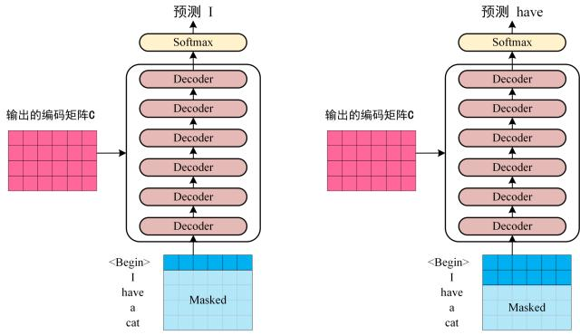

上图 Decoder 接收了 Encoder 的编码矩阵 C，然后首先输入一个翻译开始符 "<Begin>"，预测第一个单词 "I"；然后输入翻译开始符 "<Begin>" 和单词 "I"，预测单词 "have"，以此类推。这是 Transformer 使用时候的大致流程，接下来是里面各个部分的细节。

# 2. Transformer 的输入

Transformer 中单词的输入表示 x由单词 Embedding 和位置 Embedding （Positional Encoding）相加得到。
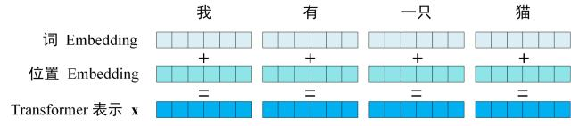

## 2.1 单词 Embedding
单词的 Embedding 有很多种方式可以获取，例如可以采用 Word2Vec、Glove 等算法预训练得到，也可以在 Transformer 中训练得到。


## 2.2 位置 Embedding
Transformer 中除了单词的 Embedding，还需要添加位置信息来标注单词出现在句子中的位置。因为 Transformer 不采用 RNN 的结构，而是使用全局信息，不能利用单词的顺序信息，而这部分信息对于 NLP 来说非常重要。所以 Transformer 中使用位置 Embedding 保存单词在序列中的相对或绝对位置。

位置 Embedding 用 PE表示，PE 的维度与单词 Embedding 是一样的。PE 可以通过训练得到，也可以使用某种公式计算得到。在 Transformer 中采用了后者，计算公式如下：
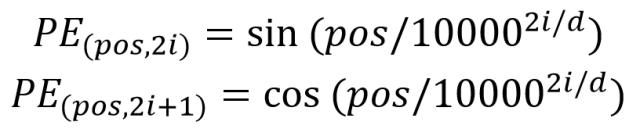

其中，pos 表示单词在句子中的位置，d 表示 PE的维度 (与词 Embedding 一样)，2i 表示偶数的维度，2i+1 表示奇数维度 (即 2i≤d, 2i+1≤d)。使用这种公式计算 PE 有以下的好处：

- 使 PE 能够适应比训练集里面所有句子更长的句子，假设训练集里面最长的句子是有 20 个单词，突然来了一个长度为 21 的句子，则使用公式计算的方法可以计算出第 21 位的 Embedding。

- 让模型容易地计算出相对位置，对于固定长度的间距 k，PE(pos+k) 可以用 PE(pos) 计算得到。因为 $Sin(A+B) = Sin(A)Cos(B) + Cos(A)Sin(B), Cos(A+B) = Cos(A)Cos(B) - Sin(A)Sin(B)。$

将单词的词 Embedding 和位置 Embedding 相加，就可以得到单词的表示向量 x，x 就是 Transformer 的输入。


# 3. Self-Attention（自注意力机制）

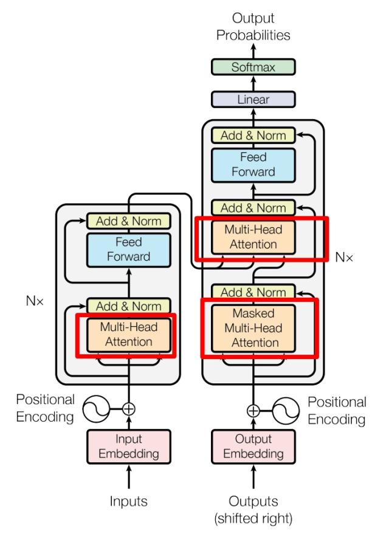

上图是论文中 Transformer 的内部结构图，左侧为 Encoder block，右侧为 Decoder block。

红色圈中的部分为 Multi-Head Attention，是由多个 Self-Attention组成的，可以看到 Encoder block 包含一个 Multi-Head Attention;

Decoder block 包含两个 Multi-Head Attention (其中有一个用到 Masked)。Multi-Head Attention 上方还包括一个 Add & Norm 层，Add 表示残差连接 (Residual Connection) 用于防止网络退化，Norm 表示 Layer Normalization，用于对每一层的激活值进行归一化。

## 3.1 Self-Attention 结构

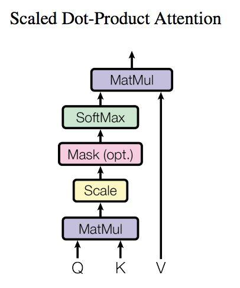

上图是 Self-Attention 的结构，在计算的时候需要用到矩阵Q(查询),K(键值),V(值)。

在实际中，Self-Attention 接收的是输入(单词的表示向量x组成的矩阵X) 或者上一个 Encoder block 的输出。而Q,K,V正是通过 Self-Attention 的输入进行线性变换得到的。

## 3.2 Q, K, V 的计算
Self-Attention 的输入用矩阵X进行表示，则可以使用线性变阵矩阵WQ,WK,WV计算得到Q,K,V。计算如下图所示，注意 X, Q, K, V 的每一行都表示一个token。

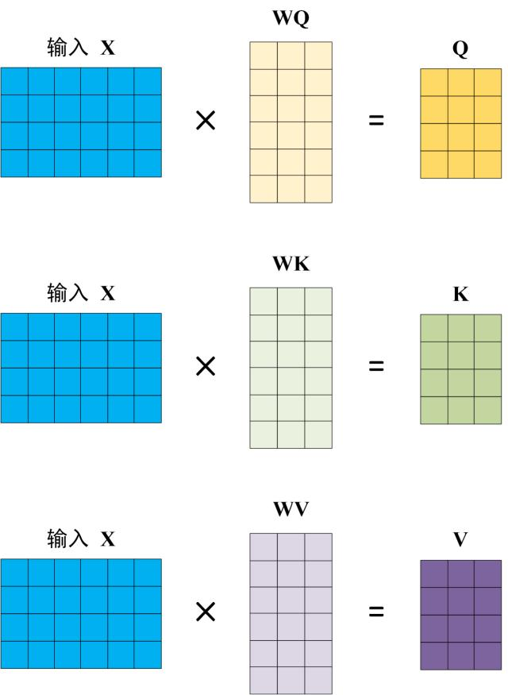

## 3.3 Self-Attention 的输出
得到矩阵 Q, K, V之后就可以计算出 Self-Attention 的输出了，计算的公式如下：
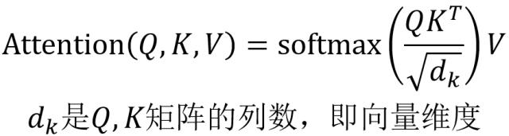

公式中计算矩阵Q和K每一行向量的内积，为了防止内积过大，因此除以dk的平方根。Q乘以K的转置后，得到的矩阵行列数都为 n，n 为句子单词数，这个矩阵可以表示单词之间的 attention 强度。下图为Q乘以$K^T$，1234 表示的是句子中的单词。

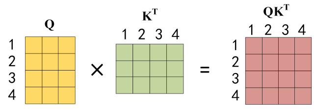

得到$QK^T$之后，使用 Softmax 计算每一个单词对于其他单词的 attention 系数，公式中的 Softmax 是对矩阵的每一行进行 Softmax，即每一行的和都变为 1.


得到 Softmax 矩阵之后可以和V相乘，得到最终的输出Z。

其中将每个值(V)向量✖️softmax分数，目的是希望关注语义上的相关Token，并弱化不相关的Token（例如，×0.0001小数）

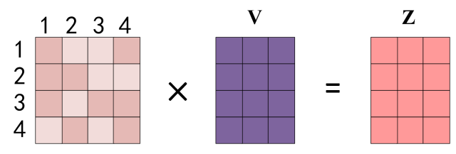
上图中 Softmax 矩阵的第 1 行表示单词 1 与其他所有单词的 attention 系数，最终单词 1 的输出$Z1$等于所有单词 i 的值$Vi$根据 attention 系数的比例加在一起得到，如下图所示：

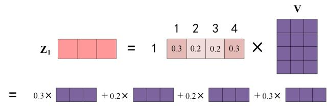

3.4 Multi-Head Attention
在上一步，我们已经知道怎么通过 Self-Attention 计算得到输出矩阵 Z，而 Multi-Head Attention 是由多个 Self-Attention 组合形成的，下图是论文中 Multi-Head Attention 的结构图。

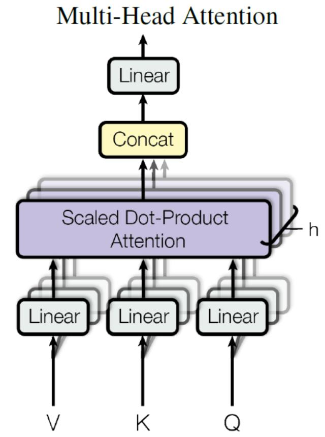

从上图可以看到 Multi-Head Attention 包含多个 Self-Attention 层，首先将输入X分别传递到 h 个不同的 Self-Attention 中，计算得到 h 个输出矩阵Z。下图是 h=8 时候的情况，此时会得到 8 个输出矩阵Z。
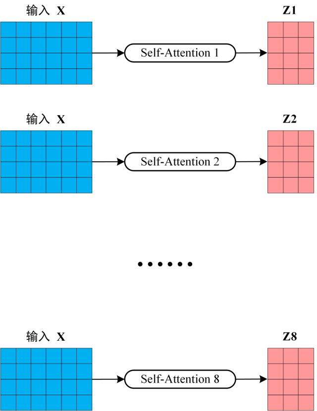

得到 8 个输出矩阵 $Z1$ 到 $Z8$ 之后，Multi-Head Attention 将它们拼接在一起 (Concat)，然后传入一个Linear层，得到 Multi-Head Attention 最终的输出Z。

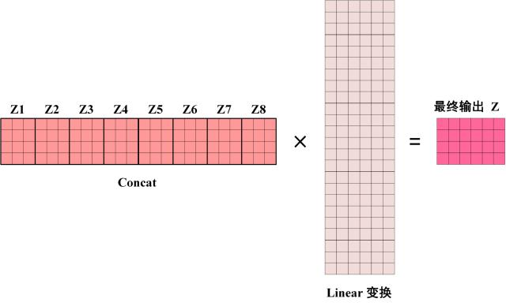

可以看到 Multi-Head Attention 输出的矩阵Z与其输入的矩阵X的维度是一样的


```
输入
input: [batch_size , max_sen_len]

词嵌入矩阵
vocab_matrix dim: [vocab_size , embedding_dim]

位置编码
PE(pos,2i)=sin(pos/10000^(2i/embedding_dim))
PE(pos,2i+1)=cos(pos/10000^(2i/embedding_dim))

encoder input embedding x = input token emb + position emb :
[batch_size , max_sen_len , embedding_dim]
对每一句话(句尾</s>)：[ max_sen_len , embedding_dim ]

---- multihead self attention ----
WQ,WK,WV: [embedding_dim , embedding_dim]
其中WQ, WK, WV可以切分为多头WQ_i, Wk_i, WV_i, 即第二个维度 = embedding_dim//num_heads=d_k
WQ_i,Wk_i,WV_i: [embedding_dim , d_k]

q_i,k_i,v_i = x * (WQ_i,WK_i,WV_i) : [max_sen_len , d_k]

实际的q_i,k_i,v_i，要加上第0维：[batch_size，num_heads, max_sen_len, d_k]。

代码中实现的时候可能是把维度为 [batch_size, max_sen_len , embedding_dim] 的大矩阵拆分为num_heads个小维度 [batch_size, max_sen_len , d_k] 的矩阵，

当作num_heads个batch在第0维拼起来 [batch_size，num_heads, max_sen_len , d_k]，这样下面的计算比较方便。

直到最后合并多个头之后、接线型输出矩阵之前 第一维才还原为batch_size

weight compute:
q_i * k_i / sqrt(d_k) : [max_sen_len * max_sen_len]


(softmax之前要对q和k做mask，输入prompt未达到max_seq_length，需要padding 0，把pad 0的位置置为-inf，这样softmax之后对应位置权重为0)

softmax(q_i * k_i / sqrt(d_k) + **Mask**) * v_i = head_i, 在最后一个维度上做softmax
head_i: [max_sen_len , d_k]
实际上这里有个维度的转换 [batch_size，num_heads, max_sen_len, d_k]——> [batch_size, msx_sen_len, embedding_dim]
Multi_head = concat num_heads of head_i = [head_1,head_2,...,head_8]: [max_sen_len , embedding_dim]
W_outlayer : [ embedding_dim , embedding_dim ]
#context = Multi_head * W_outlayer :[max_sen_len , embedding_dim] #实际 [batch_size, max_sen_len , embedding_dim]

---- add & norm ----
[max_sen_len , embedding_dim]

----ffn & add & norm ----
ffn = Relu(W_1 * x + b_1) * W_2 +b_2
    Relu = max(0,x)
    W_1 : [embedding_dim , ffn_hidden_size]
    b_1 : [1 , ffn_hidden_size ]
    W_2 : [ffn_hidden_size , embedding_dim]
    b_2 : [1 , embedding_dim]

---- encoder out ----
[batch_size, max_sen_len, embedding_dim]

```

# 4. Encoder 结构

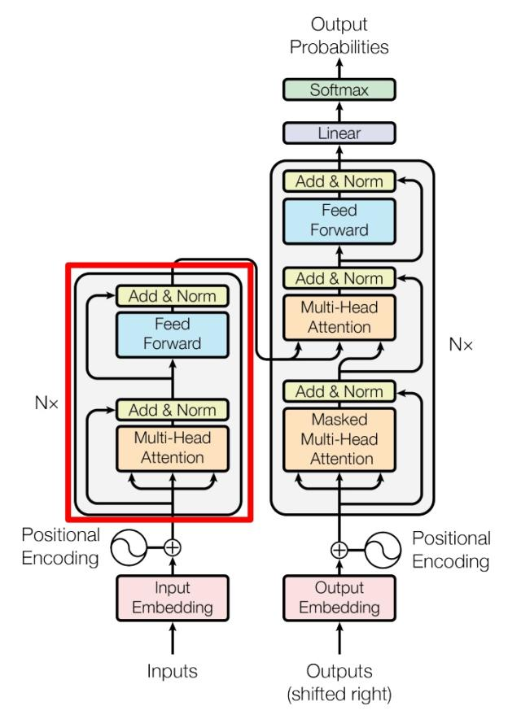

上图红色部分是 Transformer 的 Encoder block 结构，可以看到是由 Multi-Head Attention, Add & Norm, Feed Forward, Add & Norm 组成的。刚刚已经了解了 Multi-Head Attention 的计算过程，现在了解一下 Add & Norm 和 Feed Forward 部分。

## 4.1 Add & Norm

Add & Norm 层由 Add 和 Norm 两部分组成，其计算公式如下：


其中 X表示 Multi-Head Attention 或者 Feed Forward 的输入，MultiHeadAttention(X) 和 FeedForward(X) 表示输出 (输出与输入 X 维度是一样的，所以可以相加)。

Add指 X+MultiHeadAttention(X)，是一种残差连接，通常用于解决多层网络训练的问题，可以让网络只关注当前差异的部分，在 ResNet 中经常用到：
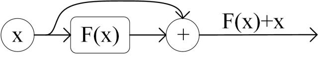

Norm指 **Layer Normalization**，通常用于 RNN 结构，Layer Normalization 会将每一层神经元的输入都转成均值方差都一样的，这样可以加快收敛。

## 4.2 Feed Forward

Feed Forward 层比较简单，是一个两层的全连接层，第一层的激活函数为 Relu，第二层不使用激活函数，对应的公式如下。

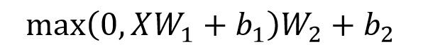

X是输入，Feed Forward 最终得到的输出矩阵的维度与X一致。

## 4.3 组成 Encoder

通过上面描述的 Multi-Head Attention, Feed Forward, Add & Norm 就可以构造出一个 Encoder block，Encoder block 接收输入矩阵 $Xnxd$，并输出一个矩阵 $Onxd$。通过多个 Encoder block 叠加就可以组成 Encoder。

第一个 Encoder block 的输入为句子单词的表示向量矩阵，后续 Encoder block 的输入是前一个 Encoder block 的输出，最后一个 Encoder block 输出的矩阵就是编码信息矩阵 C，这一矩阵后续会用到 Decoder 中。

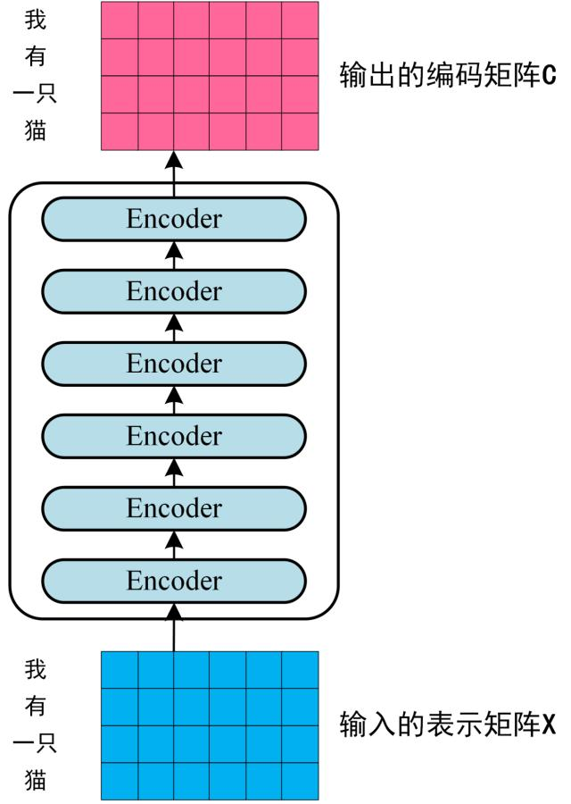

# 5. Decoder 结构

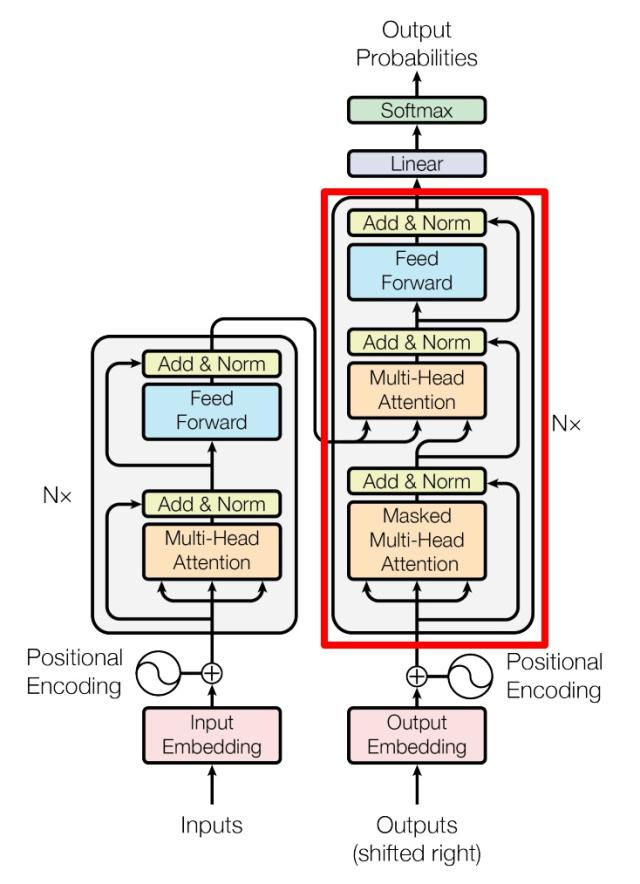

上图红色部分为 Transformer 的 Decoder block 结构，与 Encoder block 相似，但是存在一些区别：

- 包含两个 Multi-Head Attention 层。
- 第一个 Multi-Head Attention 层采用了 Masked 操作。
- 第二个 Multi-Head Attention 层的K, V矩阵使用 Encoder 的编码信息矩阵C进行计算，而Q使用上一个 Decoder block 的输出计算。
- 最后有一个 Softmax 层计算下一个翻译单词的概率。


<font color=yebl>TODO(采样策略)</font>


## 5.1 第一个 Multi-Head Attention
Decoder block 的第一个 Multi-Head Attention 采用了 Masked 操作，因为在翻译的过程中是顺序翻译的，即翻译完第 i 个单词，才可以翻译第 i+1 个单词。通过 Masked 操作可以防止第 i 个单词知道 i+1 个单词之后的信息。下面以 "我有一只猫" 翻译成 "I have a cat" 为例，了解一下 Masked 操作。

下面的描述中使用了类似 Teacher Forcing 的概念，不熟悉 Teacher Forcing 的童鞋可以参考以下上一篇文章Seq2Seq 模型详解。在 Decoder 的时候，是需要根据之前的翻译，求解当前最有可能的翻译，如下图所示。首先根据输入 "<Begin>" 预测出第一个单词为 "I"，然后根据输入 "<Begin> I" 预测下一个单词 "have"。

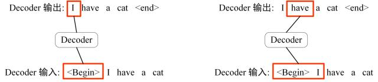

Decoder 可以在训练的过程中使用 Teacher Forcing 并且并行化训练，即将正确的单词序列 (<Begin> I have a cat) 和对应输出 (I have a cat <end>) 传递到 Decoder。那么在预测第 i 个输出时，就要将第 i+1 之后的单词掩盖住，**注意 Mask 操作是在 Self-Attention 的 Softmax 之前使用的，下面用 0 1 2 3 4 5 分别表示 "<Begin> I have a cat <end>"。**

第一步：是 Decoder 的输入矩阵和 Mask 矩阵，输入矩阵包含 "<Begin> I have a cat" (0, 1, 2, 3, 4) 五个单词的表示向量，Mask 是一个 5×5 的矩阵。在 Mask 可以发现单词 0 只能使用单词 0 的信息，而单词 1 可以使用单词 0, 1 的信息，即只能使用之前的信息。


第二步：接下来的操作和之前的 Self-Attention 一样，通过输入矩阵X计算得到Q,K,V矩阵。然后计算Q和$K^T$的乘积$QK^T$。

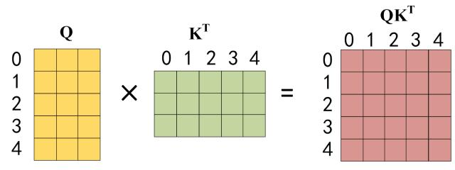

第三步：在得到$QK^T$之后需要进行 Softmax，计算 attention score，我们在 Softmax 之前需要使用Mask矩阵遮挡住每一个单词之后的信息，遮挡操作如下：

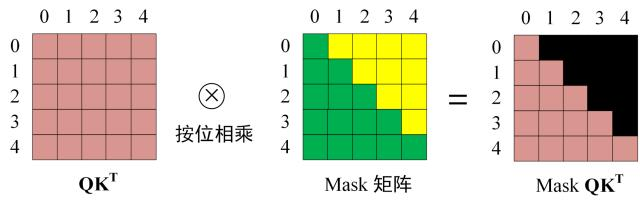

得到 Mask $QK^T$ 之后在 Mask $QK^T$ 上进行 Softmax，每一行的和都为 1。但是单词 0 在单词 1, 2, 3, 4 上的 attention score 都为 0。

第四步：使用 Mask $QK^T$ 与矩阵 V相乘，得到输出 Z，则单词 1 的输出向量 $Z_1$ 是只包含单词 1 信息的。


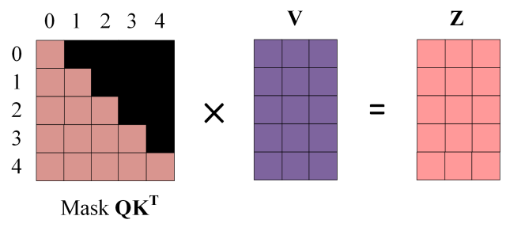

第五步：通过上述步骤就可以得到一个 Mask Self-Attention 的输出矩阵 $Z_i$ ，然后和 Encoder 类似，通过 Multi-Head Attention 拼接多个输出 $Z_i$ 然后计算得到第一个 Multi-Head Attention 的输出Z，Z与输入X维度一样。

## 5.2 第二个 Multi-Head Attention
Decoder block 第二个 Multi-Head Attention 变化不大， 主要的区别在于其中 Self-Attention 的 K, V矩阵不是使用 上一个 Decoder block 的输出计算的，而是使用 Encoder 的编码信息矩阵 C 计算的。

根据 Encoder 的输出 C计算得到 K, V，根据上一个 Decoder block 的输出 Z 计算 Q (如果是第一个 Decoder block 则使用输入矩阵 X 进行计算)，后续的计算方法与之前描述的一致。

这样做的好处是在 Decoder 的时候，每一位单词都可以利用到 Encoder 所有单词的信息 (这些信息无需 Mask)。
Multi-Head
## 5.3 最终的线性变换和Softmax 预测输出单词

Decoder block 最后的部分是利用 Softmax 预测下一个单词，在之前的网络层我们可以得到一个最终的输出 Z，因为 Mask 的存在，使得单词 0 的输出 Z0 只包含单词 0 的信息，如下：

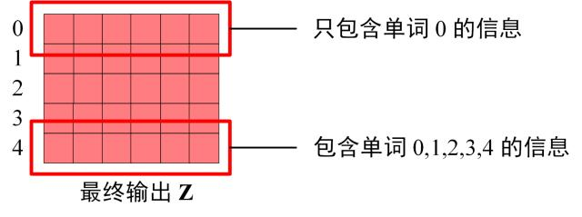

Softmax 根据输出矩阵的每一行预测下一个单词：

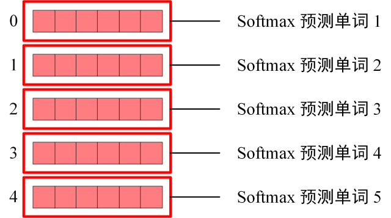

这就是 Decoder block 的定义，与 Encoder 一样，Decoder 是由多个 Decoder block 组合而成。


### 线性层（Linear Layer）的转换
作用：将d_model维向量映射到词表大小（vocab_size） 维度，也称 “投影层” 或 “LM Head”
形状变化：[batch_size, target_seq_len, d_model] → [batch_size, target_seq_len, vocab_size]
输出内容：每个位置得到vocab_size维的logits（未归一化的分数），表示该位置对应词表中每个 token 的原始得分
### Softmax 层的归一化
作用：在最后一维（vocab_size）上进行归一化，将 logits 转换为概率分布
形状：与线性层输出相同（[batch_size, target_seq_len, vocab_size]），仅数值范围改变
输出特性：
每个位置的概率和为 1.0
概率值越大，对应 token 在该位置出现的可能性越高
训练时用于计算交叉熵损失，推理时用于选择生成 token

注意：批量推理解码过程绝不提前 padding，target_seq_len 是批次内动态变长；只有所有句子生成结束，为了张量维度统一，才统一补 PAD 对齐到最大序列长度。

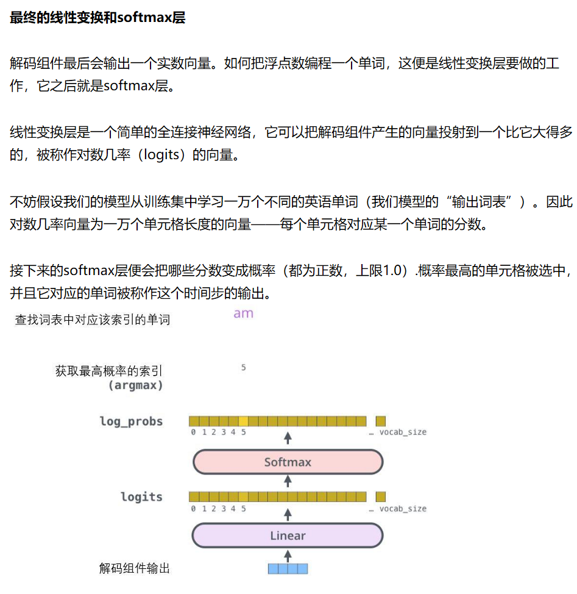


## 5.4 decode 计算过程维度变化

---- Embedding ----

decoder input embedding y = input token emb + position emb :
[ batch_size , max_sen_len , embedding_dim]
对每一句话y（要添加起始符号\<s>） : [ max_sen_len , embedding_dim ]
ENCODER的输出给每一层DECODER


---- masked multihead self attention ----

上三角矩阵置为-inf
q,k 来自encoder输出：[max_sen_len, embedding_dim]
q_i,k_i,v_i = y * WQ_i,WK_i,WV_i : [max_sen_len , d_k]


>实际的q_i,k_i,v_i，要加上第0维：[batch_size * num_heads, max_sen_len, d_k]。
代码中实现的时候可能是把维度为 [batch_size, max_sen_len , embedding_dim] 的大矩阵拆分为num_heads个小维度 [batch_size, max_sen_len , d_k] 的矩阵，
当作num_heads个batch在第0维拼起来 [batch_size * num_heads, max_sen_len , d_k]，这样下面的计算比较方便。
直到最后合并多个头之后、接线型输出矩阵之前 第一维才还原为batch_size。


weight compute:
q_i * k_i / srqt(d_k) : [max_sen_len , max_sen_len]

softmax(q_i * k_i / sqrt(d_k) + Mask) * v_i = head_i : [max_sen_len , d_k]
Multi_head = concat num_heads of head_i = [head_1,head_2,...,head_8]: [max_sen_len , embedding_dim]
W_outlayer : [ embedding_dim , embedding_dim ]
context = Multi_head * W_outlayer :[max_sen_len , embedding_dim]

---- multihead self attention ----
维度变换同上
[max_sen_len , embedding_dim]

---- add & norm ----
[max_sen_len , embedding_dim]

----ffn & add & norm ----
ffn = Relu(W_1 * y + b_1) * W_2 +b_2
    Relu = max(0,y)
    W_1 : [embedding_dim , ffn_hidden_size]
    b_1 : [1 , ffn_hidden_size]
    W_2 : [ffn_hidden_size , vocab_size]
    b_2 : [1 , vocab_size]

[batch_size, max_sen_len, vocab_size]

---- decoder out ----
[batch_size, max_sen_len, vocab_size]
decoder输出隐藏层变量，先乘以线性矩阵，再在最后一维做softmax（vocab_size维），得到词典库上的概率分布，
输出最大的概率，与真实标签进行交叉熵损失的计算，汇总一句话中每个的损失，优化，训练


# 6. Transformer 总结
- Transformer 与 RNN 不同，可以比较好地并行训练。
- Transformer 本身是不能利用单词的顺序信息的，因此需要在输入中添加位置 Embedding，否则 Transformer 就是一个词袋模型了。
- Transformer 的重点是 Self-Attention 结构，其中用到的 Q, K, V矩阵通过输出进行线性变换得到。
- Transformer 中 Multi-Head Attention 中有多个 Self-Attention，可以捕获单词之间多种维度上的相关系数 attention score。


# 参考

https://www.cnblogs.com/yh-blog/p/15115253.html
https://zhuanlan.zhihu.com/p/338817680
[从零实现Transformer](https://zhuanlan.zhihu.com/p/648127076)
[Transformer参数量、计算量、显存占用分析](https://developer.volcengine.com/articles/7387286918280511507#heading1)