# 一、 前言


最近，OpenAI推出的ChatGPT展现出了卓越的性能，引发了大规模语言模型(Large Language Model, LLM)的研究热潮。大规模语言模型的“大”体现在两个方面：模型参数规模大，训练数据规模大。以GPT3为例，GPT3的参数量为1750亿，训练数据量达到了570GB。进而，训练大规模语言模型面临两个主要挑战：**显存效率和计算效率**。
现在业界的大语言模型都是基于transformer模型的，模型结构主要有两大类：**encoder-decoder（代表模型是T5）和decoder-only**，具体的，decoder-only结构又可以分为Causal LM（代表模型是GPT系列）和Prefix LM（代表模型是GLM）。归因于GPT系列取得的巨大成功，大多数的主流大语言模型都采用Causal LM结构。因此，针对decoder-only框架，为了更好地理解训练训练大语言模型的显存效率和计算效率，本文分析采用decoder-only框架transformer模型的模型参数量、计算量、中间激活值、KV cache。

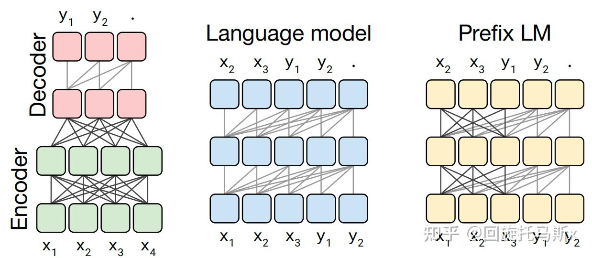

>为方便后续分析，定义数学符号：
>层数为 $l$，隐藏层维度为 $h$，注意力头数为 $a$。词表大小为 $V$，训练数据的批次大小为$b$，序列长度为 $s$


# 二、模型参数量

transformer模型由 $l$ 个相同的层组成，每个层分为两部分：self-attention块和MLP块。

attention块的模型参数有$Q、K、V$的权重矩阵$W_Q、W_K、W_V$，输出权重矩阵$W_O$，4个权重矩阵的shape为$[h, h]$, 4个偏置shape为$[h]$。

**attention 部分的参数量为** $ 4h^2 $

```
关于bias问题：
(1) 原Transformer论文中没有明确显示偏置项，torch的nn.MultiheadAttention模块默认带偏置(bias=True)
(2) 主流模型中llama没有使用bias。qwen2/2.5有使用，vit模型通常有qkv_bias参数
(3) 2023 年以后发布的大多数大模型 (如 Llama 系列) 倾向于移除所有偏置项，包括 QKV 投影和前馈网络中的偏置，在不损失性能的前提下减少参数数量和计算量

```

MLP块由2个线性层组成:
(1) FFN_UP: 线性层是先将维度从 h 映射到 4h。权重矩阵$W_1$的shape为 [h, 4h]，偏置的形状为 [4h]；
(2) FFN_DOWN：线性层再将维度从 4h 映射到 h。权重矩阵$W_2$的shape为 [4h, h], 偏置shape为 [h]。

**MLP的参数量为** $ 8h^2 + 5h $


因此，每个transformer层的参数量为 $ 12h^2 + 5h $

除此之外，Embedding矩阵的参数量也较多，Embedding维度通常等于h，Embedding矩阵的参数量为 $Vh$；最后的输出层的权重矩阵通常与Embedding矩阵是参数共享的。


关于位置编码，如果采用可训练式的位置编码，会有一些可训练模型参数，数量比较少。如果采用相对位置编码，例如RoPE和ALiBi，则不包含可训练的模型参数。我们忽略这部分参数。
综上所述，$l$ 层transformer模型可训练参数量为$ l(12h^2 + 5h) + Vh $，当隐藏层维度 h 较大时，可忽略一次项，模型参数量近似为$ 12lh^2 $。

因此可估算不同版本LLama模型参数量，如下表所示：
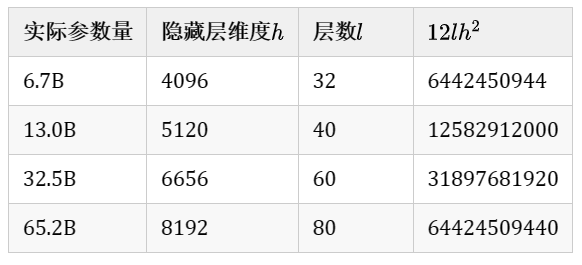


# 三、计算量FLOPs估计

<font color=yebl>FLOPs，floating point operations，表示浮点数运算次数，衡量了计算量的大小。</font>

首先需要明确矩阵乘法的FLOPs

对于 $A ∈ R^{1 \times n}, A ∈ R^{n \times 1}$, 计算AB需要进行n次乘法运算和n次加法运算，共计2n次浮点数运算，需要2n的FLOPs。
对于$A ∈ R^{m \times n}, A ∈ R^{n \times p}$, 计算AB需要计算的FLOPs为 *2mnp*

**Input**

在一次训练迭代中，假设输入数据的形状为 [b, s], 经embedding层得[b, s, h]，$[b, s, h] \times [V, h] -> [b, s, V]$，计算量为0。

原因：Embedding 层的计算量分析与普通线性层有本质区别，因为它的核心是 **内存查找（Gather）** 而非算术运算。

**self-attention**

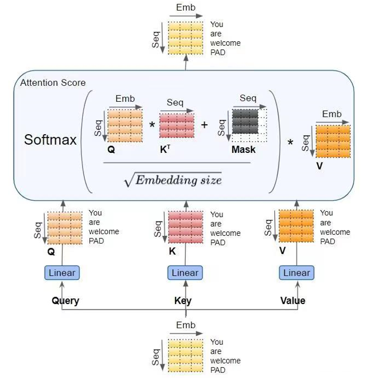

(1) 计算Q\K\V：GEMM的输入和输出shape为 $[b, s, h] \times [h, h] -> [b, s, h]$。计算量为$3 * 2bsh^2 = 6bsh^2$

(2) $QK^T$ 矩阵乘法的input和output为$[b, head\_num, s, per\_head\_hidden\_size] \times [b, head\_num, per\_head\_hidden\_size, s] -> [b, head\_num, s, s]$。计算量为$2bs^2h$

(3) 计算 V 上的加权 score * V，矩阵乘法的input和output为$[b, head\_num, s, s] \times [b, head\_num, s, per\_head\_hidden\_size] -> [b, head_num, s, per\_head\_hidden\_size] $ 。计算量为$2bs^2h$

(4) attention后的线性映射，矩阵乘法的输入和输出形状为$[b, s, h] \times [h, h] -> [b, s, h]$。计算量为$2bsh^2$

attention部分总计算量$8bsh^2 + 4bs^2h$

**MLP**

MLP计算公式如下：
$$x=f_{gelu}(x_{out}W_1)W_2 + x_{out}$$

1. 第一个线性层，矩阵乘法的input和output shape为$[b, s, h] \times [h, 4h] -> [b, s, 4h]$， 计算量为$8bsh^2$
2. 第二个线性层，矩阵乘法的input和output shape为$[b, s, 4h] \times [4h, h] -> [b, s, h]$， 计算量为$8bsh^2$

MLP部分总计算量$16bsh^2$

因此对于一个layer层总计算量大约为$24bsh^2 + 4bs^2h$


**output**

另一个计算量的大头是logits计算，将LLM 输出线性映射为logits。矩阵乘法的输入与输出形状为$[b, s, h] \times [h, V] -> [b, s, V]$，计算量为 $2bshV$


因此，对一个$l$层的transformer模型，输入数据形状为$[b, s]$的情况下，一次训练迭代的计算量为 $l*(24bsh^2 + 4bs^2h)+2bshV$


## 3.1 计算量与参数量的关联

当满足 **\(h \gg s\)**（隐藏维度远大于序列长度）时：

- \(4bs^2h\)（h 的一次项）远小于\(24bsh^2\)（h 的二次项），可以忽略

- 当模型层数l较大时，2bshV（输出头计算量）也远小于\(24lbsh^2\)，可以忽略

因此，前向传播计算量可近似为：

\(\text{FLOPs}_{\text{forward}} \approx 24lbsh^2\)


## 3.2 "每个 token 每个参数 6 次运算" 经验法则的严格推导

这个法则是大模型算力估算的基石，它的推导完全基于上述精确公式，并非经验猜测。

**步骤 1：计算 Transformer 模型的参数量**

标准 Decoder-only Transformer（不包括 Embedding 和输出头）的参数量为
- 每层参数量：attention（$4h^2$）+ FFN($8h^2$) = $12h^2$
- l 层总参数量：$N = 12lh^2$

**步骤 2：前向传播的 "参数 - token" 运算密度**

用近似前向计算量除以总参数量和总 tokens 数：
\(\frac{\text{FLOPs}_{\text{forward}}}{N \cdot bs} = \frac{24lbsh^2}{12lh^2 \cdot bs} = 2\)

一次前向传递中，平均每个 token、每个模型参数需要进行 2 次浮点运算（1 次乘法 + 1 次加法）。

**步骤 3：训练迭代的总计算量一次完整的训练迭代包含前向传播和反向传播两个阶段：**

- 前向传播：计算模型输出和损失，计算量为F
- 反向传播：计算参数梯度和输入梯度，计算量约为2F（需要计算两个梯度，而前向只计算一个输出）
- 参数更新：计算量极小（每个参数 1 次乘法 + 1 次加法），通常忽略

因此，训练迭代总计算量为：
\(\text{FLOPs}_{\text{train}} = F + 2F = 3F\)

**步骤 4：最终的 "6 次法则"**

将前向的 2 次运算乘以 3 倍的训练系数，得到：
\(\text{FLOPs}_{\text{train}} \approx 6 \cdot N \cdot T\)
其中\(T = b \cdot s\)是一次迭代处理的总 tokens 数。

这就是著名的 **"6 次法则"**：一次训练迭代中，平均每个 token、每个模型参数需要进行 6 次浮点运算


注意：
1. 该公式和经验法则仅适用于标准 Decoder-only Transformer
2. 长上下文场景：当\(s \approx h\)时，\(4bs^2h\)项会变得显著（例如 s=8192，h=8192 时，\(4bs^2h = 4bsh^2\)，占总计算量的 1/6）
3. 使用 Adam 优化器：Adam 需要维护动量和方差两个状态，会额外增加约 50% 的计算量，实际训练计算量约为\(9 \cdot N \cdot T\)

## 3.3 训练时间估计

以GPT3-175B为例，计算训练所需要的计算量。对于GPT3，每个token，每个参数进行了6次浮点数运算，再乘以参数量和总tokens数就得到了总的计算量。GPT3的模型参数量为 174600M，训练数据量为 300B tokens。

$$6 \times 174600 \times 10^6 \times 300 \times 10^9  = 3.1428 \times 10^{23} flops$$

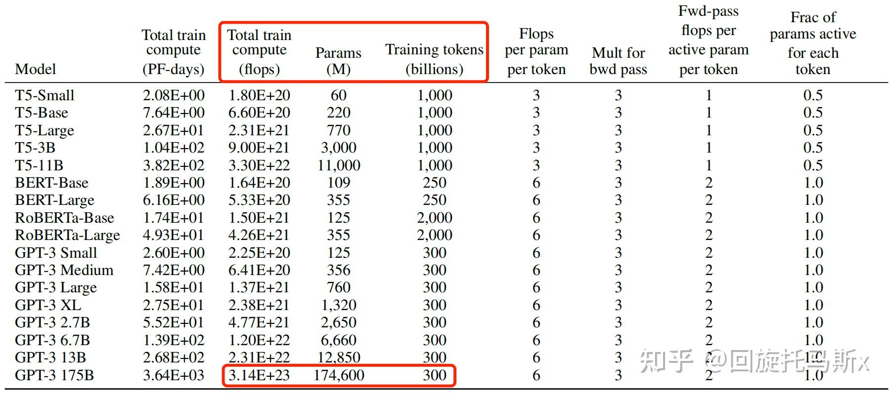


**模型参数量和训练总tokens数决定了训练transformer模型需要的计算量。**给定硬件GPU类型的情况下，可以估计所需要的训练时间。给定计算量，训练时间（也就是GPU算完这么多flops的计算时间）不仅跟GPU类型有关，还与GPU利用率有关。计算端到端训练的GPU利用率时，不仅要考虑前向传递和后向传递的计算时间，还要考虑CPU加载数据、优化器更新、多卡通信和记录日志的时间。一般来讲，GPU利用率一般在 0.3∼0.55 之间。

上文讲到一次前向传递中，对于每个token，每个模型参数，进行2次浮点数计算。使用激活重计算技术来减少中间激活显存（下文会详细介绍）需要进行一次额外的前向传递，因此前向传递 + 后向传递 + 激活重计算的系数=1+2+1=4。使用激活重计算的一次训练迭代中，对于每个token，每个模型参数，需要进行 2∗4=8 次浮点数运算。在给定训练tokens数、硬件环境配置的情况下，训练transformer模型的计算时间为：
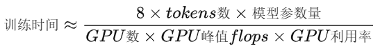
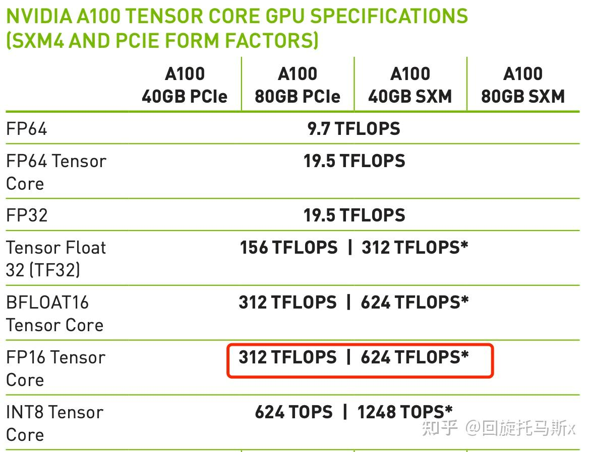

以GPT3-175B为例，在1024张40GB显存的A100上，在300B tokens的数据上训练175B参数量的GPT3。40GB显存A100的峰值性能为312TFLOPS，设GPU利用率为0.45，则所需要的训练时间为34天
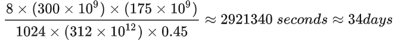

（ref: https://arxiv.org/pdf/2104.04473.pdf）

以LLaMA-65B为例，在2048张80GB显存的A100上，在1.4TB tokens的数据上训练了65B参数量的模型。80GB显存A100的峰值性能为624TFLOPS，设GPU利用率为0.3，则所需要的训练时间为21天

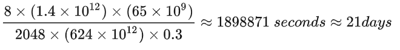

(ref: https://arxiv.org/pdf/2302.13971.pdf)


# 显存占用分析

## 训练阶段

在训练神经网络过程中，占用显存主要分为四部分：<font color=red>模型参数、Forward计算中产生的中间激活，后向传递计算得到的梯度、优化器状态。</font>

首先分析参数、梯度和优化器状态的显存占用，中间激活的显存后续会详细介绍。训练大模型时通常会采用**AdamW优化器+混合精度**来加速训练，基于这个前提分析显存占用。


标准混合精度训练流程
```
1. 前向传播(Forward Pass)：使用float16模型参数计算，产生float16中间激活, 最后的Loss计算通常会自动提升到F32以保持**数值稳定**

2. 损失缩放 (Loss Scaling)：将计算出的 FP32 Loss 乘以一个较大的缩放因子（Scale Factor，例如 $2^{14}$）。目的是提前放大 Loss，进而放大梯度，避免FP16反向传播下溢为0

3. 反向传播(Backward Pass)：基于放大后的 Loss，使用 FP16 权重和激活值计算梯度。得到**放大的F16梯度**

4. 梯度反缩放与准备 (Unscale & Cast)：缩放版 FP16 梯度转换为 FP32，除以之前使用的缩放因子（Scale Factor），还原出真实的梯度值。

5. 优化器更新(Optimizer Update)：
   a. 使用float32主参数、float32梯度和float32优化器状态进行更新
   b. 将更新后的float32主参数复制回float16模型参数

6. 权重同步 (Weight Sync)
- 将更新后的 FP32 主模型参数直接截断/复制回 FP16 模型参数。

```

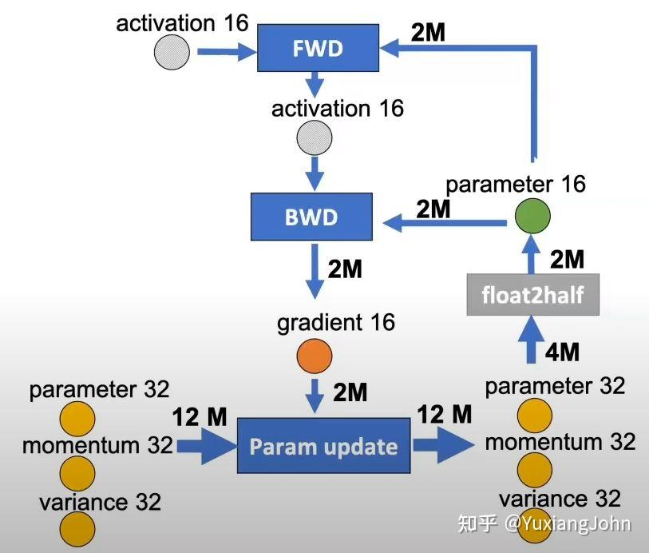

二、每参数显存占用的精确计算

1. 模型参数（4 字节 + 2 字节 = 6 字节）

- float32 主参数：4 字节 / 参数
  - 必须存在，因为 float16 精度不足以进行参数更新（会导致数值不稳定和收敛问题）
  - 仅在优化器更新阶段使用
- float16 工作参数：2 字节 / 参数
  - 用于前向传播和反向传播
  - 每次优化器更新后从主参数同步

2. 梯度（2字节/参数）
- FP16 梯度（2 字节）

 - 用途：反向传播计算得出的直接结果（已包含 Loss Scaling 后的缩放与反缩放）。
 - 特性：常驻显存（直到下一次 zero_grad 清空）。

- FP32 临时梯度（4 字节，峰值占用）
 - 用途：在优化器执行更新时，为匹配 FP32 的主权重和状态，需将 FP16 梯度 Cast 为 FP32。
 - 特性：临时显存。仅在 optimizer.step() 瞬间存在，推高系统的峰值显存（Peak Memory），更新完毕后立即释放。

3. 优化器状态（4 字节 + 4 字节 = 8 字节 / 参数）
AdamW 优化器为每个参数维护两个 float32 状态：
- 一阶动量（m）：4 字节 / 参数，存储梯度的指数移动平均
- 二阶动量（v）：4 字节 / 参数，存储梯度平方的指数移动平均
- 这两个状态必须是 float32 精度，否则会严重影响优化效果
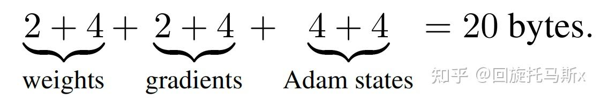

**总结**
常驻静态显存 = 6 (权重) + 2 (梯度) + 8 (优化器) = 16 字节 / 参数。

峰值动态显存 = 16 + 4 (临时 FP32 梯度) = 20 字节 / 参数。

三、不同训练配置下的每参数显存占用

| 训练配置| 模型参数|梯度 |优化器状态 |每参数总显存|
| ------| ------|------ |------ | ------ |
| AdamW + 混合精度（标准）| 6B | 2B | 8B | 16B |
| AdamW + 纯F32| 4B | 4B | 8B | 16B |
| SGD + 混合精度（标准）| 6B | 2B | 4B | 12B |
| SGD + 纯F32| 4B | 4B | 8B | 12B |

注：
（1）纯 float32 训练虽然每参数显存比混合精度少（16B vs 20B），但计算速度慢得多，且需要更大的 batch size 才能达到相同的训练效率

补充说明：
1. 为什么需要主参数副本？
很多人会问：为什么不能直接用 float16 参数进行更新？
- float16 的有效精度只有 11 位，而参数更新通常是很小的增量（1e-6 量级）
- 直接用 float16 更新会导致大部分增量被舍入掉，模型无法收敛
- 主参数副本是混合精度训练中保证数值稳定性的必要代价

1. 有没有办法减少这部分显存占用？
是的，有几种常用的技术可以减少参数相关的显存占用：
- ZeRO 优化器：将参数、梯度和优化器状态分片到多个 GPU 上
  - ZeRO-1：分片优化器状态（显存减少约 4 倍）
  - ZeRO-2：分片优化器状态和梯度（显存减少约 8 倍）
  - ZeRO-3：分片参数、梯度和优化器状态（显存减少约 16 倍）
- LoRA/QLoRA：只训练少量低秩适配器，冻结大部分模型参数
  - QLoRA 可以在消费级显卡上微调 70B 模型


## 中间激活值显存分析

除了模型参数、梯度、优化器状态外，占用显存的大头就是前向传递过程中计算得到的中间激活值了，需要保存中间激活以便在后向传递计算梯度时使用。这里的激活（activations）指的是：**前向传递过程中计算得到的，并在后向传递过程中需要用到的所有张量。**  这里的激活不包含模型参数和优化器状态，但包含了dropout操作需要用到的mask矩阵。

在分析中间激活的显存占用时，只考虑激活占用显存的大头，忽略掉一些小的buffers。比如，对于layer normalization，计算梯度时需要用到层的输入，输入的均值 μ 和 方差。
输入包括bsh个token，而输入的均值和方差分别包括了bs个元素。由于h通常较大，有$bsh>>bs$。因此，对于layer normalization，中间激活近似估计为 bsh ，而不是bsh+2bs。

大模型在训练过程中通常采用混合精度训练，中间激活值一般是float16或者bfloat16数据类型的。在分析中间激活的显存占用时，假设中间激活值是以float16或bfloat16数据格式来保存的，每个元素占了2个bytes。唯一例外的是，dropout操作的mask矩阵，每个元素只占1个bytes。在下面的分析中，单位是bytes，而不是元素个数。

每个transformer层包含了一个self-attention块和MLP块，并分别对应了一个layer normalization连接。

先分析self-attention块的中间激活。self-attention块的计算公式如下：

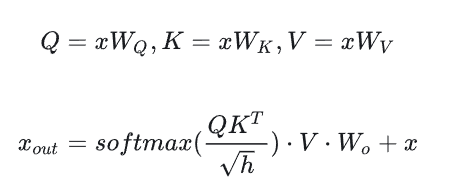

1. 对于Q\K\V, 输入X就是中间激活。输入X的shape为$[b, s, h]$，元素个数为bsh，显存占用2*bsh = 2bsh
2. 对于$QK^T$矩阵乘法，中间激活就是Q\K，两个Tensor的shape为$[b, s, h]$，显存占用2*bsh = 2bsh
3. 对于softmax函数，需要保存的函数输入为$QK^T$，shape为$[b, head\_num, s, s]$，占用的显存大小为$2bs^2a$,a为头数
4. 计算完softmax函数前，会进行dropout操作。需要保存一个mask矩阵，mask矩阵的shape与$QK^T$相同，占用$bs^2a$

5. 计算V上的attention，即score * V，需要保存score，大小为$2bs^2a$， V大小为$2bsh$。合计为$2bs^2a+2bsh$
6. 计算输出映射以及一个dropout操作。输入映射需要输入映射需要保存其输入，大小为 $2bsh$；dropout需要保存mask矩阵，大小为 $bsh$。二者占用显存大小合计为$3bsh$

因此，将上述中间激活相加得到，self-attention块的中间激活占用显存大小为$11bsh + 5bs^2a$

接下来分析MLP中间激活。

MLP计算公式如下：
$$x=f_{gelu}(x_{out}W_1)W_2 + x_{out}$$


1. FFN_UP保存输入$x_{out}$, 占用显存大小为$2bsh$
2. 激活函数需要保存其输入，占用显存大小为 $8bsh$
3. FFN_DOWN 保存输入，占用显存大小为 $8bsh$
4. 最后有一个dropout操作，需要保存mask矩阵，占用显存大小为bsh

对于MLP块，需要保存的中间激活值为 $19bsh$

self-attention块和MLP块分别对应了一个layer normalization。每个layer norm需要保存其输入，大小$2bsh$ 。2个layer norm需要保存的中间激活为 $4bsh$

综上，每个transformer层需要保存的中间激活占用显存大小为 $34bsh + 5bs^2a$


### 中间激活与模型参数的显存大小

中间显存与中间激活的关系

- 参数、梯度和优化器状态的显存占用是固定的，与 batch size 和序列长度无关
- 中间激活的显存占用是可变的，与 batch size、序列长度和模型层数成正比
- 在大 batch size 和长序列训练中，中间激活的显存占用通常会超过参数相关的显存占用
显存优化方向
- 通常采用激活重计算技术减少中间激活，理论上显存从$O(n)$减少到$O(\sqrt n)$

- 长序列s：优先优化 Attention（滑动窗口注意力、FlashAttention、序列分片），压制 \(L^2\) 项；
- 大维度hidden_size模型：优先优化 MLP（降维、稀疏 MLP），压制 \(d_{ff}\) 项。


## 推理阶段

在推断阶段，transformer模型加速推断的一个常用策略就是使用 KV cache


# 参考连接
- https://zhuanlan.zhihu.com/p/624740065

