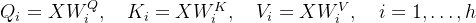
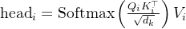
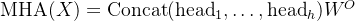
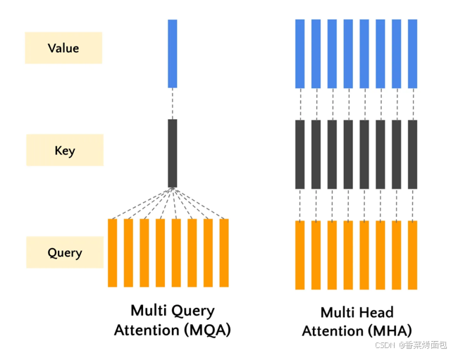
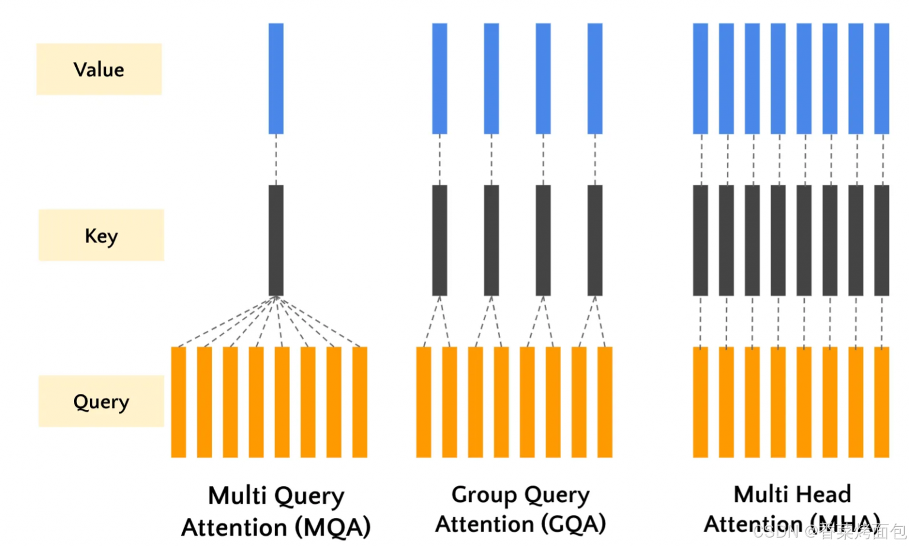
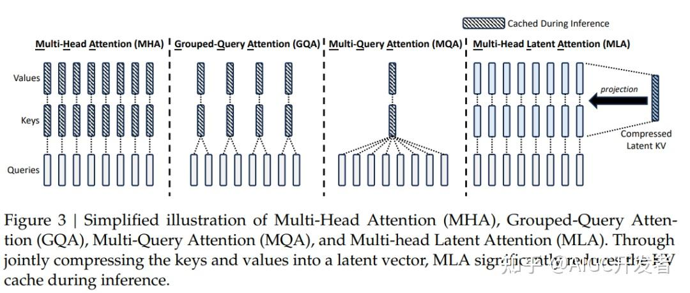
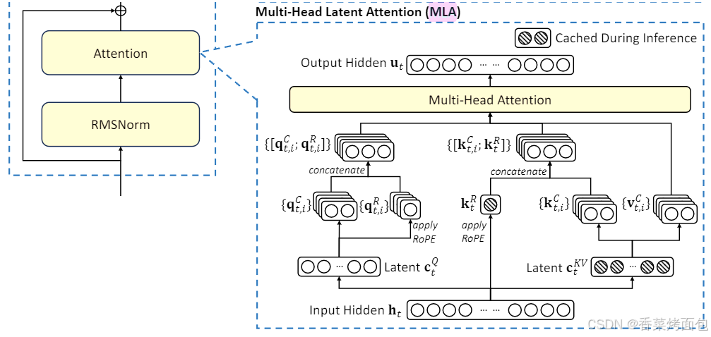

Transformer 的注意力机制经历了从** MHA（多头注意力）** 到** MQA（多查询注意力）**、**GQA（分组查询注意力）**，再到 **MLA（多头潜变量注意力）** 的逐步演进。这一过程的核心目标是：**减少计算和显存开销，同时保持模型性能**。

# MHA（Multi-Head Attention，多头注意力）

MHA 是最早出现在 Transformer（Vaswani et al., 2017） 中的注意力形式。它通过 多组独立的注意力头（heads） 来并行捕捉不同子空间的关系。

**数学形式：**

- 输入向量 $X \in \mathbb{R}^{n \times d} $ ，经过线性变换得到：


- 对每个 `head`:
  


- 最后拼接:




特点：

- 每个attention头都有自己独立的$W^Q, W^K, W^V$多个头可以同时计算，提高计算效率，但显存占用和计算量较大
- 模型表达能力强，能够捕获复杂的上下文关系，但带来参数量多，计算开销大
- 随着模型规模扩大，MHA 的参数和显存开销呈线性增长，尤其是 Key 和 Value 的存储成为瓶颈


流程：

MHA 的计算过程可概括为 “**线性变换 - 多头拆分 - 注意力计算 - 聚合投影**” 四步：

- 线性变换：输入序列通过三个可学习矩阵生成 Query（Q）、Key（K）、Value（V），维度均为（batch_size, seq_len, hidden_size）。

- 多头拆分：将 Q、K、V 按头数（num_heads）拆分，每个头的维度为（head_dim = hidden_size /num_heads），形状调整为（batch_size, num_heads, seq_len, head_dim）。

- 缩放点积注意力：每个头独立计算注意力权重，公式如下，其中根号 d_{k} 为缩放因子，缓解点积过大导致的梯度消失问题。

- 聚合投影：将所有头的输出拼接，通过线性层映射回原始维度（hidden_size）。


<details>
<summary>MHA代码实现</summary>

```python
import torch
import torch.nn as nn

class MultiHeadAttention(nn.Module):
    def __init__(self, hidden_size, num_heads, dropout=0.0):
        """
        多头注意力机制的实现。
        Args:
            hidden_size (int): 输入特征的维度，也即 hidden_state 的最后一维。
            num_heads (int): 注意力头的数量。
            dropout (float): dropout 的概率，默认为 0.0。
        """
        super(MultiHeadAttention, self).__init__()

        assert hidden_size % num_heads == 0, "hidden_size 必须能被 num_heads 整除"

        self.hidden_size = hidden_size
        self.num_heads = num_heads
        self.head_dim = hidden_size // num_heads  # 每个头的维度

        # 定义线性变换层，用于生成 Q, K, V
        self.query = nn.Linear(hidden_size, hidden_size)
        self.key = nn.Linear(hidden_size, hidden_size)
        self.value = nn.Linear(hidden_size, hidden_size)

        self.dropout = nn.Dropout(dropout)

        # 输出线性层
        self.out_projection = nn.Linear(hidden_size, hidden_size)

    def forward(self, hidden_state, attention_mask=None):

        """
        前向传播函数。
        Args:
            hidden_state (torch.Tensor): 输入的 hidden_state，形状为 [batch_size, seq_len, hidden_size]。
            attention_mask (torch.Tensor, optional): 注意力掩码，用于屏蔽某些位置，形状为 [batch_size, seq_len]。默认为 None。
        Returns:
            torch.Tensor: 注意力输出，形状为 [batch_size, seq_len, hidden_size]。

        """
        batch_size, seq_len, _ = hidden_state.size()

        # 1. 通过线性层得到 Q, K, V
        query = self.query(hidden_state)  # [batch_size, seq_len, hidden_size]
        key = self.key(hidden_state)      # [batch_size, seq_len, hidden_size]
        value = self.value(hidden_state)    # [batch_size, seq_len, hidden_size]

        # 2. 将 Q, K, V 拆分成多头
        query = query.view(batch_size, seq_len, self.num_heads, self.head_dim).transpose(1, 2)  # [batch_size, num_heads, seq_len, head_dim]
        key = key.view(batch_size, seq_len, self.num_heads, self.head_dim).transpose(1, 2)      # [batch_size, num_heads, seq_len, head_dim]
        value = value.view(batch_size, seq_len, self.num_heads, self.head_dim).transpose(1, 2)    # [batch_size, num_heads, seq_len, head_dim]

        # 3. 计算注意力权重
        attention_weights = torch.matmul(query, key.transpose(-2, -1)) / (self.head_dim ** 0.5)  # [batch_size, num_heads, seq_len, seq_len]

        # 应用 attention mask
        if attention_mask is not None:
            attention_weights = attention_weights.masked_fill(attention_mask[:, None, None, :] == 0, float('-inf'))

        attention_weights = torch.softmax(attention_weights, dim=-1)  # [batch_size, num_heads, seq_len, seq_len]
        attention_weights = self.dropout(attention_weights)

        # 4. 计算上下文向量
        context = torch.matmul(attention_weights, value)  # [batch_size, num_heads, seq_len, head_dim]

        # 5. 将多头合并
        context = context.transpose(1, 2).contiguous().view(batch_size, seq_len, self.hidden_size)  # [batch_size, seq_len, hidden_size]

        # 6. 通过输出线性层
        output = self.out_projection(context)  # [batch_size, seq_len, hidden_size]
        return output
if __name__ == '__main__':
    # 示例
    batch_size = 2
    seq_len = 10
    hidden_size = 256
    num_heads = 8

    # 创建一个 MHA 实例
    mha = MultiHeadAttention(hidden_size, num_heads)

    # 创建一个随机的 hidden_state
    hidden_state = torch.randn(batch_size, seq_len, hidden_size)

    # 创建一个 attention mask (可选)
    attention_mask = torch.ones(batch_size, seq_len)
    attention_mask[:, 5:] = 0  # 屏蔽掉每个 batch 中 seq_len 的后 5 个位置

    # 通过 MHA 层
    output = mha(hidden_state, attention_mask)

    # 打印输出形状
    print("输出形状:", output.shape)  # torch.Size([2, 10, 256])
```


</details>


# MQA（Multi-Query Attention，多查询注意力）

在传统的多头注意力机制中，每个注意力头都使用自己的一组查询、键和值，这可能需要大量计算，尤其是在注意力头数量增加的情况下。

多查询注意力机制 (MQA) 是 Transformer 中使用的传统多头自注意力机制(MHA)的一种变体。**MQA 通过在多个注意力头之间共享同一组键和值**，同时为每个注意力头维护不同的查询。




即：在 解码（inference） 阶段，MHA 的计算瓶颈主要在于存储每个 head 的 **Key/Value 缓存**。MQA 的改进是：多个 Query heads 共享同一个 Key 和 Value

核心思想：为了解决推理时 Key/Value 缓存过大的问题，**所有头共享同一组 Key 和 Value**

**Key 和 Value**

- Query：每个头独立
- Key / Value：所有头共享一组

特点：
- Q 独立，K,V 全部共享
- 大幅减少 KV 缓存，推理速度更快，显存占用更低，KV 缓存减少约 h 倍 （h是头数）
- 每个头看到的 Key/Value 相同 → 表达能力略有下降，即共享 K 和 V 可能导致模型捕捉上下文的能力下降


<details>
<summary>MQA代码实现</summary>

```python
import torch
import torch.nn as nn
from thop import profile 

class MultiQueryAttention(nn.Module):
    def __init__(self, hidden_size, num_heads, dropout=0.0):
        """
        Multi-Query Attention 的实现。
        Args:
            hidden_size (int): 输入特征的维度，也即 hidden_state 的最后一维。
            num_heads (int): 注意力头的数量。
            dropout (float): dropout 的概率，默认为 0.0。
        """
        super(MultiQueryAttention, self).__init__()

        assert hidden_size % num_heads == 0, "hidden_size 必须能被 num_heads 整除"

        self.hidden_size = hidden_size
        self.num_heads = num_heads
        self.head_dim = hidden_size // num_heads  # 每个头的维度

        # 定义线性变换层，用于生成 Q, K, V
        self.query = nn.Linear(hidden_size, hidden_size)  # 每个头独立的 Query
        self.key = nn.Linear(hidden_size, self.head_dim)  # 所有头共享的 Key
        self.value = nn.Linear(hidden_size, self.head_dim)  # 所有头共享的 Value

        self.dropout = nn.Dropout(dropout)
        self.out_projection = nn.Linear(hidden_size, hidden_size)

    def forward(self, hidden_state, attention_mask=None):
        """
        前向传播函数。
        Args:
            hidden_state (torch.Tensor): 输入的 hidden_state，形状为 [batch_size, seq_len, hidden_size]。
            attention_mask (torch.Tensor, optional): 注意力掩码，用于屏蔽某些位置，形状为 [batch_size, seq_len]。默认为 None。
        Returns:
            torch.Tensor: 注意力输出，形状为 [batch_size, seq_len, hidden_size]。
        """
        batch_size, seq_len, _ = hidden_state.size()

        # 1. 通过线性层得到 Q, K, V
        query = self.query(hidden_state)  # [batch_size, seq_len, hidden_size]
        key = self.key(hidden_state)      # [batch_size, seq_len, head_dim]
        value = self.value(hidden_state)  # [batch_size, seq_len, head_dim]

        # 2. 将 Q 拆分为多头
        query = query.view(batch_size, seq_len, self.num_heads, self.head_dim).transpose(1, 2)  # [batch_size, num_heads, seq_len, head_dim]

        # 3. 扩展 K 和 V 到 num_heads 维度（所有头共享相同的 K/V）
        key = key.unsqueeze(1).expand(-1, self.num_heads, -1, -1)  # [batch_size, num_heads, seq_len, head_dim]
        value = value.unsqueeze(1).expand(-1, self.num_heads, -1, -1)  # [batch_size, num_heads, seq_len, head_dim]

        # 4. 计算注意力权重
        attention_weights = torch.matmul(query, key.transpose(-2, -1)) / (self.head_dim ** 0.5)  # [batch_size, num_heads, seq_len, seq_len]
        # 应用 attention mask
        if attention_mask is not None:
            attention_weights = attention_weights.masked_fill(attention_mask[:, None, None, :] == 0, float('-inf'))

        attention_weights = torch.softmax(attention_weights, dim=-1)  # [batch_size, num_heads, seq_len, seq_len]
        attention_weights = self.dropout(attention_weights)

        # 5. 计算上下文向量
        context = torch.matmul(attention_weights, value)  # [batch_size, num_heads, seq_len, head_dim]

        # 6. 将多头合并
        context = context.transpose(1, 2).contiguous().view(batch_size, seq_len, self.hidden_size)  # [batch_size, seq_len, hidden_size]

        # 7. 通过输出线性层
        output = self.out_projection(context)  # [batch_size, seq_len, hidden_size]

        return output

if __name__ == '__main__':
    # 示例
    batch_size = 2
    seq_len = 10
    hidden_size = 256
    num_heads = 8

    # 创建一个 MQA 实例
    mqa = MultiQueryAttention(hidden_size, num_heads)

    # 创建一个随机的 hidden_state
    hidden_state = torch.randn(batch_size, seq_len, hidden_size)

    # 创建一个 attention mask (可选)
    attention_mask = torch.ones(batch_size, seq_len)
    attention_mask[:, 5:] = 0  # 屏蔽掉每个 batch 中 seq_len 的后 5 个位置

    # 通过 MQA 层
    output = mqa(hidden_state, attention_mask)

    # 打印输出形状
    print("输出形状:", output.shape)  # torch.Size([2, 10, 256])
```
</details>


# GQA（Grouped Query Attention，分组查询注意力）

组查询注意力 (GQA) 是对 Transformer 中使用的传统多头自注意力机制和多查询注意力机制的折中。在标准多头自注意力中，每个注意力头独立处理整个序列。这种方法虽然功能强大，但计算成本高昂，尤其是对于长序列。而MQA虽然通过在多个注意力头之间共享同一组键和值简化了这一过程，但其简化也不可避免的带来了一些精度的损失。GQA 通过将查询分组在一起来解决此问题，从而降低了计算复杂性，而不会显著影响性能。



核心思想：GQA 是 MHA 和 MQA 的折中方案：**将多个 Query 头划分为若干组，每组共享一组 Key/Value，Q 独立**

- 每组包含多个 Query heads
- 每组有独立的 Key 和 Value
- 介于“每头独立”和“全部共享”之间

特点：

- 减少显存，KV Cache 减少到 g/h，同时保留了部分多样性，性能接近 MHA
- 需要合理设置组数 g，组数过少可能接近 MQA，过多则接近 MHA
- 被广泛采用（PaLM 2、Gemini、LLaMA 2、Mixtral 等）


<details>
<summary>GQA代码实现</summary>

```python
import torch
import torch.nn as nn

class GroupedQueryAttention(nn.Module):
    def __init__(self, hidden_size, num_heads, group_size=2, dropout=0.0):
        """
        Grouped Query Attention 实现。
        Args:
            hidden_size (int): 输入特征的维度。
            num_heads (int): 查询头的数量。
            group_size (int): 每个组中包含的查询头数量。
            dropout (float): dropout 的概率。
        """
        super(GroupedQueryAttention, self).__init__()
        assert hidden_size % num_heads == 0, "hidden_size 必须能被 num_heads 整除"
        assert num_heads % group_size == 0, "num_heads 必须能被 group_size 整除"

        self.hidden_size = hidden_size
        self.num_heads = num_heads
        self.group_size = group_size
        self.group_num = num_heads // group_size
        self.head_dim = hidden_size // num_heads 

        # 查询头
        self.query = nn.Linear(hidden_size, hidden_size)
        # 键和值头（分组共享）
        self.key = nn.Linear(hidden_size, self.group_num * self.head_dim)
        self.value = nn.Linear(hidden_size, self.group_num * self.head_dim)

        self.dropout = nn.Dropout(dropout)
        self.out_projection = nn.Linear(hidden_size, hidden_size)

    def forward(self, hidden_state, attention_mask=None):
        """
        前向传播函数。
        Args:
            hidden_state (torch.Tensor): 输入张量，形状为 [batch_size, seq_len, hidden_size]。
            attention_mask (torch.Tensor, optional): 注意力掩码，形状为 [batch_size, seq_len]。
        Returns:
            torch.Tensor: 注意力输出，形状为 [batch_size, seq_len, hidden_size]。
        """
        batch_size, seq_len, _ = hidden_state.size()

        # 1. 通过线性层生成 Q, K, V
        query = self.query(hidden_state)  # [batch_size, seq_len, hidden_size]
        key = self.key(hidden_state)      # [batch_size, seq_len, group_num * head_dim]
        value = self.value(hidden_state)  # [batch_size, seq_len, group_num * head_dim]

        # 2. 将 Q, K, V 拆分成多头
        query = query.view(batch_size, seq_len, self.num_heads, self.head_dim).transpose(1, 2)  # [batch_size, num_heads, seq_len, head_dim]

        # K 和 V 扩展到 num_heads 个头
        key = key.view(batch_size, seq_len, self.group_num, self.head_dim).transpose(1, 2)  # [batch_size, group_num, seq_len, head_dim]
        key = key.unsqueeze(2).expand(-1, -1, self.group_size, -1, -1).contiguous().view(batch_size, -1, seq_len, self.head_dim)  # [batch_size, num_heads, seq_len, head_dim]
        value = value.view(batch_size, seq_len, self.group_num, self.head_dim).transpose(1, 2)  # [batch_size, group_num, seq_len, head_dim]
        value = value.unsqueeze(2).expand(-1, -1, self.group_size, -1, -1).contiguous().view(batch_size, -1, seq_len, self.head_dim)  # [batch_size, num_heads, seq_len, head_dim]

        # 3. 计算注意力权重
        attention_weights = torch.matmul(query, key.transpose(-2, -1)) / (self.head_dim ** 0.5)
        if attention_mask is not None:
            attention_weights = attention_weights.masked_fill(attention_mask[:, None, None, :] == 0, float('-inf'))
        attention_weights = torch.softmax(attention_weights, dim=-1)
        attention_weights = self.dropout(attention_weights)

        # 4. 计算上下文向量
        context = torch.matmul(attention_weights, value)

        # 5. 合并多头
        context = context.transpose(1, 2).contiguous().view(batch_size, seq_len, self.hidden_size)

        # 6. 输出投影
        output = self.out_projection(context)
        return output

# 示例
if __name__ == '__main__':
    batch_size = 2
    seq_len = 10
    hidden_size = 256
    num_heads = 8
    group_size = 2  # 每组 2 个头，共 4 组

    gqa = GroupedQueryAttention(hidden_size, num_heads, group_size)
    hidden_state = torch.randn(batch_size, seq_len, hidden_size)
    attention_mask = torch.ones(batch_size, seq_len)

    attention_mask[:, 5:] = 0  # 屏蔽后 5 个位置
    output = gqa(hidden_state, attention_mask)
    print("输出形状:", output.shape)  # torch.Size([2, 10, 256])
```
</details>

# MLA（Multi-Head Latent Attention，多头潜变量注意力）
多头潜在注意力 (MLA) 将潜在特征表示纳入注意力机制，以降低计算复杂度并改善上下文表示。MLA的核心是对KV进行压缩后，再送入标准的MHA算法中，用一个更短的k，v向量来进行计算，进而减少KV Cache的大小。



核心思想：在 GQA 的基础上进一步优化：不再直接存储 KV，而是引入一个低维“潜空间”（latent space）生成 KV，从而减少 KV Cache 的大小

工作机制：

- 将输入 token 投影到一个潜向量空间（通常维度更低）
- Key/Value 通过该潜向量生成
- 每个注意力头在潜空间中计算
- 减少 KV 缓存存储，同时保持多头的表达多样性




特点：

- 显著减少 KV 缓存，减少 93.3%，适合超长序列推理
- 推理更快，尤其在长上下文时
- 性能与 GQA 相当甚至更优
- GQA 是“多个头共享同一组 KV”，MLA 则是“多个头共享一个低维潜空间，从该空间动态生成 KV”


<details>
<summary>MLA代码实现</summary>

```python
import torch
import torch.nn as nn
import math

class RotaryEmbedding(nn.Module):
    def __init__(self, hidden_size, num_heads, base=10000, max_len=512):
        """
        RoPE位置编码模块

        Args:
            hidden_size (int): 模型维度
            num_heads (int): 注意力头数量
            base (int): 频率基值
            max_len (int): 最大序列长度
        """
        super().__init__()
        self.head_dim = hidden_size // num_heads
        self.hidden_size = hidden_size
        self.num_heads = num_heads
        self.base = base
        self.max_len = max_len
        self.cos_pos_cache, self.sin_pos_cache = self._compute_pos_emb()

    def _compute_pos_emb(self):
        theta_i = 1. / (self.base ** (torch.arange(0, self.head_dim, 2).float() / self.head_dim))
        positions = torch.arange(self.max_len)
        pos_emb = positions.unsqueeze(1) * theta_i.unsqueeze(0)

        cos_pos = pos_emb.sin().repeat_interleave(2, dim=-1)
        sin_pos = pos_emb.cos().repeat_interleave(2, dim=-1)

        return cos_pos, sin_pos

    def forward(self, q):
        """
        RoPE位置编码应用

        Args:
            q (torch.Tensor): 输入张量 [bs, num_heads, seq_len, head_dim]

        Returns:
            torch.Tensor: 应用位置编码后的张量
        """
        bs, seq_len = q.shape[0], q.shape[2]
        cos_pos = self.cos_pos_cache[:seq_len].to(q.device)  # [seq_len, head_dim]
        sin_pos = self.sin_pos_cache[:seq_len].to(q.device)  # [seq_len, head_dim]

        # 扩展维度以匹配batch和head维度
        cos_pos = cos_pos.unsqueeze(0).unsqueeze(0)  # [1, 1, seq_len, head_dim]
        sin_pos = sin_pos.unsqueeze(0).unsqueeze(0)  # [1, 1, seq_len, head_dim]

        # RoPE变换
        q2 = torch.stack([-q[..., 1::2], q[..., ::2]], dim=-1)  # 奇偶交替
        q2 = q2.reshape(q.shape).contiguous()

        return q * cos_pos + q2 * sin_pos

class MultiHeadLatentAttention(nn.Module):
    def __init__(self, hidden_size=256, down_dim=64, up_dim=128, num_heads=8, rope_head_dim=26, dropout_prob=0.0):
        """
        Multi-Head Latent Attention 实现

        Args:
            hidden_size (int): 输入特征维度
            down_dim (int): 降维后的维度
            up_dim (int): 升维后的维度
            num_heads (int): 注意力头数量
            rope_head_dim (int): RoPE编码的头维度
            dropout_prob (float): Dropout概率
        """
        super(MultiHeadLatentAttention, self).__init__()

        self.d_model = hidden_size
        self.down_dim = down_dim
        self.up_dim = up_dim
        self.num_heads = num_heads
        self.head_dim = hidden_size // num_heads
        self.rope_head_dim = rope_head_dim
        self.v_head_dim = up_dim // num_heads

        # 降维投影
        self.down_proj_kv = nn.Linear(hidden_size, down_dim)
        self.down_proj_q = nn.Linear(hidden_size, down_dim)

        # 升维投影
        self.up_proj_k = nn.Linear(down_dim, up_dim)
        self.up_proj_v = nn.Linear(down_dim, up_dim)
        self.up_proj_q = nn.Linear(down_dim, up_dim)

        # 解耦Q/K投影
        self.proj_qr = nn.Linear(down_dim, rope_head_dim * num_heads)
        self.proj_kr = nn.Linear(hidden_size, rope_head_dim)

        # RoPE位置编码
        self.rope_q = RotaryEmbedding(rope_head_dim * num_heads, num_heads)
        self.rope_k = RotaryEmbedding(rope_head_dim, 1)

        # 输出层
        self.dropout = nn.Dropout(dropout_prob)
        self.fc = nn.Linear(num_heads * self.v_head_dim, hidden_size)
        self.res_dropout = nn.Dropout(dropout_prob)

    def forward(self, h, mask=None):
        """
        前向传播

        Args:
            h (torch.Tensor): 输入张量 [bs, seq_len, d_model]
            mask (torch.Tensor): 注意力掩码 [bs, seq_len]

        Returns:
            torch.Tensor: 输出张量 [bs, seq_len, d_model]
        """
        bs, seq_len, _ = h.size()

        # Step 1: 低秩转换
        c_t_kv = self.down_proj_kv(h)  # [bs, seq_len, down_dim]
        k_t_c = self.up_proj_k(c_t_kv)  # [bs, seq_len, up_dim]
        v_t_c = self.up_proj_v(c_t_kv)  # [bs, seq_len, up_dim]
        c_t_q = self.down_proj_q(h)  # [bs, seq_len, down_dim]
        q_t_c = self.up_proj_q(c_t_q)  # [bs, seq_len, up_dim]

        # Step 2: 解耦Q/K处理
        # RoPE投影处理
        q_t_r = self.proj_qr(c_t_q)  # [bs, seq_len, rope_head_dim*num_heads]
        q_t_r = q_t_r.view(bs, seq_len, self.num_heads, self.rope_head_dim).transpose(1, 2)  # [bs, num_heads, seq_len, rope_head_dim]
        q_t_r = self.rope_q(q_t_r)  # 应用RoPE编码

        k_t_r = self.proj_kr(h)  # [bs, seq_len, rope_head_dim]
        k_t_r = k_t_r.unsqueeze(1)  # [bs, 1, seq_len, rope_head_dim]
        k_t_r = self.rope_k(k_t_r)  # 应用RoPE编码

        # Step 3: 注意力计算
        # Q/K/V维度调整
        q_t_c = q_t_c.view(bs, seq_len, self.num_heads, -1).transpose(1, 2)  # [bs, num_heads, seq_len, up_dim/num_heads]
        q = torch.cat([q_t_c, q_t_r], dim=-1)  # [bs, num_heads, seq_len, (up_dim+rope_head_dim)/num_heads]

        k_t_c = k_t_c.view(bs, seq_len, self.num_heads, -1).transpose(1, 2)  # [bs, num_heads, seq_len, up_dim/num_heads]
        k_t_r = k_t_r.expand(bs, self.num_heads, seq_len, -1)  # [bs, num_heads, seq_len, rope_head_dim]
        k = torch.cat([k_t_c, k_t_r], dim=-1)  # [bs, num_heads, seq_len, (up_dim+rope_head_dim)/num_heads]

        # 计算注意力权重
        scores = torch.matmul(q, k.transpose(-1, -2))  # [bs, num_heads, seq_len, seq_len]
        scores = scores / (math.sqrt(self.head_dim) + math.sqrt(self.rope_head_dim))

        if mask is not None:
            scores = scores.masked_fill(mask[:, None, None, :] == 0, float('-inf'))  # [bs, num_heads, seq_len, seq_len]

        attn_weights = torch.softmax(scores, dim=-1)  # [bs, num_heads, seq_len, seq_len]
        attn_weights = self.dropout(attn_weights)

        # V维度调整
        v_t_c = v_t_c.view(bs, seq_len, self.num_heads, self.v_head_dim).transpose(1, 2)  # [bs, num_heads, seq_len, v_head_dim]

        # 计算上下文向量
        context = torch.matmul(attn_weights, v_t_c)  # [bs, num_heads, seq_len, v_head_dim]

        # 合并多头
        context = context.transpose(1, 2).contiguous().view(bs, seq_len, -1)  # [bs, seq_len, num_heads*v_head_dim]

        # 输出投影
        output = self.fc(context)  # [bs, seq_len, d_model]
        output = self.res_dropout(output)

        return output

if __name__ == '__main__':
    batch_size = 2
    seq_len = 10
    hidden_size = 256

    h = torch.randn(batch_size, seq_len, hidden_size)
    mla = MultiHeadLatentAttention(hidden_size=hidden_size)

    # 创建可选掩码
    mask = torch.ones(batch_size, seq_len)
    mask[:, 5:] = 0

    output = mla(h, mask)
    print("输出形状:", output.shape)  # 应输出 torch.Size([2, 10, 256])
```
</details>

# 参考

https://spaces.ac.cn/archives/10091

https://github.com/haukzero/from-mha-to-mla

https://zhuanlan.zhihu.com/p/1909650875439387633

https://lengm.cn/post/20250226_attention/