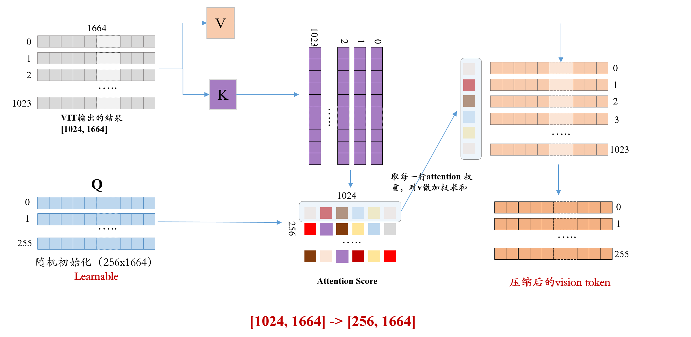

Cross Attention（交叉注意力）和 Self Attention（自注意力）是注意力机制中的两种不同类型，它们在信息交互的方式上有显著的区别。具体来说，主要区别体现在输入的来源和信息交互的对象上。

一、定义与核心原理

1. 自注意力机制（Self-Attention）

- 定义：Self Attention 用于计算同一输入序列内部元素之间的依赖关系，即每个元素与序列中其他元素的关联程度。

- 核心原理：
 - 输入序列通过线性变换生成查询向量（Query, Q）、键向量（Key, K）和值向量（Value, V）。
 - 通过计算 Query 与所有 Key 的相似度（如点积、缩放点积），得到注意力权重。
 - 权重对 Value 进行加权求和，输出当前元素的表示（融合了序列全局信息）。

- 典型应用：Transformer 的编码器层、BERT 等模型。

2. 交叉注意力机制（Cross-Attention）

- 定义：交叉注意力机制用于计算两个不同输入序列之间的依赖关系，即一个序列的元素与另一个序列元素的关联程度。
- 核心原理：
  - 两个序列分别为**目标序列**（生成 Query）和**上下文序列**（生成 Key 和 Value）。
  - Query 来自目标序列，Key 和 Value 来自上下文序列，通过计算 Query 与 Key 的相似度得到权重，对 Value 加权求和后输出目标序列的表示。
- 典型应用：Transformer 的解码器层（目标序列为 Decoder 输入，上下文序列为 Encoder 输出）、图像生成模型（如 Diffusion Models）中的文本 - 图像交互。

二、 核心区别对比

||Self-Attention|Cross-Attention|
|---|---|---|
|输入序列数量|1个（同一序列）|2个（目标序列、上下文序列）|
|Q/K/V来源|Q、K、V 均来自同一序列|Q 来自目标序列，K/V 来自上下文序列|
|关注对象|序列内部元素之间的依赖关系|两个序列元素之间的依赖关系|
|信息交互方向|单向（序列来自交互）|单向（目标序列关注上下文序列）|
|核心功能|捕捉序列内部的长距离依赖、全局结构|利用上下文信息增强目标序列的表示|

三、优缺点对比

1、Self-Attention

优点：

  - 全局建模能力：能捕捉序列内任意位置的依赖关系，解决循环神经网络（RNN）的长距离依赖问题。
  - 并行计算：可同时计算所有元素的注意力权重，适合批量处理，提升训练效率。
  - 结构灵活：无需依赖外部信息，适用于单模态、无额外上下文的任务（如文本分类）。

缺点：

  - 计算复杂度高：时间和空间复杂度为 O(n2)（n为序列长度），长序列（如文档级文本）场景下计算成本激增。
  - 缺乏外部信息引导：仅依赖自身序列信息，难以利用跨模态或先验知识（如文本生成图像时需结合图像语义）。

2. Cross-Attention

优点：
  - 上下文引导：通过引入外部上下文（如 Encoder 输出、文本描述），可针对性地增强目标序列的表示，提升任务相关性。
  - 计算效率更高：若目标序列长度为 m，上下文序列长度为 n，复杂度为 O(mn)，通常 m≪n（如 Decoder 生成时逐词解码），实际计算量低于自注意力。
  - 跨模态交互：天然支持不同模态数据的交互（如文本 - 图像、语音 - 文本），适用于多模态任务。

缺点：
  - 依赖上下文质量：若上下文序列携带噪声或关键信息缺失，会直接影响目标序列的表示效果。
  - 结构受限：需明确区分目标序列和上下文序列，无法单独使用（需配合其他模块提供上下文）。

四、应用场景对比
1. 自注意力机制适用场景

- 单模态无上下文任务：
  文本分类、语义相似度计算（如 BERT 直接处理单句或句子对）。
  图像特征提取（如 Vision Transformer 将图像分块后计算块间注意力）。
- 需要全局建模的任务：
  机器翻译的 Encoder 层（捕捉源语言句子的全局结构）。
  长文本摘要生成（需整合全文信息）。

2. 交叉注意力机制适用场景

- 多模态任务：
  机器翻译的 Decoder 层（目标语言序列关注源语言 Encoder 的输出）。
  图像生成（如 Stable Diffusion 中文本 Embedding 作为上下文，指导图像特征生成）。
- 条件生成任务：
  文本生成（如 GPT 系列通过交叉注意力融合提示词或前缀信息）。
  语音合成（文本序列作为上下文，指导语音特征生成）。
- 交互式任务：
  问答系统（问题作为上下文，关注文档中的关键段落）。

五、总结与选择建议
核心差异本质：**自注意力是 “内部交互”，交叉注意力是 “外部引导”。**

选择依据：
- 若任务仅需建模单一序列的内部结构（如文本理解），优先使用自注意力。
- 若任务需要结合外部信息（如条件生成、跨模态交互），交叉注意力是更优解。
结合使用案例：
- Transformer 中 Encoder 层用自注意力建模源语言，Decoder 层用交叉注意力关注 Encoder 输出，同时用自注意力建模目标语言内部依赖。
- 多模态模型（如 CLIP）通过自注意力分别处理文本和图像，再通过交叉注意力计算跨模态相似度。