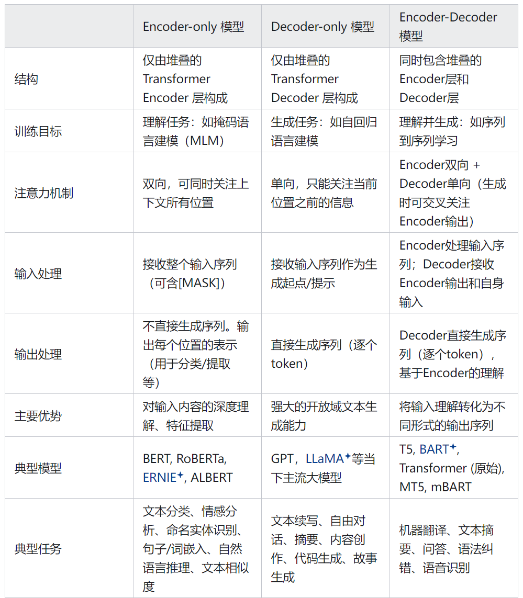

Encoder-only、Decoder-only和Encoder-Decoder的模型区别

# 标准的 `Transformer` 中的 `Encoder` 和 `Decoder`

- `Encoder` 负责理解输⼊⽂本，为每个输⼊构造对应的语义表⽰（语义特征）。

- `Decoder` 负责⽣成输出，使⽤ Encoder 输出的语义表⽰结合其他输⼊来⽣成⽬标序列。

## Encoder-only 模型

Encoder-only 模型只使⽤编码器部分。核心思想是**理解与表示​**​。专注于学习输入序列的​**​深度双向上下文表示**​​。

架构上只包含堆叠的Transformer Encoder层。每个Encoder层包含自注意力机制（可以关注序列中所有位置）和前馈神经网络。

训练目标：

- **掩码语言建模**：​​ 随机屏蔽输入序列中的一些词（Token），让模型预测被屏蔽的词。通过这种方式，模型被迫学习利用上下文所有词的信息来理解句子。
- **下一句预测**：​​ （如BERT）判断两个句子是否是连续的。

工作流程：

1. 输入序列被送入模型。
2. 每个Encoder层对序列进行自注意力和前馈计算，逐步精炼每个Token的表示。
3. **最终输出**：​​ 模型输出每个输入Token位置的​​上下文丰富的向量表示（Embedding）​​。这些表示捕获了该Token在整个输入序列上下文中的语义。

代表模型：BERT

## Encoder-Decoder 模型

核心思想是​​**序列到序列学习**，将​**​理解输入序列​​和​​生成输出序列**​​结合起来，处理源序列到目标序列的转换问题。

架构包含两个部分：
- Encoder：​​ 接收并编码输入序列（源语言文本、长文档等），输出其上下文表示。
- Decoder：​​ 接收Encoder的输出（常称为context或memory）。在生成目标序列的每个Token时：

  - 进行​​掩码自注意力​​（关注已生成的目标序列部分）。
  - 进行​​交叉注意力​​（关注Encoder的输出）。
  - 结合两者信息预测下一个目标Token。

训练目标：

**序列到序列学习**​​。模型被训练以给定输入序列X的条件下，预测目标序列Y。损失函数通常是目标序列各位置Token预测损失的和。

工作流程：

1. 输入序列 x​​（源文本）送入​​Encoder​​进行处理，得到包含整个输入信息的上下文表示context。
2. Decoder​​接收到起始符（如[SOS]）和context信息。
3. Decoder基于当前状态、已生成的目标序列和context信息，预测下一个目标Token y_t。
4. 将y_t加入Decoder输入序列。
5. 重复步骤3-4，直到生成结束符（如[EOS]）或达到指定长度。

代表模型：T5\BART

## Decoder-only 模型核心思想是自回归生成​​。

**专注于​​基于已有信息（提示/上下文）按顺序生成新的序列**​​

架构：只包含堆叠的Transformer ​​Decoder​​层。Decoder-only模型的Decoder层通常采用​​掩码自注意力​​ (Masked Self-Attention) 机制（在生成时只能看到当前位置及之前的信息，防止看到未来的词）。

训练目标：自回归语言建模​​。模型被训练来预测序列中​​下一个词​​是什么，给予所有之前的词。训练损失是所有位置“下一个词”预测损失的和。

工作流程：

1. 输入一个​​起始符​​或一个​​提示序列​​作为初始上下文。
2. 模型基于当前的上下文，预测下一个最可能的Token y_t (生成)。
3. 将预测的Token y_t 添加到输入序列后面，形成新的输入上下文。
4. 重复步骤2-3，直到生成结束符或达到指定长度。

代表模型：llama GPT

## 主流大模型都是Decoder-only架构的原因：

**第一 Decoder-only的泛化性能更好**。

- **注意力满秩问题**。双向attention的注意力矩阵容易退化为低秩状态，表达能力会下降；而causal attention（就是Decoder-only的单向attention）的注意力矩阵是下三角矩阵，必然是满秩的，建模能力更强
- **预训练任务难度问题**。纯粹的Decoder-only架构 + Next Token Prediction预训练任务，每个位置所能接触的信息比其他架构少，要预测下一个token的难度更高。当模型足够大、数据足够多的时候，Decoder-only模型学习通用表征的上限更高
- **上下文学习（In-context Learning）为Decoder-only架构带来更好的few-shot性能**。具体来说，prompt和示例的信息可以视为对模型参数的隐式微调，而Decoder-only架构的prompt可以更加直接地作用于decoder每一层的参数，微调的信号更强（模型不更新权重，但通过注意力机制把这些示例当成了临时的规则，从而指引模型行为）
- **causal attention具有隐式的位置编码功能，打破了Transformer的位置不变性**。而双向attention的模型如果不带位置编码，双向attention的部分token对换后也不改变表示，对语序的区分能力天生较弱

**第二 效率问题**

- **Decoder-only支持一直复用KV-Cache。** 生成第N+1个词时，不需要重新计算前面N个词在注意力机制中的Key和Value值，放在Cache里直接拿来用就行。对多轮对话更友好
- **轨迹依赖。** OpenAI以Decoder-only架构为基础摸索出了一套行之有效的训练方法和Scaling Law，工程生态上Megatron和Flash Attention等重要工具对causal attention的支持也会更好
  
总结：

- Decoder-only架构在参数量不太大时就具有更强的zero-shot性能，更匹配主流的自监督训练范式
- 大参数量的加持下具有了涌现能力后，可以匹敌Encoder-Decoder做微调的效果而不需要有标注的数据，且在In-Context的环境下又能更好地做few-shot任务

## 注意力满秩问题（理论优势）

低秩这一块可以看苏神的博客：[为什么现在的LLM都是Decoder-only的架构？ - 科学空间|Scientific Spaces](https://link.zhihu.com/?target=https%3A//kexue.fm/archives/9529/comment-page-1)

1、首先要明确，啥是秩？

- 矩阵的秩 = 矩阵在行方向（或列方向）上线性无关的向量的最大个数, 因此，信息冗余会导致低秩

2、其次要明确，这里讨论的注意力矩阵是什么？为什么双向注意力会导致低秩，而单向注意力是满秩？

- 指的是注意力分数矩阵，即$QK^T $计算出的矩阵，通常是softmax之前的矩阵（softmax会有一定的升秩作用）
- 在双向注意力（如BERT）中，每个词可以看到所有词（包括它自己和前后的词），导致矩阵中大量信息是对称、冗余、线性相关的。矩阵会趋近于一个低秩的结构
- 而在单向注意力（如GPT）中，每个词只能看到它之前的词（因果掩码），强制打破了对称性。矩阵变成严格的下三角形式（主对角线及以下可随意，以上强制为负无穷），这种结构天然是满秩的

3、那为什么低秩会削弱模型的表达能力呢？

- 几何角度，秩越低，矩阵能把向量映射到的目标空间的维度就越低，能表达的不同模式就越少
- 信息角度，低秩产生了线性相关性，即冗余信息
- 一句话总结，低秩 = 信息经过变换后被压缩进了更低维的空间 + 输出成分之间存在大量线性依赖 = 无法表达丰富、独立、精细的模式 = 表达能力下降

## zero-shot能力问题

Decoder-only架构有如下三个优势：
1、更好的zero-shot性能，更适合于大语料自监督学习

- Decoder-only模型在没有任何tuning数据的情况下zero-shot表现最好，而Encoder-Decoder则需要在一定量的标注数据上做多任务微调才能激发最佳性能
- 目前的LLM训练范式还是在大规模语料上做自监督学习。很显然，zero-shot性能更好的Decoder-only架构才能更好地利用这些无标注数据
- 此外，InstructGPT在自监督学习外还引入了RLHF辅助学习。RLHF本身也不需要人工提供任务特定的标注数据，仅需要在LLM生成的结果上作排序

2、大数据训练+大参数模型的涌现能力替代了多任务微调

- 大模型的涌现能力（emergent abilities）是指在模型参数量足够大时，模型的能力提升不再遵守以往的log-linear（对数-线性性能）提升法则，而是突然急速增强性能。

- 涌现能力的一个表现是，当参数量达到一定量级后，模型具有了**复杂的推理能力**，譬如从非结构化的文本中自动提取结构化的知识。那么，LLM也可以**自动从大数据里做self multi-task finetune，因为大数据里天然蕴含了许多任务**，比如：双语网页数据->机器翻译，论文数据->文本摘要，维基百科数据->命名实体识别等等
- 由此，Encoder-Decoder在multi-task finetune上的优势在大参数量时被LLM涌现出的推理能力拉平了

3、In-context Learning对LLM有few-shot微调的作用

- 在实际使用LLM时，经常会加入CoT（Chain-of-Thought）或In-Context信息作为prompt，以进一步激发模型的潜力，例如加入一些示例让GPT类模型来模仿、生成更好的结果
- In-Context信息可以视为一种任务微调，即**将prompt信息归为对Transformer Attention层参数的微调**
- Decoder-only架构中，prompt和示例直接作为前缀序列，能被每一层decoder的因果自注意力无损失地、反复地、直接地看到和利用，这种“短接”的路径使得上下文中的示例产生了堪比强监督信号的隐式微调效果——不改变参数值，但强力地改变了每层表征的流动方向

训练效率问题（infra角度）

**Decoder-only架构最核心的优势是非常便于scaling up，基于scaling laws的实际训练成本最低**

- 相同参数量的训练效率上：Decoder-only > Encoder-only > Encoder-Decoder
- 现行分布式并行策略（如下表）下，可以扩展的参数量上限和分布式集群规模的上限：Decoder-only Encoder-only >> Encoder-Decoder

**流水并行（Pipeline Parallelism）是千卡以上分布式训练中最重要的特性。** 如T5这样的Encoder-Decoder模型很难scaling up（最大的T5模型只有11B，详见google-research/text-to-text-transfer-transformer），因为很难使用PP（而11B恰好是一个不借助PP，仅通过ZeRO + TP就可以训练的模型大小）

- 流水并行有很重要的约束条件：**需要一个规整对称、线性顺序的网络结构**。GPT就是这样一个典型的网络结构：完全一样的Transformer Layer顺序堆叠，没有分叉和不对称的情况。当均匀切分Layer时，各个Stage的前向/反向计算时间均一致
- 而T5这样的Encoder-Decoder架构，整个网络分为两大块，且Encoder和Decoder的Transformer Layer参数大小、Attention计算量、Context Length等均不一致，导致Encoder的理论计算量要比Decoder大很多（整个网络不是均匀对称的）；且Encoder的输出要发给每个Decoder Layer，网络结构不是线性而是有大量的分叉，前向/反向之间包含了复杂的数据依赖关系，会**导致流水并行中各个Stage之间产生大量的非对称的、间隔跨多个Stage的数据依赖**，更加剧了流水并行的加载均衡问题

# 参考：
[主流大模型都是Decoder-only架构的原因](https://zhuanlan.zhihu.com/p/2032483128695109534)