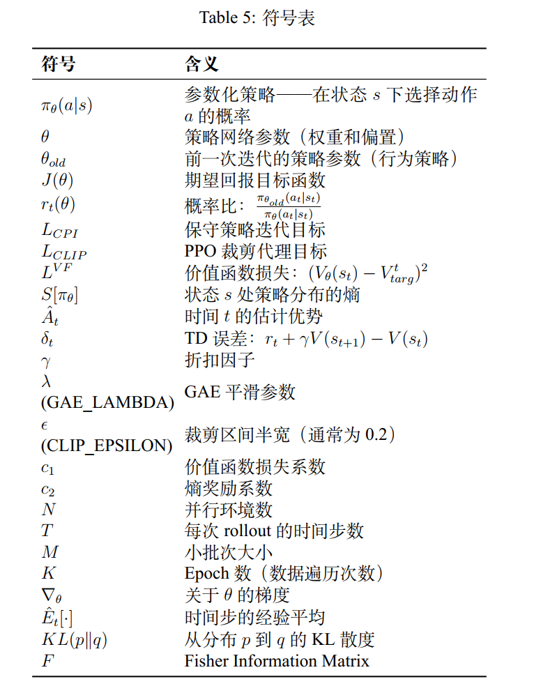

# 1 背景与动机
## 1.1 从 Policy Gradient 到 PPO

`Proximal Policy Optimization (PPO)` 代表了强化学习算法的重大进步。要理解其动机，我们必须首先研究现有策略优化方法的格局。
传统的策略梯度方法（如 REINFORCE）虽然简单优雅，但存在一个关键缺陷：它们是 `on-policy` 算法，这意味着每次更新策略参数时都必须丢弃所有收集的数据。这导致极低的样本效率。

另一方面， `Trust Region Policy Optimization (TRPO)` 引入了一种使用 KL 散度约束策
略更新的数学严格方法。然而， TRPO 需要计算 `Fisher Information Matrix`（KL 散度的二阶导数），对于大型神经网络来说计算量巨大。

PPO 取得了平衡： 它保留了 TRPO 约束优化的数学安全性，同时实现了标准策略梯度方法的计算简单性。

1.2 PPO的设计目标

PPO的核心创新是剪裁代理目标函数。

与 TRPO 使用硬 KL 约束不同， PPO 修改目标函数本身来惩罚偏离旧策略过远的策略更新。这种裁剪机制在计算上微不足道，同时有效地防止了破坏性的策略更新

# 2 标准策略梯度基础
## 2.1 目标函数

在强化学习中，我们的根本目标是最大化策略 $ π_\theta$ 下的期望累计奖励。期望回报定义为：
$$J(θ) = E_{τ∼π_θ}[R(τ)]  $$ (1)
其中:
- $τ = (s0, a0, r1, s1, a1, r2, . . .) $：轨迹（状态和动作的序列）
- $R(τ) = ∑T t=0 rt$：轨迹的总奖励
- πθ：由神经网络权重 θ 参数化的策略

2.2 策略梯度定理

使用似然比技巧，可以在不计算环境动力学梯度的情况下推导目标函数梯度：

$$\nabla_{\theta}J(\theta)=E_{\tau\sim\pi_{\theta}}[(\sum_{t=0}^{T}\nabla_{\theta}\log~\pi_{\theta}(a_{t}\vert{}s_{t}))R(\tau)] $$


通过仔细应用因果原则(时间t之前的奖励不影响时间t的梯度)，这简化为：   
$$\nabla_{\theta}J(\theta)=\hat{E}_{t}[\nabla_{\theta}\log~\pi_{\theta}(a_{t}\vert{}s_{t})\hat{A}_{t}] $$  
其中 $\hat{A}_{t}$ 是时间步t的估计优势函数。   

符号定义：
- $\hat{E}_{t}[\cdot]$：时间步的经验平均(近似期望)   
- $\nabla_{\theta}\log~\pi_{\theta}(a_{t}\vert{}s_{t})$：在状态下选择动作 $a_{t}$ 的对数概率梯度   
- $\hat{A}_{t}$：优势估计，衡量一个动作相比该状态的平均行为好多少  

## 2.3 伪目标函数

相应的伪目标函数（通过梯度上升最大化为）：

$$L_{PG}(\theta)=\hat{E}_{t}[\log~\pi_{\theta}(a_{t}\vert{}s_{t})\hat{A}_{t}] $$

这是PPO构建的基础

# 3 通过重要性采样的离策略学习

## 3.1 离策略学习的必要性   

标准策略梯度方法是`on-policy`的：每次更新$\theta $时，我们必须丢弃采样轨迹并采集新轨迹。这极大了样本效率。   

为提高数据效率，我们希望使用由旧策略 $\pi_{\theta_{old}} $收集的数据来优化新策略 $\pi_{\theta} $。   

## 3.2 重要性采样恒等式   

我们使用重要性采样来实现这一点，这是一种将一个分布下的期望重写为另一个分布下期望的数学恒等式：

$$E_{x\sim p}[f(x)]=\int p(x)f(x)dx=\int q(x)\frac{p(x)}{q(x)}f(x)dx=E_{x\sim q}[\frac{p(x)}{q(x)}f(x)] $$

关键洞察：分布p下的期望可以使用来自分布的样本计算，通过重要性权重 $\frac{p(x)}{q(x)} $ 来修正分布不匹配

## 3.3 概率比

将此应用于策略目标，定义定义概率比 $r_{t}(\theta) $：   

$$r_{t}(\theta)=\frac{\pi_{\theta_{old}}(a_{t}\vert{}s_{t})}{\pi_{\theta}(a_{t}\vert{}s_{t})} $$

重要观察：如果 $\theta=\theta_{old} $。则 $r_{t}(\theta)=1 $

## 3.4 保守策略迭代(CPI)目标   

用这个比率替换标准对数梯度得到保守策略迭代目标：   

$$L_{CPI}(\theta)=\hat{E}_{t}[\frac{\pi_{\theta_{old}}(a_{t}\vert{}s_{t})}{\pi_{\theta}(a_{t}\vert{}s_{t})}\hat{A}_{t}]=\hat{E}_{t}[r_{t}(\theta)\hat{A}_{t}] $$

符号定义：
- $\pi_{\theta_{old}}(a_{t}\vert{}s_{t} )$：在状态 $s_{t} $ 下由旧(行为)策略选择动作 $a_{t} $ 的概率 
- $\pi_{\theta}(a_{t}\vert{}s_{t}) $：新(目标)策略下的概率
- $r_{t}(\theta) $：衡量新策略相比旧策略选择 $a_{t} $ 的可能性倍数 

# 4 破坏性更新的危险   

## 4.1 为什么无约束的 $L_{CPI}$ 是危险的   

无约束地最大化 $L_{CPI}(\theta) $ 是非常危险的。因为 $L_{CPI}$ 只是真目标在 $\theta_{old}$ 附近的一阶(线性)近似，巨大的梯度步长可能导致 $r_{t}(\theta)$ 飙升或暴跌。这迫使策略进入无法恢复的状态，性能崩溃。

## 4.2 一阶(线性)近似陷阱   

在机器学习中，真目标函数(在所有可能的神经网络权重上策略的实际好坏)是一个高度复杂的蜿蜒山脉。   

当算法进行一阶近似时，它：
1. 在单一精确坐标 $(\theta_{old})$ 处观察山脉   
2. 计算斜率(一阶导数/梯度)   
3. 画一条完全直的正切线

**局部(小额步长)**：直线非常准确。沿直线移动0.001个单位，你基本上仍在山上。
**全局(巨额步长)**：直线完全脱离现实。如果山脉突然变成陡峭的下行悬崖，直线不在乎——它继续指向天空。   

对于好动作 $(\hat{A}_{t}>0) $，线性近似告诉网络：”你越朝这个方向移动，奖励越高，无限！”优化器盲目信任这条线并迈出巨额步长，迫使 $r_{t}(\theta) $ 飙升至无穷大。   

相反，对于坏动作 $(\hat{A}_{t}<0) $，这条线告诉它使概率比降至零，完全破坏策略分布。

## 4.3 TRPO的解决方案:硬KL约束   

TRPO 认识到这种危险，并引入硬数学约束使用KL散度确保 $\pi_{\theta} $ 保持在 $\pi_{\theta_{old}} $ 附近：   

$$\max_{\theta} \hat{E}_{t}[r_{t}(\theta)\hat{A}_{t}] \text{ subject to } \hat{E}_{t}[KL(\pi_{\theta_{old}}(\cdot\vert{}s_{t})\vert{}\vert{}\pi_{\theta}(\cdot\vert{}s_{t}))]\le\delta $$

符号定义：   
- $KL(\pi_{\theta_{old}}\vert{}\vert{}\pi_{\theta}) $：衡量策略分布变化的KL散度   
- $\delta $：最大允许KL散度(”信任区域”半径) 

## 4.4 Fisher Information Matrix 噩梦   
为什么 TRPO计算量巨大：   

”信任区域”的形状不是完美的圆——它是一个高度扭曲的多维椭球。在某些权重方向上，微小变化会完全改变策略；在其他方向上，你可以大幅度改变权重而不改变行为。为了绘制这个安全区域的确切轮廓，TRPO必须计算KL散度梯度如何随权重变化。梯度的导数是**二阶导数**(称为`Hessian` 的偏二阶导数矩阵)。   

当应用于概率分布时，这个特定的二阶导数矩阵被称为`Fisher Information Matrix (FIM)`。

计算规模：   
假设你的神经网络包含 $P=1,000,000$ 个参数(权重和偏置)。FIM是一个大小为 $P\times P $ 的方阵，包含1万亿个元素。存储这需要大约`4TB`的显存。   
要进行更新步骤，TRPO必须计算这个矩阵的逆 $(F^{-1}) $，这在计算上是毁灭性的。

## 4.5 PPO的巧妙解决方案   

PPO 看到了这个计算噩梦，说：“与其花费巨大的计算能力构建一个完美的4TB安全室矩阵(TRPO)，不如使用我们廉价的线性近似，但添加一个简单的裁剪函数来切断试图走太远的梯度。” 

# 5 PPO裁剪代理目标   
## 5.1 裁剪区间   

PPO 不是在策略空间上强制硬约束，而是强制概率比 $r_{t}(\theta) $ 保持在1附近的区间内，通常是：

$$[1-\epsilon,1+\epsilon]$$  

其中 
- $\epsilon\approx0.2 $ 是一个超参数。   
  
## 5.2 裁剪代理目标定义   

PPO 裁剪代理目标定义为：

$$L_{CLIP}(\theta)=\hat{E}_{t}[\min(r_{t}(\theta)\hat{A}_{t},\text{clip}(r_{t}(\theta),1-\epsilon,1+\epsilon)\hat{A}_{t})] $$

符号定义：   
- $\text{clip}(r_{t}(\theta),1-\epsilon,1+\epsilon) $：将 $r_{t}(\theta) $ 裁剪到区间 $[1-\epsilon,1+\epsilon] $   
- $\min(\cdot,\cdot) $：取未裁剪和裁剪目标的最小值

## 5.3 案例分析:裁剪机制如何工作   

为了理解为什么min和clip算子有效，我们必须根据动作是否产生正向或负向结果来检查它们的行为。   

### 5.3.1 Case 1:正优势 $(\hat{A}_{t}>0) $   

采取的动作获得了超出预期的回报。我们想修改使这个动作更可能，这将驱动 $r_{t}(\theta)$ **高于1**。   

**子情况1a**:当 $r_{t}(\theta)\le1+\epsilon $   

裁剪函数不触发。目标简化为：

$$L_{CLIP}(\theta)=r_{t}(\theta)\hat{A}_{t} $$

梯度是活跃的，网络学习增加这个好动作的概率。   

**子情况1b**:当 $r_{t}(\theta)>1+\epsilon $   

裁剪项锁定在 $(1+\epsilon)\hat{A}_{t}$。因为 $\hat{A}_{t}>0 $：

$$r_{t}(\theta)\hat{A}_{t}>(1+\epsilon)\hat{A}_{t} $$  
$\min(\cdot) $ 算子选择较小的值： $(1+\epsilon)\hat{A}_{t} $   

**直觉**：一旦策略使动作比之前可能性高出 $1+\epsilon $ 倍，梯度降至零。这防止算法在单个好轨迹上过度优化。


## 5.3.2 Case 2:负优势 $(\hat{A}_{t}<0) $   

采取的动作获得了低于预期的回报。我们想修改使这个动作不太可能，这将驱动 $r_{t}(\theta)$ 低于1。   

**子情况2a**:当 $r_{t}(\theta)\ge1-\epsilon $   
裁剪函数不触发。目标是 $r_{t}(\theta)\hat{A}_{t} $。   

**子情况2b**:当 $r_{t}(\theta)<1-\epsilon $   

裁剪项锁定在 $(1-\epsilon)\hat{A}_{t} $。因为 $\hat{A}_{t}<0 $，乘以一个较小的数得到一个**较大(较小负)** 的值：

$$0.5\times(-2)=-1.0 \text{ 而 } 0.8\times(-2)=-1.6 $$

$\min(-1.0,-1.6) $ 算子选择较小(较负)的值： $(1-\epsilon)\hat{A}_{t} $   

直觉：当 $r_{t}(\theta) $ 低于 $1-\epsilon $ 时，目标变平，意味着智能体不会因为使坏动作更不可能而获得无限赞扬。


## 5.4 紧急制动机制   

如果策略犯了可怕的错误怎么办？   

如果动作是坏的 $(\hat{A}_{t}<0) $ 但策略更新意外地使其更可能 $(r_{t}(\theta)\gg1) $：   
- 裁剪项变为 $(1+\epsilon)\hat{A}_{t} $ (一个大负数)   
- 未裁剪项 $r_{t}(\theta)\hat{A}_{t} $ 变成一个巨大的负数   
- $\min(\cdot) $ 算子选择未裁剪的值

这充当未裁剪的紧急制动，允许强大的负梯度将策略有力地拉回。   

## 5.5 数学总结:裁剪如何迫使梯度为零   

理解裁剪如何限制更新，我们检查反向传播期间梯度发生了什么。回想核心优化更新步骤：

$$\theta_{new}=\theta_{old}+\eta\nabla_{\theta}L_{CLIP}(\theta) $$  

如果 $\nabla_{\theta}L_{CLIP}(\theta)=0 $，则 $\theta_{new}=\theta_{old} $，意味着网络完全停止学习该数据点。当 $r_{t}(\theta)>1+\epsilon $：   

$$L_{CLIP}(\theta)=(1+\epsilon)\hat{A}_{t} $$

仔细看这个项。$(1+\epsilon) $ 是一个常数(如0.2)， $\hat{A}_{t} $ 已在数据收集期间计算和冻结。这个项中没有 $\theta $ 残留。它是一个平的常数。   

因此：

$$\nabla_{\theta}L_{CLIP}(\theta)=\nabla_{\theta}[\text{constant}]=0 $$  

总结：裁剪机制不是物理上阻塞权重；它使损失景观变平。当策略偏离太远时，通过将目标函数变成平坦高原，它剥夺了优化器的梯度。没有梯度，优化器无法计算移动方向，有效地锁定策

# 6 完整PPO 目标函数   

## 6.1 带价值函数和熵奖励的完整目标 

当使用深度神经网络实现PPO时，策略网络(Actor)和价值网络(Critic)通常共享早期层。为了同时优化两者同时防止提前收敛，最终PPO损失函数结合了三个组件：   

$$L^{CLIP+V_{F}+S}(\theta)=\hat{E}_{t}[L_{CLIP}^{t}(\theta)-c_{1}L_{t}^{VF}(\theta)+c_{2}S[\pi_{\theta}](s_{t})] $$

其中：   

$$L_{t}^{VF}(\theta)=(V_{\theta}(s_{t})-V_{targ}^{t})^{2} $$

符号定义：   
- $L_{CLIP}^{t}(\theta) $：时间t的裁剪代理目标   
- $L_{t}^{VF}(\theta) $：价值函数损失——预测值 $V_{\theta}(s_{t}) $ 与目标值 $V_{targ}^{t}$ 之间的均方误差   
- $S[\pi_{\theta}](s_{t}) $：状态 $s_{t} $ 处策略熵，衡量策略的随机性   
- $c_{1} $：价值函数损失系数(通常为0.5)   
- $c_{2} $：熵奖励系数(通常为0.01)  


## 6.2 组件1:裁剪代理目标 $L_{CLIP}$   

如第5章所推导的，这是防止破坏性策略更新的核心PPO目标：   
$$L_{CLIP}(\theta)=\hat{E}_{t}[\min(r_{t}(\theta)\hat{A}_{t},\text{clip}(r_{t}(\theta),1-\epsilon,1+\epsilon)\hat{A}_{t})] $$  

## 6.3 组件2:价值函数损失 $L^{VF}$   

价值函数损失迫使Critic准确预测状态值：
$$L_{t}^{VF}(\theta)=(V_{\theta}(s_{t})-V_{targ}^{t})^{2}=(V_{\theta}(s_{t})-\hat{R}_{t})^{2} $$  

重要性：   
- Critic 网络 $V_{\theta}(s) $ 估计从状态开始的期望累计奖励   
- $V_{targ}^{t} $ 是目标值(通常使用GAE或n步回报计算)   
- 最小化这个MSE损失提高优势估计的准确性   
- 更好的优势估计带来更稳定和高效的学习

# 6.4 组件3:熵奖励 $S[\pi_{\theta}] $   
熵衡量策略分布的随机性或不确定性：   
$$S[\pi_{\theta}](s)=-\sum_{a}\pi_{\theta}(a|s)\log~\pi_{\theta}(a|s) $$ 

对于具有 softmax 策略的离散动作空间，这是动作概率分布的香农熵。

熵奖励的作用：   
- **鼓励探索**：确定性策略(所有概率在一个动作上)的熵为零。添加熵奖励防止策略过早崩溃   
- **防止提前收敛**：没有熵奖励，策略可能过早锁定在次优确定性策略上   
- **系数** $c_{2} $：控制探索强度。太高=随机行为；太低=提前收敛   

重要说明：熵奖励在损失函数中被减去，意味着我们**最大化熵同时最大化裁剪目标**。这通过添加 $-c_{2}\times S $(负熵)到损失来实现，等价于最小化 $c_{2}\times(-S) $。


# 7 优势估计   

## 7.1 [Mni+16] 风格:截断 horizon   
一种策略梯度实现风格，在[Mni+16] (Mnih et al. 2016 A3C论文)中流行，非常适合与循环神经网络一起使用，运行策略T个时间步(其中T远小于回合长度)，并使用收集的样本进行更新。   

这种风格需要不超出时间步T的优势估计器。   

## 7.2 截断估计器(公式10)   

[Mni+16]使用的估计器是： 
$$\hat{A}_{t}=-V(s_{t})+r_{t}+\gamma r_{t+1}+\cdot\cdot\cdot+\gamma^{T-t+1}r_{T-1}+\gamma^{T-t}V(s_{T}) $$

其中指定在给定长度-T轨迹段内的时间索引[0,T]。符号定义：   
- $V(s_{t})$：截断段开始处的价值估计   
- $r_{t},r_{t+1},...,r_{T-1} $：截断窗口内的观测奖励   
- $\gamma^{T-t}V(s_{T}) $：截断段末尾的 bootstrap 值   
- $V(s_{t}) $ 前的负号修正起始值(基线减法)   

直觉：这个估计器正好向前看T-t步(加上末尾的bootstrap值)，使其适用于RNN中截断 BPTT(通过时间的反向传播)。


## 7.3 广义优势估计(GAE)

推广截断选择，我们可以使用截断广义优势估计版本，当 $\lambda=1$ 时简化为公式(10)：   

$$\hat{A}_{t}=\delta_{t}+(\gamma\lambda)\delta_{t+1}+\cdot\cdot\cdot+(\gamma\lambda)^{T-t+1}\delta_{T-1} $$  

其中TD误差定义为：   
$$\delta_{t}=r_{t}+\gamma V(s_{t+1})-V(s_{t}) $$  

符号定义：   
- $\delta_{t} $：时间t的TD误差(价值估计偏离了多少)   
- $\gamma $：折扣因子   
- $\lambda $：GAE平滑参数(平衡偏差和方差)   
- $V(s_{t+1}) $：下一状态的价值估计

7.4 从第一性原理推导 GAE   
GAE 公式表示n步TD误差的指数加权移动平均：   
$$\hat{A}_{t}=\sum_{n=0}^{T-t-1}(\gamma\lambda)^{n}\delta_{t+n} $$  
让我们验证当 $\lambda=1$ 时这简化为公式(10)：   
   
$$\hat{A}_{t}=\delta_{t}+\gamma\delta_{t+1}+\gamma^{2}\delta_{t+2}+\cdot\cdot\cdot+\gamma^{T-t-1}\delta_{T-1} $$ 

展开每个 $\delta$：
$$\delta_{t}=r_{t}+\gamma V(s_{t+1})-V(s_{t}) $$  
$$\delta_{t+1}=r_{t+1}+\gamma V(s_{t+2})-V(s_{t+1}) $$

经过代数消去的望远镜求和后，这简化为正是公式(10)。   

## 7.5 通过 $\lambda$ 的偏差-方差权衡   
GAE_LAMBDA($\lambda$)是平衡两个evil的调谐旋钮：   

极端1: $\lambda=0$ (高偏差，低方差)   
- 算法只向前看一步   
- 严重依赖 Critic 网络的价值估计   
- 训练初期，当Critic无知时，这导致系统性偏差   
  
极端2: $\lambda=1$ (低偏差，高方差)   
- 算法一直看到回合结束(蒙特卡洛回报)   
- 不依赖价值估计(无偏)   
- 然而，随机环境导致方差在长 horizon上指数级复合   

最佳点: $\lambda=0.95$ 
通过设置 GAE_LAMBDA $=0.95$，我们取所有多步向前看的指数加权平均：   
- 严重倾向于向前看远方(低偏差)   
- 应用温和的折扣因子来抑制后期步骤的混乱噪声(可控方差)   
  
数十年的经验 RL研究表明， 0.95 是平衡这种权衡的几乎通用最优选择


# 8 理解PPO 目标曲线   
## 8.1 沿策略更新方向的插值   
神经网络权重生活在具有数千或数百万维的空间中，使可视化整个损失景观成为不可能。为了解决这个问题，研究人员通过该巨大空间取一个单一的1D”切片”。   
设 $\theta_{old} $ 为起始权重， $\theta_{new} $ 为PPO提出的目标权重。”方向”是连接它们的直线：   $$\theta(\alpha)=\theta_{old}+\alpha(\theta_{new}-\theta_{old}) $$  

阅读x轴(线性插值因子)：   
- 在 $\alpha=0 $：恰好站在 $\theta_{old}$(在进行任何更新之前)   
- 在 $\alpha=1 $：恰好站在 $\theta_{new}$ (PPO决定采取的实际步长)   
- 在 $\alpha>1 $：故意超调看看会发生什么   

## 8.2 阅读图表:曲线逐条   
该图显示当我们将 $\alpha $ 上下调节时，四个不同数学指标如何变化。   
橙线 $(L_{CPI}) $:危险的乐观主义者 
这是标准的未裁剪策略梯度目标 $(r_{t}A_{t}) $。注意当我们推过 $\alpha=1$ 时，橙线继续飙升向上。 
**问题：** 如果你使用标准策略梯度，优化器会说”哇，向右走产生巨大奖励！让我们大步迈向 $\alpha=5$ 或 $\alpha=10!$”这导致破坏性策略更新。   
**蓝线** $(\hat{E}_{t}[KL_{t}]) $:隐藏的悬崖 
这追踪KL散度(策略实际行为变化了多少)。注意它在 $\alpha=0$ 处是平的，但随着 $\alpha$ 增加曲线剧烈向上。 
**问题**：这显示了橙线盲目看不到的危险。如果优化器盲目跟随橙线向右走，策略变化如此剧烈以至于性能将完全崩溃。   
**绿线(仅裁剪项)** 
这显示隔离裁剪 piece的行为： $\text{clip}(r_{t},1-\epsilon,1+\epsilon)\hat{A}_{t} $。当你向右走时，它完全变平，一旦走太远就剥夺优化器的任何梯度。   
**红线** $(L_{CLIP})$: PPO的杰作 
这是实际的PPO目标函数，取橙线和绿线的最小值。注意其美丽的形状：   
- 在0和1之间，它向上爬升，允许模型高效学习   
- 它几乎恰好在 $\alpha=1$ 处达到峰值   
- 一旦你超调超过1，红线开始迅速下降

## 8.3 为什么红线下降?(”下界”直觉)   
PPO的 $L_{CLIP} $ 是 $L_{CPI} $ 的下界，对过大的策略更新进行惩罚。   
**为什么它下降而不是保持平坦？**   
PPO的一次迭代计算整个批次数据上的平均(期望)，包含数百个不同的状态-动作对。 
对于好动作 $(\hat{A}_{t}>0)$，超调使它们变平(跟随绿线)。 
但对于坏动作 $(\hat{A}_{t}<0)$，过大步长可能意外地使那些坏动作更可能。对于那些特定的坏转换，未裁剪项变成一个巨大的负数。 
因为PPO公式使用 $\min(\cdot) $ 算子，它迫使目标忽略好动作的平坦绿线，而是关注坏动作的巨大负惩罚。这将整个平均(红线)向下拖。


## 8.4 终极启示   
PPO的数学有效地重塑了损失景观。它将危险的盲目陡峭山峰(橙线)变成安全、定义良好的峰值(红线)，迫使你的深度学习优化器恰好在完美步长 $(\alpha=1)$ 处停止，此时更新是安全的。   

# 9 PPO中的On-Policy与Off-Policy   

## 9.1 澄清命名法   

**严格来说，PPO是一个on-policy算法**。在RL中，如果算法可以将经验存储在回放缓冲区中并重用由数百上千步前的旧策略收集的数据，则是off-policy(如DQN或SAC)。PPO不能做到这一点。如果你尝试用完全不同训练会话的数据喂养PPO，算法会失败。   
然而，PPO通常被描述为具有**off-policy 特性**，因为它是**局部 off-policy**。它使用一个策略收集一批数据，冻结该策略，然后重用相同的数据更新权重**K个epoch**。

## 9.3 为什么标准PG在重用数据上失败   
分解如下：   
1. 你使用当前策略权重 $\theta_{0} $ 收集数据   
2. 你运行一步梯度上升。你的权重从 $\theta_{0}\rightarrow\theta_{1} $ 变化   
3. 你现在有一个新策略 $\pi_{\theta_{1}} $   
4. 如果你尝试使用相同的数据进行第二步梯度下降，你正在用来自 $\pi_{\theta_{0}} $ 的数据评估 $L_{PG}(\theta_{1})$   
5. 因为 $\pi_{\theta_{1}}\ne\pi_{\theta_{0}} $，数学期望崩溃。梯度指向根本错误的方向，导致策略破坏性地过拟合于它不再代表的分布  

## 9.4 PPO如何克服这个(重要性采样)   
PPO 使用**重要性采样**绕过这个期望约束。这是一种数学恒等式，允许你使用从分布Q采样的数据计算分布P下的期望。   
PPO不是优化标准对数损失，而是优化一个比率：   
$$r_{t}(\theta)=\frac{\pi_{\theta_{old}}(a_{t}|s_{t})}{\pi_{\theta}(a_{t}|s_{t})} $$ 


目标函数变为：   
$$L_{CPI}(\theta)=E_{(s_{t},a_{t})\sim\pi_{\theta_{old}}}[\frac{\pi_{\theta_{old}}(a_{t}|s_{t})}{\pi_{\theta}(a_{t}|s_{t})}\hat{A}_{t}] $$  

注意现在的下标：数据允许来自 $\pi_{\theta_{old}} $。

当PPO运行K个epoch时， $\pi_{\theta_{old}} $ 保持完全冻结。当 $\theta $ 在那些epoch上更新和变化时，比率 $r_{t}(\theta) $ **数学上修正了数据略微陈旧的事实**。它缩放梯度上下以补偿分布偏移。   

## 9.5 解决你关于不准确优势函数的观点   
**统计噪声**(不准确的优势函数)和**系统性数学错误**(违反期望约束)之间有巨大差异。   
1. **训练开始时的不准确优势(统计噪声)**：Critic网络是新而且预测能力差，所以 $\hat{A}_{t}$ 高度不准确和有噪声。然而，在深度学习中，神经网络非常擅长过滤零均值随机噪声如果你喂养它们足够多的数据。只要梯度平均指向正确方向，模型将学习。   
2. **违反期望约束(系统性错误)**：如果你在不进行重要性采样的情况下在标准策略梯度中重用数据，你不仅仅是处理有噪声的数据——你正在给优化器喂一个数学上**欺诈的梯度**。优化器认为它正在计算当前策略景观的斜率，但实际上它正在计算来自旧策略的扭曲斜率。这种系统性偏差迅速将策略网络推下悬崖。

# 10 PPO算法流程   
## 10.1 解码优化指令   
短语”**Optimize surrogate L wrt $\theta$, with K epochs and minibatch size** M < NT”只是数据回收管道的紧凑机器学习速记。   

Table 1: PPO变量定义

|变量|是什么|实际含义|
|---|---|---|
|N|并行环境数|同时运行以收集数据的游戏/模拟实例数|
|T|时间步数|每个环境在暂停更新网络前收集的体验步数|
|NT|总数据池|收集的完整体验批次(N×T总转换数)|
|M|小批次大小|从NT 采样用于计算单次梯度步长的较小数据块|
|K|Epoch 数|在丢弃之前算法循环遍历整个 NT 数据池的次数|


## 10.2 实际逐步流程   
与标准策略梯度不同(收集数据、更新一次、立即丢弃)，PPO执行以下操作：   
**步骤1:收集数据**   
- 智能体在N个环境中播放T步   
- 累积NT个总数据点的大池：状态、动作、奖励、价值、对数概率、done 标志   
**步骤2:冻结旧策略 **  
- 将当前策略权重保存为 $\pi_{\theta_{old}}$   
- 这用于计算比率的分母 

**步骤3:Epoch 循环(运行K次) **
对于每个 epoch：   
1. 洗牌整个NT 数据点池   
2. 将数据池切分成大小为M的较小小批次   
3. 对于每个小批次：   
- 计算PPO损失 $(L_{CLIP})$   
- 使用优化器(如Adam或SGD)计算梯度并更新实际网络权重   

**步骤4:丢弃并重复**
- 在对数据进行K次完整遍历后，丢弃NT 数据   
- 用更新后的策略从步骤1重复   

## 10.3 裁剪如何限制更新的微积分   

理解裁剪如何精确限制更新，我们检查反向传播期间梯度发生了什么。

回想核心优化更新步骤：   

$$\theta_{new}=\theta_{old}+\eta\nabla_{\theta}L_{CLIP}(\theta) $$

如果 $\nabla_{\theta}L_{CLIP}(\theta)=0 $，则 $\theta_{new}=\theta_{old} $，意味着网络完全停止学习该数据点。   

区域1:正常区域(无裁剪) 

当新策略与旧策略相比没有太大变化时，比率接近1 $(1-\epsilon<r_{t}(\theta)<1+\epsilon) $。$\min $算子选择未裁剪目标：
$$L_{CLIP}(\theta)=r_{t}(\theta)\hat{A}_{t}=\frac{\pi_{\theta_{old}}(a_{t}|s_{t})}{\pi_{\theta}(a_{t}|s_{t})}\hat{A}_{t} $$  

当我们取关于网络权重的导数时，梯度是活跃的并驱动权重更新

区域2:裁剪区域(更新”制动”) 

现在想象网络更新其权重，在下一个 epoch中遇到完全相同的数据点。策略变化如此之大，以至于现在非常可能选择那个动作。比率超过阈值： $r_{t}(\theta)>1+\epsilon $ 此时，$\min$算子触发并迫使目标函数选择裁剪版本：  

$$L_{CLIP}(\theta)=(1+\epsilon)\hat{A}_{t} $$  

仔细看这个项。$(1+\epsilon)$ 是一个常数(如0.2)， $\hat{A}_{t} $ 

已在数据收集期间计算和冻结。这个项中没有 $\theta $ 残留。它是一个平的常数。   


当我们尝试计算梯度时：   

$$\nabla_{\theta}L_{CLIP}(\theta)=\nabla_{\theta}[\text{constant}]=0 $$  

因为梯度降至恰好零，SGD更新公式计算为：   

$$\theta\leftarrow\theta+\eta(0)=\theta $$  

网络停止学习该数据点。 


# 11 完整PPO 实现   

## 11.1 PyTorch实现与详细注释 

```python
import gymnasium as gym # [cite: 403]
import numpy as np # [cite: 404]
import torch # [cite: 405]
import torch.nn as nn # [cite: 406]
import torch.optim as optim # [cite: 407]
from torch.distributions.categorical import Categorical # [cite: 408]

# Hyperparameters
ENV_NAME = "CartPole-v1" # [cite: 411]
LEARNING_RATE = 3e-4 # [cite: 412]
TOTAL_TIMESTEPS = 100000 # [cite: 413]
TRAIN_COEFFICIENTS = {"value": 0.5, "entropy": 0.01} # [cite: 414]

# PPO Specific Hyperparameters
ROLLOUT_STEPS = 2048 # N* T (Total data pool size per iteration) [cite: 417, 425]
MINIBATCH_SIZE = 64 # M [cite: 419, 426]
PPO_EPOCHS = 10 # K [cite: 420, 427]
CLIP_EPSILON = 0.2 # epsilon [cite: 421, 428]
GAMMA = 0.99 # Discount factor [cite: 422, 429]
GAE_LAMBDA = 0.95 # Smoothing factor for GAE [cite: 423, 430]

class ActorNetwork(nn.Module): # [cite: 431]
    def __init__(self, state_dim, action_dim): # [cite: 432]
        super(ActorNetwork, self).__init__() # [cite: 433]
        self.network = nn.Sequential( # [cite: 434]
            nn.Linear(state_dim, 64), # [cite: 450]
            nn.Tanh(), # [cite: 451]
            nn.Linear(64, 64), # [cite: 452]
            nn.Tanh(), # [cite: 453]
            nn.Linear(64, action_dim) # [cite: 454]
        )
    def get_action_distribution(self, state): # [cite: 455]
        logits = self.network(state) # [cite: 456, 457]
        return Categorical(logits=logits) # [cite: 458]

class CriticNetwork(nn.Module): # [cite: 459]
    def __init__(self, state_dim): # [cite: 460]
        super(CriticNetwork, self).__init__() # [cite: 461]
        self.network = nn.Sequential( # [cite: 462]
            nn.Linear(state_dim, 64), # [cite: 473]
            nn.Tanh(), # [cite: 474]
            nn.Linear(64, 64), # [cite: 475]
            nn.Tanh(), # [cite: 476]
            nn.Linear(64, 1) # [cite: 477]
        )
    def forward(self, state): # [cite: 499]
        return self.network(state) # [cite: 481]

class PPOAgent: # [cite: 502]
    def __init__(self, state_dim, action_dim): # [cite: 482]
        self.actor = ActorNetwork(state_dim, action_dim) # [cite: 483]
        self.critic = CriticNetwork(state_dim) # [cite: 484]
        self.actor_optimizer = optim.Adam(self.actor.parameters(), lr=LEARNING_RATE) # [cite: 485, 486]
        self.critic_optimizer = optim.Adam(self.critic.parameters(), lr=LEARNING_RATE) # [cite: 487, 488]

    def train_step(self, states, actions, old_log_probs, returns, advantages): # [cite: 489]
        # Convert data to PyTorch tensors
        states = torch.tensor(np.array(states), dtype=torch.float32) # [cite: 491, 492]
        actions = torch.tensor(np.array(actions), dtype=torch.long) # [cite: 493]
        old_log_probs = torch.tensor(np.array(old_log_probs), dtype=torch.float32) # [cite: 494]
        returns = torch.tensor(np.array(returns), dtype=torch.float32).unsqueeze(1) # [cite: 495, 496]
        advantages = torch.tensor(np.array(advantages), dtype=torch.float32) # [cite: 542]
        
        # Normalize advantages for training stability
        advantages = (advantages - advantages.mean()) / (advantages.std() + 1e-8) # [cite: 543, 544]
        
        dataset_size = len(states) # [cite: 545]
        # K Epochs Loop
        for _ in range(PPO_EPOCHS): # [cite: 525, 546]
            permutation = torch.randperm(dataset_size) # [cite: 547]
            # Minibatch Loop
            for start_idx in range(0, dataset_size, MINIBATCH_SIZE): # [cite: 548, 549, 550]
                batch_indices = permutation[start_idx:start_idx + MINIBATCH_SIZE] # [cite: 551, 552]
                b_states = states[batch_indices] # [cite: 553]
                b_actions = actions[batch_indices] # [cite: 554]
                b_old_log_probs = old_log_probs[batch_indices] # [cite: 555]
                b_returns = returns[batch_indices] # [cite: 556]
                b_advantages = advantages[batch_indices] # [cite: 557]
                
                # Actor Loss Calculation
                dist = self.actor.get_action_distribution(b_states) # [cite: 558, 577]
                new_log_probs = dist.log_prob(b_actions) # [cite: 578]
                entropy = dist.entropy().mean() # [cite: 578]
                
                # Probability Ratio r_t(theta)
                ratios = torch.exp(new_log_probs - b_old_log_probs) # [cite: 579]
                
                # Clipped Surrogate Objective
                surr1 = ratios * b_advantages # [cite: 580]
                surr2 = torch.clamp(ratios, 1.0 - CLIP_EPSILON, 1.0 + CLIP_EPSILON) * b_advantages # [cite: 581, 582, 583]
                actor_loss = -torch.min(surr1, surr2).mean() # [cite: 583]
                
                # Critic Loss Calculation (MSE)
                state_values = self.critic(b_states) # [cite: 584, 585]
                critic_loss = nn.MSELoss()(state_values, b_returns) # [cite: 586]
                
                # Total Objective Optimization
                self.actor_optimizer.zero_grad() # [cite: 587, 588]
                actor_total_loss = actor_loss - TRAIN_COEFFICIENTS["entropy"] * entropy # [cite: 589, 590]
                actor_total_loss.backward() # [cite: 591]
                self.actor_optimizer.step() # [cite: 592]
                
                self.critic_optimizer.zero_grad() # [cite: 593]
                critic_total_loss = TRAIN_COEFFICIENTS["value"] * critic_loss # [cite: 594, 595]
                critic_total_loss.backward() # [cite: 596]
                self.critic_optimizer.step() # [cite: 608]

def main(): # [cite: 610]
    env = gym.make(ENV_NAME) # [cite: 611]
    state_dim = env.observation_space.shape[0] # [cite: 613, 614]
    action_dim = env.action_space.n # [cite: 616]
    
    agent = PPOAgent(state_dim, action_dim) # [cite: 619]
    state, _ = env.reset() # [cite: 622]
    
    global_step = 0 # [cite: 624]
    episode_rewards = [] # [cite: 626]
    current_episode_reward = 0 # [cite: 634]
    
    while global_step < TOTAL_TIMESTEPS: # [cite: 635]
        # 1. Storage buffers for Rollout Data Pool (N*T)
        b_states, b_actions, b_log_probs, b_rewards, b_dones, b_values = [],[],[],[],[],[] # [cite: 636]
        
        # 2. Data Collection Phase
        for _ in range(ROLLOUT_STEPS): # [cite: 637, 641, 657]
            global_step += 1 # [cite: 657]
            state_t = torch.tensor(state, dtype=torch.float32) # [cite: 658]
            with torch.no_grad(): # [cite: 659]
                dist = agent.actor.get_action_distribution(state_t) # [cite: 660, 661, 662]
                action = dist.sample().item() # [cite: 663]
                log_prob = dist.log_prob(torch.tensor(action)).item() # [cite: 664, 665]
                value = agent.critic(state_t).item() # [cite: 666]
                
            next_state, reward, terminated, truncated, _ = env.step(action) # [cite: 667]
            done = terminated or truncated # [cite: 668]
            current_episode_reward += reward # [cite: 669]
            
            b_states.append(state) # [cite: 670]
            b_actions.append(action) # [cite: 672]
            b_log_probs.append(log_prob) # [cite: 674]
            b_rewards.append(reward) # [cite: 676]
            b_dones.append(done) # [cite: 678]
            b_values.append(value) # [cite: 680]
            
            state = next_state # [cite: 683]
            if done: # [cite: 685]
                state, _ = env.reset() # [cite: 687, 708]
                episode_rewards.append(current_episode_reward) # [cite: 709]
                if len(episode_rewards) % 10 == 0: # [cite: 709]
                    print(f"Step: {global_step} | Avg Reward (Last 10 Eps): {np.mean(episode_rewards[-10:]):.2f}") # [cite: 710]
                current_episode_reward = 0 # [cite: 711]
                
        # Compute bootstrap value for the final unfinished step
        with torch.no_grad(): # [cite: 712]
            next_value = agent.critic(torch.tensor(state, dtype=torch.float32)).item() if not done else 0 # [cite: 713]
            
        # 3. Generalized Advantage Estimation (GAE) Calculation
        b_advantages = np.zeros_like(b_rewards, dtype=np.float32) # [cite: 714]
        b_returns = np.zeros_like(b_rewards, dtype=np.float32) # [cite: 714]
        last_gae_lam = 0 # [cite: 714]
        
        for t in reversed(range(ROLLOUT_STEPS)): # [cite: 715]
            next_non_terminal = 1.0 - b_dones[t] # [cite: 715]
            next_val = b_values[t+1] if t < ROLLOUT_STEPS - 1 else next_value # [cite: 715]
            # Delta (temporal difference error)
            delta = b_rewards[t] + GAMMA * next_val * next_non_terminal - b_values[t] # [cite: 716, 717, 718, 732, 734]
            
            # GAE tracking formula
            b_advantages[t] = last_gae_lam = delta + GAMMA * GAE_LAMBDA * next_non_terminal * last_gae_lam # [cite: 733, 735, 736, 737]
            b_returns[t] = b_advantages[t] + b_values[t] # [cite: 738]
            
        # 4. Policy Optimization Phase
        agent.train_step(b_states, b_actions, b_log_probs, b_returns, b_advantages) # [cite: 739, 740, 741]
        
    env.close() # [cite: 742]

if __name__ == "__main__": # [cite: 743]
    main() # [cite: 744]
```

Table 2:代码核心要点解读
|代码段|数学含义|
|---|---|
|Categorical(logits).sample()|从 softmax 策略分布 πθ​(a∣s) 采样动作|
|"torch.clamp(ratios, 1- CLIP_EPSILON| 1+ CLIP_EPSILON)","实现 clip(rt​,1−ϵ,1+ϵ)"|
|"torch.min(surr1, surr2)"|实现 LCLIP​ 中的$\min(...)$算子|
|"-torch.min(surr1, surr2).mean()"|负号因为我们执行梯度下降(最小化负PPO损失=最大化 LCLIP​)|
|GAE tracking formula|计算 A^t​=δt​+γλδt+1​+⋅⋅⋅|
|b_returns[t] = b_advantages[t] + b_values[t]|计算目标值 Vtargt​=A^t​+V(st​)|

## 11.2 超参数含义   

Table 3:超参数表

|超参数|值|含义|
|---|---|---|
|CLIP_EPSILON|0.2|控制策略在一次更新中可以偏离 πθold​​ 的程度|
|GAE_LAMBDA|0.95|平衡优势估计中的偏差-方差权衡|
|ROLLOUT_STEPS|2048|每次更新前收集的总样本数(NXT)|
|PPO_EPOCHS|10|重用相同数据更新的次数|
|MINIBATCH_SIZE|64|每个小批次的梯度计算大小|
|GAMMA|0.99|未来奖励的折扣因子|
|LEARNING_RATE|3e-4|Adam 优化器的步长|


