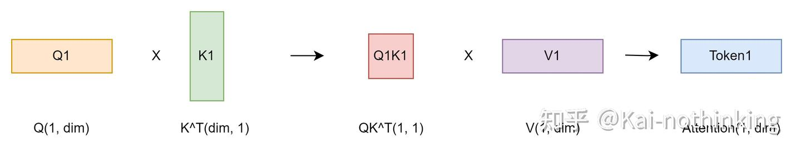
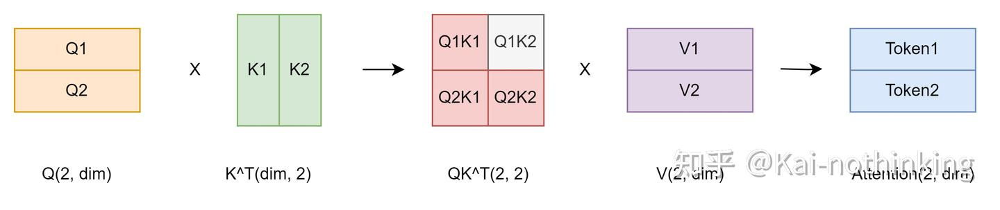
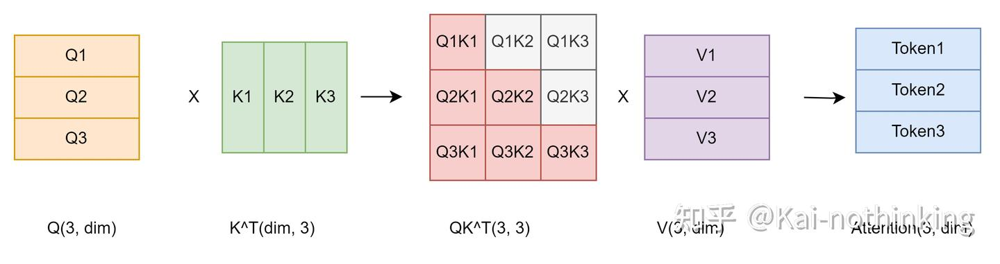
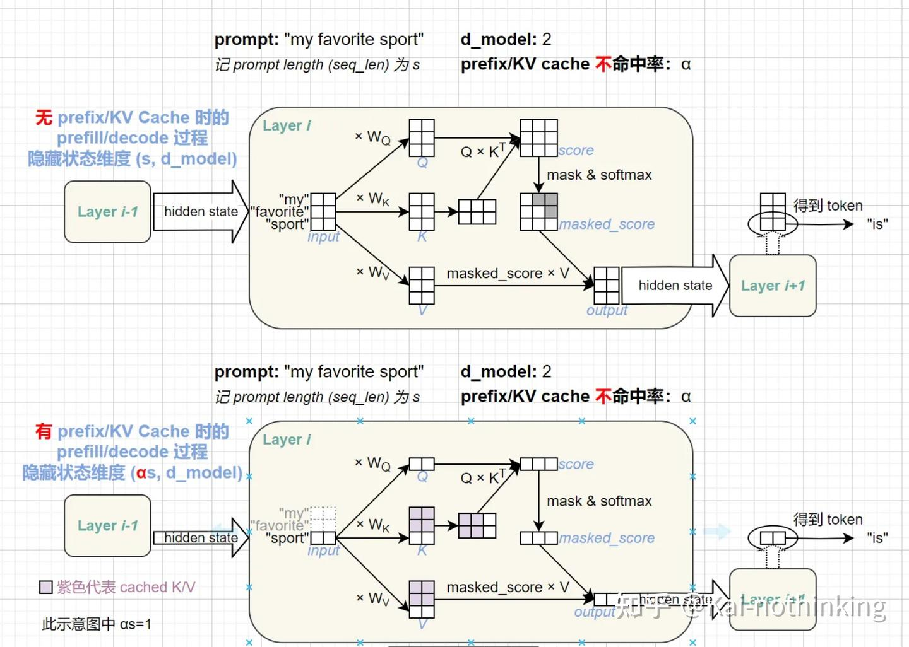
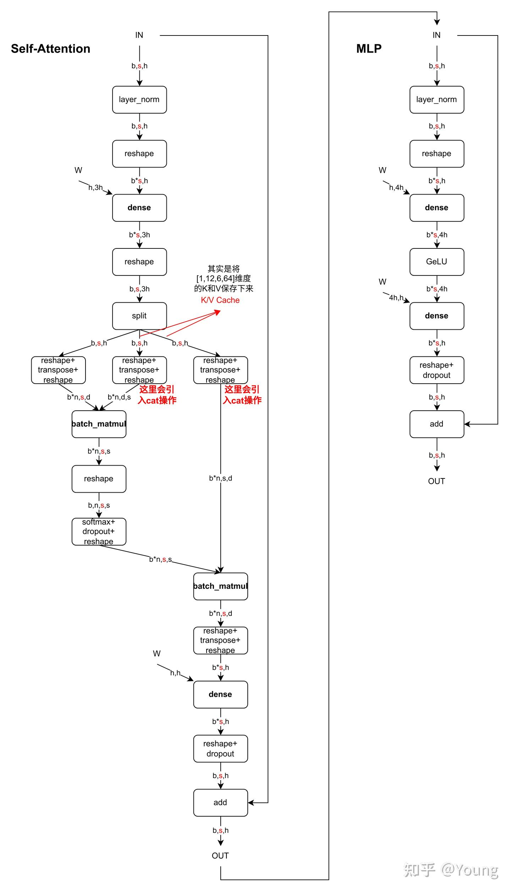
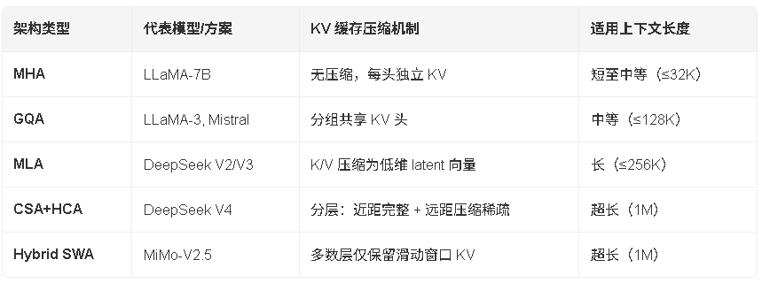

# 背景

生成式generative模型的推理过程很有特点，我们给一个输入文本，模型会输出一个回答（长度为N），其实该过程中执行了N次推理过程。即GPT类模型一次推理只输出一个token，输出token会与输入tokens 拼接在一起，然后作为下一次推理的输入，这样不断反复直到遇到终止符。如上描述是我们通常认知的GPT推理过程。代码描述如下：

```python

import torch
from transformers import GPT2LMHeadModel, GPT2Tokenizer


model = GPT2LMHeadModel.from_pretrained("/WORK/Test/gpt", torchscript=True).eval()

# tokenizer
tokenizer = GPT2Tokenizer.from_pretrained("/WORK/Test/gpt")
in_text = "Lionel Messi is a"
in_tokens = torch.tensor(tokenizer.encode(in_text))

# inference
token_eos = torch.tensor([198]) # line break symbol
out_token = None
i = 0
with torch.no_grad():
    while out_token != token_eos:
        logits, _ = model(in_tokens)
        out_token = torch.argmax(logits[-1, :], dim=0, keepdim=True)
        in_tokens = torch.cat((in_tokens, out_token), 0)
        text = tokenizer.decode(in_tokens)
        print(f'step {i} input: {text}', flush=True)
        i += 1

out_text = tokenizer.decode(in_tokens)
print(f' Input: {in_text}')
print(f'Output: {out_text}')
```


输出：

```python


step 0 input: Lionel Messi is a player
step 1 input: Lionel Messi is a player who
step 2 input: Lionel Messi is a player who has
step 3 input: Lionel Messi is a player who has been
step 4 input: Lionel Messi is a player who has been a
step 5 input: Lionel Messi is a player who has been a key
step 6 input: Lionel Messi is a player who has been a key part
step 7 input: Lionel Messi is a player who has been a key part of
step 8 input: Lionel Messi is a player who has been a key part of the
step 9 input: Lionel Messi is a player who has been a key part of the team
step 10 input: Lionel Messi is a player who has been a key part of the team's
step 11 input: Lionel Messi is a player who has been a key part of the team's success
step 12 input: Lionel Messi is a player who has been a key part of the team's success.
step 13 input: Lionel Messi is a player who has been a key part of the team's success.

Input: Lionel Messi is a
Output: Lionel Messi is a player who has been a key part of the team's success.
```


# KV Cache 加速原理

为什么 KV Cache 可以实现加速？关键在于 Decoder-Only 架构中 Attention 计算使用了因果掩码

我们从仅输入一个 Token 开始推理，分析不使用 KV Cache 的 Attention 计算过程。

step1：


$$Att_1(Q,K,V) = softmax(Q_1{K_1}^T)V_1$$

Step2：此时生成了一个 Token，拼接到原始输入


$$Att_1(Q,K,V) = softmax(Q_1{K_1}^T)V_1$$
$$Att_2(Q,K,V) = softmax(Q_2{K_1}^T)V_1 + softmax(Q_2{K_2}^T)V_2$$

此时$QK^T$计算输出的矩阵中，上三角$Q_1{K_2}^T$被上三角矩阵mask掉。此时$Att_1$的计算与第三步完全一样，并且可以发现$Att_1$仅依赖于$Q_1$，与$Q_2$无关，$Att_2$同样如此。

Step3：


$$Att_1(Q,K,V) = softmax(Q_1{K_1}^T)V_1$$
$$Att_2(Q,K,V) = softmax(Q_2{K_1}^T)V_1 + softmax(Q_2{K_2}^T)V_2$$
$$Att_3(Q,K,V) = softmax(Q_3{K_1}^T)V_1 + softmax(Q_3{K_2}^T)V_2 + softmax(Q_3{K_3}^T)V_3$$

与 Step2 类似，可以发现当前计算存在大量冗余计算，每一步只需要对新 Token 的$Q_k$与$Att_k$即可，原来的$QK^T$矩阵乘变成了向量矩阵，之前计算的Attention完全不需要重新计算（注意理解：若没有因果掩码则要重新计算，因为会“关注”到后面的 token，即“双向注意力”）

由于K和V全程参与计算，因此需要把每一个Attention中的K,V缓存，即 KV Cache。

**使用 KV Cache 的推理过程**



一个典型的带有 KV cache 优化的生成大模型的推理过程包含了两个阶段：

1、预填充阶段（Prefill） ：输入一个prompt序列，为每个transformer层生成 key cache 和 value cache（KV cache），并生成第一个 token。

此时通常要计算多个 token 的 Attention
Compute-Bound，容易打满 MFU
2、解码阶段（Decode） ：使用并更新 KV cache，一个接一个地生成token，当前生成的 token 词依赖于之前已经生成的token。

此时每一步仅需要计算新生成 token 的 Attention
Memory-Bound，GPU 利用率不高，BatchSize 越大越好（吞吐量 and GPU 利用率），但是受到 HBM 显存容量的限制。
KV Cache 的使用分成两步：

- 先把当前token的K、V向量拼接到K_cache和V_cache
- 计算attention时，只使用当前token的Q向量直接与整个K_cache矩阵和V_cache矩阵进行计算


# 实现细节
目前各大模型推理都实现了KV Cache，下面就看如何使用了。我们可以在上面代码基础上修改，主要改动：
- 在推理时新增了 past_key_values 参数，该参数就会以追加方式保存每一轮的K V值。kv cache变量内容为((k,v), (k,v), ..., (k,v))，即有 $n_{layers}$ 个 k,v 组成的一个元组，其中 k 和 v 的维度均为 [b, n_head, s, head_dims]。这里可以顺带计算出每轮推理对应的 cache 数据量为 $2*b*s*h*n_{layers}$ ，这里 s 值等于当前轮次值。以GPT3-175B为例，假设以 float16 来保存 KV cache，senquence长度为100，batchsize=1，则 KV cache占用显存为 2×100×12288×96×2 Byte= 472MB。
- 推理输出的token直接作为下一轮的输入，不再拼接，因为上文信息已经在 kvcache 中。


```python


import torch
from transformers import GPT2LMHeadModel, GPT2Tokenizer


model = GPT2LMHeadModel.from_pretrained("/WORK/Test/gpt", torchscript=True).eval()

# tokenizer
tokenizer = GPT2Tokenizer.from_pretrained("/WORK/Test/gpt")
in_text = "Lionel Messi is a"
in_tokens = torch.tensor(tokenizer.encode(in_text))

# inference
token_eos = torch.tensor([198]) # line break symbol
out_token = None
kvcache = None
out_text = in_text
i = 0
with torch.no_grad():
    while out_token != token_eos:
        logits, kvcache = model(in_tokens, past_key_values=kvcache) # 增加了一个 past_key_values 的参数
        out_token = torch.argmax(logits[-1, :], dim=0, keepdim=True)
        in_tokens = out_token # 输出 token 直接作为下一轮的输入，不再拼接
        text = tokenizer.decode(in_tokens)
        print(f'step {i} input: {text}', flush=True)
        i += 1
        out_text += text

print(f' Input: {in_text}')
print(f'Output: {out_text}')
```
通过上面代码只能看到调用层面的变化，实现细节还需看各框架的底层实现，例如Hugging Face的transformers库代码实现就比较清爽，在modeling_gpt2.py中Attention部分相关代码如下：

```python

query = self._split_heads(query, self.num_heads, self.head_dim)
        key = self._split_heads(key, self.num_heads, self.head_dim)
        value = self._split_heads(value, self.num_heads, self.head_dim)

        if layer_past is not None: # 当输出第一个token后，layer_past就是非None了
            past_key, past_value = layer_past # 取出之前计算好的 key, value
            key = torch.cat((past_key, key), dim=-2) # past_key 与当前 token 对应的 key 拼接
            value = torch.cat((past_value, value), dim=-2) # past_value 与当前 token 对应的 value 拼接

        if use_cache is True:
            present = (key, value)
        else:
            present = None
```


在 block 层面也有相关代码，大家有空细品吧。还是那句话，说一千道一万不如阅读并运行源码一次。


其实，KV Cache 配置开启后，推理过程可以分为2个阶段：

- 预填充阶段：发生在计算第一个输出token过程中，这时Cache是空的，计算时需要为每个 transformer layer 计算并保存key cache和value cache，在输出token时Cache完成填充；FLOPs同KV Cache关闭一致，存在大量gemm操作，推理速度慢。
- 使用KV Cache阶段：发生在计算第二个输出token至最后一个token过程中，这时Cache是有值的，每轮推理只需读取Cache，同时将当前轮计算出的新的Key、Value追加写入至Cache；FLOPs降低，gemm变为gemv操作，推理速度相对第一阶段变快，这时属于Memory-bound类型计算。


这里用图可能更有助理解，下图是一个Decoder Block（仅以MHA为例），含有Self-Attention和MLP，标红部分为KV Cache影响到的内容，即KV Cache开启后，标红的序列长度 sss 变为 1，当batch_size=1时，Self-Attention中的2个dense全都变为gemv操作，MLP中的dense也全都变为gemv操作。看懂这个图就可以答对上面的3个问题啦。图中数据维度相关字母的含义：
- b: batchsize
- s: sequence length，序列长度
- h: hidden_state 维度 = n * d
- n: head 个数
- d: head 维度



# 四种优化方案

## 架构级优化：从 MHA 到混合稀疏注意力

架构层面的优化旨在通过改变注意力机制本身，减少每个 token 所需缓存的 KV 数据量。标准多头注意力（MHA）为每个查询头分配独立的 K/V 头，导致缓存体积与头数成正比。为降低开销，MQA（多查询注意力）让所有查询头共享一组 K/V，GQA（分组查询注意力）则折中地将查询头分组共享，已在 LLaMA-3、Mistral 等模型中落地。更进一步，DeepSeek V2/V3 引入 MLA（Multi-head Latent Attention），将 K/V 联合压缩为低维潜在向量 c，仅缓存该向量，推理时再解压还原，大幅缩减缓存体积。而 DeepSeek V4（2026年发布）则采用 CSA（压缩稀疏注意力）与 HCA（高压缩注意力）的混合架构，在最近 128 个 token 保留完整 KV 的同时，对远距离历史 token 实施交错重叠压缩与稀疏选择，实现分层混合策略。小米 MiMo-V2.5 则采用 Hybrid SWA（混合滑动窗口注意力），仅在少数层保留全序列 KV，其余层仅维护滑动窗口，使百万 token 上下文下的 KV Cache 降至传统架构的约 1/7。



## 02存储管理优化：分页与前缀复用

即使架构不变，高效的存储管理也能显著缓解 KV Cache 的显存压力。vLLM 引入的 PagedAttention 借鉴操作系统虚拟内存分页思想，将逻辑上连续的 KV 序列划分为固定大小的 block，并通过 block table 映射到物理显存中的非连续块，从而减少内存碎片、提升显存利用率，实测内存浪费低于4%。该机制支持动态扩容和按需分配，使 batch size 可更大，提升 GPU 利用率。另一类优化是 Prefix Caching，由 SGLang 首创，针对多轮对话或系统提示词等场景中存在大量相同前缀的情况，跨请求复用已计算的 KV Cache。其实现通常结合 Radix Tree 或分块哈希索引，当缓存池满时基于 LRU 策略淘汰旧条目。Prefix Caching 主要优化预填充阶段（Prefill），显著降低首 token 延迟（TTFT）。两者可协同使用：PagedAttention 解决单请求内显存调度问题，Prefix Caching 则挖掘跨请求的复用机会。

- PagedAttention：解决显存碎片，支持高效连续批处理，适用于高并发推理服务
- Prefix Caching：加速重复前缀场景（如 Agent 多轮交互），降低 TTFT，依赖前缀一致性
- Offload 机制：将不活跃 KV Cache 卸载至 CPU 内存或 NVMe，扩展有效缓存容量

## 03 精度压缩：从 INT8 到 TurboQuant 的 3-bit

精度压缩通过降低 KV Cache 中数值的表示位宽来减少显存占用和带宽需求。传统方案如 INT8/FP8 量化可将 FP16（16-bit）缓存压缩至一半体积，精度损失极小。Google 发布的 TurboQuant 技术则进一步将 KV Cache 无损压缩至 3-bit，采用 PolarQuant（随机旋转+极坐标变换）和 QJL（1-bit 符号位误差校正）两步正交算法，无需训练或校准数据。由于现代 GPU（如 H100）的 Tensor Core 原生支持最低 8-bit 计算，3-bit 数据需反量化后参与运算，但显存带宽瓶颈的缓解带来了显著提速——在 128K 上下文、batch=32 条件下，显存占用从 1.37TB 降至 250GB，推理吞吐翻倍。值得注意的是，压缩收益随上下文长度增加而放大：短上下文（4K）中 KV 占显存约30%，而超长上下文（1M）中占比高达98.5%，此时压缩效果尤为关键。


## 04策略级优化：滑动窗口与动态稀疏

策略级优化聚焦于减少需保留的 KV token 数量，核心假设是并非所有历史 token 对当前生成同等重要。Mistral 2023 年提出的 SWA（滑动窗口注意力）仅保留最近 W 个 token 的 KV，窗口外信息被丢弃，KV Cache 上限固定为 W。DeepSeek 2025 年的 NSA（Native Sparse Attention）则在 SWA 基础上引入学习到的稀疏模式，动态选择性保留窗口外的关键 token KV，兼顾长距离依赖与显存效率。后续的 CSA/HCA 和 Hybrid SWA 均融合了“近距离精确保留 + 远距离稀疏压缩”的思想。这类方法特别适合对话类任务，其中近期上下文通常更具相关性。但若任务依赖远距离信息（如长文档问答），则可能影响生成质量。因此，策略选择需结合具体应用场景权衡记忆长度与模型表现。

综合来看，各优化方案并非互斥，而是常被组合使用。例如 DeepSeek V4 同时采用 MLA 架构、CSA/HCA 策略及高效存储管理；而 TurboQuant 可与滑动窗口或稀疏注意力叠加，进一步释放显存。用户在评估方案时，可依据自身场景关注不同维度：若追求极致长上下文支持，混合稀疏架构（如 CSA+HCA、Hybrid SWA）值得关注；若部署环境显存受限但上下文较短，精度压缩（如 TurboQuant）或 GQA 架构更具性价比；而在高并发服务中，PagedAttention 与 Prefix Caching 的组合能显著提升资源利用率。最终选择应基于实际负载特征、硬件约束及质量容忍度进行权衡。


# 总结

KV Cache是Transformer推理性能优化的一项重要工程化技术，各大推理框架都已实现并将其进行了封装（例如 transformers库 generate 函数已经将其封装，用户不需要手动传入past_key_values）并默认开启（config.json文件中use_cache=True）。

# 参考
[大模型推理性能优化之KV Cache解读](https://zhuanlan.zhihu.com/p/630832593)

[KV Cache - 从矩阵运算的角度理解](https://zhuanlan.zhihu.com/p/16080518294)

[优化方案](https://zhuanlan.zhihu.com/p/2038417882950980560)

[kv cache 手撕](https://zhuanlan.zhihu.com/p/2005776848555116449)