# vLLM核心技术PagedAttention原理

# 一、LLM推理的两阶段
一个常规的LLM推理过程通常分为两个阶段：prefill和decode。通常会使用KV cache技术加速推理。

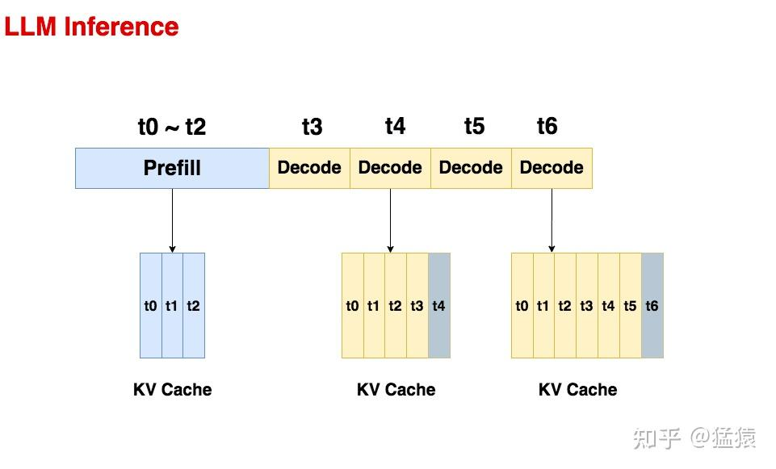

## 1.1 Prefill
预填充阶段。在这个阶段中，我们把整段prompt喂给模型做forward计算。如果采用KV cache技术，在这个阶段中我们会把prompt过 $W_k, W_v$后得到的 $X_k, X_v$保存在cache_k和cache_v中。这样在对后面的token计算attention时，我们就不需要对前面的token重复计算$X_k, X_v$了，可以帮助我们节省推理时间。

在上面的图例中，我们假设prompt中含有3个token，prefill阶段结束后，这三个token相关的KV值都被装进了cache。

## 1.2 Decode

**生成response的阶段**。在这个阶段中，我们根据**prompt的prefill结果**，一个token一个token地生成response。
同样，如果采用了KV cache，则每走完一个decode过程，我们就把对应response token的KV值存入cache中，以便能加速计算。例如对于图中的t4，它与cache中t0~t3的KV值计算完attention后，就把自己的KV值也装进cache中。对t6也是同理。

**由于Decode阶段的是逐一生成token的，因此它不能像prefill阶段那样能做大段prompt的并行计算，所以在LLM推理过程中，Decode阶段的耗时一般是更大的。**

从上述过程中，我们可以发现使用KV cache做推理时的一些特点：

**- 随着prompt数量变多和序列变长，KV cache也变大，对gpu显存造成压力
- 由于输出的序列长度无法预先知道，所以我们很难提前为KV cache量身定制存储空间**

下图展示了一个13B的模型在A100 40GB的gpu上做推理时的显存占用分配（others表示forward过程中产生的activation的大小，这些activation你可以认为是转瞬即逝的，即用完则废，因此它们占据的显存不大），从这张图中我们可以直观感受到推理中KV cache对显存的占用。**因此，如何优化KV cache，节省显存，提高推理吞吐量，就成了LLM推理框架需要解决的重点问题。**

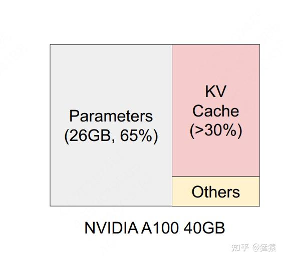

# 二、为KV cache分配存储空间的常规方式

对于训练好的模型，一种常用的部署方式是将其打包成一个推理服务（server），它接收客户端发送来的请求（request），读取请求中的数据（prompt）来做推理。一个请求中可以只有1个prompt，也可以包含多个prompt。

在常规的推理框架中，当我们的服务接收到一条请求时，它会为这条请求中的prompts分配gpu显存空间，其中就包括对KV cache的分配。**由于推理所生成的序列长度大小是无法事先预知的，所以大部分框架会按照(batch_size, max_seq_len)这样的固定尺寸，在gpu显存上预先为一条请求开辟一块连续的矩形存储空间。然而，这样的分配方法很容易引起“gpu显存利用不足”的问题，进而影响模型推理时的吞吐量。**你可能觉得这个描述有点抽象，别着急，我们来具体看一个例子。

下图展示了一个常规的推理框架是如何为请求中的prompt在gpu显存上分配KV cache的。在本例中，我们假设一个请求只发送1条prompt（本例中共有3条请求）：

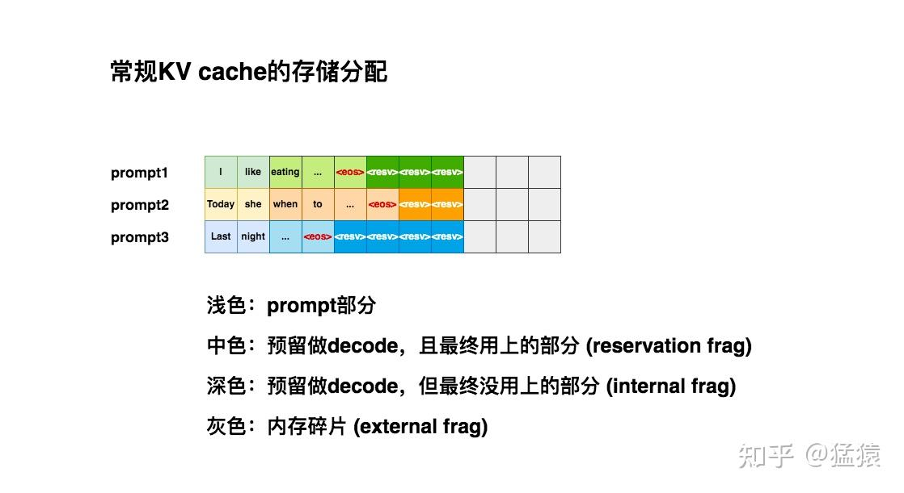

假设`max_seq_len = 8`，所以当第1条请求(prompt1)过来时，推理框架为它安排了(1, 8)大小的连续存储空间。

当第2条请求（prompt2）过来时，同样也需要1块(1, 8)大小的存储空间。但此时prompt1所在的位置上，只剩3个空格子了，所以它只能另起一行做存储。对prompt3也是同理。

仔细观察这3条prompt的KV cache排布，你是不是隐约觉得这种排布似乎没有充分利用起gpu的显存？：

- 浅色块：观察图中的浅色块，它是prefill阶段prompt的KV cache，是无论如何都会被使用的空间，它不存在浪费。
- 中色块：观察图中的中色块，它是decode阶段的KV cache，其中<eos>表示序列生成的截止符。虽然这些中色块最终都会被我们用上，但是在decode阶段一个个token生成时，我们并不能预知哪些块会被最终用上。例如对于prompt2，当你生成when的时候，你无法知道下一个会生成<eos>，还是会生成别的词。所以这些中色块都是一种“潜在的浪费”，我们称中色块的部分为**预留碎片（reservation fragment**）。
- 深色块：观察图中的深色块，它也是decode阶段的KV cache，但直到序列生成完毕，它都没有被用上。由于这些深色块是预留的KV cache的一部分，所以我们称其为内部碎片（internal fragment）。
- 灰色块：观察图中的灰色块，它不是我们预留的KV cache的一部分，且最终也没有被用上，我们称这些灰色块为外部碎片（external fragment）。想象一下，此时新来了一条prompt4，它也要求显存中的8个格子作为KV cache。此时你的显存上明明有9个空格子，但因为它们是不连续的碎片，所以无法被prompt4所使用。这时prompt4的这条请求只好在队列中等待，直到gpu上有足够显存资源时再进行推理，这不就对模型推理的吞吐量造成显著影响了吗？

**观察整个KV cache排布，你会发现它们的毛病在于太过“静态化”。**当你无法预知序列大小时，你为什么一定要死板地为每个序列预留KV cache空间呢？为什么不能做得更动态化一些，即“用多少占多少”呢？这样我们就能减少上述这些存储碎片，使得每一时刻推理服务能处理的请求更多，提高吞吐量，这就是vLLM在做的核心事情，我们先通过一张实验图来感受下vLLM在显存利用上的改进效果（VS 其它推理框架）：

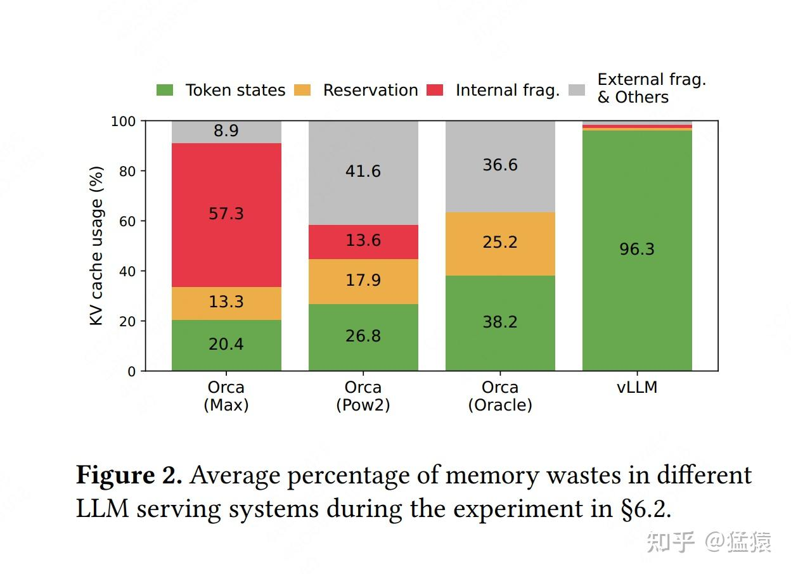

# 三、PagedAttention原理
在本节中，我们先来回答问题1：vLLM通过一种名为PagedAttention的技术，动态地为请求分配KV cache显存，提升显存利用率。

整体上来说，PagedAttention的设计灵感来自操作系统中虚拟内存的分页管理技术。所以本节会先通过通俗易懂的方式，和大家一起快速回顾操作系统的虚拟内存技术，在这个过程中和大家一起具象化感受PagedAttention的设计思想。然后再来详细介绍PagedAttention的运作流程。

## 3.1 操作系统的虚拟内存

（1）不使用虚拟内存

我们知道程序运行时，会将代码、数据等内容存放在物理内存上。在最原始的做法中（没有操作系统，例如单片机），程序直接对物理内存进行操作，决定使用它的哪些存储地址。

如果你只跑一个进程，那还好说。但如果需要运行多个进程时，麻烦就来了：由于我直接操作了物理内存地址，所以我在为自己的进程分配物理内存时，还要考虑别的进程是如何分配物理内存的（别人已经占用的我不能用）。这样不同进程间的耦合性太高了，给开发带来难度。

有没有一种办法，让各个进程间的开发能够相互独立呢？一种直觉的做法是：

给每个进程分配一个虚拟内存。每个进程在开发和运行时，可以假设这个虚拟内存上只有自己在跑，这样它就能大胆操作。
虚拟内存负责统一规划代码、数据等如何在物理内存上最终落盘。这个过程对所有进程来说都是透明的，进程无需操心

虚拟内存的核心思想可简化成下图:

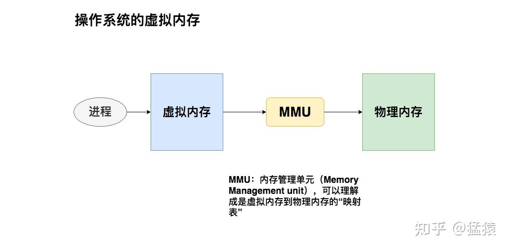

（2）虚拟内存的分段管理

在分段式内存管理中，虚拟内存会尽量为每个进程在物理内存上找到一块连续的存储空间，让进程加载自己的全部代码、数据等内容。我们来看一个具体的例子：
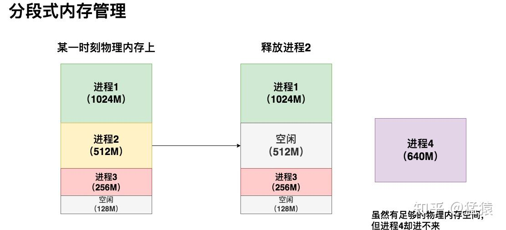

在这个例子中，3个进程的虚拟内存各自为它们在物理内存上映射了一块连续的存储空间。在某一时刻，我释放了进程2，同时想运行进程4。这时我尴尬地发现，虽然物理内存上有640M的空间剩余，但因为是碎片化的，我的进程4无法加载进去，因此它只能等待（回想一下本文第二部分对传统KV cache显存分配的分析）。

在这个情况下，如果我硬要运行进程4，也是有办法的：我可以先把进程3从物理内存上交换（swap）到磁盘上，然后把进程4装进来，然后再把进程3从磁盘上加载回来。通过这种方法我重新整合了碎片，让进程4能够运行。

但这种办法的显著缺点是：如果进程3过大，同时内存到磁盘的带宽又不够，整个交换的过程就会非常卡顿。这就是分段式内存管理的缺陷。

这时，我自然而然会想到：我为什么要给所有进程都预分配一个固定的存储块（段）呢？假设这个进程是一个浏览器，我难道会一下就用到这个进程里所有的功能吗？就不能进程运行到哪里，或者我想用哪个具体功能时，再加载这部分相关的内容去内存，以此让整个内存分配更加动态？

（3）虚拟内存的分页管理

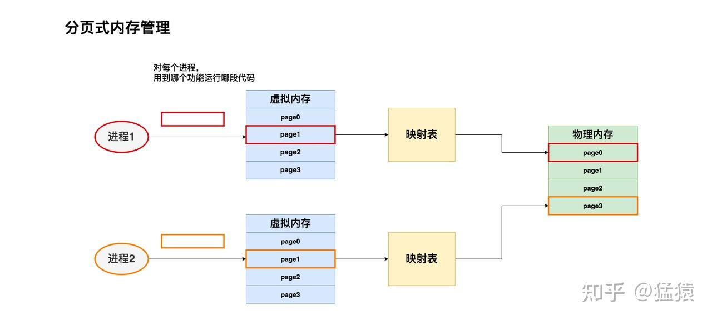

我们可以将进程1、进程2想成是两本书。代码分布在书的不同page上。我们希望想读哪一页，就加载哪一页，而不是一下把两本书都加载进来。同时，当我们不想读某些页的时候，我们也能根据页码将其清空。

现在，我们希望读进程1和进程2的page1，我们就将其加载到物理内存上。虚拟内存会帮我们做好映射，把来自不同进程的这两页分别加载到物理内存对应位置。

虚拟内存的分页技术总结起来就是：

- **将物理内存划分为固定大小的块，我们称每一块为页（page）**。从物理内存中模拟出来的虚拟内存也按相同的方式做划分
- 对于1个进程，我们不需要静态加载它的全部代码、数据等内容。我们想用哪部分，或者它当前跑到哪部分，我们就动态加载这部分到虚拟内存上，然后由虚拟内存帮我们做物理内存的映射。
- 对于1个进程，虽然它在物理内存上的存储不连续（可能分布在不同的page中），但它在自己的虚拟内存上是连续的。**通过模拟连续内存的方式，既解决了物理内存上的碎片问题，也方便了进程的开发和运行。**

## 3.2 PagedAttention
（1）处理单个请求
现在，你已经知道虚拟内存分页管理的基本原理和优势，趁热打铁，我们马上来看以其为灵感的PagedAttention技术是如何操作的。我们还是从具体的例子讲起。

假设现在你向模型server发送一条请求，prompt为Four score and seven years ago our，你希望模型能做续写。PagedAttention的运作流程如下图：
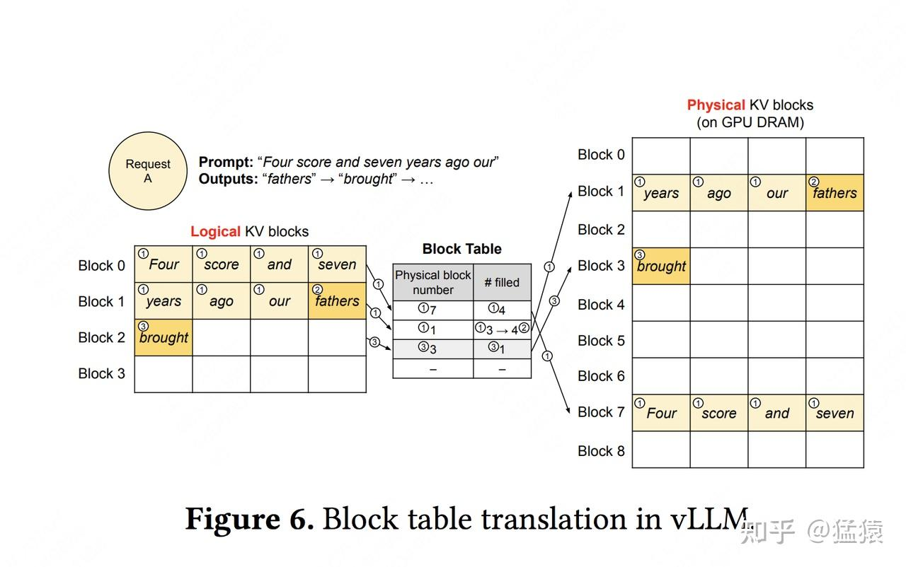

在图中：

- 请求（request）可理解为操作系统中的一个进程

- 逻辑内存（logical KV blocks）可理解为操作系统中的虚拟内存，每个block类比于虚拟内存中的一个page。每个block的大小是固定的，在vLLM中默认大小为16，即可装16个token的K/V值

- 块表（block table）可理解为操作系统中的虚拟内存到物理内存的映射表

- 物理内存（physical KV blocks）可理解为操作系统中的物理内存，物理块在gpu显存上，每个block类比于虚拟内存中的一个page

图中带圈的序号表示操作步骤，我们就按这个顺序来看看。

(i) Prefill阶段

- **划分逻辑块**：vLLM拿到这条prompt，先按照设定好的block大小B（本例中B=4），为prompt划分逻辑块（Logical KV blocks）。由于prompt中有7个token，所以vLLM用2个逻辑块（block 0， block 1）来装它们的KV值。其中，在逻辑块1中目前只装了"years", "ago", "hour"这3个token的KV值，有1个位置是空余的。这个位置就被称为保留位（reservation）
- **划分物理块**：划分好逻辑块后，我们就可以将其映射到物理块中去了。物理块是实际存放KV值的地方。我们通过一张block table来记录逻辑块和物理块的映射关系，block table的主要内容包括：
    - 逻辑块和物理块的映射关系（physical block number）：例如逻辑块0对应物理块7
    - 每个物理块上被填满的槽位（# filled）：例如在prefill阶段，对物理块7，其4个槽位都被填满；对物理块1，其3个槽位被填满。
- 正常计算prompt的KV值，并通过划分好的关系填入物理块中。

(ii) Decode阶段-生成第1个词。

- **使用KV cache计算attention，生成第1个词fathers**。不难发现，当我们计算时，我们使用的是逻辑块，即形式上这些token都是连续的。与此同时，vLLM后台会通过block table这个映射关系，帮我们从物理块上获取数据做实际计算。**通过这种方式，每个request都会认为自己在一个连续且充足的存储空间上操作，尽管物理上这些数据的存储并不是连续的。**
- 基于新生成的词，更新逻辑块、物理块和block table。对于block table，vLLM将它filled字段由3更新至4。
- 分配新的逻辑块和物理块。当fathers更新进去后，逻辑块已装满。所以vLLM将开辟新的逻辑块2，并同时更新对应的block table和物理块。

（2）处理多个请求
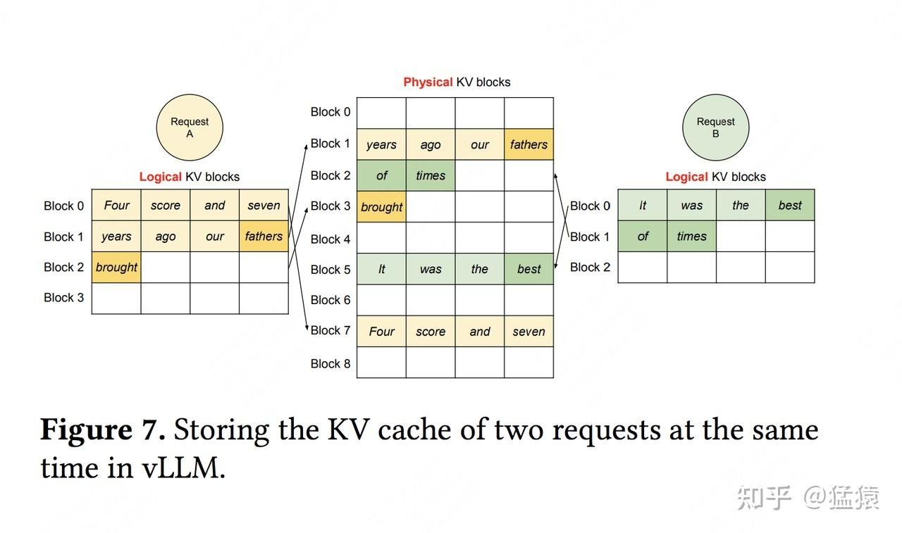

有了（1）的解释，看懂这张图应该不难。通过多个请求（prompt）同时做推理的例子，大家可以更好感受到PagedAttention是如何通过动态存储KV cache的方式，来更充分利用gpu显存的。

# 四、PagedAttention在不同解码策略下的运作
通过前文的解释，我们已经基本掌握了PagedAttention的设计思想、运作流程。你可能隐隐能感受到它在显存管理上的“灵活性”，和减少碎片化显存的能力。但可能你觉得还不够具象，所以在本节中，我们通过更具体的场景，再假设一下对PagedAttention优势的理解。

我们知道，根据实际需求，大模型的解码方式也比较复杂，例如：

-** Parallel Sampling**：我给模型发送一个请求，希望它对prompt做续写，并给出三种不同的回答。我们管这个场景叫parallel sampling。在这个场景中，我们可以将prompt复制3次后拼接成1个batch喂给模型，让它做推理。但我们也需注意到，这种方式会产生prompt部分KV cache的重复存储。
- **Beam Search**：束搜索，这是LLM常用的deocde策略之一，即在每个decode阶段，我不是只产生1个token，而是产生top k个token（这里k也被称为束宽）。top k个token必然对应着此刻的top k个序列。我把这top k个序列喂给模型，假设词表的大小为|V|，那么在下一时刻，我就要在k*|V|个候选者中再选出top k，以此类推。不难想象每一时刻我把top k序列喂给模型时，它们的前置token中有大量的KV cache是重复的。
- **Shared prefix**：在某些大模型中，所有请求可能都会共享一个前置信息（比如system message: “假设你是一个有帮助的AI助手...."），这些前置信息没有必要重复存储KV cache

## 4.1 Parallel Sampling
下面说明在parallel sampling的场景下，vLLM（PagedAttention）是怎么做到节省显存的。

**传统KV cache**

假设模型的max_seq_len = 2048。传统KV cache可能在显存中分配两块长度是2048的空间。由于prompt一致，这两块2048的空间中存在大量重复的KV cache。

**vLLM**

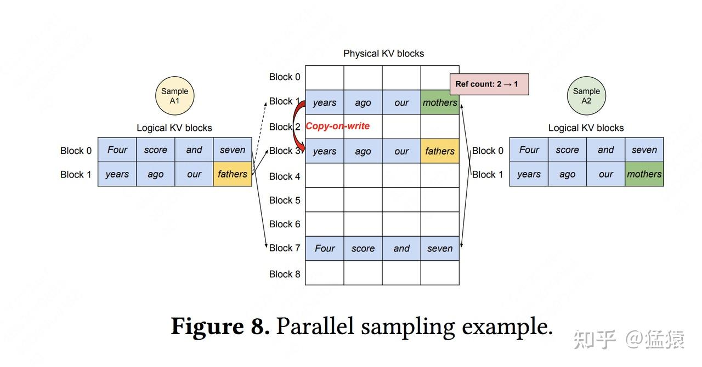

假定我们发给模型1个request，这个request中包含2个prompt/sample，记为Sample A1和Sample A2，这两个prompt完全一致，都为Four score and seven years ago our，我们希望模型对这两个prompt分别做续写任务。

（1）首先，**Prefill阶段，vLLM拿到Sample A1和Sample A2，根据其中的文字内容，为其分配逻辑块和物理块。**

- 分配逻辑块：对于A1，vLLM为其分配逻辑块block0和block1；对于A2，vLLM为其分配逻辑块block0和block1。**需要注意的是，A1的逻辑块和A2的逻辑块是独立的（尽管它们都叫block0和block1）**，你可以将A1和A2视作操作系统中两个独立运行的进程。
- 分配物理块：对于A1和A2，虽然逻辑块独立，但因为它们的文字完全相同，所以可以**在物理内存上共享相同的空间**。所以A1的逻辑块block0/1分别指向物理块block7/1；A2的逻辑块block0/1分别指向物理块block7/1。我们设每个物理块下映射的逻辑块数量为ref count，所以对物理块block7/1来说，它们的ref count都为2。

（2）然后，**进入decode阶段，A1和A2各自做推理，得到第一个token，分别为fathers和mothers。**

- 将生成的token装入逻辑块：对于A1和A2来说，将其生成的token装入各自的逻辑块block1。
- 触发物理块copy-on-write机制：由于fathers/mothers是两个完全不同的token，因此对物理块block1触发复制机制，即在物理内存上新开辟一块空间。此时物理块block1只和A2的逻辑块block1映射，将其ref count减去1；物理块block3只和A1的逻辑块block1映射，将其ref count设为1。

总结起来，vLLM节省KV cache显存的核心思想是，对于相同数据对应的KV cache，能复用则尽量复用；无法复用时，再考虑开辟新的物理空间。

## 4.2 Beam Search

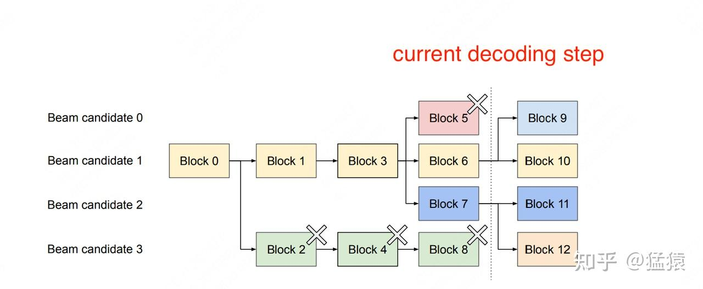

**从右往左来看这张图。虚线位置表示“当前decoding时刻”，beam width = 4。图中所有的block皆为逻辑块。**

因为beam width = 4，这意味着根据beam search算法，在当前阶段我们生成了top 4个概率最大的token（我们记这4个token为beam candidate 0/1/2/3），它们分别装在block5，block6，block7和block8中。

现在我们继续使用beam search算法做decoding，继续找出top 4个最可能的next token。经过我们的计算，这top 4 next token，有2个来自beam candidate 1，有2个来自beam candidate 2。因此我们在block6中引出block9和block10，用于装其中两个top 2 next token；对block7也是同理。

现在，block9/10/11/12中装的top 4 next token，就成为新的beam candidates，可以按照和上述一样的方式继续做beam search算法。**而对于block5和block8，它们已经在beam search的搜索算法中被淘汰了，后续生成的token也不会和它们产生关系，所以可以清除掉这两个逻辑块，并释放它们对应的物理块的内存空间。**

好，我们继续往左边来看这幅图。block3引出block5/6/7，block4引出block8，这意味着当前这4个top4 token，是上一个timestep下candidate1和candidate3相关序列生成的（candidate0和2的block没有画出，是因为它们所在的序列被beam search算法淘汰了，因此没有画出的必要）。**由于block8已经被淘汰，所以block4也相继被淘汰，并释放对应的物理内存空间。**

**由此往左一路推，直到block0为止（block0代表着prompt，因此被beam seach中所有的序列共享）。这一路上，我们都根据最新时刻的beam search decoding结果，释放掉不再被需要的逻辑块和对应的物理内存空间，达到节省显存的目的**。

# 五、调度和抢占

到目前为止，我们已经回答了“vLLM是如何优化KV cache显存分配”的问题，现在我们来回答另一个重要的问题：

>当采用动态分配显存的办法时，虽然明面上同一时刻能处理更多的prompt了，但因为没有为每个prompt预留充足的显存空间，如果在某一时刻整个显存被打满了，而此时所有的prompt都没做完推理，那该怎么办？

## 5.1 总原则

当有一堆请求来到vLLM服务器上时，vLLM需要一个调度原则来安排如何执行这些请求，这个调度原则概括如下：

- 先来的请求先被服务（First-Come-First-Serve, FCFS）
- 如有抢占的需要，后来的请求先被抢占（preemption）

（1）先来的请求先被服务
这个很好理解，当有一堆请求到达vLLM服务器时，vLLM肯定优先处理来得早的请求

（2）后来的请求先被抢占
想象一下，当一堆请求来到vLLM服务器做推理，导致gpu显存不足时，vLLM会怎么做呢？

最直接的办法，就是暂停这堆请求中最后到达的那些请求的推理，同时将它们相关的KV cache从gpu上释放掉，以便为更早到达的请求留出足够的gpu空间，让它们完成推理任务。如果不这样做的话，各个请求间相互争夺gpu资源，最终将导致没有任何一个请求能完成推理任务。等到先来的请求做完了推理，vLLM调度器认为gpu上有足够的空间了，就能恢复那些被中断的请求的执行了。

**在资源不足的情况下，暂时中断一些任务的执行，这样的举动就被称为“抢占（preemption）”。**

## 5.2 终止和恢复被抢占的请求

对于这些因gpu资源不足而被抢占的任务，vLLM要完成两件事：

- **暂停它们的执行，同时将与之相关的KV cache从gpu上释放掉**
- **等gpu资源充足时，重新恢复它们的执行**
针对这两件事，vLLM分别设计了**Swapping（交换策略）和Recomputation（重计算策略）**来解决。我们来细看这两个策略。

（1）Swapping

对于被抢占的请求，vLLM要将其KV cache从gpu上释放掉，那么：

- **问题1：该释放哪些KV cache？**
- **问题2：要把这些KV cache释放到哪里去？**

先看问题1。由前文PagedAttention原理可知，一个请求可能对应多个block。我们既可以选择释放掉部分block，也可以选择释放掉全部block，或者更科学地，我们可以预测一下哪些block被使用的频率最低，然后释放掉这些低频block（但这种方式实现起来难度较大，性价比不是很高）。**在vLLM中，采取的是all-or-nothing策略，即释放被抢占请求的所有block。**

再来看问题2。**对于这些被选中要释放的KV block，如果将它们直接丢掉，那未免过于浪费。vLLM采用的做法是将其从gpu上交换（Swap）到cpu上。这样等到gpu显存充份时，再把这些block从cpu上重载回来。**

（2）Recomputation

知道了Swapping机制，重计算的过程也很好理解了：对于有些任务（比如parallel sampling中并行采样数n=1的任务），当它们因为资源不足而被抢占时，可以不做swap，而是直接释放它们的物理块，把它们重新放入等待处理的队列中，等后续资源充足时再重新从prefill阶段开始做推理

我们总结一下vLLM对请求的调度处理流程：

- 当一堆请求来到vLLM服务器上时，按照First-Come-First-Serve（FCFS）原则，优先处理那些最早到来的请求。
- 当gpu资源不足时，为了让先来的请求能尽快做完推理，vLLM会对那些后到来的请求执行“抢占”，即暂时终止它们的执行。
- 一旦vLLM决定执行抢占操作，它会暂停处理新到来的请求。在此期间，它会将被抢占的请求相关的KV block全部交换（swap）至cpu上。等交换完成后，vLLM才会继续处理新到来的请求。
- 部分情况下，对于一些seq，vllm会抛弃它的kv cache，将它重新放入等待队列中，后续重新做prefill

# 六、分布式管理
在本文的最后部分，我们再来看看分布式环境下vLLM的整体架构。本文不再对vLLM的性能实验部分做说明，感兴趣的朋友可以自行阅读。

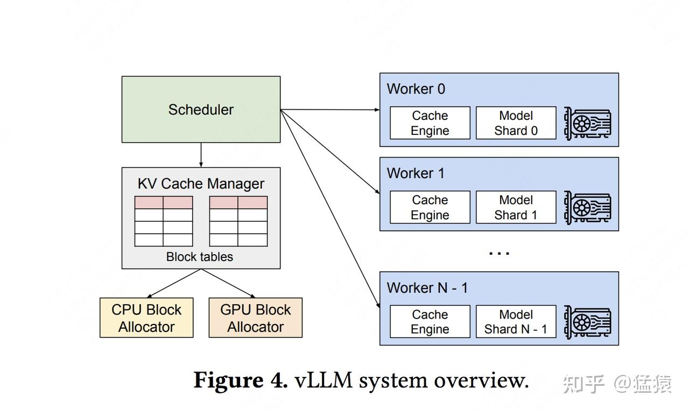

在LLM推理实操中，某些场景下单卡是完成不了推理的，需要多卡。那么对于多gpu这种更普适性的情况，vLLM是怎么处理的呢？

上图显示了在分布式场景下，vLLM的整体运作流程：

- 首先，vLLM有一个中央调度器（Scheduler），它负责计算和管理每张卡上KV cache从逻辑块到物理块的映射表(block tables)
- 在做分布式计算时，Schedular会将映射表广播到各张卡上，每张卡上的Cache engine接收到相关信息后，负责管理各卡上的KV block

上图中给出的例子，是用张量模型并行（megatron-lm）做分布式推理时的情况，所以图中每个worker上写的是model shard。**在张量并行中，各卡上的输入数据相同，只是各卡负责计算不同head的KV cache。** 所以这种情况下，各卡上的逻辑块-物理块的映射关系其实是相同的（用的同一张block table），只是各卡上物理块中实际存储的数据不同而已