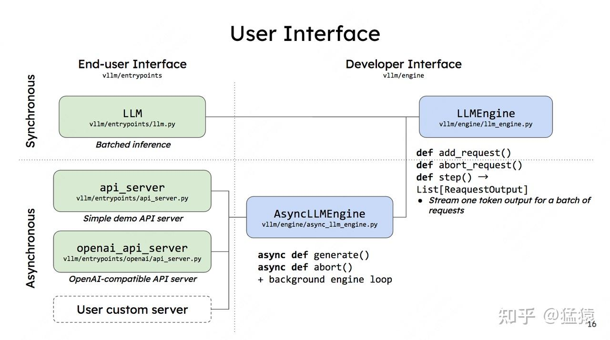
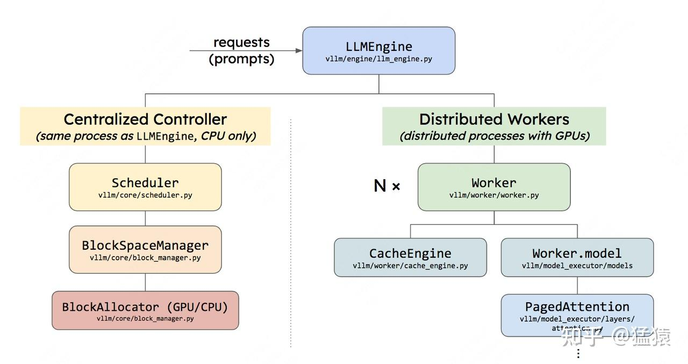
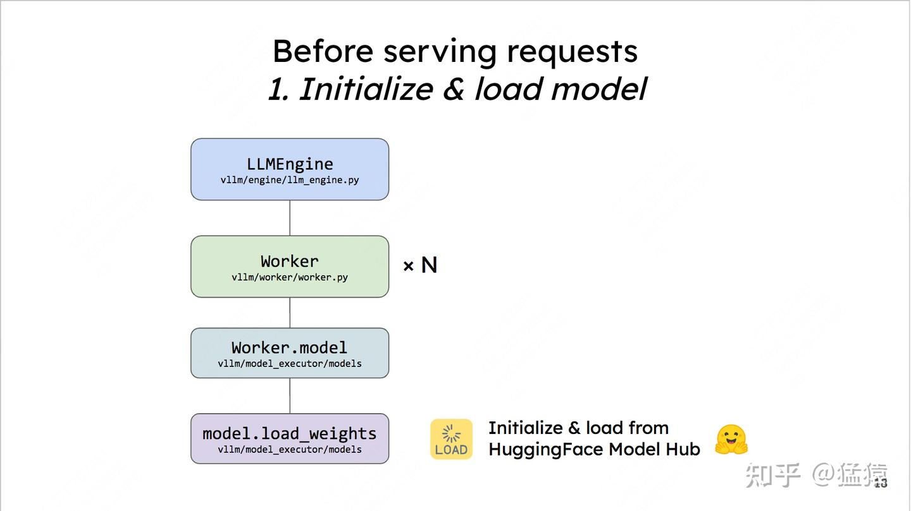
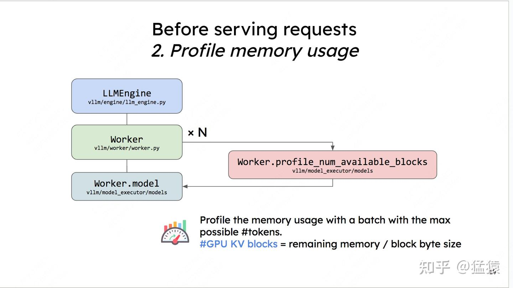
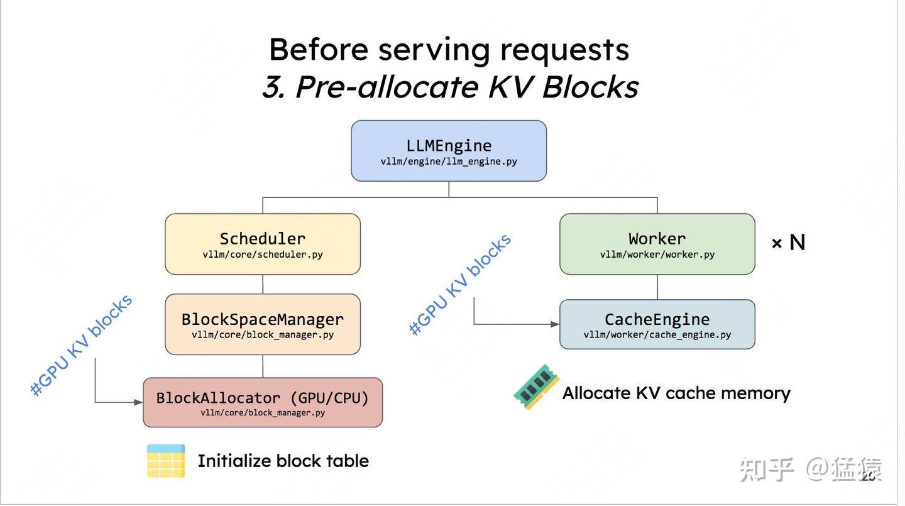
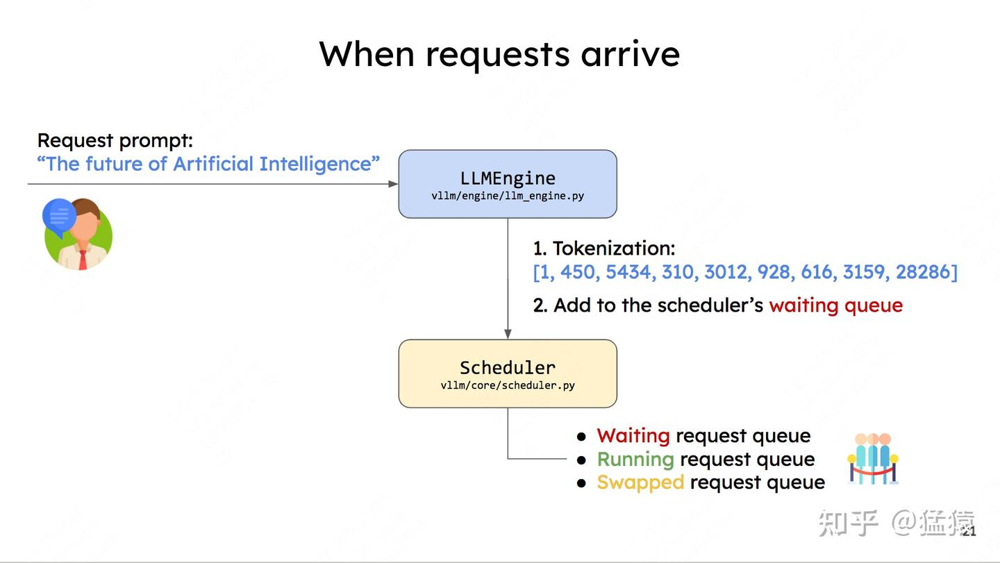
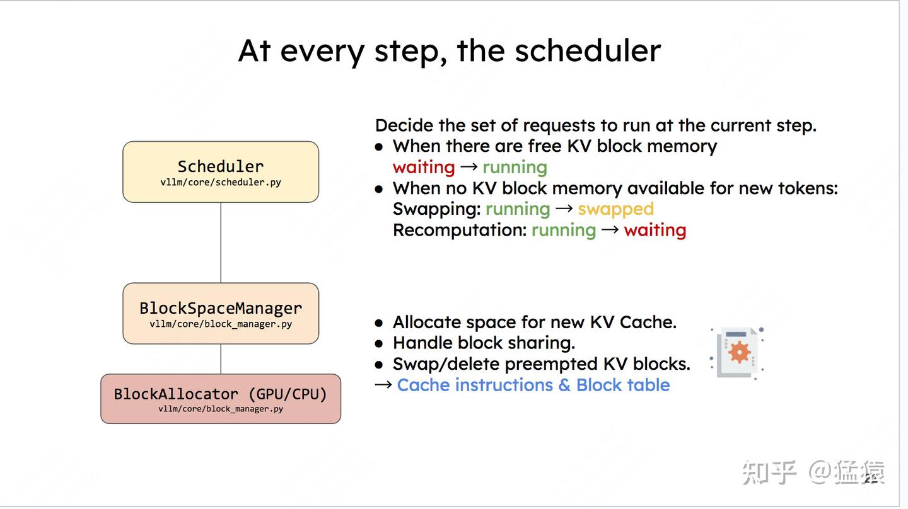

# 一、调用vLLM的两种方式
根据vLLM的官方文档，它向用户提供了两种调用它的方法，分别是：

- Ofline Batched Inference（同步，离线批处理）
- API Server For Online Serving（异步，在线推理服务），在这下面又提供了2种支持的API类型：
    - OpenAI-Compatible API Server（官方推荐）：兼容了OpenAI请求格式的server，包括OpenAI Completions API和OpenAI Chat API。
    - Simple Demo API Server（测试开发用，官方不推荐，相关脚本也不再维护）


在代码实现上，vLLM首先实现了一个推理内核引擎(LLMEngine)，在此基础上封装了上述两种调用方法。在本系列的讲解中，我们会先以“offline bacthed inference”作为入口，详细解说内核引擎LLMEngine的各块细节。在此基础上我们再来看“online serving”的运作流程。


## 1.1 Offline Batched Inference

```python
from vllm import LLM, SamplingParams

# ===========================================================================
# batch prompts
# ===========================================================================
prompts = ["Hello, my name is",
           "The president of the United States is",
           "The capital of France is",
           "The future of AI is",]

# ===========================================================================
# 采样参数
# ===========================================================================
sampling_params = SamplingParams(temperature=0.8, top_p=0.95)

# ===========================================================================
# 初始化vLLM offline batched inference实例，并加载指定模型
# ===========================================================================
llm = LLM(model="facebook/opt-125m")

# ===========================================================================
# 推理
# ===========================================================================
outputs = llm.generate(prompts, sampling_params)

# ===========================================================================
# 对每一条prompt，打印其推理结果
# ===========================================================================
for output in outputs:
    prompt = output.prompt
    generated_text = output.outputs[0].text
    print(f"Prompt: {prompt!r}, Generated text: {generated_text!r}")
```


在传统离线批处理中，我们每次给模型发送推理请求时，都要：

- 等一个batch的数据齐全后，一起发送
- 整个batch的数据一起做推理
- 等一个batch的数据全部推理完毕后，一起返回推理结果

**这种“团体间等成员到齐，再一起行动”的行为，就被称为“同步”。**

在vLLM中，当我们使用离线批处理模式时，表面上是在做“同步”推理，也即batch_size是静态固定的。**但推理内核引擎（LLMEngine）在实际运作时，batch_size是可以动态变更的**：在每一个推理阶段（prefill算1个推理阶段，每个decode各算1个推理阶段）处理的batch size可以根据当下显存的实际使用情况而变动。

举个例子来说：

- 给定一个很大的batch，此时尽管vLLM采用了PagedAttention这样的显存优化技术，我们的gpu依然无法同时处理这么大的batch。
- 所以batch中的每一条数据，会被先放到一个waiting队列中。vLLM会用自己的调度策略从waiting队列中依次取数，加入running队列中，直到它认为取出的这些数据将会打满它为1个推理阶段分配好的显存。此时waiting队列中可能还会剩一些数据。
- 在每1个推理阶段，vLLM对running队列中的数据做推理。如果这1个推理阶段执行完毕后，有的数据已经完成了生成（比如正常遇到<eos>了），就将这些完成的数据从running队列中移开，并释放它占据的物理块显存。
- 这时，waiting队列中的数据就可以继续append进running队列中，做下1个阶段的推理。
- 因此在每1个推理阶段，vLLM处理的batch size可能会动态变更。
- 将LLMEngine包装成离线批处理形式后，所有的数据必须等到一起做完推理才能返给我们。所以从体感上，我们可能很难感知到内核引擎的“动态”逻辑。

**也正是因为LLMEngine这种“动态处理”的特性，才使得它同时也能成为异步在线服务的内核引擎：** 当一条条请求发来时，它们都先进入LLMEngine调度器（Scheduler）的waiting队列中（实际并不是直接进入waiting队列中的，而是在传给LLMEngine前先进入asyncio.Queue()中，然后再由LLMEngine调度进waiting队列中的，这些细节我们也放在后面说，这里不影响理解就行）。此时模型正常执行它的1个推理阶段，调度器也正常处理新来的请求。当模型准备执行下1个推理阶段时，调度器再根据设定的策略，决定哪些数据可以进入running队列进行推理。由于在线服务是异步的，先推理完成的数据就可以先发给客户端了（如果采用流式传输，也可以生成多少先发多少）。


**在这个过程中，vLLM通过PagedAttention技术和“先来先服务（FCFS），后来先抢占，gpu不够就先swap到cpu上”的调度策略，在1个推理阶段处理尽可能多的请求，解决高并发场景下的推理吞吐问题。这就是整个vLLM运作的核心思想。（对这行黑体字里的术语有疑惑的朋友，建议先看vLLM原理篇讲解）**

## 1.2 API Server For Online Serving

```bash
# ===========================================================================
# Server：起服务
# ===========================================================================
$ python -m vllm.entrypoints.openai.api_server --model meta-llama/Llama-2-7b-hf

# ===========================================================================
# Client：发请求（OpenAI API）
# ===========================================================================
$ curl http://localhost:8000/v1/completions \
    -H "Content-Type: application/json" \
    -d '{
        "model": "meta-llama/Llama-2-7b-hf",
        "prompt": "San Francisco is a",
        "max_tokens": 7,
        "temperature": 0
    }'
```

vLLM在实现在线服务时，采用uvicorn部署fastapi app实例，以此实现异步的请求处理。而核心处理逻辑封装在AsyncLLMEngine类中（它继承自LLMEngine）。所以，只要我们搞懂了LLMEngine，对vLLM的这两种调用方式就能举一反三了。

## 1.3 总结

vLLM的两种调用方式与内核引擎LLMEngine的关系如下（图片来自vLLM团队2023 first meetup PPT）:



图中左侧是用户使用界面，罗列了上述所说的两种调用方式（注意，如前文所说，做demo用的api server官方已经不再维护了，openai_api_server才是官方推荐的使用方式，user custom server目前还没有实现）。右侧则是开发者界面，不难发现LLMEngine是vLLM的核心逻辑。


开发者界面下的几个函数，先来看LLMEngine：

- add_request()：该方法将每一个请求包装成vLLM能处理的数据类型(SequenceGroup，后面我们会详细解释)，并将其加入调度器（Scheduler）的waiting队列中。**在LLMEngine中，这个函数是按照“同步”的方式设计的**，也就是它被设计为“遍历batch中的每条数据，然后做相应处理”。所以这个函数本身只适合批处理场景。在异步的online serving中将会把它重写成异步的形式。

- abort_request：在推理过程中，并不是所有的请求都能有返回结果。比如客户端断开连接时，这个请求的推理就可以终止了（abort），这个函数就被用来做这个操作。
- step()：负责执行1次推理过程（1个prefill算1个次推理，每个decode各算1次推理）。在这个函数中，vLLM的调度器会决定要送那些数据去执行本次推理，并负责给这些数据分配好物理块（这些信息都被作为metadata放在要送给模型做推理的数据中）。模型会根据这些信息，采用PagedAttention方法，实际完成推理。


# 二、vLLM代码整体架构




LLMEngine可以具体分成两个部分：


## 2.1 Centralized Controller

**Centralized Controller，也就是前文我们所说的调度器(Scheduler)**。它和LLMEngine所在的进程是同一个，且两者都是在CPU上的。

- **调度器的主要作用就是，在每1个推理阶段，决定要把哪些数据送给模型做推理，同时负责给这些模型分配KV Cache物理块。**但要注意，它只是分配了物理块的id，而不是物理块本身。物理块的实际分配是模型在推理过程中根据物理块id来操作的，也就是CacheEngine做的事情。
- **调度器下维护着BlockSpaceManager。它负责管理BlockAllocator（实际参与分配物理块的类）。BlockAllocator又分成gpu和cpu两种类型，分别管理这两类设备上的物理块。你可能会问，cpu上的物理块是什么呢？** 你还记得调度器有一个swap策略吗？当gpu上显存不足时，它会把后来的请求抢占，并将其相关的KV cache物理块全部都先swap（置换、卸载）在cpu上，等后续gpu显存充足时，再把它们加载回gpu上继续做相关请求的推理。所以在cpu上我们也需要一个管控物理块的BlockAllocator。**实际代码实现时，Block相关的部分可不止这两个class，还有一些更复杂的逻辑细节**。

## 2.2 Distributed Workers

Distributed Workers，也就是分布式系统，你可以将每个worker理解成一块gpu。它的作用是将我们要使用的模型load到各块卡上（目前对单卡装不下的模型，vLLM支持tp/pp推理），然后对Controller传来的数据做1次推理，返回相关结果。我们来细看下这块：

- **Distributed Workers**：图中绘制为Distributed Workers这个绿色块，**其实按vLLM的源码内容，写成Executor会更合适一些。它就是所有Workers的管控中心**，它指定了用什么方法管控这些Workers，负责分布式环境的初始化，目前支持的方法有：
- cpu_executor：（较少用），使用cpu做推理时可考虑
- gpu_executor：单卡（world_size = 1）的情况下可用
- ray_gpu_executor：使用ray这个分布式计算框架实现的executor，适用于多卡环境

- Worker：在硬件上，它指gpu；在代码上，它指的是Worker实例（每个gpu上的进程维护自己的Worker实例）。在每个Worker实例中又管控着如下两个重要实例：
 - CacheEngine：负责管控gpu/cpu上的KV cache物理块（调度器的block manager只负责物理块id的分配，CacheEngine则是根据这个id分配结果实打实地在管理物理块中的数据）
 - Worker.model：根据vLLM代码，这里写成model_runner会更合适一些。它负责加载模型，并执行推理。PagedAttention的相关逻辑，就维护这个实例关联的代码下。

# 三、加载模型与预分配显存

在vLLM正式开始处理1条请求（也就是LLMEngine的调度器正式开始运作时），它需要做两件和初始化相关的事：

>加载模型
>预分配显存

## 3.1 加载模型




## 3.2 预分配显存



**在模型部署的初始化阶段（推理正式开始前），vLLM会通过模拟实验的方式，来决定gpu/cpu上到底有多少个KV cache物理块可以分配给后续的请求们做推理。vLLM管这个步骤叫profile_num_available_blocks**

（1）杜撰假数据

首先，用户在初始化LLMEngine引擎时，会提供两个重要参数：

- **max_num_seqs**：在1个推理阶段中，LLMEngine最多能处理的seq数量（1条seq就是指我们待推理的1条数据）。默认是256
- **max_num_batched_tokens**：在1个推理阶段中，LLMEngine最多能处理的token数量。默认是2048

根据这两个参数，我们可以假设在模型推理中，平均一个seq要处理max_num_batched_tokens // max_num_seqs个token，余数部分我们默认放在第一个seq中。例如，假设max_num_batched_tokens=10，max_num_seqs = 3，那么我们就能杜撰出3条seq，每个seq的长度分别为4，3，3


（2）用假数据模拟一次前向推理

在1次推理过程中，可以分配多少的显存给KV cache。
使用如下公式计算：
**分配给KV cache显存 = gpu总显存 - 不使用KV cache做1次推理时的显存占用（包括模型本身和推理过程中的中间数据）**

对于“不使用KV cache做1次推理时的显存占用”，我们就可以用杜撰出来的假数据模拟一次前向推理来计算得出。在前向推理之后，我们把gpu上的缓存清一次，让它不要影响后续模型的正常推理。

（3）计算可分配的KV cache物理块总数

从（2）的模拟实验中，我们已经预估了一块卡上“分配给KV Cache的总显存”。现在，我们可以来计算总的物理块数量了。
我们易知：**总物理块数量 = 分配给KV Cache的显存大小/ 物理块大小，其中“大小”的单位是bytes。**

物理块尺寸（block_size），也即一个物理块有多少个槽位，是可以由用户自定义的，vLLM推荐的默认值是block_size = 16。由大模型中KV值的定义，我们易知：

$$K_cache_block_size = block_size * num_heads * head_size * num_layers * dtype_size$$

其中dtype_size表示精度对应的大小，例如fp16就是2，fp32就是4
同理可知：V_cache_block_size = K_cache_block_size

则最终一个物理块的大小为：
$$cache_block_size = block_size * num_heads * head_size * num_layers * dtype_size * 2$$

（4）将预分配的KV Cache加载到gpu上



确定好KV Cache block的大小后，我们就可以创建empty tensor，将其先放置到gpu上，实现显存的预分配。以后这块显存就是专门用来做KV Cache的了。也正是因为这种预分配，你可能会发现在vLLM初始化后，显存的占用比你预想地要多（高过模型大小），这就是预分配起的作用。相关代码如下（帮助大家更好看一下KV cache tensor的shape）:

```python
 def _allocate_kv_cache(
        self,
        num_blocks: int,
        device: str,
    ) -> List[torch.Tensor]:
        """Allocates KV cache on the specified device."""
        kv_cache_shape = self.attn_backend.get_kv_cache_shape(
            num_blocks, self.block_size, self.num_heads, self.head_size)
        pin_memory = is_pin_memory_available() if device == "cpu" else False
        kv_cache: List[torch.Tensor] = []
        # =======================================================================
        # kv_cache_shape: (2, num_blocks, block_size * num_kv_heads * head_size)
        # =======================================================================
        for _ in range(self.num_layers):
            kv_cache.append(
                torch.empty(kv_cache_shape,
                            dtype=self.dtype,
                            pin_memory=pin_memory,
                            device=device))
        return kv_cache
```

整个预分配的过程，其实也是在提醒我们：当你发现vLLM推理吞吐量可能不及预期，或者出现难以解释的bug时，可以先查查输出日志中pending(waiting)/running/swapped的序列数量，以及此时KV Cache部分的显存利用程度，尝试分析下这些默认的预分配设置是不是很好契合你的推理场景，如果不行，可以先尝试调整这些参数进行解决。


# 四、Scheduler调度

vLLM初始化工作完成后，就是调度器发挥作用的时候，整个调度过程如下：





