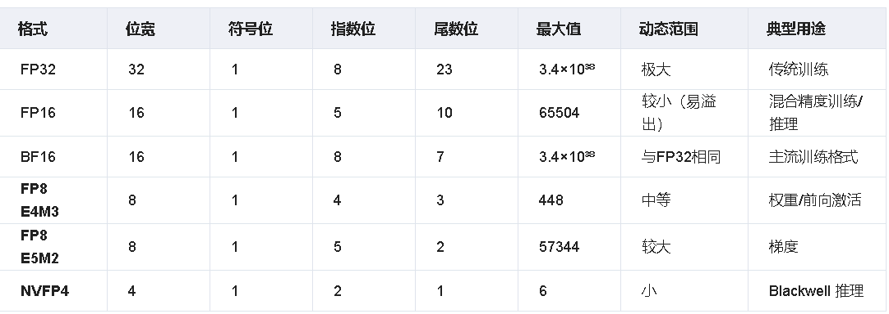
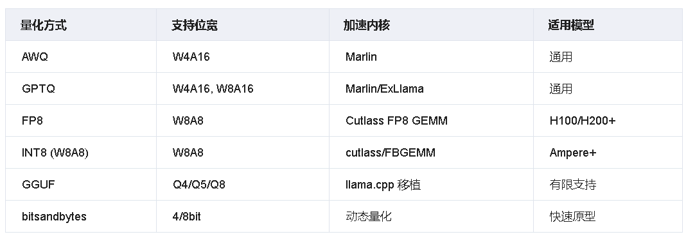
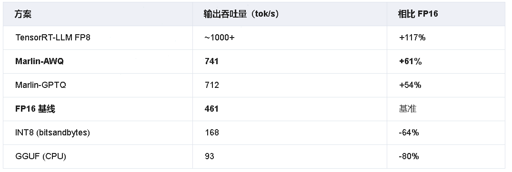
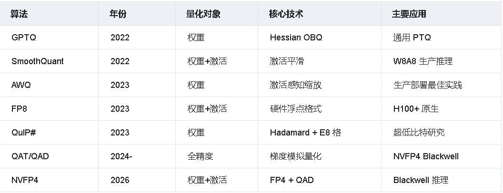

# 一、背景：为什么量化如此重要？

大模型的参数规模在过去五年内呈指数级增长——从 GPT-2 的 15 亿参数，到 LLaMA-3.1-405B 的 4050 亿参数，再到 DeepSeek-V3 的 671B 亿参数。然而，GPU 的显存容量增长远不及模型规模的扩张速度。以 FP16 精度存储 70B 模型需要约 140GB 显存，而一块 H100 SXM5 的显存仅为 80GB。

量化（Quantization） 的核心思路是将**模型的权重和/或激活值从高精度浮点数（FP32/BF16）转换为低精度数值表示（INT8/INT4/FP8）**，从而：

- **压缩显存**：INT4 相比 FP16 可节省 75% 显存（140GB → 35GB for 70B 模型）
- **加速推理**：低精度计算吞吐量更高（H100 FP8 理论峰值 3958 TFLOPS，FP16 仅 1979 TFLOPS）
- **降低带宽压力**：Transformer 解码阶段往往受内存带宽约束，更小的数据宽度直接减少内存读取量

**核心挑战**：简单截断取整会引入量化误差，导致模型质量下降。量化研究的精髓，在于如何以最小精度损失换取最大压缩比


# 二、量化基础：数值表示与误差来源

## 2.1 均匀量化

（Uniform Quantization）
均匀量化将浮点数值映射到等间隔的整数网格上。给定输入张量 $X$，其缩放因子（scale）$s$ 和零点（zero-point）$z$ 定义如下：

$$s = \frac{x_{max} - x_{min}}{2^b - 1}, \quad z = \text{round}\left(-\frac{x_{min}}{s}\right) $$

量化：$X_q = \text{clamp}\left(\text{round}\left(\frac{X}{s}\right) + z,\ 0,\ 2^b - 1\right) $

反量化：$\hat{X} = s \cdot (X_q - z) $

其中 $b$ 是量化位宽。量化误差 $\epsilon = X - \hat{X} $ 由两部分组成：截断误差（clipping error，极值被压缩）和舍入误差（rounding error，精度损失）。


## 2.2 对称量化 vs 非对称量化
- 对称量化（Symmetric）：零点 $z = 0 $，适合权重（分布往往近似对称）
- 非对称量化（Asymmetric）：$z \neq 0 $，适合激活值（如 ReLU 输出只有正值）

## 2.3 分组量化（Group Quantization）

对整个张量使用同一个 $s $ 会引入较大误差。分组量化将权重分成若干组（如每 128 个元素一组），每组独立计算缩放因子，大幅提升精度，代价是少量额外元数据开销。GPTQ、AWQ、GGUF 均采用这一策略。

## 2.4 量化粒度（Granularity）

|粒度|说明|精度|开销|
|---|---|---|---|
|Per-tensor|整个Tensor共用一个scale|最低|最小|
|Per-token|激活值每行一个scale|中等|较小|
|Per-channel|权重每列/行一个scale|高|较小|
|Per-group|每Group一个scale|最高|较大|


三、浮点格式体系：FP32->BF16->FP8->FP4




## FP8 的关键优势
相比 INT8，FP8 保留了指数位的设计，具备：

- 更大动态范围：INT8 仅能表示 [-128, 127]，而 FP8 E4M3 最大值达 448，E5M2 达 57344
- 自然处理异常值（outliers）：神经网络激活值往往含有少量极大值，INT8 对此极度敏感
- 无需调整量化策略：标准浮点算术，工程实现更简洁

**H100 FP8 硬件支持**：NVIDIA Hopper 架构引入了 FP8 张量核心（Tensor Core），同一芯片上 FP8 GEMM 吞吐量是 FP16 的 2 倍，相比 FP32 高达 4 倍。


>H100 SXM5 峰值算力：
  FP32:   67 TFLOPS
  FP16:  1979 TFLOPS (with sparsity: 3958)
  FP8:   3958 TFLOPS (with sparsity: 7916)


# 四、PTQ核心算法之一：GPTQ--基于Hessian的逐层量化

论文：GPTQ: Accurate Post-Training Quantization for Generative Pre-trained Transformers（Frantar et al., 2022, ETH Zurich）

## 4.1 核心思想：最优脑量化（Optimal Brain Quantization，OBQ）
GPTQ 的思想根植于 1990 年代的"最优脑损伤"（Optimal Brain Damage）理论——利用 Hessian 矩阵来量化每个参数对损失的影响，从而有针对性地压缩对结果影响最小的权重。

对于某层权重矩阵 $W \in \mathbb{R}^{d_{out} \times d_{in}} $，设输入激活为 $X $，则量化后的重构误差为：


$$E = |WX - \hat{W}X|_2^2 $$

其中 $\hat{W} $ 为量化后的权重。GPTQ 的目标是找到最优 $\hat{W} $ 使得 $E $ 最小，同时约束 $\hat{W} $ 为低精度整数。


## 4.2 算法流程
1. 收集校准数据：从训练集中取少量样本（通常 128 个）作为校准集
2. 计算 Hessian 矩阵：$H = 2XX^T \in \mathbb{R}^{d_{in} \times d_{in}}$
3. 逐列（列序）量化：
 - 将权重矩阵按列依次量化
 - 量化第 $q$ 列后，利用 $H$ 计算误差并更新剩余列以补偿

```python
# GPTQ 核心更新公式（简化版）
delta_W[q+1:] -= err_q * H[q, q+1:] / H[q, q]
```

4. **Lazy Batching**：将 128 列作为一批并行处理，避免逐列 GPU 同步开销
5. **Cholesky 分解预处理**：对 $H$ 的逆矩阵做 Cholesky 分解，提升数值稳定性

## 4.3 性能特点
- 量化时间：OPT-175B 在单 A100 上约需 4 小时（全量化）
- 精度：W4A16（4位权重、16位激活）几乎无精度损失，困惑度（perplexity）仅上升 0.2-0.3
- 局限：仅量化权重，矩阵乘法仍在 FP16 下运行（推理时反量化），计算密集型场景提升有限


## 4.4 GPTQ 的工程优化
社区在原始 GPTQ 上进行了大量工程优化：

- **AutoGPTQ**：最广泛使用的 GPTQ Python 实现，支持 Hugging Face 生态
- **ExLlamaV2**：针对 AMD/NVIDIA GPU 优化的自定义 CUDA 内核，速度比原始 GPTQ 快约 3 倍
- **GPTQModel**：ModelCloud 团队维护的增强版，支持 GPTQ/AWQ/FP8/EXL3 多种格式


# 五、PTQ核心算法之二：AWQ--激活感知权重量化

论文：`AWQ: Activation-aware Weight Quantization for LLM Compression and Acceleration（Lin et al., 2023, MIT CSAIL）`


## 5.1 核心洞见：1% 的显著权重

AWQ 的出发点是一个关键观察：**并非所有权重对模型质量的影响是均等的**。

实验发现，**约 0.1%～1% 的权重通道（channels）对激活值有显著影响——这些"显著权重"（salient weights）对应于输入激活值幅度较大的通道。如果这些通道在量化中受到保护，模型精度能得到大幅保留。**

关键发现：显著权重不能由权重本身的幅度识别，而必须通过激活值的统计量来识别。这也是"激活感知"名称的由来。

## 5.2 算法核心：数学等效缩放变换

AWQ 不采用混合精度（部分权重保持 FP16），而是设计了一种全均匀低精度 + 缩放补偿的方案，从而避免混合精度带来的硬件开销。

**关键数学变换：**

对于某层线性变换 $y = Wx$，在激活值 $x$ 经过逐通道缩放因子 $s$ 缩放后，等效地对权重做逆缩放：

$$y = (W \cdot \text{diag}(s)^{-1}) \cdot (\text{diag}(s) \cdot x) = W' \cdot x' $$

其中 $W' = W \cdot \text{diag}(s)^{-1}$，$x' = \text{diag}(s) \cdot x $。

量化对精度的影响：

如果对显著通道（激活值大的通道 $j$）应用较大的缩放 $s_j > 1 $：

$W'_j = W_j / s_j$：权重值变小，量化步长相对增大，量化误差减小（以相对精度衡量）
$x'_j = s_j \cdot x_j $：激活值增大，但因为激活精度不变，这不产生额外误差
通过搜索最优缩放因子 $s^* $：

$$s^* = \arg\min_{s} \mathcal{L}(W \cdot \text{diag}(s)^{-1}, s) $$

AWQ 使用网格搜索（grid search）在验证集上高效求解 $s^* $。


## 5.3 硬件友好性：AWQ 为何能部署

AWQ 最大的工程优势在于：所有权重保持相同位宽（无混合精度），不需要特殊处理极少数 FP16 权重带来的分支逻辑。这使得：

vLLM、TensorRT-LLM、llama.cpp 等主流框架均原生支持
Marlin 内核（由 IST Austria 开发）专门为 AWQ 设计的高效 CUDA 矩阵乘法内核，在 H100 上实现 10.9 倍于原始 AWQ 的吞吐量（741 tokens/s vs 68 tokens/s on Llama-3.1-8B）


## 5.4 实测性能（Llama-3.1-8B，H100）
|方案|输出吞吐量|相比FP16|
|---|---|---|
|Marlin-AWQ (W4A16)|741tok/s|+61%|
|Marlin-GPTQ|712tok/s|+54%|
|FP16基线|461tok/s|基准|
|原生 AWQ（无 Marlin）|68tok/s|-85%|

>教训：没有高效 CUDA 内核的 AWQ 反而比 FP16 慢，量化算法的价值必须与配套内核一起评估。


# 五、PTQ核心算法之三：SmoothQuant--激活异常值平滑迁移

论文：SmoothQuant: Accurate and Efficient Post-Training Quantization for Large Language Models（Xiao et al., 2022, MIT CSAIL + 微软）

## 6.1 问题根源：激活值异常值（Activation Outliers）
GPTQ 和 AWQ 只量化权重，激活值保持高精度。但在追求更高吞吐量时，我们希望实现 W8A8（权重和激活都是 8 位），利用 INT8 张量核心的计算加速。

然而，Transformer 模型的激活值存在严重的异常值问题：

>典型激活值分布（OPT-66B，某层 FFN 输出）：
  正常通道范围：[-1, 1]
  异常值通道：[-300, 300]  ← 幅度高出 100～300 倍


如果用一个全局缩放因子做 INT8 量化，正常通道会因步长太大（要覆盖异常值范围）而损失大量精度


## 6.2 核心思想：难度迁移（Difficulty Migration）
SmoothQuant 的洞见极具优雅性：激活值难以量化，但权重容易量化；可以将激活值的"难度"通过等效变换迁移给权重。

对于线性层 $y = \hat{x}W$，引入逐通道平滑因子 $\mathbf{s} \in \mathbb{R}^{C_{in}} $：

$$y = (\hat{x} \cdot \text{diag}(\mathbf{s})^{-1}) \cdot (\text{diag}(\mathbf{s}) \cdot W) = \hat{x}' \cdot W' $$

通过选取：

$$s_j = \frac{\max(|\hat{x}_j|)\alpha}{\max(|W_j|){1-\alpha}}, \quad \alpha \in [0, 1] $$

当 $\alpha = 1 $：所有难度转移给权重，激活量化变简单，权重量化变难
当 $\alpha = 0 $：保持不变
当 $\alpha = 0.5 $：难度平均分配（实践中常用）
离线吸收：$W' $ 可在推理前预先计算并存储（类似 batch normalization folding），推理时无额外开销。

## 6.3 W8A8 推理加速机制
SmoothQuant 实现的 W8A8 量化，其加速来源于**INT8 张量核心的矩阵乘法计算加速（而非仅减少内存带宽）**，特别适合：

- **预填充（Prefill）阶段**：处理长序列时 batch size 大，计算密集型
- **大批量推理**：吞吐量优先场景
在 OPT-175B 上：W8A8 相比 FP16，内存节省 2 倍，吞吐量提升约 1.65 倍，精度几乎无损失

# 九、DeepSeek-V3的FP8训练实践：671B参数上的豪赌

2024 年 12 月，DeepSeek-V3（671B MoE，37B activated）发布时宣布：这是首个在如此大规模上成功应用 **FP8 精度进行端到端训练的模型**。这一突破极大降低了训练成本，引发业界广泛关注。

## 9.1 技术方案：细粒度混合精度
DeepSeek-V3 的 FP8 训练并非"全部换 FP8"，而是采用精心设计的混合精度方案：

>训练精度分配：
  权重（W）：BF16 主权重 + FP8 量化副本（用于前向计算）
  激活（X）：FP8 E4M3（前向）
  梯度（dX）：FP8 E5M2
  优化器状态：FP32
  AllReduce 通信：BF16

**关键设计：FP8 量化 + BF16 主权重**

权重保留高精度的 BF16 主权重，每次前向计算前实时量化为 FP8。这样：

1. 权重更新精度不受影响（优化器在 FP32/BF16 下更新）
2. GEMM 计算使用 FP8 加速
3. 梯度累积使用高精度，避免精度漂移

## 9.2 细粒度量化：1×128 Tile Scale
标准 FP8 训练通常使用 per-tensor 或 per-channel 量化，DeepSeek-V3 进一步采用 1×128 的 tile 级别缩放因子（即每行每 128 个元素一个 scale）：

>权重矩阵 W [M × K]：
  - 对于每个 (i, j) 块（j = 0..K-1，步长 128）
  - 计算该行段的 scale_factor
  - 存储 M × (K/128) 个 scale


这一细粒度设计使量化误差更小，尤其对 MoE 模型中各专家权重差异较大的情况有显著改善。

## 9.3 高精度累加：防止 FP8 Matmul 误差累积
FP8 E4M3 尾数仅 3 位，大量累加会引发精度损失。DeepSeek-V3 在 GEMM 的内循环中使用 FP32 累加器：

>GEMM 执行模式（伪代码）：
  accum_fp32 = 0
  for k in range(K):
      accum_fp32 += fp32(A_fp8[m, k]) * fp32(B_fp8[k, n])
  C_bf16[m, n] = bf16(accum_fp32)

当时 H800 硬件的限制（H100 原生支持 FP8 + FP32 累加），通过软件实现了近似等价的精度保证。

## 9.4 训练稳定性保障
FP8 训练的主要风险是精度崩溃（loss spike），DeepSeek-V3 采用多重保障措施：

- 梯度裁剪（Gradient Clipping）：防止 FP8 梯度下 norm 爆炸
- 动态缩放因子（Dynamic Scaling）：根据激活值动态范围实时调整 scale，避免溢出
- 关键层保持 BF16：Embedding 层、LayerNorm、Softmax 等数值敏感操作保持高精度
- 损失函数 FP32：最终 loss 计算和 log 保持 FP32

## 9.5 成本收益

FP8 训练带来的效率提升显著：相比 BF16 训练，GPU 内存占用减少约 45%，GEMM 吞吐量提升约 1.6-1.8 倍，DeepSeek-V3 671B 模型仅用约 278 万 H800 GPU 小时完成全量训练，成本约 550 万美元——远低于同规模 GPT-4 训练的估算成本。


# 十、工程实战：量化在推理框架中的集成

## 10.1 vLLM 量化支持矩阵
vLLM 是目前量化支持最全面的开源推理框架：


vLLM FP8 推理（支持 H100）：

```python
from vllm import LLM, SamplingParams

# 原生 FP8 推理（需要 H100 或更高）
llm = LLM(
    model="deepseek-ai/DeepSeek-V3",
    quantization="fp8",
    kv_cache_dtype="fp8_e5m2",  # KV Cache 也用 FP8
)
```


## 10.2 TensorRT-LLM 的 FP8 优化
TensorRT-LLM 是 NVIDIA 官方推理框架，对 FP8 的优化最为深入：

- **FP8 GEMM 内核**：直接使用 H100 原生指令，无反量化开销
- **FP8 KV Cache**：KV 缓存从 FP16 压缩到 FP8，显存减半
- **Prefill-Decode FP8 一体化**：批量推理和单次生成使用同一量化格式
相比 vLLM FP16，TensorRT-LLM FP8 吞吐量可提升 2-5 倍（依模型规模和批量大小而定）

# 十一、代码示例：AWQ与GPTQ实战

## 11.1 使用 AutoAWQ 量化模型

```python
# pip install autoawq
from awq import AutoAWQForCausalLM
from transformers import AutoTokenizer

model_path = "meta-llama/Llama-3.1-8B-Instruct"
quant_path = "./llama3.1-8b-awq-w4"

# 加载模型和 tokenizer
tokenizer = AutoTokenizer.from_pretrained(model_path, trust_remote_code=True)
model = AutoAWQForCausalLM.from_pretrained(
    model_path, 
    low_cpu_mem_usage=True, 
    use_cache=False
)

# AWQ 量化配置
quant_config = {
    "zero_point": True,  # 非对称量化
    "q_group_size": 128,  # 分组大小，平衡精度和速度
    "w_bit": 4,          # 4 位量化
    "version": "GEMM",   # 可选 GEMM/GEMV
}

# 准备校准数据
from datasets import load_dataset
data = load_dataset("pileval", split="validation")
calib_data = tokenizer("\n\n".join(data[:128]["text"]), return_tensors="pt")

# 执行量化（约 5-10 分钟，8B 模型单卡 A100）
model.quantize(
    tokenizer,
    quant_config=quant_config,
    calib_data=calib_data,
)

# 保存量化模型（可推送到 HuggingFace Hub）
model.save_quantized(quant_path)
tokenizer.save_pretrained(quant_path)
print(f"量化完成！保存至 {quant_path}")


```


## 11.2 使用 AutoGPTQ 量化模型

```python
# pip install auto-gptq
from auto_gptq import AutoGPTQForCausalLM, BaseQuantizeConfig
from transformers import AutoTokenizer
import torch

model_path = "meta-llama/Llama-3.1-8B-Instruct"

# GPTQ 量化配置
quantize_config = BaseQuantizeConfig(
    bits=4,              # 量化位宽
    group_size=128,      # 分组量化，每 128 个参数一个 scale
    damp_percent=0.01,   # Hessian 矩阵正则化系数
    desc_act=False,      # 是否按激活降序排列权重（精度更高但更慢）
    sym=False,           # 非对称量化（zero_point != 0）
)

tokenizer = AutoTokenizer.from_pretrained(model_path, use_fast=True)
model = AutoGPTQForCausalLM.from_pretrained(model_path, quantize_config)

# 准备校准数据（建议 128 条，覆盖各种文本类型）
examples = [
    tokenizer("GPTQ is a quantization method for LLMs", return_tensors="pt"),
    tokenizer("The Transformer architecture uses attention mechanism", return_tensors="pt"),
    # ... 更多样本
]

# 执行量化（OPT-175B 约需 4 小时，8B 约需 15 分钟）
model.quantize(examples)

# 保存
model.save_quantized("./llama3.1-8b-gptq-4bit", use_safetensors=True)


```


## 11.3 使用 vLLM 加载 AWQ 量化模型推理

```python
from vllm import LLM, SamplingParams

# 加载 AWQ 量化模型（自动检测量化格式）
llm = LLM(
    model="./llama3.1-8b-awq-w4",
    quantization="awq",
    dtype="float16",
    gpu_memory_utilization=0.85,
    max_model_len=8192,
)

sampling_params = SamplingParams(
    temperature=0.7,
    top_p=0.9,
    max_tokens=512,
)

prompts = [
    "请解释 Transformer 中的注意力机制",
    "什么是量化感知训练？",
]

outputs = llm.generate(prompts, sampling_params)
for output in outputs:
    print(f"Prompt: {output.prompt!r}")
    print(f"Generated: {output.outputs[0].text!r}\n")


```


## 11.4 SmoothQuant 量化示例

```python
# pip install smoothquant
from smoothquant.smooth import smooth_lm
from smoothquant.calibration import get_act_scales
from transformers import AutoModelForCausalLM, AutoTokenizer
import torch

model_path = "facebook/opt-6.7b"
tokenizer = AutoTokenizer.from_pretrained(model_path)
model = AutoModelForCausalLM.from_pretrained(
    model_path, 
    torch_dtype=torch.float16, 
    device_map="auto"
)

# 第一步：收集激活统计量（用于确定平滑因子）
act_scales = get_act_scales(model, tokenizer, dataset, num_samples=512)

# 第二步：应用平滑变换（修改权重，将激活难度迁移到权重）
smooth_lm(model, act_scales, alpha=0.5)  # alpha=0.5 为平衡点

# 第三步：W8A8 量化
from smoothquant.fake_quant import quantize_opt
model_w8a8 = quantize_opt(model, weight_quant="per_channel", act_quant="per_token")

# 推理（速度接近原生 INT8 张量核心）
inputs = tokenizer("Hello, SmoothQuant!", return_tensors="pt").to("cuda")
with torch.no_grad():
    outputs = model_w8a8.generate(**inputs, max_new_tokens=50)
print(tokenizer.decode(outputs[0]))

```


## 十二、横向对比与选型指南

## 12.1 精度性能对比（Llama-3-70B，A100）




## 12.2 推理吞吐量对比（Llama-3.1-8B，H100）


## 12.3 选型决策树

>你的 GPU 是 H100/H200/B200？
├── 是 → 优先考虑 FP8 (vLLM / TensorRT-LLM)
│         └── 需要极致性能？→ TensorRT-LLM FP8
│         └── 需要通用性？→ vLLM FP8
└── 否（A100/3090 等）
    ├── 显存够放 FP16 模型？
    │   ├── 是 → 使用 FP16 或 BF16，无需量化
    │   └── 否 → 进入权重量化
    ├── 4-bit 权重量化
    │   ├── 追求速度 → AWQ + Marlin 内核
    │   ├── 追求精度 → AWQ（MLSys 2024 最佳论文）
    │   ├── 离线 / 不受 vLLM 约束 → GPTQ + ExLlamaV2
    │   └── CPU / 边缘设备 → GGUF + llama.cpp
    └── 8-bit 量化（大批量、计算密集）
        └── SmoothQuant W8A8 → 平衡精度与计算加速


# 12.4 量化算法技术特征总结




# 参考

[工程实战量化在推理框架中的集成](https://www.cnblogs.com/SCCQ/p/19964636#10-%E5%B7%A5%E7%A8%8B%E5%AE%9E%E6%88%98%E9%87%8F%E5%8C%96%E5%9C%A8%E6%8E%A8%E7%90%86%E6%A1%86%E6%9E%B6%E4%B8%AD%E7%9A%84%E9%9B%86%E6%88%90)