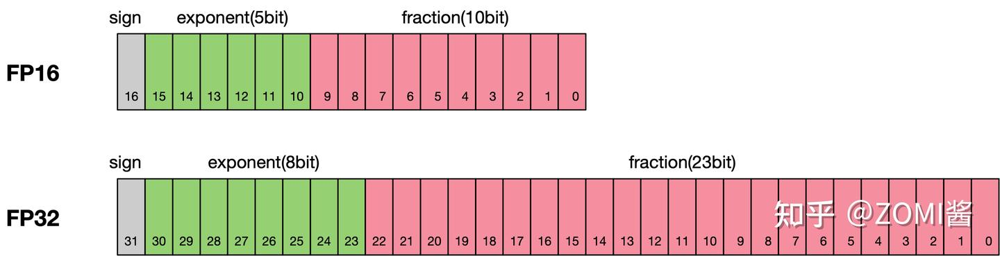
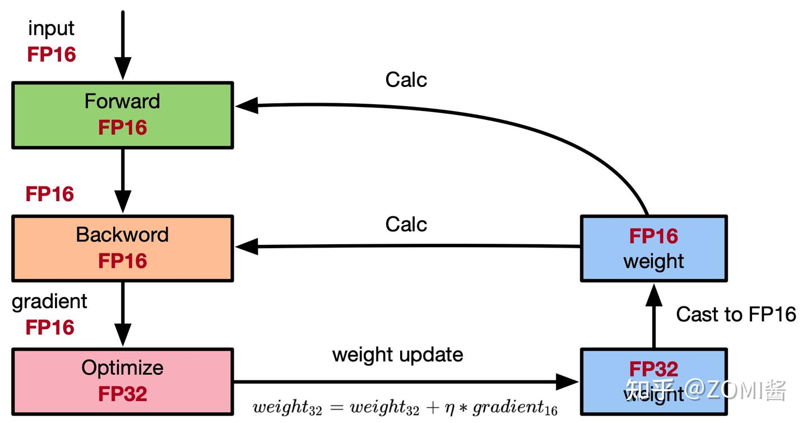
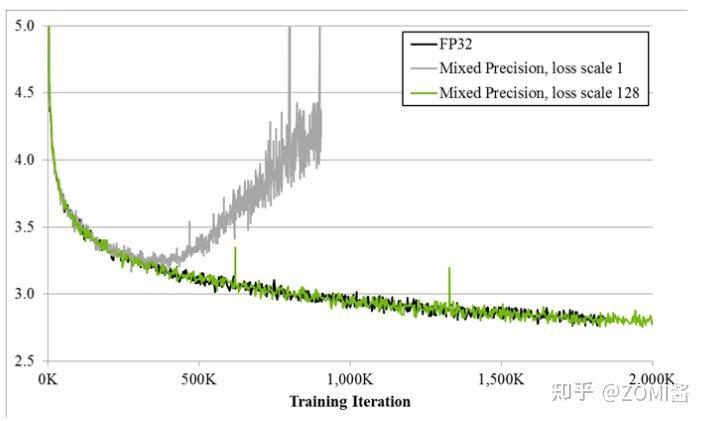
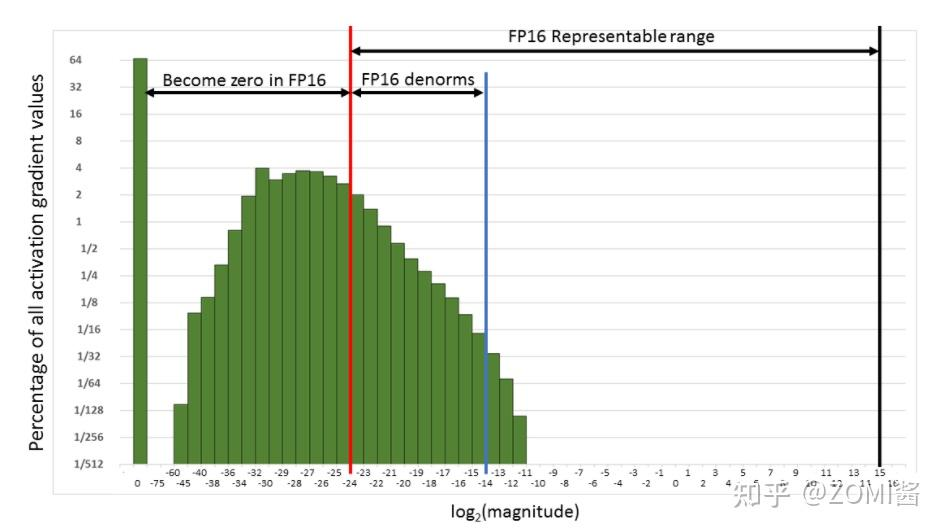
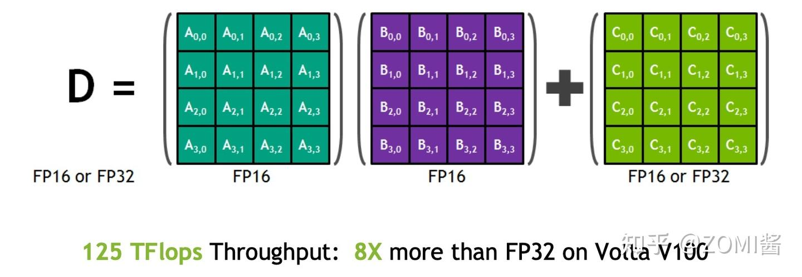

近年来，为了加快训练时间、减少网络训练时候所占用的内存，并且保存训练出来的模型精度持平的条件下，业界提出越来越多的混合精度训练的方法。这里的混合精度训练是指在训练的过程中，同时使用单精度（FP32）和半精度（FP16）。

# 1、浮点数据类型

浮点数据类型主要分为**双精度（Fp64）、单精度（Fp32）、半精度（FP16）**。在神经网络模型的训练过程中，一般默认采用单精度（FP32）浮点数据类型，来表示网络模型权重和其他参数。在了解混合精度训练之前，这里简单了解浮点数据类型。

根据IEEE二进制浮点数算术标准（IEEE 754）的定义，浮点数据类型分为双精度（Fp64）、单精度（Fp32）、半精度（FP16）三种，其中每一种都有三个不同的位来表示。FP64表示采用8个字节共64位，来进行的编码存储的一种数据类型；同理，FP32表示采用4个字节共32位来表示；FP16则是采用2字节共16位来表示。如图所示：

从图中可以看出，与FP32相比，FP16的存储空间是FP32的一半，FP32则是FP16的一半。主要分为三个部分：

- 最高位表示符号位sign bit。
- 中间表示指数位exponent bit。
- 低位表示分数位fraction bit。

以 FP16 为例，编码结构包含 1 位符号位 (sign)、5 位指数位 (exponent) 以及 10 位分数位 (fraction)。其规格化数值表示公式为：

$$Value = (-1)^{sign} \times 2^{exponent - 15} \times (1 + \frac{fraction}{2^{10}})$$

# 2、使用FP16训练问题
首先来看看为什么需要混合精度。使用FP16训练神经网络，相对比使用FP32带来的优点有：

1. **减少内存占用**：FP16的位宽是FP32的一半，因此权重等参数所占用的内存也是原来的一半，节省下来的内存可以放更大的网络模型或者使用更多的数据进行训练。
2. **加快通讯效率**：针对分布式训练，特别是在大模型训练的过程中，通讯的开销制约了网络模型训练的整体性能，通讯的位宽少了意味着可以提升通讯性能，减少等待时间，加快数据的流通。
3. **计算效率更高**：在特殊的AI加速芯片如华为Ascend 910和310系列，或者NVIDIA VOTAL架构的Titan V and Tesla V100的GPU上，使用FP16的执行运算性能比FP32更加快。

但是使用FP16同样会带来一些问题，其中最重要的是**精度溢出和舍入误差**。

1. 数据溢出：FP16 与 FP32 的数值表示范围差异巨大。FP16 的有效数据表示范围（规格化数值）约为 $[\pm 6.10 \times 10^{-5}, \pm 65504]$，而 FP32 的有效数值表示范围约为 $[\pm 1.18 \times 10^{-38}, \pm 3.4 \times 10^{38}]$。

可见FP16相比FP32的有效范围要窄很多，使用FP16替换FP32会出现上溢（Overflow）和下溢（Underflow）的情况。而在深度学习中，需要计算网络模型中权重的梯度（一阶导数），因此梯度会比权重值更加小，往往容易出现下溢情况。

2. 舍入误差：Rounding Error指示是当网络模型的反向梯度很小，一般FP32能够表示，但是转换到FP16会小于当前区间内的最小间隔，会导致数据溢出。如0.00006666666在FP32中能正常表示，转换到FP16后会表示成为0.000067，不满足FP16最小间隔的数会强制舍入

# 3、混合精度相关技术
为了想让深度学习训练可以使用FP16的好处，又要避免精度溢出和舍入误差。于是可以通过FP16和FP32的混合精度训练（Mixed-Precision），混合精度训练过程中可以引入权重备份（Weight Backup）、损失放大（Loss Scaling）、精度累加（Precision Accumulated）三种相关的技术。

## 3.1、权重备份（Weight Backup）

权重备份主要用于解决舍入误差的问题。其主要思路是把神经网络训练过程中产生的激活activations、梯度 gradients、中间变量等数据，在训练中都利用FP16来存储，同时复制一份FP32的权重参数weights，用于训练时候的更新。具体如下图所示

从上图看到，在计算过程中所产生的权重weights，激活activations，梯度gradients等均使用 FP16 来进行存储和计算，其中权重使用FP32额外进行备份。由于在更新权重公式为:
$$weigth = weight + \eta * gradient$$

权重更新过程中。$\eta * gradient$参数值可能会非常小，利用FP16来进行相加的话，则很可能会出现舍入误差问题，导致更新无效。因此通过将权重weights拷贝成FP32格式，并且确保整个更新过程是在 fp32 格式下进行的。即：

$$weigth_{32} = weight_{32} + \eta * gradient$$

权重用FP32格式备份一次，那岂不是使得内存占用反而更高了呢？是的，额外拷贝一份weight的确增加了训练时候内存的占用。 但是实际上，在训练过程中内存中分为动态内存和静态内容，其中动态内存是静态内存的3-4倍，主要是中间变量值和激活activations的值。而这里备份的权重增加的主要是静态内存。只要动态内存的值基本都是使用FP16来进行存储，则最终模型与整网使用FP32进行训练相比起来， 内存占用也基本能够减半。

## 3.2、损失缩放（Loss Scaling）
如图所示，如果仅仅使用FP32训练，模型收敛得比较好，但是如果用了混合精度训练，会存在网络模型无法收敛的情况。原因是梯度的值太小，使用FP16表示会造成了数据下溢出（Underflow）的问题，导致模型不收敛，如图中灰色的部分。于是需要引入损失缩放（Loss Scaling）技术。

为了解决梯度过小数据下溢的问题，对前向计算出来的Loss值进行放大操作，也就是把FP32的参数乘以某一个因子系数后，把可能溢出的小数位数据往前移，平移到FP16能表示的数据范围内。根据链式求导法则，放大Loss后会作用在反向传播的每一层梯度，这样比在每一层梯度上进行放大更加高效。

损失放大是需要结合混合精度实现的，其主要的主要思路是：

- Scale up阶段，网络模型前向计算后在反响传播前，将得到的损失变化值DLoss增大2^K倍。

- Scale down阶段，反向传播后，将权重梯度缩2^K倍，恢复FP32值进行存储。

**动态损失缩放（Dynamic Loss Scaling）**：上面提到的损失缩放都是使用一个默认值对损失值进行缩放，为了充分利用FP16的动态范围，可以更好地缓解舍入误差，尽量使用比较大的放大倍数。总结动态损失缩放算法，就是每当梯度溢出时候减少损失缩放规模，并且间歇性地尝试增加损失规模，从而实现在不引起溢出的情况下使用最高损失缩放因子，更好地恢复精度。

**动态损失缩放的算法如下：**

1. 动态损失缩放的算法会从比较高的缩放因子开始（如2^24），然后开始进行训练迭代中检查数是否会溢出（Infs/Nans）；
2. 如果没有梯度溢出，则不进行缩放，继续进行迭代；如果检测到梯度溢出，则缩放因子会减半，重新确认梯度更新情况，直到数不产生溢出的范围内；
3. 在训练的后期，loss已经趋近收敛稳定，梯度更新的幅度往往小了，这个时候可以允许更高的损失缩放因子来再次防止数据下溢。
4. 因此，动态损失缩放算法会尝试在每N（N=2000）次迭代将损失缩放增加F倍数，然后执行步骤2检查是否溢出。

## 3.3、精度累加（Precision Accumulated）
在混合精度的模型训练过程中，使用FP16进行矩阵乘法运算，利用FP32来进行矩阵乘法中间的累加（accumulated），然后再将FP32的值转化为FP16进行存储。简单而言，就是利用FP16进行矩阵相乘，利用FP32来进行加法计算弥补丢失的精度。 这样可以有效减少计算过程中的舍入误差，尽量减缓精度损失的问题。

例如在Nvidia Volta 结构中带有Tensor Core，可以利用FP16混合精度来进行加速，还能保持精度。Tensor Core主要用于实现FP16的矩阵相乘，在利用FP16或者FP32进行累加和存储。在累加阶段能够使用FP32大幅减少混合精度训练的精度损失。

# 4、自动混合精度训练（Automatic Mixed Precision，AMP）

1. 前向传播(Forward Pass)：使用float16模型参数计算，产生float16中间激活, 最后的Loss计算通常会自动提升到F32以保持**数值稳定**

2. 损失缩放 (Loss Scaling)：将计算出的 FP32 Loss 乘以一个较大的缩放因子（Scale Factor，例如 $2^{14}$）。目的是提前放大 Loss，进而放大梯度，避免FP16反向传播下溢为0

3. 反向传播(Backward Pass)：基于放大后的 Loss，使用 FP16 权重和激活值计算梯度。得到**放大的F16梯度**

4. 梯度反缩放与准备 (Unscale & Cast)：缩放版 FP16 梯度转换为 FP32，除以之前使用的缩放因子（Scale Factor），还原出真实的梯度值。

5. 优化器更新(Optimizer Update)：
   a. 使用float32主参数、float32梯度和float32优化器状态进行更新
   b. 将更新后的float32主参数复制回float16模型参数

6. 权重同步 (Weight Sync)
- 将更新后的 FP32 主模型参数直接截断/复制回 FP16 模型参数。