[toc]

# 第一章：基础问题

## 1.1 激活函数：从sigmoid到Relu的演进

### Silu && GElu
在LLM的演进中，激活函数的选择经历了从传统的Relu到Gelu，再到如今广泛实用的silu(及其衍生的SwiGlu)的转变。对于需要再较小规模下（如0.6B）压榨模型极限表达能力，优化特定任务（如 Function Calling）的场景来说，这种底层架构的细节至关重要。

相比于传统的 ReLU 函数，SiLU 和 GELU 的核心优势主要体现在<font color=yebl>平滑性、非线性性以及对负值的处理能力上。</font>

1.传统的局限：ReLU 的“死区”与“硬折角”

ReLU 的公式非常简单：$f(x) = \max(0, x)$

Relu的优势在于**计算速度快且在正半轴不会发生梯度消失**。但它的缺点在极深的网络中会被放大：

- **神经元死亡(Dying ReLU）**： 当输入 $x \le 0$ 时，梯度瞬间变为 0。如果一个神经元在训练中陷入负值区，它的权重将无法更新，彻底“死亡”。
- **零点不可导**:在$x=0$处有一个硬折角，这在优化过程中可能会导致梯度的震荡。

2.GELU 与 SiLU 的数学形态

为了克服 ReLU 的缺点，研究者引入了平滑且带有“负值尾巴”的函数：
- GELU (Gaussian Error Linear Unit): 结合了 Dropout、Zoneout 和 ReLU 的思想。公式为 $f(x) = x \Phi(x)$，其中 $\Phi(x)$ 是高斯分布的累积概率分布函数。它允许负值以一定概率被保留。

- SiLU (Sigmoid Linear Unit / Swish-1): 公式为 $f(x) = x \sigma(x) = \frac{x}{1 + e^{-x}}$。它在形状上与 GELU 非常相似，但在现代 LLM 中计算效率更高。

3.Silu和Gelu三大核心优势

一、 处处平滑（Smoothness）与更好的梯度传播

**GELU 和 SiLU 都是处处无穷阶可导的连续函数。**没有了 ReLU 在 0 处的“硬折角”，损失曲面（Loss Landscape）变得更加平滑。这使得优化器在进行梯度下降时更容易找到全局或局部最优解，尤其是在极深的网络结构中，平滑的梯度流能显著加速收敛。


二、 非线性与自稳定机制（Non-monotonicity）

观察图像，会发现在 $x$ 略微小于 0 的区域，GELU 和 SiLU 会产生一个轻微的“负值低谷”（即 $f(x)$ 为负，但随着 $x$ 变得更负，函数值又逐渐趋近于 0）。
- 优势： 这种非单调性相当于一种内在的正则化。**对于较小的负输入，它允许梯度回传，避免了“神经元死亡”问题**。同时，负值的保留提高了网络对微小扰动的鲁棒性，让**模型能更好地捕捉输入的细微特征**。

三、门控线性单元（Glu）的绝佳搭档

在当前的开源模型架构（如 LLaMA、Qwen 架构）中，单纯的 SiLU 通常会与门控机制结合，形成 SwiGLU。
- 对于小参数模型而言，SwiGLU的引入是提升性能的关键。它通过引入两个权重矩阵（一个用于线性变换，一个经过silu后作为门控），极大的增强每个 Transformer 层的非线性表达能力。这使得模型能在有限的参数量下，更好的拟合复杂的逻辑映射（比如精准解析指令并输出结构化的工具调用json）

下图是三个函数及其导数的形态差异
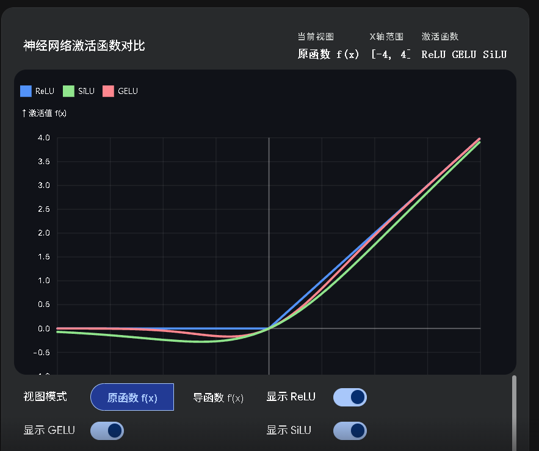


对于正在构建和微调底层模型的开发者来说，理解这些激活函数的导数行为非常有价值。SiLU 带来的平滑梯度不仅有利于预训练的稳定，在进行 SFT（监督微调）或 RL（强化学习）以对齐复杂指令时，也能提供更细腻的梯度信号，防止模型过快遗忘已有的能力。

### SwiGlu

SwiGLU（Swish-Gated Linear Unit）是一种结合了Swish和GLU（Gated Linear Unit）特点的激活函数，旨在提高深度学习模型的性能。SwiGLU通过引入门控机制和Swish激活函数，使得模型能够更有效地选择性通过信息，从而增强模型的表达能力和性能。

**数学定义**

SwiGLU函数的数学表达式为：

$$\text{SwiGLU}(a, b) = \text{Swish}(a) \otimes \sigma(b)$$

其中：
- $a$ 和 $b$ 是输入张量。
- $\text{Swish}(x) = x \cdot \sigma(x)$ 是Swish激活函数。
- $\sigma(x) = \frac{1}{1 + e^{-x}}$ 是Sigmoid激活函数。
- $\otimes$ 表示逐元素乘法（Hadamard乘积）。

**关键性质**

1. **门控机制**：SwiGLU通过引入门控机制，使得模型能够选择性地通过信息，从而提高模型的表达能力。
2. **平滑性**：Swish函数的平滑性有助于提高模型的稳定性和收敛速度。
3. **非单调性**：Swish函数的非单调性使得SwiGLU能够捕捉到更复杂的模式。
4. **信息过滤**：通过门控机制，SwiGLU能够过滤掉不重要的信息，从而增强模型的表现。

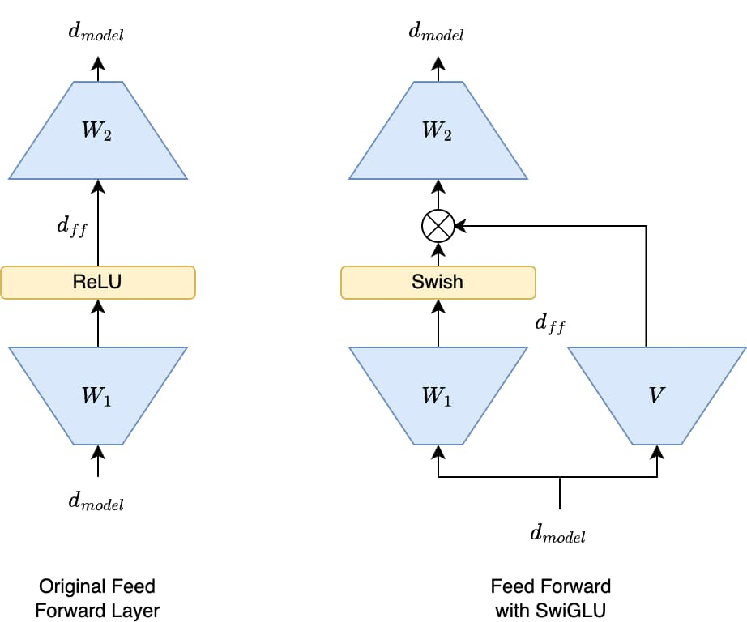

在 FFN 层中，SwiGLU 的应用通常不是像 GLU 那样简单地将一个大的线性层输出分割成两半。更常见的实现方式涉及三个线性变换。

1. 两个并行的线性变换
$$ Gate = W_{gate}·x \\ Up = W_{up}·x $$

$W_{gate}$和$W_{up}$都是将$d_{model}$维度映射到$d_{ff}$的权重矩阵

2. 应用Swish门控
- $Gated = Swish(Gate) \otimes Up $
- Gated的维度是 $d_{ff} $

3. 最终的线性变换
- $Output = W_{down} \otimes Gated $
- $W_{down} $是将维度从$d_{ff}$映射回$d_{model}$的权重矩阵


### 参考
[silu & relu](https://blog.csdn.net/shizheng_Li/article/details/146539248)
[SwiGLU](https://blog.imkasen.com/swiglu-activation-function/#SwiGLU)


## 1.2 梯度问题：深度网络的“交通堵塞”

## 1.3 损失函数：交叉熵 vs MSE的区别

## 1.4 评估指标：AUC的统计学意义和应用

## 1.5 正则化：防止过拟合的两大法宝

# 第二章：核心原理与架构（基础理论）

## 2.1 注意力机制：Transformer整体架构深度解析

[2.1-Transformer详解](./2.1-Transformer详解.md)


## 2.2 self-attention的Q/K/V来源和实现

## 2.3 MHA/GQA/MLA:原理机制和代码实现
[MHA/GQA/MLA:原理机制和代码实现](./2.3-MHA_GQA_MLA原理和代码实现.md)

## 2.4 self-attention vs cross-attention
[self-attention vs cross-attention](./2.4_self-attention_cross-attention.md)


## 2.5 attention Mask

[Attention Mask](./2.5-attention_mask.md)


## 2.6 位置编码技术：绝对编码到相对编码

https://lishizheng.blog.csdn.net/article/details/161116190

https://www.zhihu.com/question/1982396384608007549/answer/1988583033943642969

https://zhuanlan.zhihu.com/p/2023493768003724514

https://github.com/CalvinXKY/InfraTech/blob/main/models/modules/rope_principle.ipynb


## 2.7 BatchNorm vs LayerNorm vs RMSNorm


[特征归一化：BatchNorm vs LayerNorm vs RMSNorm](https://zhuanlan.zhihu.com/p/2033356613210388440)

BatchNorm、LayerNorm、RMSNorm都是深度学习中特征归一化的方式,都是对神经网络的中间层输出（或输入）进行归一化，使其均值为0、方差为1。其中，BatchNorm适合CNN，而LayerNorm、RMSNorm适合RNN / Transformer等NLP场景。


- **BatchNorm**：每个特征维度在 batch 上归一化（计算 batch 均值和方差）（CNN中是对channel维度做归一化）。对batch_size敏感（批次太小效果差）
- **LayerNorm**：对每个样本的所有特征维度归一化（跨特征维度 计算样本内均值和方差），** 适合**变长序列**和在线/小批量场景
- **RMSNorm**：LN的简化变体，**去除了减去均值的中心化操作**，计算更高效

### 特征归一化的重要性

**输入特征的尺度会影响梯度下降算法的迭代步数和梯度更新的难度，从而影响训练的收敛性。** 因此，无论是机器学习还是深度学习，在特征处理时都需要对特征进行归一化，**使得各个特征有相似的尺度，即相似的取值范围或相似的分布**，以消除量纲的影响，让模型收敛地更快


### BN（Batch Normalization，批归一化）

BN 是针对整个batch中的样本在**同一维度特**征做处理，即针对一个batch中所有样本的每一个特征做BN。

假设输入是RGB三通道的彩色图像，BN也就是分别对R通道、G通道、B通道所对应的特征矩阵（即feature map）进行处理，这里channel为特征维度。公式如下：
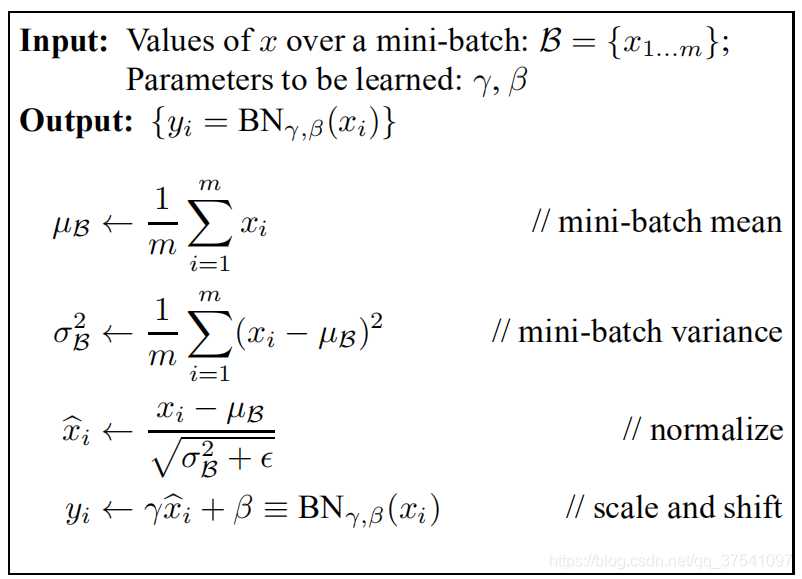

- 归一化公式中的 \epslion 是一个很小的常量，用来防止分母为零
- 最后一行公式中的 $γ$ 是用来调整数值分布的方差大小（默认值是1），是用来调节数值均值的位置（默认值是0）。** 这两个参数是在反向传播过程中学习得到的，初始化向量大小等于channel维度大小 **


一个batch size为2（两张图片）的BN的计算过程示例如下：
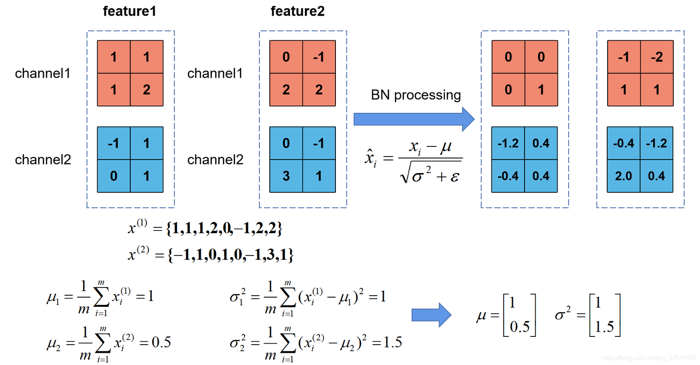

- 两个feature分别指由两张图片经过一系列卷积池化后得到的特征矩阵
- feature有两个通道

> 为什么CNN在channel维度上做BN？

因为**卷积核数=通道数**，所以一个卷积核可以得到一个通道的特征图数据。我们希望不同图像、图像的不同位置用这个卷积核执行卷积以后的数据分布是稳定的，所以需要在通道维度执行BN

BN 的优点

1、解决内部协变量偏移（Internal Covariate Shift，ICS）问题：**输入每层的分布因为有隐层处理，输出后与输入时分布不同，增大了学习难度。BN在每个mini-batch上归一化激活值**（指被激活函数处理前的那个值，即z = Wx + b），使其均值为0、方差为1，缓解了这个问题

2、**缓解梯度饱和问题，加快收敛速度：** 通过将每层输入归一化到均值为0、方差为1的分布，强制激活函数的输入落在非饱和区（如果使用sigmoid或tanh等激活函数的话），从而保持梯度不消失，允许更大的学习率，大幅加速收敛

3、**隐式的正则化效果**：训练时采用随机选取的mini-batch来计算均值和方差，不同mini-batch的均值和方差不同，近似于引入了随机噪音，使得模型不会过拟合到某一特定的均值和方差参数下，提高模型的泛化能力

4、**对参数初始化和学习率大小不敏感**：BN可以抑制参数微小变化随网络加深的影响，使得网络对参数初始化和尺度变化的适应性更强，从而可以使用更大的学习率而不用担心参数更新step过大带来的训练不稳定


BN 的不足

1、**batch_size较小的时候效果差**，因为BN的假设是使用mini-batch样本的均值和方差来模拟全部数据的均值和方差。batch_size越大，统计值越接近整个训练集的分布，效果越好

2、**BN无法应用于RNN**。RNN实际是共享的MLP（在时间维度上展开），每个step的输出是(batch_size, hidden_dim)。由于不同sequence同一位置的分布大概率是不同的，应用BN来约束是没有意义的


### LN（Layer Normalization，层归一化）
[LN（Layer Normalization，层归一化）](https://zhuanlan.zhihu.com/p/492803886)

为什么BN在NLP中效果比较差呢？简单来说，因为输入是长度不等的序列数据，不能有效地得到整个batch的均值和方差，从而导致**前向和反向传播中batch统计量及其梯度都不太稳定**

- 在训练时，BN需要保存每个step的batch统计信息（均值和方差）。在测试时，由于变长句子的特性，测试集可能出现比训练集更长的句子，所以对于后面位置的step是没有训练的统计量使用的

- 不同句子的长度不一样，对所有的样本统计均值或方差是无意义的，因为某些样本在后面的step其实是PAD

比如说，现在有10个样本（batch_size=10），9个样本长度为5，1个样本长度为20。输入时，前5个单词的均值和方差可以用10个样本算出；但是第6-20个单词的均值和方差，前9个样本都没有，只能用第10个样本算，这样就又回到了BN的缺点1，即batch_size较小时效果差

而LN是对第10个样本的20个单词去做缩放，**天然适合序列数据（变长数据）**
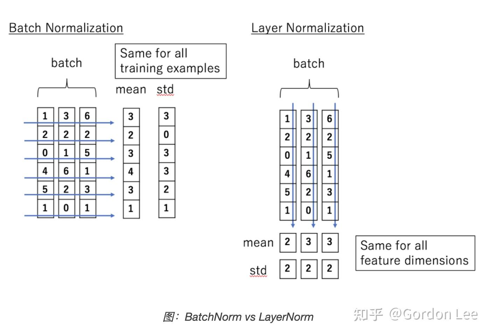

- BN是对batch的维度做归一化，也就是针对不同样本的同一特征做操作（在每个维度上统计所有样本的值，计算均值和方差）

- 而LN是对hidden的维度做归一化，也就是针对单个样本的不同特征做操作（在每个样本上统计所有维度的值，计算均值和方差）。因此LN和句子长度、batch大小都无关

- 无论是BN还是LN都可以归结为：减去均值、除以标准差，再施以线性映射（可学习参数）
**什么是LN**

LN是针对同一个样本的所有单词去做均值和方差的缩放。把神经网络中隐藏层归一为标准正态分布，以起到稳定前向输入分布、加快训练速度、加速收敛的作用

- BN在每个维度上的分布是稳定的，LN在每个样本上的分布是稳定的，因此LN也不需要移动平均

- BN比LN在infer的时候快，因为不需要计算mean和var，直接用running mean和running var就行


**代码**

LN是对每个样本的所有维度统计均值和方差，所以求均值的是d维度，最后向量形状是 (batch_size, seq_len)

1、手搓LN

```python
import torch
import torch.nn as nn

class LayerNorm(nn.Module):
    def __init__(self, d_model, eps=1e-5):
        super(LayerNorm, self).__init__()
        self.gamma = nn.Parameter(torch.ones(d_model))  # 可学习的缩放参数，调整方差，默认为1
        self.beta = nn.Parameter(torch.zeros(d_model))  # 可学习的偏移参数，调整均值，默认为0
        self.eps = eps

    def forward(self, x):
        # x: [batch_size, seq_len, d_model] 或 [batch_size, d_model]

        # 1. 在最后一个维度上计算均值和方差
        mean = x.mean(dim=-1, keepdim=True)  # 保持维度，方便广播
        var = x.var(dim=-1, keepdim=True, unbiased=False)  # 有偏估计

        # 2. 归一化
        x_hat = (x - mean) / torch.sqrt(var + self.eps)    # 减去均值除以标准差

        # 3. 缩放和偏移（广播自动处理）
        return self.gamma * x_hat + self.beta    # 再施以线性映射

```

注意，LayerNorm原始论文中使用的就是有偏估计（除以N）

- LayerNorm常用于NLP任务，序列长度可变，在极端情况下可能出现N=1。此时无偏估计的分母为0，会出错
- 当N较大时（如d_model = 512），N和N-1的差异几乎可以忽略

2、调用torch接口

```python
import torch.nn as nn

class NetDemo(nn.Module):
    def __init__(self, d_model, d_ff):
        super(NetDemo, self).__init__()
        ...
        self.layer_norm = nn.LayerNorm(d_model)

    def forward(self, inputs):
        residual = inputs     # inputs: [batch_size, seq_len, d_model]
        output = ...
        return self.layer_norm(output + residual)
```


### RMSNorm（LLaMA、DeepSeek、Qwen） 
[RMSNorm（LLaMA、DeepSeek、Qwen）](https://link.zhihu.com/?target=https%3A//papers.cool/arxiv/1910.07467)

论文证明，LayerNorm的中心化（减均值）操作对于LLM的效果提升贡献有限，主要起作用的是缩放（除以标准差）部分

**均值偏移在多层网络中会被后续的线性层和偏置项吸收,因此可以省略均值计算，仅保留RMS（均方根）缩放,计算量减少约10-15%，效果几乎无损**

RMSNorm在保持效果的同时降低了计算成本，因此成为现代LLM的主流选择

```python
# LN
mean = x.mean(-1, keepdim=True)
var = x.var(-1, keepdim=True, unbiased=False)
x_norm = (x - mean) / torch.sqrt(var + eps)
return gamma * x_norm + beta    # gamma和beta都是可学习的

# RMSNorm
rms = torch.sqrt((x ** 2).mean(-1, keepdim=True) + eps)
x_norm = x / rms
return gamma * x_norm   # gamma是可选的，默认值为1；没有beta（平移项）

```

为什么去掉减均值的操作效果几乎无损
残差连接让激活值天然趋近零均值，减均值几乎没有效果。三个原因叠加：

（1）权重初始化是零均值的（Xavier / Kaiming初始化），因此每个子层 F(x) 的输出期望 ≈ 0

（2）残差连接只做加法， $x_L = x_0 + F_1 + F_2 + ...$ ，整个网络的均值在传播过程中保持恒定且稳定

（3）Pre Norm自我强化，每次进子层前先归一化，从而子层F_l的输出分布更对称，均值就更接近0

以上三点合起来，**整个网络的均值始终是一个常数 c（不随深度变化），那么LayerNorm减去的均值就是一个常数，这个常数平移完全可以被后续线性层的偏置吸收，减去它是多余的计算。** 所以RMSNorm直接省去均值计算，只保留幅值缩放，既保留了效果，计算又更高效


```python
import torch
import torch.nn as nn

class RMSNorm(nn.Module):
    def __init__(self, hidden_dim, eps=1e-5):
        super().__init__()
        self.gamma = nn.Parameter(torch.ones(hidden_dim))
        self.eps = eps
    
    def forward(self, x):
        rms = torch.sqrt((x ** 2).mean(-1, keepdim=True) + self.eps)
        x_norm = x / rms
        return self.gamma * x_norm   # 无beta参数
```

### Transformer 中 Post-Norm 与 Pre-Norm 的对比及主流架构选择

Post-Norm（原始 Transformer 方案）
- 公式：\(x_{n+1} = \text{Norm}(x_n + \text{Sublayer}(x_n))\)
- 流程：输入 → 注意力 / FFN 计算 → 残差相加 → 层归一化 → 输出
- 特点：归一化操作包裹了整个残差块，所有梯度必须经过 LayerNorm 层
- 优点：理论表征能力更强；缺点：梯度稳定性差，深度扩展性差

Pre-Norm（现代大模型主流方案）
- 公式：\(x_{n+1} = x_n + \text{Sublayer}(\text{Norm}(x_n))\)
- 流程：输入 → 层归一化 → 注意力 / FFN 计算 → 残差相加 → 输出
- 特点：归一化操作在子层输入之前，残差连接形成了一条独立的 "梯度高速公路"
- 优点：训练简单可靠、梯度流动极其稳定、深度扩展性极佳


Pre-Norm 已成为几乎所有主流大模型的标准选择，包括：llama qwen deepseek gpt

原因：

大模型时代的核心需求是 **"可训练性" 和 "可扩展性"。**
Post-Norm 虽然理论性能更好，但在训练超过 70 层的模型时（如 GPT-3 为 96 层、LLaMA-2 70B 为 80 层）会完全失败。而 Pre-Norm 的梯度分离机制使得万卡级分布式训练中数千层模型的同步收敛成为可能。


## 2.8：架构对比：encoder-decoder vs Decoder-only
[encoder-decoder vs Decoder-only](./2.8_encoder-decoder_Decoder-only.md)

## 2.9：生成解码策略：topk与Top-p采样


## 问题汇总

### Question-1 请介绍 Transformer 的结构组成、各部分作用及底层原理。

整体架构

Transformer 采用 Encoder-Decoder 架构，但两者都由相同的 Layer 堆叠而成。

输入部分：包括输入嵌入（Input Embedding）和位置编码（Positional Encoding）。

Encoder（编码器）：

由 $N$ 个相同的 Encoder Layer 堆叠（原论文 $N=6$）
每个 Encoder Layer = Multi-Head Self-Attention + Feed-Forward Network (FFN)（两层的全连接层，第一层激活函数为 ReLU 即 max(0,x)，第二层没有激活函数，不改变矩阵维度） + 两个残差连接 + LayerNorm（即 AddNorm）


Decoder（解码器）：

由 $N$ 个相同的 Decoder Layer 堆叠
每个 Decoder Layer = Masked Multi-Head Self-Attention + Cross-Attention（使用 Encoder 的输出）+ FFN + 三个残差连接 + LayerNorm
输出部分：包括一个线性层（Linear）和 Softmax 层，用于计算下一个 token 的概率分布。

各部件作用与原理

| 组件 | 作用 | 底层原理 |
|------|------|------|
| Self-Attention |建立序列内任意位置的直接依赖，捕获全局上下文 | 通过 Q/K/V 计算相似度加权，实现"全连接"的序列建模，时间复杂度|
| Multi-Head |将高维空间切分为多个子空间，并行学习不同语义关系 | |
| | | |

各部分作用及底层原理：

- 位置编码
- 多头注意力：
- 前馈网络（FFN）
- 残差连接&层归一化：
- 掩码多头注意力：

### Question-2 Transformer 的 forward 计算包含哪些部件？非线性由什么提供？

**Forward 计算包含的部件：**

1. 输入部件：Token 嵌入查找和位置编码叠加。
2. 多头注意力部件：$ QKV $ 线性投影、点积相似度计算、Softmax、加权求和、多头拼接、输出线性投影。
3. Add & Norm 部件：残差相加和层归一化。
4. 前馈网络（FFN）部件：第一个线性层、非线性激活函数、第二个线性层。
5. 输出部件：最后的线性层和 Softmax。


Forward 流程（以 Encoder 为例）

```python
Input Embedding + Positional Encoding
    ↓
[Encoder Layer × N]
    ├─ Multi-Head Self-Attention
    │   ├─ Linear 投影得到 Q, K, V
    │   ├─ Scaled Dot-Product Attention (Softmax)
    │   ├─ Concat + Linear
    │   └─ Dropout
    ├─ Add & LayerNorm (残差1)
    ├─ FFN
    │   ├─ Linear₁ (升维，通常 4×)
    │   ├─ Activation (ReLU/GELU/SwiGLU)
    │   ├─ Linear₂ (降维)
    │   └─ Dropout
    └─ Add & LayerNorm (残差2)
    ↓
Output
```

非线性来源

| 位置 | 非线性操作 | 说明 |
|------|------|------|
| FFN 激活函数 | ReLU / GELU / SwiGLU | 非线性映射，打破线性叠加，引入非线性表达 |
| Attention Softmax | $softmax(QK^T/\sqrt(d_k))$ | 非线性概率映射，把注意力分数转为 0~1 权重分布 |
| LayerNorm |  | 属于非线性变换，LN 均值方差归一化 + 缩放偏移，打破线性约束，稳定训练梯度。 |

>重点：<font color=red>Transformer 90% 非线性表达能力来自 FFN 激活函数，注意力靠 Softmax 实现非线性权重分配。</font>


### Question-3 Transformer 为什么能替代 RNN？核心优势是什么？

Transformer 能替代 RNN 的核心在于它解决了 RNN 的两大痛点：无法并行和长距离遗忘。

**RNN 天生致命缺陷**

1. 串行计算，无法并行
RNN 必须逐词依次计算：时间步t必须依赖t-1的隐状态，前后强依赖，训练极慢，无法做大模型。

2. 计算复杂度高
序列长度n，计算复杂度$O(nd^2)$, 但常数因子大且无法加速

3. 长距离依赖弱，梯度消失严重
序列一长，远端信息不断衰减。

4. 只能单向时序建模
只能顺着时间流传递信息，难以直接捕捉全局任意位置语义关系。

**RNN 仅剩优势**

短序列、轻量部署、低算力场景，LSTM 推理更快、更省显存，其余场景全被 Transformer 取代。

**Transformer 的核心优势**

1. 全局并行计算（最核心优势）
自注意力一次性同时计算所有词，不分先后顺序，训练速度远超 RNN，是超大预训练模型唯一可行架构。

2. 长距离依赖建模
通过缩放点积注意力，任意两个 token 直接建立关联，距离无衰减，长文本、长序列任务全面吊打 LSTM。

3. 多头注意力：多维度语义捕捉
多头可同时学习：语序依赖、语法依赖、语义关联、指代关系，表达能力远强于单一循环结构。

4. 结构极简，极易堆叠扩容
Encoder/Decoder 层结构统一，轻松堆深层、堆参数量，适配 BERT、GPT 等大预训练范式；RNN 深层极易难收敛。

5. 灵活可控，双向 / 单向自由切换
Encoder 双向注意力 → 理解类任务（分类、翻译、理解）
Decoder 掩码单向注意力 → 生成类任务（写诗、对话、文本生成）RNN 很难灵活切换双向 / 单向。


### Question-4 为什么要用 Multi-Head Attention？切分为多头的作用是什么？

核心原因：**为了让模型从多个不同维度、不同视角并行学习句子里多种语义关系与位置依赖，弥补单头注意力表征单一的缺陷，在低成本下极大增强全局语义建模能力。**

切分多头的 5 大核心作用
1. 并行捕获多种不同语义依赖（最核心）: 有的关注局部（相邻词），有的关注全局（远距离依赖），有的关注特定语法关系

2. 拓宽特征表征空间，提升模型表达力: 在不显著增加计算量前提下，大幅提升语义建模能力，远强于单头注意力。
3. 丰富注意力关注范围: 部分头侧重近距离依赖，部分头侧重长距离依赖，全局长短依赖全覆盖。
4. 实现多视角特征融合相当于集成多个不同侧重点的注意力模型，融合后特征更全面、鲁棒性更强。
5. 增强语义正交性，减少信息冗余: 各个头学习到的特征相互差异化，避免单一维度信息堆叠，信息利用率更高。


补充优点
- 计算开销小：多头总计算量≈单头注意力，效率极高, 总计算量：$4 * d_m^2$(q\k\v\O各$d_m * d_m$)
- 适配预训练：BERT、GPT 统一用 8 头 / 16 头，泛化性极强


>Head Pruning：可裁剪冗余 head 而不显著损失性能，证明存在分工


### Question-5 Attention 的 Softmax 之前为什么要除以根号dk

回顾公式：
$$score = QK^T/\sqrt(d_k)$$

$d_k$代表q\k向量的维度，这叫做缩放点积注意力（Scaled Dot-Product Attention）。核心目的只有一个：**防止点积数值过大，导致softmax进入饱和区，造成梯度消失。**

数学推导：

假设q和k是独立的随机变量，均值为0，方差为1。那么它们的点积$q*k = q_1*k_1 + q_2*k_2 +...+q_{d_k}*k_{d_k}$的均值为0，但是方差变为$d_k$

根据方差运算的性质：

单个$q_ik_i$方差为1，累加$d_k$项后，点积结果的方差=$d_k$，对应的标准差就是$\sqrt(d_k)$,因此$d_k$越大，点积结果会非常大（方差大）

因此：

未缩放时：当$d_k$很大时，点积结果会非常大（方差大），导致 Softmax 函数的输入落入梯度极小的饱和区域。这意味着 Softmax 之后，正确的词概率接近1，错误的词概率接近0，但反向传播时梯度会非常小，参数无法更新，模型几乎无法学习。

缩放后：分数整体压缩到均值 0、方差 1 的合理区间，Softmax 输出分布变得平缓，梯度可以正常反向传播。

额外两个作用

- 统一尺度不管向量维度\(d_k\)取 64、128、512，缩放后分数分布尺度一致，训练稳定性大幅提升。
- 保留相对注意力关系只是整体数值缩放，token 之间的相似度排名不会改变，不会破坏原本的强弱相关性。

### Question-6 如果在 Transformer 中去掉 K，变成 QQV，会有什么问题？（以encoder为例）

QKV的功能与作用（图书馆查询系统）：

| 指标 | 说明 | 权重 |
|------|------|------|
| Query | 查询内容 | 想寻找的信息 |
| Key | 索引标签 |  我能提供什么|
| Value | 说明 | 实际存储的全部信息 |

回顾QKV的标准计算：

给定输入序列$X ∈ R^{n*d_{model}}$（n为序列长度），通过三个不同的线性投影得到Q\K\V:
$$Q=XW_Q  K=XW_K  V=XW_V$$
其中$W_Q/W_K ∈ R^{d_{model}*d_k}$, $W_V ∈ R^{d_{model}*d_v}$（一般$d_k$ == $d_v$）


如果去掉 K，变成 QQV（即用 Q 代替 K），数学上近似于对 V 做固定的二次型加权，失去灵活性，等价于线性 Attention 退化 ：


这会带来以下严重问题：

（1）注意力矩阵强制对称，丧失有向建模能力
$QQ^T$ 是对称矩阵，$A_{ij}==A_{ji}$,但自然语言中是大量有方向结构，例如：“主语→谓语”、“代词→先行词”、“修饰语→被修饰语”。强行要求“A 关注 B”与“B 关注 A”的原始相似度相同，会严重损害编码器对句法和语义关系的建模。

（2）失去 Query 与 Key 的角色分离，容量降低
标准 Transformer 中，W_QW Q和 W_KW_K学习不同的投影空间：一个位置“作为 Query 如何提问”和“作为 Key 如何被匹配”可以有不同的表示。
如果 Q 与 K 共享同一投影，一个 token 只能用同一种表示同时承担“提问”和“被匹配”两个角色，这大大降低了模型的灵活性和容量。模型难以学会类似“某个词在查询时侧重语义，在被查询时侧重位置”的复杂模式。

（3）信息检索视角的退化
QKV 机制可以类比信息检索：**Query（查询词）与Document Key（文档索引词）**通常使用不同的表示，因为“想找什么”和“被找到的依据”往往不是同一回事。强制 K = Q 相当于把检索问题退化成了完全对称的相似度匹配，失去了针对不同任务动态调整匹配策略的能力。

本质：K 的存在实现了**内容与查询的解耦**，是 Attention 机制"检索-读取"逻辑的关键。去掉 K，模型退化为固定的自相关计算，失去动态路由能力。


### Question-7 Tranformer参数、计算、显存占用
[Tranformer参数、计算、显存占用](./2.1.7-Tranformer参数、计算、显存占用.md)


显存占用：主要包括**模型参数、梯度、优化器状态和中间激活值**。对于 Transformer 层，中间激活值（尤其是 attention 权重矩阵$QK^T$形状为 [batch, heads, seq_len, seq_len]）是长序列下的主要瓶颈。此外，FFN 的中间层激活也占用显存。例如，对于批次大小 b、序列长度 s、隐层维度 h、头数 a，单层注意力权重占用 $bs^2a$ 个浮点数，在长序列时极大。

计算复杂度：每层自注意力为 $O(s^2h)$（计算 QK 乘积和加权求和），FFN 为 $O(sh^2)$。总体每层复杂度 O(n²d + nd²)。对于大模型，d 较大，但长序列时 n² 项主导。

显存占用拆解（训练时）

模型状态（Model States，对于每参数占用显存为 16byte，

工作参数（Parameters）：2byte（FP16/BF16）
梯度（Gradients）：2byte
优化器状态（Optimizer States）：Adam 需要 12byte（FP32 拷贝 + 动量 + 二阶矩）


激活值（Activations）- 与 batch size 和序列长度相关

- Attention 矩阵： $O(s^2·b·a)$, B=batch_size， a=head_num
- MLP：$O(s·b·h)$ 

具体显存占用情况（7B模型为例）：[CSDN | LLM 微调基础：加载 / 微调一个 7B 模型，到底需要多少显存？](https://blog.csdn.net/MoonOutCloudBack/article/details/158932005)


计算复杂度（FLOPs）

前向传播每层：$8bsh^2 + 4bs^2h$

FFN: $16bsh^2$

短序列（s<<h）：FFN 主导，
长序列（s>>h）：Attention 主导，
训练时反向传播额外 2 倍计算量

关键结论


### Question-8 Transformer 是 Encoder-Decoder 架构，而 GPT 是 Decoder-only 架构，为什么会演变成这种形式？为什么生成式任务（如 GPT）通常舍弃 Encoder？

这种演变主要源于预训练任务目标和下游任务形式的变化。

1. 原始 Transformer：诞生于机器翻译任务，这是一个典型的 Seq2Seq 任务，输入（源语言）和输出（目标语言）是完整的、但内容不同的句子。Encoder 负责理解整个输入句子，Decoder 则负责基于输入理解逐个生成输出词。
2. GPT 的 Decoder-only：GPT 开创了“自回归语言建模”的预训练范式，即 “预测下一个词” 。这个任务天然适合 Decoder-only 架构：模型只能看到当前词之前的词（通过 Masked Attention），然后预测下一个词，完美契合了生成任务的本质。
3. BERT 的 Encoder-only：BERT 使用的预训练任务是 Masked Language Model（完形填空），需要同时利用一个词的左右两侧上下文信息来预测被遮住的词，因此它只需要 Encoder 来理解完整的上下文。

生成式任务舍弃 Encoder 的原因：

1. 任务本质匹配：生成式任务的本质是无条件或基于提示（Prompt）的续写。这本质上就是一个自回归过程。Decoder-only 架构的 Masked Self-Attention 天生就是为此设计的：它在生成时只能看到历史信息，符合因果推断的逻辑。
2. 架构简化与扩展：舍弃 Encoder 极大地简化了模型结构，使得堆叠更多层、训练更大规模的模型变得更加容易和稳定。GPT 系列的成功证明了这种简洁架构的扩展能力。
3. 统一的任务表示：Decoder-only 架构可以将各种不同的任务（翻译、问答、摘要等）都统一为“文本生成”的格式。只需要将任务描述和输入拼接成 Prompt 喂给模型，模型就能以续写的方式生成答案，实现大一统的通用能力。
4. 上下文学习（In-Context Learning）：Decoder-only 架构在推理时，能够灵活地利用输入 Prompt 中的示例来调整输出，这种能力被称为上下文学习。Encoder-Decoder 模型由于对输入和输出的处理方式不同，实现这种能力相对复杂。

### Question-9 Transformer 的 FFN 层为什么会逐渐演变成 MOE 层？
TODO


### Question-10 [FFN为什么先升维后降维度](https://www.zhihu.com/collection/754951797)
Transformer模型中的前馈神经网络（Feed-Forward Network, FFN）采用“先升维再降维”的设计，这种结构是**<font color=yebl>为了能够在模型的表现力和计算效率之间取得平衡。</font>**

1、升维与降维的作用
FFN由两层全连接层（Linear Layer）和一个非线性激活函数（如ReLU）组成。其公式为：
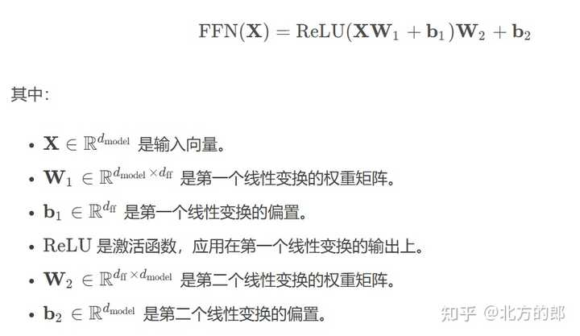

其中，W1和W2作为weight，分别对应升维和降维的计算过程。

- 升维（通过 W1​）：首先，输入 xxx 的维度（通常是 hidden_size，即模型的隐藏层维度）被投影到一个更大的空间。**这一操作的目的是增强网络的表示能力，使其能够捕捉更多的特征和复杂的非线性关系。升维后，网络能学到更多的特征信息，从而提高表达能力。**
- 激活：升维后的结果通常通过激活函数（如 ReLU）进行非线性变换，进一步增强模型的表示能力。通过激活函数的作用，模型能处理更复杂的模式和关系。
- 降维（通过 W2​）：然后，升维后的结果被映射回原始维度（即hidden_size​），这样可以保证输出和输入的维度一致，便于与后续层的操作（例如，后续的自注意力层）相连接。

2、提升模型表示能力
升维操作通过将输入映射到更高维度空间，允许模型学习更多的特征表示。这是因为，高维空间有更大的自由度，能够表示更加复杂的模式。如果直接从输入维度映射到输出维度，模型可能无法捕捉到复杂的非线性关系。因此，升维可以增强模型的非线性表达能力，使得模型能够更好地处理复杂的模式识别任务。

3、信息压缩和降维

升维操作增强了表达能力，但同时也可能引入过多的特征，导致<font color=yebl>计算开销增大和潜在的过拟合风险</font>。通过降维操作（即通过 W2​），模型会将信息压缩回原始维度，保证计算效率和避免冗余特征的产生。这一过程类似于“特征选择”，它能有效地减少模型的复杂度，并确保每个维度的信息都是高效且有用的。

4、relu激活作用
在升维操作之后通常会应用 ReLU 激活函数。ReLU 是一个常用的非线性激活函数，它能够有效地提高模型的表达能力。通过增加非线性，ReLU 使得网络能够学习到复杂的函数关系。如果 FFN 只是线性升维和降维，它的表达能力会受到限制，因此 ReLU 的应用非常重要。

5、梯度传播与训练效率

升维后，模型能够更灵活捕捉特征信息，而通过降维回到原始维度后，梯度的传播效率更高，有助于避免梯度消失或梯度爆炸问题。在实际训练过程中，较大的中间维度可以帮助模型更好的进行学习和优化

6、计算效率与内存管理
升维和降维操作也有助于更好地平衡计算效率和内存使用。在实际实现中，通过适当的升维和降维，Transformer 模型可以有效地进行并行计算，同时避免由于维度过大导致的计算和内存开销过大。

总结
**Transformer 中的 FFN 设计中先升维再降维，主要是为了提高模型的表达能力、增强非线性变换的效果、控制计算开销并提高训练效率。升维使得模型能够学习到更复杂的模式，降维则帮助模型减少冗余信息，保持计算效率，同时提高训练时的稳定性。**


### Question-11 LayerNorm 和 BatchNorm 的区别


- 计算维度：BatchNorm 对每个特征维度在 batch 上归一化（计算 batch 均值和方差）；LayerNorm 对每个样本的所有特征维度归一化（跨特征维度 计算样本内均值和方差）。
- 适用场景：BatchNorm 适用于 CV 等固定尺寸输入，对 batch size 敏感；LayerNorm 适用于 NLP 等变长序列，所需要的均值、方差统计量单样本独立，不依赖 batch，因此 Transformer 采用 LayerNorm。
- 训练与推理：BatchNorm 在训练时使用 batch 统计量，推理时使用全局统计量；LayerNorm 训练和推理一致。
- 依赖关系：BatchNorm 依赖 batch 内样本，LayerNorm 不依赖 batch。


为什么 Transformer 不用 BN？

1. 序列长度可变：不同样本长度不同，batch 统计无意义
2. 自回归生成：推理时逐个生成 token，无法预计算 batch 统计
3. 独立同分布假设破坏：序列中不同位置 token 分布不同

RMSNorm（LLaMA 使用）：
- 去掉均值中心化，只保留方差归一化：
$$y=x/(\sqrt{Mean(x^2)})·γ$$

- 速度快，计算量低（10-15%）效果相当


### Question-12 ROPE如何支持 100k 上下文
为什么 RoPE 不能直接扩展到 100k？
首先向面试官明确：RoPE 极其缺乏直接的“外推”（Extrapolation）能力。

假设模型预训练时的最大长度是 4k（$L = 4096$）。RoPE 的相对位置感知是通过旋转角度 $m\theta $ 来实现的。如果推理时突然遇到第 100,000 个 Token，$m$ 远远超出了训练时见过的最大范围。这会导致两个致命问题：
- 注意力分数崩溃： 旋转角度进入了未知的分布区间（Out-of-Distribution），Query 和 Key 的点积结果会变得极其混乱。
- 局部特征丧失： 模型无法正确计算超长距离下的相对关系，导致模型生成乱码或产生严重的幻觉。因此，支持 100k 的核心思想是将“外推”转化为“内插”（Interpolation）。

2. 技术演进路线：从 PI 到 YaRN
   
接下来，清晰地向面试官展示实现长上下文的三种主流技术演进：

方案 A：线性位置插值 (Positional Interpolation, PI)
- 原理： 既然模型没见过 $m=100,000$ 的角度，那我们就把 100k 的位置等比例压缩回 4k 的范围内。假设扩展倍数 $s = 25$（100k / 4k），我们将位置索引除以 $s$：$m' = \frac{m}{s}$。
- 优点： 极其简单，只需要用少量长文本数据进行几百步的 SFT（微调），模型就能适应 100k。
- 缺陷： 粗暴的线性缩放破坏了相邻 Token 之间的局部高频特征（比如“打”和“球”本来距离是 1，现在变成了 0.04），会导致模型在短文本上的表现明显下降。

方案 B：NTK-Aware 插值（高频外推，低频内插）

- 原理： 这是社区提出的一种极具数学美感的方法，也是目前最主流的方案之一。它基于一个洞察：RoPE 不同的维度对应着不同的旋转频率。
  - 高频维度（对应小的 $\theta_i$）：负责捕捉临近 Token 的局部关系，不应该被缩放（保持外推）。
  - 低频维度（对应大的 $\theta_i$）：负责捕捉长距离的全局关系，应该被缩放（进行内插）。
- 实现： 不直接缩放位置 $m$，而是通过放大 RoPE 的底数（Base，默认为 10000），让高频分量几乎不变，低频分量实现平滑插值。
- 优点： 很多时候甚至不需要微调（Zero-shot），直接修改底数就能让模型支持极长的上下文，且不损害局部注意力。

方案 C：**YaRN (Yet another RoPE extensioN)**
- 原理： 目前最先进的开源方案之一。它在 NTK 的基础上，把 RoPE 的维度显式地划分为三组：完全不插值的高频区、线性插值的低频区、以及中间的平滑过渡区。同时，YaRN 还引入了温度系数（Temperature Scaling）来放大注意力分数（Logits），抵消上下文变长带来的注意力稀释问题。

### Question-？ 在 Agent 多轮对话任务中，Attention 的局限性体现在哪些方面？
TODO


# 第三章：训练与微调技术（核心算法）

## 3.1 监督微调：SFT

## 3.2 高效微调：LoRA技术深度解析
[垂域模型SFT(FULL & LoRA)微调](./3.1-SFT监督微调/)


## 3.3 微调实践：灾难性遗忘与质量保证

## 3.4 强化学习 PPO GRPO DPO
[PPO](./3.4-RL/PPO/Proximal%20Policy%20Optimization.md)

## 3.5 算法进阶：DAPO GSPO

## 3.5 MOE expert

## DeepSeek系列训练流程


## 问题汇总


### Question-1 从 txt 文本预处理到 SFT 训练的全流程


### Question-2 Collective通信操作


1. Gather && Scatter

Gather将分散在各个gpu上的Tensor，组合成一个$N \times k$的Tensor，放到指定的GPU上。而Scatter正好相反。

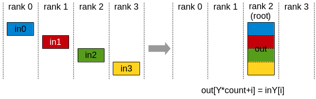


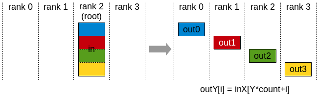


2. Reduce

执行同AllReduce相同的操作，但结果仅写入具有的某个显卡。

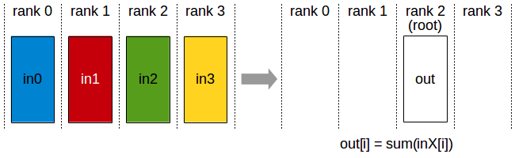

3. AllReduce

将各个显卡的Tensor进行聚合(sum、min、max)后，再将结果写回至各个显卡， 各个gpu中计算结果一致

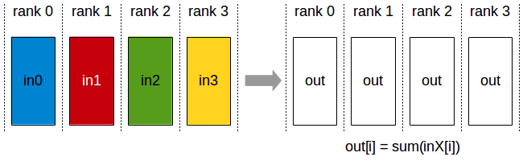


4. AllGather

每个gpu上有一个大小为N的Tensor，共有k个gpu。经过AllGather后将所有显卡上的张量合并为一个$N \times k$的Tensor，然后将结果分配至所有显卡上。

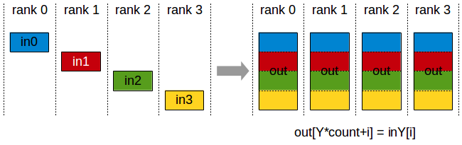


5. ReduceScatter

执行Reduce相同的操作，但是结果会被分散至不同的显卡。

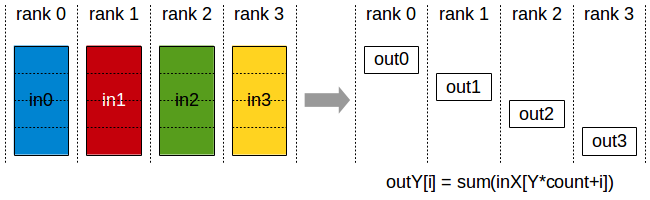


6. AlltoAll

每个gpu都提供$N \times k$的Tensor，其中第j个N值块被发送到目标列j。

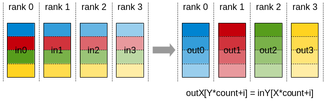


7. Broadcast

将Tensor从某张卡广播至所有卡。

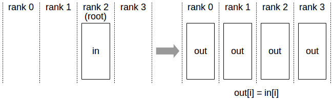

参考：

[Collective通信操作及Pytorch示例](https://zhuanlan.zhihu.com/p/607605729)
[Collective Operations](https://link.zhihu.com/?target=https%3A//docs.nvidia.com/deeplearning/nccl/user-guide/docs/usage/collectives.html)


### Question-3 DeepSpeed ZeRO 三阶段解读

DeepSpeed ZeRO是MSFT开发的显存优化技术，ZeRO-1/2/3的核心区别在于分片对象不同，从优化器状态逐步扩展到梯度、模型参数，内存节省递增但通信开销随之增加

|阶段|分片对象|内存节省|通信量|
|----|----|----|----|
|ZeRO-DP|----|1|1x|
|ZeRO-1|仅优化器状态|约4倍|1x|
|ZeRO-2|优化器状态+梯度|约8倍|1x|
|ZeRO-3|优化器状态+梯度+模型|与GPU数量成正比（接近1/N）|1.5x|

- ZeRO-1: 每个GPU保留完整模型参数和梯度，仅将优化器状态（Adam动量）分片，适合模型较小、优化器状态占据主导的场景
- ZeRO-2：在ZeRO-1基础上进一步分片梯度，模型参数仍然完整存储，是实践中常用的平衡点
- ZeRO-3：全面分片所有状态，每次计算通过ALL-Gather动态收集所需参数，计算后释放，支持CPU/NVMe卸载（ZeRO-infinity）

### Question-4 pretrain SFT RLHF区别

如果把大模型看作一个天才的成长过程：

- Pre-train（预训练） 是**通识教育**，让模型通读群书，具备语言理解和海量世界知识；

- SFT（监督微调） 是**课后定向教学**，教模型理解什么是‘指令’，并学会用人类助手的规范格式来回答；

- RLHF（对齐） 则是**导师品德树人**，通过**奖惩机制**，让模型的回答更符合人类的价值观、偏好和安全底线，解决'幻觉'和'答非所问'的问题


|维度|pretrain|SFT|RLHF|
|----|----|----|----|
|目标|学习通用语言表示和世界知识|学习指令遵循+规范任务格式|对齐人类偏好（有用、无害、诚实）|
|数据|海量无标注文本（网页、书籍、代码）|高质量指令-输出对（数十到数百万）|偏好对/排序数据（A>B）|
|任务定位|自监督学习，next token prediction;基础模型构建|有监督学习，条件生成；任务适配/对话能力培养|强化学习，优化奖励函数；价值观对齐|
|解决问题|"模型会说话"，从海量无标注文本中获取语言能力|"模型听指令"，模型理解人类意图，输出符合期望的内容|"模型不仅说的好还安全"，纠正模型生成中不符合人类偏好的行为|
|Loss|纯交叉熵（所有token）|交叉熵（通常只算answer部分）|期望Reward最大化+KL惩罚）|

### Question-4.1 SFT 的 Loss 及多 Token 计算

SFT 的 Loss 为交叉熵损失，计算模型对每个 token 预测的概率与真实 token 的差异。若 target 有 N 个 token，则损失是这 N 个 token 的交叉熵的平均值（或求和，通常取平均）。

实现时，通过设置 ignore_index（如 -100）忽略非 target 部分。

假设prompt有$L_p$个token，answer有$L_a$个token（$L_a$=10或100）

```c++
Full sequence: [P1, P2, ..., P_Lp, A1, A2, ..., A_La]
               ↑ prompt部分        ↑ answer部分（只算这些的loss）

```
计算步骤：
1. Forward计算得到logits:`[batch, seq_len, vocab_size]`
2. shift right：logits 去掉最后一个，labels 去掉第一个
3. Mask prompt：将 prompt 对应位置的 labels 设为 -100（ignore_index）
4. 只在 answer 部分计算 CE Loss

注意这个 loss -平均到每个 token，最终 loss 是标量（mean over valid tokens）。序列长只是求和的项多，但除的也是$L_a$，所以不同长度样本的 loss 量级可比。


### Question-4.2 SFT Loss 计算代码（含 shift right）

```python
import torch
import torch.nn.functional as F
from torch.nn import CrossEntropyLoss
 
def compute_sft_loss(logits, labels, ignore_index=-100):
    """
    logits: [batch_size, seq_len, vocab_size]  # 模型输出
    labels: [batch_size, seq_len]              # 目标 token IDs，prompt部分为-100
    """
    # 1. Shift right：模型预测第 t 个，对应 label 第 t+1 个
    shift_logits = logits[..., :-1, :].contiguous()   # [batch, seq_len-1, vocab]
    shift_labels = labels[..., 1:].contiguous()        # [batch, seq_len-1]
    
    # 2. Flatten
    shift_logits = shift_logits.view(-1, shift_logits.size(-1))  # [(batch*(seq-1)), vocab]
    shift_labels = shift_labels.view(-1)                          # [batch*(seq-1)]
    
    # 3. 计算 loss，自动忽略 -100 的位置
    loss_fct = CrossEntropyLoss(ignore_index=ignore_index, reduction='mean')
    loss = loss_fct(shift_logits, shift_labels)
    
    return loss
 
# ========== 完整训练步骤示例 ==========
def sft_train_step(model, batch, optimizer):
    input_ids = batch['input_ids']      # [batch, seq_len]
    attention_mask = batch['attention_mask']
    labels = batch['labels']            # prompt部分为-100，answer部分为真实token id
    
    # Forward
    outputs = model(input_ids=input_ids, attention_mask=attention_mask)
    logits = outputs.logits             # [batch, seq_len, vocab_size]
    
    # 计算 loss（注意：模型已经 shift 过，但 logits 和 labels 需要手动 align）
    loss = compute_sft_loss(logits, labels)
    
    # Backward
    optimizer.zero_grad()
    loss.backward()
    
    # Gradient clipping（防止梯度爆炸）
    torch.nn.utils.clip_grad_norm_(model.parameters(), max_norm=1.0)
    
    optimizer.step()
    
    return loss.item()
```


### Question-5 pretrain 和 SFT 优化目标区别


**数学公式**

1. Pretrain

目标本质是**全文本的因果语言建模（Causal Language Modeling, CLM）**，即标准的 Next-token Prediction。利用自回归的方式，基于上文预测下一个 Token。

对于一个长度为T的文本序列$X=(x_1, x_2,...,X_T)$,其优化目标是最小化整个序列的负对数似然估计（Negative Log-Likelihood）：

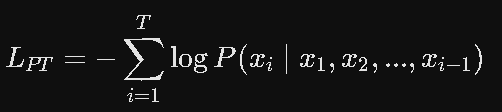

特点：每一个Token都会作为Target去计算Loss并参与梯度回传

2. SFT
目标的本质是**条件语言建模（Conditional Language Modeling）**。将输入拼接为 $[Prompt; Response]$。假设 Prompt 长度为 $M$，Response 长度为 $N$。SFT 的优化目标是仅对 Response 部分最小化负对数似然：

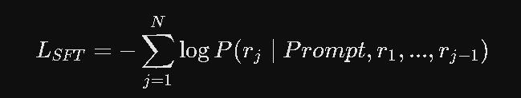

特点： 只有 Response 部分的 Token 会贡献 Loss，Prompt 部分只作为上下文（Context），不参与 Loss 的计算。

**工程实现差异（关键加分点：Loss Mask）**

在 PyTorch 或 Hugging Face 的实际工程中，这个区别是通过 labels 的 Mask 机制（通常是 ignore_index=-100） 来实现的。

Pretrain 阶段： labels 和 input_ids 几乎完全一致（除了向右平移一位）。所有 Token 对应的 label 都是有效的 Token ID。

SFT 阶段： 我们会对数据进行 Data Collator 处理。Prompt 对应的 Token 在 labels 矩阵中会被重置为 -100，而 Response 对应的 Token 保持原样。
在调用 PyTorch 的 CrossEntropyLoss(ignore_index=-100) 时，底层算子会自动跳过对 -100 的梯度计算。

工程细节： 这意味着在 SFT 的前向传播（Forward）中，Prompt 依然会参与 Attention 矩阵的计算并产生 Key 和 Value；但在计算 Loss 和反向传播（Backward）时，Prompt 位置的梯度被阻断了。

优化目标不同对模型行为的本质影响

|维度|pretrain优化目标的影响|SFT优化目标的影响|
|----|----|----|
|概率分布|试图去拟合整个互联网海量文本的真实统计分布（决定了模型的“世界观”和知识底座）。|试图在预训练的广阔空间中，锚定一个特定的条件概率方向——即如何像一个“AI助手”一样去说话。|
|对格式的反馈|迫使模型学会任何文本的续写（包括代码、乱码、错别字、小说）。|强迫模型学会“听懂”起止符(如 `<`)|


### Question-6 在 SFT 阶段，如果我们不给 Prompt 加 Mask，把 Prompt 和 Response 一起算 Loss，会有什么后果？

- **引发灾难性遗忘与分布偏移**： 用户输入的 Prompt（提示词）千奇百怪，口语化严重、甚至有语法错误。如果对 Prompt 算 Loss，模型就会去强行拟合“用户是如何提问的”这种低质量分布，从而破坏预训练阶段学到的通用语言规律。

- **降低模型的指令遵循能力**： 模型的容量是有限的。如果不加 Mask，模型会把大量的梯度预算（Gradient Budget）浪费在记忆 Prompt 上，导致其无法集中能力去学习 Response 中的“逻辑推理”和“格式对齐”，从而导致模型在推理时极易出现“答非所问”或复读机现象。

### Question-7 SFT 核心流程及数据集构建策略

#### 核心流程

1. 数据准备与对齐

- 数据清洗：去重、过滤低质 / 有毒内容、格式统一。MinHash去重、ppl过滤低质量文本、关键词黑名单进行安全合规过滤
- Chat Template拼接：格式化拼接指令和回答，添加角色标识。

2. 模型训练

- Tokenize 与 Labels 构建： 如果是多轮对话（User1 -> Assistant1 -> User2 -> Assistant2），你的 Mask 怎么做？
**必须采用"整轨拼接， 多段mask"的策略。将整个对话拼接成一条数据，但在计算Loss时，所有的 User 文本以及所有的 System 提示词都要被 Mask 掉（设为 -100），只有模型自己输出的 Assistant1 和 Assistant2 部分计算 Loss。绝对不能拆成多条单轮数据去训，那样会破坏上下文的连贯性。**

- 训练超参控制：
学习率（LR）： 通常在 1e-5 到 5e-5 之间。对于全量微调，LR 偏小（如 1e-5）；对于 LoRA / QLoRA，LR 可以适当放大（如 5e-5 到 2e-4）。

Epoch 抉择： 严格控制在 1~3 个 Epoch。大模型极其容易在 SFT 数据上发生过拟合（Overfitting），一旦 Epoch 过多，模型会变成只懂背诵话术的“复读机”，丧失预训练的泛化能力。

算力优化（加分项）： 在实际训练中，为了提高吞吐量，我们会使用 Sample Packing（样本拼接） 技术，将多条短样本通过特殊的 EOS Token 拼接成长样本（如满足 4k 窗口），避免大量的 Padding Token 浪费显存和算力。

3. 模型测评

针对特定场景（如 Agent / 结构化输出 / Function Calling），应引入 IFEval（指令遵循基准）或精确的正则匹配率、可执行代码的通过率（Pass@1）作为硬性指标。

#### 数据构建策略

|策略维度|核心落地手段|解决方案|
|----|----|----|
|质量 (Quality)|3H 原则(Helpful, Honest, Harmless)|LIMA 效应证明“少即是多”。 1k 条高质量的人工精洗数据远胜 10w 条含杂质的机器生成数据。工业界常用 LLM-as-a-Judge（如用 GPT-4）对数据进行自学打分（筛选出 >4.5 分的优质样本）。|
|多样性 (Diversity)|覆盖问答、代码、数理逻辑、角色扮演、工具调用 (Function Calling) 等|多样性不足会导致模型坍塌。 我们可以使用 Embedding 模型（如 text-embedding-3）将数据向量化，通过 K-Means 聚类，观察各簇的密度，针对稀疏区域进行定向数据扩充。|
|配比平衡 (Balance)|3:5:2 的难度分布。短（<1k）、中、长（>4k）混合分布。|防止长度偏见（Length Bias）。 模型在 SFT 时很容易学到“越长的回答得分越高”的恶习。我们必须在数据端严格控制 Response 的长度分布，避免长文数据压倒性多于短文。|

“以 Function Calling（函数调用） 场景为例，SFT 的数据构建策略会更加严苛：

负样本设计（Negative Sampling）： 数据集中必须包含约 20%~30% 的‘闲聊/无法调用工具’的普通指令。如果全是工具调用的正样本，模型会变得极度敏感，无论用户说什么都会强行去拼凑 API 参数。

格式鲁棒性： 在 Response 中，API 的 JSON 参数必须设计有轻微的格式扰动，或者提供错误的参数供模型在多轮对话中纠错，从而训练模型的容错和敏感度。”


### Question-8 为什么 SFT 后还要做 RL？为何偏好对齐不能用偏好数据直接做 SFT？

1. 为什么 SFT 之后必须引入强化学习？
- **提供明确的“负反馈”**：SFT的本质是行为克隆，它只能告诉模型“你应该这么做”。如果训练数据中没有某种错误示范，模型就不知道“不能这么做”。而在 RLHF 中，奖励模型（Reward Model）对于有毒、有害或答非所问的输出会给出极低的负向奖励。这种明确的负反馈对于安全性（Safety）对齐至关重要。
- **缓解暴露偏差**：缓解暴露偏差（Exposure Bias）： SFT 使用的是 Teacher Forcing 机制，模型在训练时看到的“上文”全是完美的人类标注数据；但在实际推理时，它是自回归生成的，只能依赖自己前面生成的 Token 作为上文。一旦模型在生成中途稍微偏离了正确轨迹，它就会陷入“训练时没见过”的分布，导致误差级联放大。而 RL 是一种 On-policy（同策略） 算法，它是在模型自己生成的回答分布上进行打分和优化的，这教会了模型如何在自己可能犯错的轨迹下做出最优选择。
- **防止模式崩溃（惩罚机制**）： 纯粹优化偏好很容易导致模型找到捷径，比如“只要回答越长，奖励越高”（Length bias）。RL（如 PPO 算法）在最大化奖励的同时，通常会引入与初始 SFT 模型的 KL 散度（KL Divergence）惩罚。这就像一根无形的绳子，确保模型在学习偏好的同时，不要偏离 SFT 学到的语言基础和事实能力太远。

2. 偏好数据真的不能直接用于类似 SFT 的训练吗？


- 偏好数据通常是成对比较（如 A 比 B 好），而非绝对最优答案。然而，SFT 需要明确的“正确答案”，无法直接利用相对偏好信息。RL 可以通过奖励模型建模偏好，并优化策略以最大化期望奖励，同时允许模型探索超越示范的答案。
- 此外，RL 能更好地处理多目标优化（如帮助性、安全性）。
- 优化相对偏好：直接最大化"好回答 vs 坏回答"的 margin。
- RL 可以生成训练时未见过的回答并评估，SFT 只能复制见过的。RL 可以用奖励模型泛化到未标注场景，SFT 不行。


### Question-9 场景题: 端侧 Function Calling

端侧（Edge）和云端（Cloud）的 Function Calling 有着天壤之别，核心痛点在于：算力与内存极度受限、延迟要求极高（通常要求首字延迟 <100ms）、容错率为零（手机要是错拔了电话或删了照片，用户会直接崩溃）。


1. 痛点切入：端侧 Function Calling 的三大硬约束
“在手机端侧（通常是 0.5B 到 1.5B 左右的小参数模型）做系统主要功能的 Function Calling，我们不能照搬 OpenAI 那套极其冗长的 JSON Schema 格式。我们需要在极致的 Token 预算下，解决**小模型能力弱、易误触发（过敏感）**的问题。”

2. 数据集构建策略（核心加分项：如何为小模型量身定做数据）
需要强调以下三点：

(1) Schema 极致压缩（Token Optimization）：
云端大模型可以用几百个 Token 详细描述一个 API。但在端侧，系统提示词（System Prompt）越长，Prefill（预序列填充）阶段的延迟和显存开销就成倍增加。

- 做法： 弃用标准的 JSON 声明，改用符号化/XML 标签式的精简 Schema。

- 示例： ```text
// 云端繁琐格式：{"name": "call", "description": "make a phone call", "parameters": ...}
// 端侧精简格式：[TOOL: call(name:str, num:int)] 打电话

(2) 严苛的“负样本”设计（抗误触发）：
端侧小模型非常容易“拿着锤子找钉子”，用户稍微提到相关词，它就想去调用 API。

做法： 数据集中必须包含 30%~40% 的负样本（闲聊或超纲指令）。当用户说：“我想看一部关于打假电话的电影”时，模型必须学会拒绝调用 phone.call()，而是输出纯文本或特定的 [NO_TOOL] 标签。

（3） 多轮槽位填充（Slot Filling）与纠错数据：
手机场景绝大多数是多轮的。用户说：“给张三发个微信”，模型需要调用 send_wx(user)，但缺了内容。

做法： 构建多轮 SFT 数据。让模型在参数不全时，学会主动追问：[TEXT]: 请问发送什么内容？；并在用户修改意图时（“算了，不发微信了，改打电话”），模型能准确清除状态。


3. SFT 训练策略（针对端侧小模型的特调）
- 损失函数（Loss Mask）的细节：
在端侧，不仅要 Mask 掉 User 的 Prompt，如果系统的 API 列表（Schema）是静态或半静态的，强烈建议把 System Prompt 里的 API 描述也全部 Mask 选项掉。只对模型输出的 [TOOL: xxx] 和参数部分计算 Loss，让有限的拟合能力全部集中在“意图识别”和“参数提取”上。

- 格式强约束：
小模型极易吐出不合法的 JSON/XML。在 SFT 时，对于输出格式的错误（如少了一个括号），要给予极高的惩罚；或者在训练数据中加入“格式容错”，允许轻微的非标准输出，由端侧微型的 Parser（解析器）去兜底。

- 微调范式选择：
为了保证端侧高频核心功能（如闹钟、电话、短信）的绝对稳定，不建议用大而全的通用 LoRA，而是建议针对系统控制场景单独全量微调（Full Fine-Tuning）一个小模型，或者训练一个专用的高内聚 LoRA 模块，在需要时动态加载（LoRA Swapping）。

4. 端侧工程指标与评测（展现你的全栈落地思维）
回答完训练，主动拔高到“工程落地”指标：

“在端侧，我们评估这个 SFT 模型的指标不仅仅是准确率（Accuracy），还引入了以下工业级硬指标：”

1. False Positive Rate（误触发率）： 用户正常聊天或搜索时，模型误调用系统功能的概率必须控制在万分之一以下。

2. 首字延迟（Time to First Token, TTFT）： Prefill + 首字生成必须在 100ms-150ms 内完成，否则用户肉眼可见卡顿。这也是为什么我们要拼命压缩 SFT 里的数据长度。

3. 参数提取精确率（Argument Extraction Accuracy）： 比如把“定明天早上7点闹钟”里的 7:00 和 tomorrow 准确提取，通过定制化的单元测试（Unit Test）集进行严格 regression（回归测试）。


### Question-10 控制模型生成多样性的参数有哪些？如何控制？
生成多样性是指避免模型总是输出重复或单一的文本。常用参数：

- 温度（Temperature, T）：在 softmax 前对 logits 进行缩放，logits = logits / T。T 越高，概率分布越平滑，低概率词更容易被选到，多样性增加；T 越低（趋近 0），分布越尖锐，趋于贪心。
- Top-k 采样：只保留概率最高的 k 个 token，重新归一化后采样。k 越大，多样性越高；k 小则更集中。
- Top-p（核采样）：选择累积概率超过 p 的最小 token 集合，动态调整候选集大小。p 越大（如 0.9），候选越多，多样性高；p 小则候选少。
- 重复惩罚（Repetition Penalty）：对已经生成的 token 的 logits 进行惩罚（如乘以小于 1 的系数），降低重复概率。
- 频率惩罚/存在惩罚：根据 token 在已生成序列中出现次数或是否出现过，调整其概率，减少重复。
- Beam Search 相关：beam size 越大，可能得到更多样化的候选，但 beam search 本身倾向于高概率序列，多样性有限，常结合随机采样。（不懂 beam search）


实际控制时，通常组合使用：如温度 + top-k + top-p，并调节惩罚系数。温度调节整体随机性，top-k/top-p 控制候选集，惩罚处理重复。

### Question-11 top-k 与 top-p 的区别？除了贪心，还有哪些生成策略？

- top-k：固定选取概率最高的 k 个 token 作为候选，然后重新归一化采样。缺点：k 固定，可能在某些分布下（如平坦分布）截断过多，或尖锐分布时引入低概率词。
- top-p：动态选择累积概率达到 p 的最小 token 集合，适应不同分布。比如，如果 p = 0.7，那么就贪心选择概率最大的 token 加入候选集合，直到集合内 token 的概率累加 ≥ 0.7。当分布尖锐时，候选集小；平坦时，候选集大。更灵活。

除了贪心（每次选概率最大 token），常见生成策略：

- 随机采样：根据概率分布直接采样，但可能产生不连贯文本，常与 top-k/top-p 结合。
- Beam Search：保留多个候选序列（beam），每一步扩展，最终选得分最高的序列。适合确定性任务（翻译、摘要），但多样性差。（不懂这个，但听说 minimax 会手撕 beam search）
- 对比搜索（Contrastive Search）：考虑 token 概率与上下文相似度的平衡，促进生成连贯且新颖的文本。（不懂这个）
- 典型采样（Typical Sampling）：选择信息量适中的 token，避免过高或过低概率，模仿人类写作。
- 惩罚机制：如重复惩罚、n-gram 惩罚，防止重复。
- 温度调节：缩放 logits 后采样。
实际中，常用 top-k + top-p + 温度 + 重复惩罚 的随机采样。


### Question-12 Tokenizer 是怎么做的？有哪些实现方式？
Tokenizer 是将原始文本（字符串）转换为模型可以处理的整数序列（token IDs）的组件。

主要步骤包括：文本规范化（如大小写转换、Unicode 归一化）、预分词（如按空格、标点切分）、基于词表的子词切分或字符切分，最后映射到 ID。

常见实现方式：

- 基于词（Word-based）：直接按空格和标点分词，每个词一个 token。词表极大，存在 OOV（未登录词）问题。
- 基于字符（Character-based）：每个字符作为一个 token。序列过长，缺乏语义信息。
- 基于子词（Subword-based）：平衡词和字符，常见算法有：
    - BPE（Byte Pair Encoding）：从字符开始，逐步合并出现频率最高的相邻字节对，形成子词词表。GPT、BERT 等使用。
    - WordPiece：类似 BPE，但合并依据是最大化训练数据似然，而非频率。BERT 使用。
    - Unigram Language Model：从一个较大的词表开始，逐步剪枝保留概率最高的子词，最终得到词表。SentencePiece 支持。
    - SentencePiece：将文本视为 Unicode 字符序列，可直接处理多语言，无需预先分词，支持 BPE 和 Unigram。
现代大模型多采用子词分词（如 BPE 或 SentencePiece），以平衡词表大小和覆盖度。


### Question-13 Embedding 是怎么做的？从 ID 到 Embedding 有哪些实现方式？
Embedding 是将离散的 token ID 映射为连续的稠密向量，使模型能够处理语义信息。

从 ID 到 Embedding 的实现方式的类别：

- 标准 Embedding 层：一个可训练的查找表（Lookup Table），维度为 [vocab_size, hidden_size]。输入 ID 通过索引直接取出对应向量，梯度通过反向传播更新该表。
- 随机初始化：Embedding 矩阵随机初始化，随训练优化。
- 预训练 Embedding：使用预训练的词向量（如 Word2Vec、GloVe）初始化 Embedding 层，然后微调或固定。
- 位置编码叠加：在 token embedding 基础上加上位置编码（如正弦位置编码、可学习位置编码），以注入序列位置信息。
其他变体：
  - yte-level Embedding（如 BPE 后直接映射）。
  - 共享输入输出 Embedding：输入和输出层共用同一个 Embedding 矩阵，减少参数量（如 Transformer 中的 tied embeddings）。
  - 分段 Embedding（如 BERT 的 segment embedding）用于区分不同句子。

实际中，LLM 通常使用可学习的 token embedding + 位置 embedding（或相对位置编码），并可能结合层归一化。


### Question-14 大模型幻觉是什么？怎么缓解大模型幻觉？
大模型幻觉：指模型生成的内容与事实不符、无中生有或逻辑矛盾的现象。分为内在幻觉（输出与输入冲突）和外在幻觉（输出与真实世界事实不符）。

治理幻觉不是单一阶段的事，从模型出生（训练）到它上岗（推理），每一个阶段都有对应的策略：

[数据/训练期] ➔ [提示词约束] ➔ [外部知识注入 (RAG)] ➔ [解码策略优化] ➔ [后处理核查]
  (RLHF/反事实)      (Prompt)          (检索增强)          (对比解码)       (工具核查/修正)


1. 训练期：纠正“性格” (Alignment & Data)
- RLHF / RLAIF：模型最初只追求“把话编完”。通过人类反馈强化学习，我们明确告诉模型：“知之为知之，不知为不知，瞎编就要受罚”。这改变了模型的输出偏好。

- 引入反事实/拒绝样本：在微调数据中主动加入“请问2026年iPhone 20的发布会说了什么？”这类陷阱问题，并让正确答案拒绝回答，训练模型学会说“我不知道”。

2. 推理期：提供“开卷考试”的机会 (RAG & Prompt)
这是目前工业界最落地、成本效益最高的一环。

- RAG (检索增强生成)：不让模型光凭记忆闭卷考试。先去知识库捞出标准答案（上下文），塞给大模型，让它“照本宣科”。

- Prompt 工程：给模型戴上“紧箍咒”。例如：“请严格基于以下参考内容回答，如果参考内容中没有提到，请直接回答‘抱歉，文档中未提及’，绝对不要发散或想象。”

3. 生成期：管住“嘴巴” (Decoding Strategy)
对比解码 (Contrastive Decoding)：用一个大模型和一个小模型同时生成，大模型懂得多但容易幻觉，小模型懂得少也容易幻觉，通过对比两者的概率分布，放大大模型独特的高级语义，抑制因概率凑巧而产生的幻觉词。

降低 Temperature (采样温度)：直接把 Temperature 设为 0（贪婪解码）。让模型每次都选概率最高的那个词，虽然丧失了创造力，但大大增加了确定性。

4. 后处理：配一个“校对秘书” (Post-processing)
事实核查流：模型生成完一句话后，后台自动提取关键实体（如时间、人物、事件），调用 Google Search API 或内部知识图谱进行比对。如果发现不符，直接在后台修正后再吐给用户。

学术界目前普遍认为：幻觉是生成式 AI 的固有特性，只能“缓解”，无法“根除”。 在实际的企业级应用中（比如金融、医疗等容错率为 0 的场景），通常采用的黄金组合拳是：

**基座模型 (已做过RLHF) + 行业知识库 (RAG) + 严格的提示词约束 (Prompt) + 最终合规性审查脚本 (Post-processing)。**


### Question-15 LoRA 的核心原理

LoRA（Low-Rank Adaptation，低秩微调）的核心原理可以用一句话概括：大模型虽然参数量巨大，但在特定下游任务上微调时，其权重矩阵的更新实际上发生在一个极低的“内在维度”（Intrinsic Dimension）上。

基于这个假设，LoRA 放弃了直接更新庞大的原始权重，而是通过在原本的网络结构旁边增加一个低秩的“旁路”（Bypass）来模拟权重的变化。

以下是它的核心机制和数学表达：

1. 核心数学机制：矩阵分解

假设预训练模型中的某一个权重矩阵为 $W_0 \in \mathbb{R}^{d \times k} $。在全量微调（Full Fine-Tuning）中，我们需要计算并更新一个同样巨大的增量矩阵 $\Delta W \in \mathbb{R}^{d \times k} $，使得微调后的权重变为 $W_0 + \Delta W $。

LoRA 的做法是：冻结原始权重 $W_0$，用两个极小的矩阵 $A$ 和 $B$ 的乘积来近似表示更新量 $\Delta W$：
$$\Delta W = B A $$

- 降维矩阵 $A \in \mathbb{R}^{r \times k} $：负责将输入维度 $k $ 降维到极小的秩 $r $（通常 $r$ 设置为 8、16、64 等，远小于 $d $ 和 $k $）。
- 升维矩阵 $B \in \mathbb{R}^{d \times r} $：负责将 $r $ 维度再升维回输出维度 $d$

在向前传播（Forward Pass）时，输入向量 $x $ 会同时经过原始权重和这两个小矩阵，最后将结果相加：

$$h = W_0x + \Delta Wx = W_0x + BAx $$

2. 巧妙的初始化策略为了保证在训练刚开始时，模型的能力和预训练模型完全一致（不造成破坏），LoRA 采用了特定的初始化方式：
- 矩阵 $A$ 使用随机高斯分布初始化。
- 矩阵 $B$ 初始化为全零矩阵。

这就保证了在训练初始阶段 $BA = 0 $，即 $\Delta W = 0 $。模型一开始的表现与未经微调的基础模型完全一样，随着训练进行，矩阵 $A $ 和 $B $ 的梯度才会逐渐更新。

3. 为什么 LoRA 如此成功？

LoRA 之所以成为现在 LLM（包括你之前提到的 SFT 和 DPO 阶段）最核心的微调基础设施，是因为它带来了几个颠覆性的优势：

- **极端的参数和显存节省**： 假设 $W_0$ 的维度是 10,000 × 10,000（1亿参数），全量微调需要更新1亿个参数，并保存巨大的优化器状态（如 Adam 的动量和方差）。如果使用 LoRA 并设置 $r=8$，那么 $A$ 和 $B$ 加起来只有 $(10000 \times 8) + (8 \times 10000) = 160,000 $ 个参数。可训练参数量直接下降了近 1000 倍，极大降低了显存（VRAM）门槛。
- **推理“零”延迟（重参数化）**： 在训练结束后，由于矩阵加法的分配律，我们可以直接将训练好的 $BA$ 乘积加回到原始权重中：$W_{new} = W_0 + BA $。在实际部署推理时，网络结构和全量微调完全一样，没有任何额外的计算开销和延迟。
-** 模块化与热插拔**： 原始模型 $W_0 $ 可以作为“底座”被多个任务共享。针对不同任务（如代码生成、角色扮演、某个垂直行业），我们只需要保存极小的 LoRA 权重文件（通常只有几十 MB）。在切换任务时，只需卸载当前任务的 $BA$，加载新任务的 $B'A'$ 即可。

### Question-16 Lora_rank和lora_alpha对模型表现影响，以及如何选择

lora_rank（通常用 $r$ 表示）和 lora_alpha（通常用 $\alpha $ 表示）是 LoRA 微调中最核心、最影响模型最终表现的两个超参数。它们决定了微调的“容量”和“强度”。理解它们的作用以及如何搭配，是训练出高质量 LoRA 模型的关键。

1. lora_rank ($r$)：微调的“容量”与“复杂度”在上一条回复中我们提到，LoRA 用两个小矩阵 $A$ 和 $B$ 来替代庞大的更新矩阵，而 $r$ 就是这两个小矩阵的**中间维度（秩）**。
   
- 对模型表现的影响：
  - 表达能力（Capacity）： $r $ 越大，矩阵 $A $ 和 $B $ 包含的参数就越多，模型能够学习到的任务细节、复杂特征和新知识就越多。
  - 显存与时间成本： $r$ 与训练参数量成正比。$r$ 从 8 增加到 64，意味着可训练参数量增加了 8 倍，消耗的显存和计算时间也会相应增加。
  - 过拟合风险（Overfitting）： 当 $r$ 设定过高，而你的微调数据量又不够大时，模型极其容易死记硬背训练集（过拟合），导致在未见过的数据上表现极差，甚至丧失预训练模型原本的泛化能力。

- 如何选择 $r$：根据任务难度决定

  - $r = 4$ 或 $8$： 适合简单任务或指令格式对齐。例如：让模型学会用特定的 JSON 格式输出、调整说话的语气（如变成客服口吻）、或者做简单的文本分类。
  - $r = 16$ 或 $32$： 适合中等难度任务。例如：特定垂直领域的知识微调（如医学问答、法律条款解析）、角色扮演（Role-play）、或者代码补全。这是最常用的起始基准值。
  - $r = 64$ 及以上（甚至 $128, 256$）： 适合极其复杂的任务。例如：让模型学习一种它以前完全没见过的小语种、注入海量全新的领域知识、或者进行复杂的数学推理微调。

2. lora_alpha ($\alpha$)：微调的“强度”与“权重”

lora_alpha 是一个缩放因子（Scaling Factor）。要理解它，必须看 LoRA 在前向传播时合并权重的真实数学公式。

LoRA 并不是直接把 $BA$ 加到原权重 $W_0$ 上，而是会乘上一个比例系数 $\frac{\alpha}{r} $：$$W_{new} = W_0 + \frac{\alpha}{r} (BA) $$

- 对模型表现的影响：
  - $\alpha$ 决定了 LoRA 模块（也就是你新学到的知识）在整个模型中说话的分量有多重。
  - 如果 $\alpha$ 过大： LoRA 的权重会过度覆盖原始权重。这会导致模型患上“灾难性遗忘”（忘了预训练学到的常识），输出可能变成毫无逻辑的乱码，或者损失函数（Loss）直接爆炸（NaN）。
  - 如果 $\alpha$ 过小： 无论你的 LoRA 怎么训练，它对最终输出的影响都微乎其微。模型依然我行我素，看起来就像没微调过一样，Loss 下降极其缓慢。

3. 黄金法则：如何搭配选择 $r $ 和 $\alpha $？
因为公式中包含 $\frac{\alpha}{r} $ 这一项，这意味着 $\alpha $ 和 $r $ 必须绑定在一起调参。开源社区和学术界经过大量实验，总结出了一个非常稳定的经验法则：

**首选策略：设定 $\alpha = 2 \times r $ 或者 $\alpha = r $**

- 为什么这么设定？如果保持 $\frac{\alpha}{r}$ 比例恒定（例如 $\frac{\alpha}{r} = 2 $ 或 $1 $），这意味着无论你把 $r$ 调大还是调小，LoRA 矩阵初始化时的整体方差和输出量级都能保持稳定。这样，当你因为任务需要改变 $r$ 时，你不需要重新去大海捞针般地寻找合适的学习率（Learning Rate），原有的学习率通常依然有效。

4. 实战调参建议（Workflow）如果你面对一个全新的数据集，建议按照以下步骤进行：
- 从标准基准线起步： 设定 $r = 16$，$\alpha = 32$，Target Modules（目标模块）选择所有的线性层（如 q_proj, v_proj, k_proj, o_proj, gate_proj, up_proj, down_proj）。跑一个小的 epoch 观察 Loss 曲线。
- 观察现象并调整：
  - 如果模型很快过拟合（训练集 Loss 极低，验证集 Loss 反弹）： 说明容量太大或学习过猛。可以尝试减小 $r$（如降到 8），保持 $\alpha = 2r$（16）；或者增加 Dropout（lora_dropout=0.05）。
  - 如果模型学不进你的新知识（一直用预训练的口吻回答）： 说明微调强度不够。可以尝试将比例提高到 $\alpha = 4 \times r$（如 $r=16, \alpha=64$），以增强 LoRA 模块的话语权，或者适当提高学习率。

### Question-17 LoRA 微调推理时是否要挂着 Adaptor？合并 Adapter 权重时有没有遇到梯度爆炸？
LoRA 推理时的两种模式：
|模式|做法|使用场景|
|---|---|---|
|动态挂载|保持 $W_o $和 $BA$ 分离，推理时计算$h = W_0 x + B Ax$|多任务切换、需要灵活加载不同 LoRA|
|权重合并|预计算$W = W_o + B A $， 替换原权重|单任务部署，追求最低延迟|

工业实践：生产环境几乎都用合并模式，合并后模型结构与原模型完全相同，推理无额外开销。

合并权重时的梯度爆炸：合并操作本身是线性求和，不会引发梯度爆炸（因为不涉及梯度计算）。但在训练过程中，若学习率过大或初始化不当，可能导致 A 和 B 的数值过大，从而在合并后使模型输出异常。

但梯度爆炸通常发生在训练的反向传播中，合并阶段仅涉及推理，因此不会出现梯度爆炸。训练中可通过适当初始化（如 B 初始为零）和梯度裁剪来避免。

### Question-18 训练 LoRA 模型时，如何选择冻结层？依据是什么？

通常对所有预训练权重进行冻结，只对插入的 LoRA 参数（即 A 和 B ）进行训练。

但有时可根据需求选择性地解冻某些层：

- 全部冻结：默认做法，只训练 LoRA 参数 A B。
- 部分解冻：若任务与预训练领域差异大，可解冻输出层或特定模块（如 LayerNorm 的缩放参数），以增强适应性。
- 分层学习率：对不同层设置不同学习率，如高层（靠近输出）学习率较大，底层较小。

选择性解冻的考量

依据 1：任务相似度

- 领域适配（如医学→通用）：冻结底层，解冻顶层 + LoRA
- 格式学习（如对话模板）：可能需要解冻 Embedding 和 LM Head，但貌似这种情况少见

依据 2：参数效率分析

- Attention 层：包含语义和句法知识，优先加 LoRA
- FFN 层：存储事实知识，领域迁移时需适配
- LayerNorm：控制信息流，通常解冻 bias 有助于稳定
依据 3：层的重要性

- 底层（靠近输入）：通用特征，少动
- 中层：任务相关特征，重点适配
- 顶层（靠近输出）：任务特定，重点适配

|任务类型、模型状态|推荐挂载 LoRA 的模块 (Target Modules)|未挂载(实质冻结)的模块 |
|---|---|---|
|基础格式对齐、语气调整|"q_proj, v_proj"|所有 FFN，部分 Attention|
|中等难度、一般微调任务|"Attention 全量 (q,k,v,o_proj)"|所有 FFN 层|
|复杂逻辑推理、深层知识注入|Attention + FFN (all-linear)|仅底层 Transformer Block|
|极端小模型执行高精度任务|全量线性层 (all-linear) 覆盖绝大部分层|极少，仅为防过拟合微调 r |


# 四、推理和系统工程优化

## 4.1 KV cache优化原理与实践


## 4.2 prefill与decode阶段优化策略

## 4.3 Flashattention与内存优化

## 4.4 vllm与pageattention架构
[vllm与pageattention架构](./4.4-vllm与pageattention架构/)

## 4.5 量化：AWQ\GPTQ\SmoothQuant\Spinquant

[量化笔记](./4.5-AWQ_GPTQ_SmoothQuant.md)

## 4.6 长上下文处理技术


## 4.7 混合精度训练

[混合精度训练笔记](./4.7-混合精度训练.md)


## 4.8 DeepSpeed Zero显存优化

[4.8 DeepSpeed Zero显存优化](https://blog.csdn.net/yang2330648064/article/details/157256141)


## 问题汇总

### Question-1 Roofline Model


屋脊模型（Roofline Model）就是一种用于分析计算性能瓶颈的工具，它可以告诉你一个计算是受限于硬件内存带宽（memory-bound）还是硬件计算能力（compute-bound）。下面结合具体的例子来看看屋脊模型。

下图就是屋脊模型，是一个分段函数，横轴是计算强度（单位FLOPS/byte），表示搬运1字节的数据，可以完成多少FLOPs计算，简写为$I, Intensity = 总计算率 \div 数据传输量$,纵轴是性能（单位GFLOPS）。整个图类似于一个屋顶，所以名为屋脊模型。
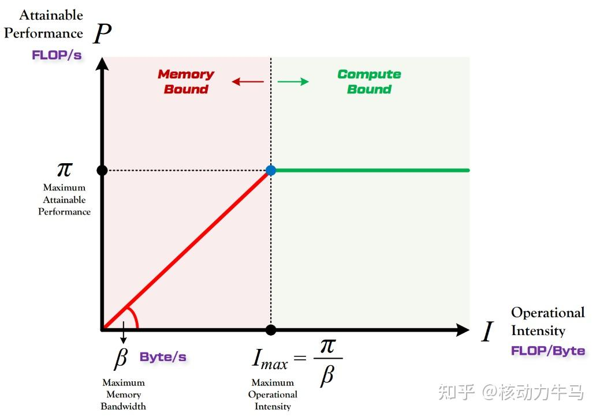


函数曲线左段斜率为B（Bandwidth），B为硬件理论最大内存带宽。右段斜率为0的水平线，对应的y轴值表示硬件理论峰值计算性能，记为$P_{peak}$。某个计算的实际性能记为P，即$P ≤ min(p_{peak}, B × I) $。

**如果落在左段，计算受限于带宽，落在右段，则受限于硬件计算能力**


以具体的例子——矩阵乘法，来看怎么使用屋脊模型。设A矩阵shape为M×K，B矩阵shape为K×N，使用 FP32 精度，M，K，N均为1024，两个矩阵相乘得到C矩阵，shape为M×N。硬件为NVIDIA GeForce RTX 3080 GPU，该卡带宽B约为760GB/s，单精度峰值计算次数约为30TFLOPs。

第一步计算矩阵乘法总计算量，主要涉及乘法和加法，乘法次数为$M*N*K$，加法次数为$M*N*(K-1) $，所以总的FlOPs为$2*M*N*K $，带入1024，计算量约为2.15GFLOPs。
第二步计算数据传输量，假设总共是3次搬运，读入A，读入B，写回C。总传输量为$3*M*N*4 $，乘4是因为FP32为4字节。带入1024后约为12.58MB。由此可得计算强度：

$$I = 2.15*10^9 FLOPs \div 12.58*10^20 Byte ≈ 170.91 FLOPs/Byte $$

硬件的峰值带宽B乘计算强度I,可得

$$B * I = 760 GB/s *  170.91 FLOPs/Byte ≈ 129.89 TFLOPs $$

129.89TFLOPs远高于硬件实际的浮点计算次数30TFLOPs，P取两者最小值$min(p_{peak}, B × I) $。可知，在该例中，矩阵乘法实际受限于硬件的计算能力，想要加速矩阵乘法，应该考虑增加计算资源。


# 五、多模态与主流模型架构


