# 1.引言

在梳理Qwen-VL系列前，先以更通用的视角简单了解下基于LLM的多模态模型的设计框架，方便我们先了解下业界通用的做法，也了解一些基本的概念。


在MM-LLMs综述一文中，总结了多模态大语言模型的通用模型框架和每个模块的一些实现方法，如图1 所示：
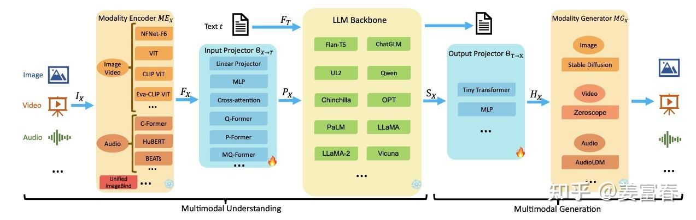

从上图中可以看到，在通用的MM-LLM（Multi-Modality LLM）框架里，共有五个模块，整体以LLM为核心主干，分别在前后有一个输入、输出的投影模块（Projector），投影模块主要是用于桥接不同模态输入和输出。输入投影模块（Input Projector）用于将模态编码器处理的不同模态特征映射到文本特征空间，以便输入给LLM；输出投影模块（Output Projector）用于将文本特征空间结果映射到模态生成器的输入空间，以引导模态生成器生成多模态结果。五个模块按数据流顺序，具体描述如下：

- **模态编码器（Modality Encoder）**：将多模态的数据编码成向量空间特征，该模块通常是单独进行预训练的，典型的方法有基于CNN的ResNET，基于Transformer的ViT等。
- **输入投影层（Input Projector）**：将模态编码器的输出映射到LLM的输入特征空间的适配层，一般模型结构比较简单，不同的多模态模型一般是随机初始化该模块的参数做冷启训练。典型的网络层：MLP，Cross-Attention等
- **LLM主干网络（LLM Backbone**）：LLM是经过预训练的模型，一般还要串联多个模块继续做Post-Pretrain和微调，使得模型能识别多模态的特殊token和多模态的特征输入。
- **输出投影层（Output Projector）**：将LLM生成的数据，映射成Modality - Generator 可理解的特征空间，一般是简单的Transformer层或MLP层。
- **模态生成器（Modality Generator）**：多模态的生成器，最终输出多模态的结果如图像、语音、视频等。模型基本都是基于LDM（Latent Diffusion Models）的衍生模型，如图片领域的Stable Diffusion方法。

以上介绍完通用的MM-LLM的框架。本文梳理的Qwen-VL模型是一系列视觉+文本多模态理解模型，即LVLM(Large-scale Vision-Language Model)，主要处理文本和视觉特征，输入Text、Image、Video，输出Text。

## 二、QWEN-VL

Qwen-VL 是以Qwen-7B Base为主干模型，通过引入视觉感知器（Visual receptor）来增强视觉特征的感知能力。视觉感知器包括一个跟语言模型对齐视觉编码器（visual encoder）和一个位置感知的适配器（position- aware adapter）。套用上面的通用多模态框架，Qwen-VL包括了典型的前3个模块：

- **模态编码器（Modality Encoder）** ： 视觉编码器（visual encoder），只用来编码图片视觉特征
- **输入投影层（Input Projector）**：位置感知的适配器（position-aware adapter）
- **LLM主干网络（LLM Backbone）**： Qwen-7B Base 模型

### 2.1. 视觉编码器（Visual Encoder）
Qwen-VL的视觉编码器使用的是ViT架构（Vision Transformer），ViT的网络设置和初始化参数使用了OpenCLIP预训练好的ViT-bigG模型。

>OpenCLIP是laion.ai组织的一个开源项目，是对OpenAI's的CLIP（Contrastive Language-image Pre-training）的开源实现。laion.ai发布了一系列基于CLIP框架训练的不同size模型，同时他也为CV领域贡献了大量的开源数据，ViT-bigG是经过了2B的训练数据训出来的ViT模型。

Qwen-VL使用的ViT(ViT-bigG)是基于CLIP框架训练的，CLIP是通过**Contrastive Learning**的方式来学习Vision和文本的表征。

如下图（左图）所示，对于一个Batch的数据，以样本集中原始图文pair $<I_i, T_i>$为正例pair，Batch内与其他样本的$I_x, T_x$组成为负例pair：$<I_i, T_x>, <I_x, T_i>$其中$i ≠ x$ 。模型训练采用了对比损失函数，通过最大化正例Pair的相似度，同时最小化负例Pair的相似度来训练模型。通过这种方式，能学习到视觉特征和文本特征的对齐关系。最后将训练好的Image Encoder模型(即ViT)参数保存下来，以供其他下游任务热启使用。

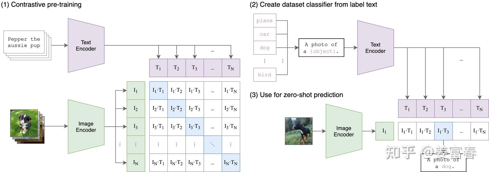


在Qwen-VL中采用的是标准的ViT框架，ViT的原理比较简单：将图片分割成多个图像块（Patch），然后针对每个Patch通过线性映射转化成token，再将所有token拼接成序列，最终将一张图片从$(H, W, C)$格式转换成$(S, H)$，格式的序列特征。

在标准的ViT实现上，输入图片会先被调整成长宽比1：1的正方形，然后再分割成固定的图像块。

因此这种标准的ViT框架的设计，只能接收固定分辨率的图片，同时Patch的大小也是模型在训练期间使用的一个固定size。ViT处理过程如图3所示：

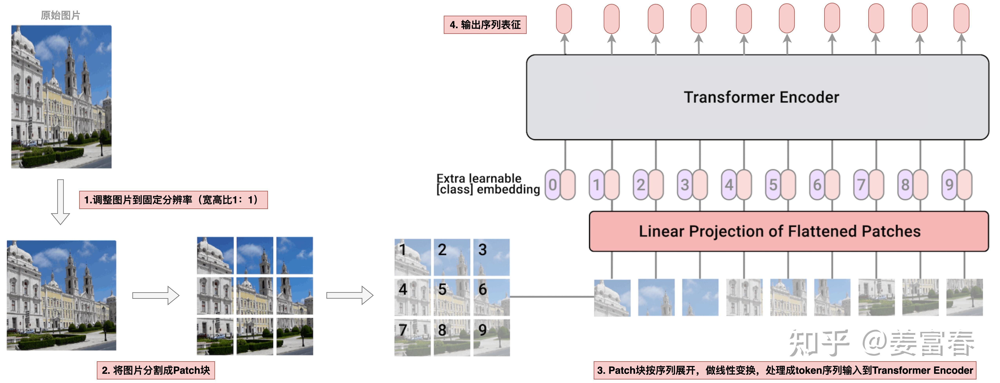

ViT核心处理就几行代码，如下：

```python
class VisionTransformer(nn.Module):
   def __init__(...):
       self.conv1 = nn.Conv2d(in_channels=3, out_channels=width, kernel_size=patch_size, stride=patch_size, bias=False)

   def forward(self, x: torch.Tensor):
        # 注释1：通过卷积核将一张图片从[H，W，C]=[448, 448, 3] 映射成 [width, grid, grid] = [1664, 32, 32]
        x = self.conv1(x)  # shape = [*, width, grid, grid]
        # 注释2：一张图片按行展开，[width, grid, grid] 映射成 [grid * grid, width]二维序列
        x = x.reshape(x.shape[0], x.shape[1], -1)  # shape = [*, width, grid ** 2]
        x = x.permute(0, 2, 1)  # shape = [*, grid ** 2, width]
        # 注释3：增加位置编码输入transformer模型
        x = x + get_abs_pos(self.positional_embedding, x.size(1))
        x = self.transformer(x)
```

代码注释1的处理过程：一张图片做卷积操作，处理成 [width, grid, grid] = [1664, 32, 32]的数据，如图4所示。
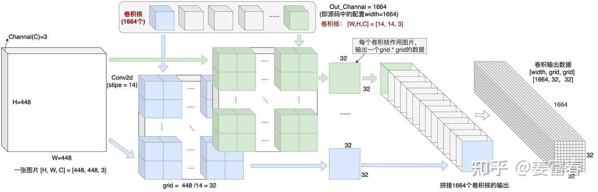

代码注释2的处理过程：按行优先展开，处理成一个二维格式的数据[sequence_len, hidden_size] = [1024, 1664]（类似与一条文本处理后的序列）。如图下5所示。
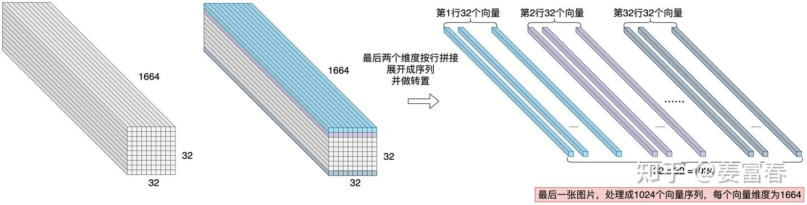

### 2.2. 输入投影层：感知位置的视觉-语言适配器（Position-aware Vision-Language Adapter ）

经过上述ViT处理后，对于448✖️448的image，生成一个[1024, 1664]的序列，也就是向量维度为1664的长度为1024的序列。

为了压缩视觉token的输入长度，Qwen-VL引入了一个Adapter来压缩图像特征。这个Adaper就是一个随机初始化的单层**Cross-Attention模块**。该模块使用一组可学习的query向量，将来自ViT的图像特征作为Key向量。通过Cross-Attention操作后将视觉特征序列压缩到固定的256长度。

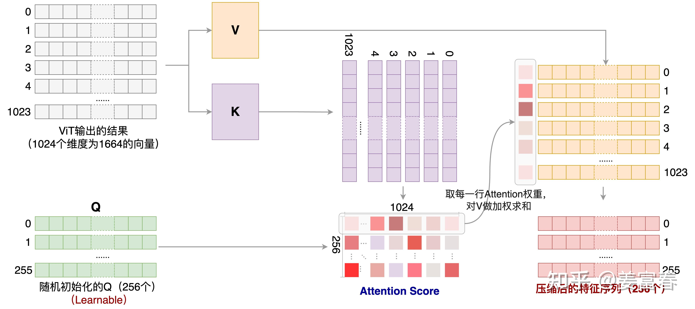

上图描述了基于可学习Query和ViT输出的序列作为k,v的Attention计算过程，经过Cross-Attention后，将ViT阶段的1024长度的序列，压缩到了长度为256的序列。

此外，考虑到位置信息对于精细图像理解的重要性，Qwen-VL将二维绝对位置编码（三角位置编码）整合到Cross-Attention的q,k中，以减少压缩过程中可能丢失的位置细节。随后将长度为256的压缩图像特征序列输入到大型语言模型中。


### 2.3. 输入和输出
对于输入LLM前的特征序列，为了区分图片和文本的输入信息，对图片的feature使用了特殊的token包裹，图像特征的开始和结束用和</img>token圈定，来明确标识图像特征的起止位置。同时为了做grounding任务，对图像中bounding box 统一用一个"左上-右下"坐标框格式表示：$(X_{topleft}, Y_{topleft}), (X_{bottomright}, Y_{bottomright})$, 坐标值统一做归一化处理，规范化到(0, 1000)区间。并用</box>、<box>特殊token圈定。对于描述bounding box的文本，也用</ref>、<ref> 两个特殊的token圈定起来。下面图7是一条典型的grounding 任务的样本实例

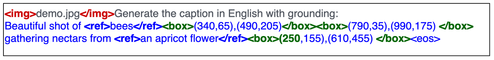

样本中的demo.jpg：
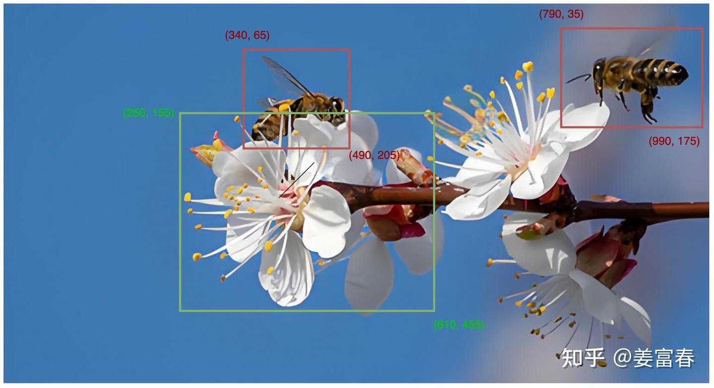

2.4. 训练过程
Qwen-VL共分成3个训练阶段，包括两个预训练阶段和一个SFT阶段。

**第一阶段：单任务大规模预训练（Pre-training ）**，主要使用大量网上抓取和内部的图文pair数据做预训练，训练数据有1.4B，英文数据占比77.3%，中文占比22.7%，训练数据的图片统一处理成224X224的尺寸。该阶段LLM模型参数是frozen的，ViT和Cross-Attention层的参数是激活更新的，这个阶段主要通过**大规模数据训练模型的vision模态对齐语言模型的能力。**

**第二阶段：多任务预训练（Multi-task Pre-training）**，这个阶段使用了更高分辨率、更高质量的数据，同时引入图文混排的数据。该阶段是个多任务的预训练阶段，包括7个任务，其中有6个Vision任务（包括Captioning ，VQA，grounding等）和1个文本生成任务，这个阶段模型是全参数激活的。该阶段之所以引入文本生成任务，主要是为了保证模型的通用文本处理能力。该阶段的训练数据，Vision数据的分辨率从224X224 提升到448X448 ，数据做了精选处理，包括多模态数据69M和 文本数据7.8M。第二阶段的数据量比第一阶段少了2个量级。该阶段训练完成后，最终产出了Qwen-VL base模型。

**第三阶段： 指令微调（Supervised Fine-tuning）**，主要提升模型的指令遵循能力和对话能力。在这个阶段作者对数据做了些数据增强，通过人工标注、模型生成和策略拼接等方式构造多模态的多轮会话数据。该阶段指令集数据共收集了350K。


三个阶段详细的训练过程，包括：样本、模型和建模任务等细节，汇总到下图，如图9所示。

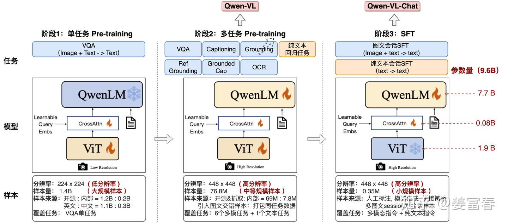


## 三、QWEN2-VL

### 样本示例

Qwen2-VL是可以同时输入多种Vision数据给模型（包括：图像和视频），视频相当于多图像的帧序列。
在数据处理上尽量打平了两种数据的处理流程，然后统一格式输入给模型。统一格式的方法：把图像处理成一个三维(T, H, W)的帧序列，在时间轴（T）维度对单张图片做一次复制，做成一个时间长度为2的帧序列，实现数据形式的统一。

Qwen2-VL在指令微调阶段，样本统一采用ChatML JSON格式，ChatML(Chat Markup Language)是OpenAI提出的一种用于在对话中定义消息格式的标记语言。目前也是LLM描述对话样本的一种主流的数据组织协议。

以一个真实的例子来看下ChatML JSON数据格式，如下图1是与Qwen2.5-VL-72B对话两轮的真实数据，其中第一轮输入中包括2张图片和一段文本Question。

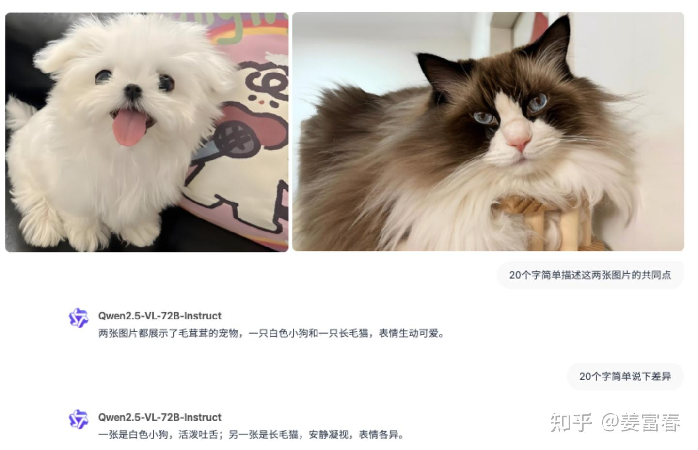

样本示例1：
```python
[
    {   "role": "user",
        "content": [
            {"type": "image", "image": "./dog.png"},
            {"type": "image", "image": "./cat.png"},
            {"type": "text", "text": "20个字简单描述这两张图片的共同点"}
        ]},
    {   "role": "assistant",
        "content": [
            {"type": "text", "text": "两张图片都展示了毛茸茸的宠物，一只白色小狗和一只长毛猫，表情生动可爱。"}
        ]},
    {   "role": "user",
        "content": [
            {"type": "text", "text": "20个字简单说下差异"}
        ]},
    {   "role": "assistant",
        "content": [
            {"type": "text", "text": "一张是白色小狗，活泼吐舌；另一张是长毛猫，安静凝视，表情各异。"}
        ]}
]
```

ChatML JSON格式以数组格式组织多轮会话，每个会话片段包括「role」和 「content」两个key。

- role：用来区分会话中不同的角色，包括：user(用户)，assistant(AI助手，即模型输出)，system(系统，即预设Prompt) 。

- content：用来记录角色的会话内容，内容可根据需要自定义数据组织形式，比如上述通过「type」标记数据模态类型，单会话中多条内容通过数组方式顺序记录。


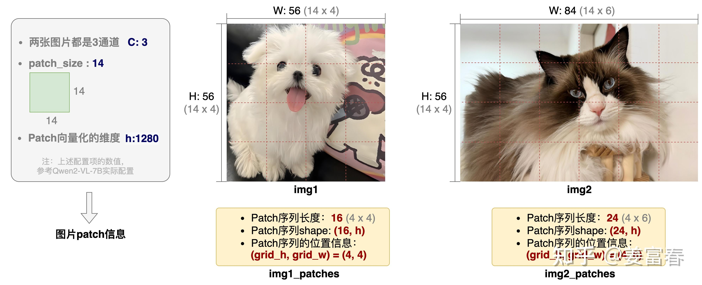

### 输入模型前image process

多模态样本中有文本(text)数据和vision(图像、视频)数据，在输入模型前会分别做不同的预处理过程，通常文本数据会过Tokenizer做token化处理。Vision数据通过Process做Patchification处理。下面我们来通过源码看看数据处理的细节。

数据处理涉及到的源码，包括以下几个代码块：

1. [vision_process.py](https://github.com/QwenLM/Qwen3-VL/blob/main/qwen-vl-utils/src/qwen_vl_utils/vision_process.py)：Qwen官方提供的数据处理工具，从ChatLM JSON中读取Vision数据并加载成Python内部对象
2. processing_qwen2_vl.py：Hugging Face的Qwen2-VL源码，多模态数据预处理代码
3. image_processing_qwen2_vl.py：Hugging Face的Qwen2-VL源码， Vision数据Patch处理代码
4. tokenization_utils_base.py：Hugging Face tokenizer实现的apply_chat_template方法，转换JSON数据到ChatLM格式，接收chat_template参数
5. chat_template.json：基于Hugging Face的ChatTemplate机制，转换JSON数据到ChatLM格式的脚本。这是传给apply_chat_template方法的实参。


先整体概览代码间的调用流程，针对上述ChatML JSON格式的样本，总结源码的预处理过程如下图3所示：

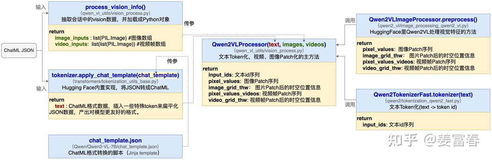

再以上述真实样本示例1为例，看下各个处理过程的数据视图，如下图4所示（该图自底向上阅读）：

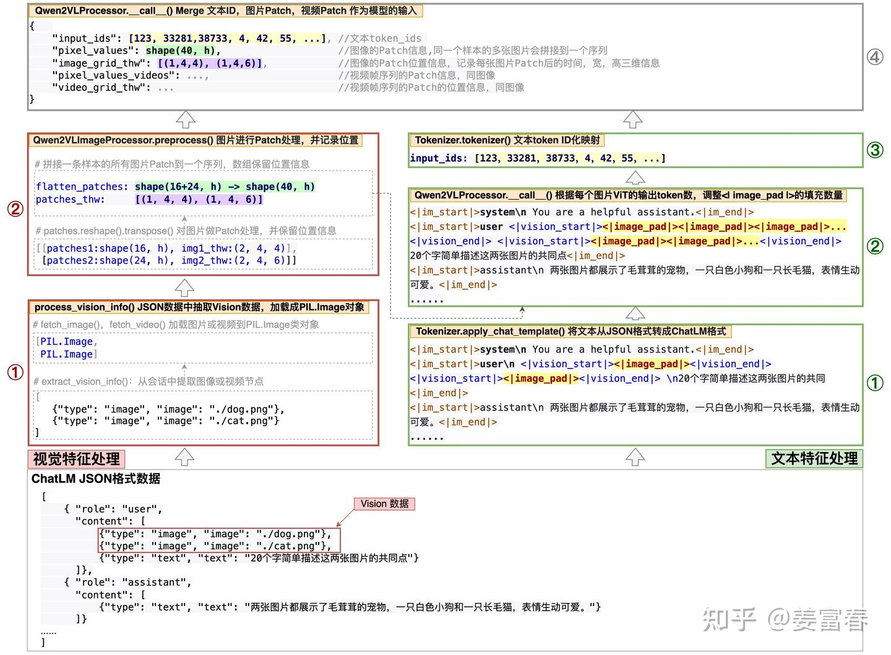

下面分别从**整体的代码调度和数据处理**两个视角概括源码中数据处理的过程。从上图中，可以看到将一条样本拆分成两个特征处理流程：视觉特征处理，文本特征处理，最后将处理好的特征merge到一个结构体里输入给模型。下面我们分别看两部分特征处理的细节。


#### 视觉特征处理
图像和视频数据处理的流程封装在：Qwen2VLImageProcessor.preprocess()方法。该方法封装了一条样本中多个Vision数据的处理过程，我们先来看看对一张图像的处理过程。

单张图片的处理过程主要封装在Qwen2VLImageProcessor._preprocess()方法， 核心处理代码块如下。

首先对图片做些格式化等预处理操作：

```python
#https://github.com/huggingface/transformers/blob/main/src/transformers/models/qwen2_vl/image_processing_qwen2_vl.py#L226
def _preprocess():
    ### 格式转换等一些预处理操作
    images = make_list_of_images(images)
    images = [convert_to_rgb(image) for image in images]
    images = [to_numpy_array(image) for image in images]
    processed_images = []
    ### 每张图片做smart resize 操作，满足[min_pixels, max_pixels]区间限制
    for image in images:
         ### 图片resize后，保证图片的宽、高能被patch_size * merge_size 整除。
         resized_height, resized_width = smart_resize(factor=patch_size * merge_size, ...)
         image = resize(image, size=(resized_height, resized_width),...)
         processed_images.append(image)
    patches = np.array(processed_images)
```

每张图片做格式转换等预处理，如图4所示：

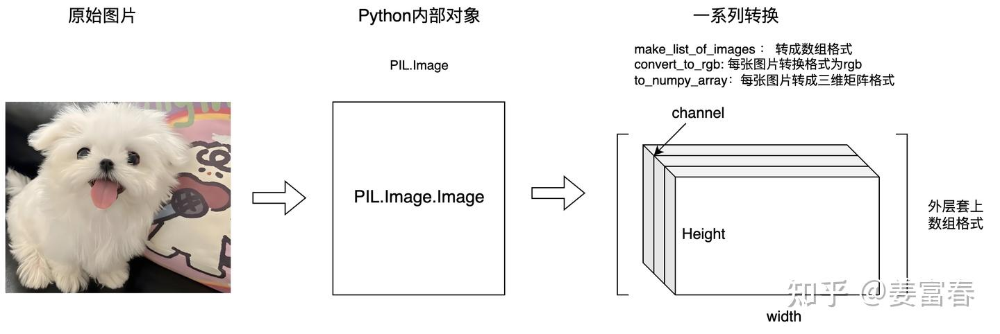

做smart rescale，保证图片的像素满足$[min\_pixels, max\_pixels]$区间，对图像做插值处理，保证图像宽、高能被 $[patch\_size, merge\_size]$ 整除，如图5所示：

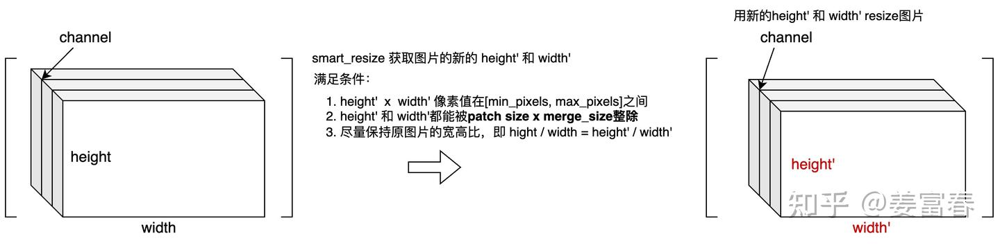


注： 一般图像处理成宽、高是patch_size的整数倍，这样能保证分割成整数个patch。在Qwen2-VL处理过程中，Patch_size多乘以了一个merge_size系数，通过阅读Paper和查看源码不难理解merge_size的含义。
在源码中 merge_size = 2， 在ViT编码后，为了压缩序列长度，通过了一层Projector层，Projector是个简单的 4h -> h 的MLP层，会将宽高各等于merge_size的一个正方形区域的Patch（也就是2X2个Patch），压缩成一个表征，最终输入给LLM模型。所以图片resize时，宽高要能被$[patch\_size, merge\_size]$整除，这样在做后续Projector映射时Patch的数量才能被4整除，然后就可以进行非Paddding的压缩处理。后面也会详述Projector层，这里先简单描述，方便理解。


接下来，为了跟视频的处理一致，将图片也处理成帧序列的格式，具体操作：在单一图片上，增加temporal维度($[C, H, W] -> [T, C, H, W]$)。

Qwen2-VL的Patch是个带时间维度的3D的卷积操作。那么帧序列的长度最小应该等于时间轴的Patch size大小（源码中的变量temporal_patch_size=2）。Qwen2-VL是对图像做一次复制操作，然后堆叠两张图片，增加了一个长度为2的temporal维度。如下代码块：


```python
#https://github.com/huggingface/transformers/blob/main/src/transformers/models/qwen2_vl/image_processing_qwen2_vl.py#L226
def _preprocess():
    ......
    repeats = np.repeat(patches[-1][np.newaxis], self.temporal_patch_size - 1, axis=0)
    patches = np.concatenate([patches, repeats], axis=0)
```

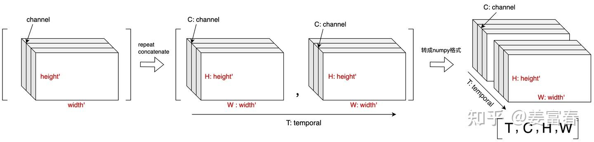


对帧序列进行Patchification操作，核心代码块如下

```python
# #https://github.com/huggingface/transformers/blob/main/src/transformers/models/qwen2_vl/image_processing_qwen2_vl.py#L226
def _preprocess(): 
    ......   
    channel = patches.shape[1]
    grid_t = patches.shape[0] // self.temporal_patch_size
    grid_h, grid_w = resized_height // self.patch_size, resized_width // self.patch_size
    patches = patches.reshape(
        grid_t, self.temporal_patch_size,
        channel,
        grid_h // self.merge_size, self.merge_size, self.patch_size,
        grid_w // self.merge_size, self.merge_size, self.patch_size,
    )
    ### 将2x2的邻域Patch放到一起，方便后续做领域的Patch过Projector层做聚合压缩
    patches = patches.transpose(0, 3, 6, 4, 7, 2, 1, 5, 8)
    ### Patch序列化，并保留Patch位置信息（时间，高，宽）
    flatten_patches = patches.reshape(
        grid_t * grid_h * grid_w, channel * self.temporal_patch_size * self.patch_size * self.patch_size
    )

```

处理过程从源码上看，主要是reshape和transpose操作，第一个reshape过程，从一个4维的Tensor，reshape成了9维的Tensor，其中：

- 时间T：拆成grid_t 和 t_patch_size 两个维度
- 图片H：拆成grid_h, merge_size, patch_size 三个维度
- 图片W：拆成grid_w, merge_size, patch_size三个维度

然后有做数据重排列，最终reshape成2维的Tensor。如下图7所示：

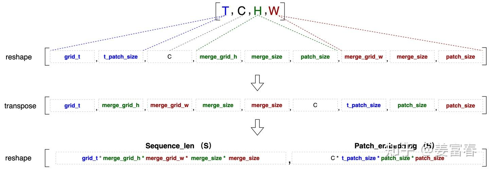

正常对图片的patch操作是个2-D的，即shape=(C, patch_size, patch_size) ，而Qwen2-VL处理Vision数据增加了temporal维度，patch处理是3-D的，即shape=(C, t_patch_size, patch_size, patch_size)，所以数据reshape和transpose操作后，最后的四个维度表示分割的patch块。

另外对于高、宽的维度上还做了个merge_size的reshape和transpose处理，表示将空间位置上临近区域的Patch块(2x2)放在序列中临近的4个连续的位置，方便后面做Projector压缩操作。

对上面的patch操作，如下图8所示：

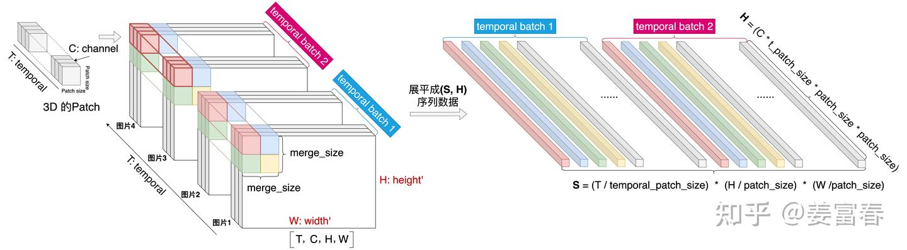


注：
1. 这里为了表示清楚更一般的多时序帧的情况（如视频的帧序列），用4张图片的序列来举例。
2. 该过程还没有进行卷积操作，序列展开是像素铺平的过程，卷积操作在下一步模型内部进行

```python
#https://github.com/huggingface/transformers/blob/main/src/transformers/models/qwen2_vl/image_processing_qwen2_vl.py#L226
def _preprocess(): 
    ......   
    return flatten_patches, (grid_t, grid_h, grid_w)

# flatten_patches： 记录展平的Patch序列序列数据，shape: (S, H)
# (grid_t, grid_h, grid_w)：记录序列S的结构化信息，表示patch处理后，时间、高、宽三个维度的大小。
```

上面我们描述完了_preprocess()函数的全部操作过程，主要是对单图片或单视频的数据做Patch分块处理。我们以样本示例1的第一张图片为例，经过_preprocess()处理后得到的Patch序列和位置信息如下图9所示：
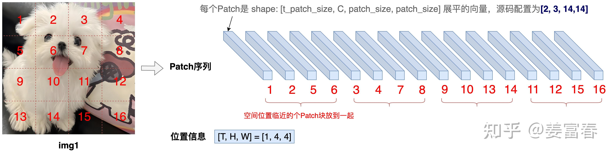

>示例1中的第二张图片会按同样的处理逻辑输出Patch序列：序列长度为：24，位置信息为：[T, H, W] = [1, 4, 6]

最后在preprocess()方法中，将一条样本中的多个图像、多个视频输入结果，merge到一个序列中，并分别通过image_grid_thw或vedio_grid_thw记录不同图片、视频的帧序列位置信息。代码块如下：

```python
#https://github.com/huggingface/transformers/blob/main/src/transformers/models/qwen2_vl/image_processing_qwen2_vl.py#L226
def preprocess(...)
    ### 输入数据存在多张图片，通过extend将多图片序列化结果pack成一个序列
    if images is not None:
        pixel_values, vision_grid_thws = [], []
        for image in images:
            patches, image_grid_thw = self._preprocess(image, ...)
            pixel_values.extend(patches)
            vision_grid_thws.append(image_grid_thw)
        pixel_values = np.array(pixel_values)
        vision_grid_thws = np.array(vision_grid_thws)
        data = {"pixel_values": pixel_values, "image_grid_thw": vision_grid_thws}

    ### 输入数据存在多个视频，通过extend将多帧序列化结果pack成一个序列
    if videos is not None:
        pixel_values, vision_grid_thws = [], []
        for images in videos:
            patches, video_grid_thw = self._preprocess(images, ...)
            pixel_values.extend(patches)
            vision_grid_thws.append(video_grid_thw)
        pixel_values = np.array(pixel_values)
        vision_grid_thws = np.array(vision_grid_thws)
        data = {"pixel_values_videos": pixel_values, "video_grid_thw": vision_grid_thws}

    return BatchFeature(data=data, tensor_type=return_tensors)
```

以样本示例1中的两张图片为例，merge后的数据如图10所示：

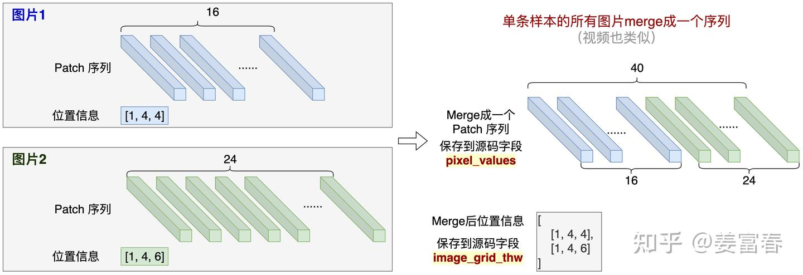

我们看到通过上述操作后，虽然一个样本中多个图片merge到一个序列中，但可以通过位置信息还原每个图片Patch分片。

上述就是完整的Vision数据处理的全过程。下面我们再来看下文本数据的处理过程


#### 文本特征处理
如样本示例1的JSON格式的样本可读性是非常好的，但JSON格式的数据并不适合模型直接读入，如果直接将上述格式数据通过json.dumps()处理后，数据里会有很多格式化的分隔符（如"{", "}", 双引号等），信息密度非常低。对于ChatML JSON格式数据Hugging Face实现了一个易用的接口(apply_chat_template)把JSON格式的数据处理成对模型输入友好的ChatML格式。

具体来说，Hugging Face为所有模型的Tokenizer基类PreTrainedTokenizerBase实现了apply_chat_template方法，Qwen2的Tokenizer类（Qwen2Tokenizer）继承了PreTrainedTokenizerBase基类。在使用apply_chat_template方法可传入一个名叫chat_template的参数，方法定义详见如下代码片段：

```python
# 源码： https://github.com/huggingface/transformers/blob/main/src/transformers/tokenization_utils_base.py#L1527
class PreTrainedTokenizerBase(SpecialTokensMixin, PushToHubMixin):    
    def apply_chat_template(self, conversation, chat_template):
        """
        Args:
            conversation: 要被转换的JSON格式的会话数据
            chat_template (`str`): A Jinja template定义的会话转换脚本，字符串形式传入
        """
        ......
```

chat_template参数接收字符串形式的一段脚本，负责将JSON格式conversation数据做转换处理。chat_template可以默认不传入，Hugging Face有默认的实现；也可以在发布模型时，通过上传chat_template.json文件，自定义chat_template的处理过程。

Qwen在Hugging Face上发布的Qwen2-VL模型就有包含chat_template的处理脚本，详见：Qwen/Qwen2.5-VL-3B-Instruct/chat_template.json。为了方便查看脚本，将脚本字符串做格式化处理后，如下代码：


Qwen2-VL：chat_template定义

```json



    
        <|im_start|>system\nYou are a helpful assistant.<|im_end|>\n
    
    <|im_start|>{{ message['role'] }}\n
    
        {{ message['content'] }}<|im_end|>\n
    
        
            
                
                
                    Picture {{ image_count.value }}: 
                
                <|vision_start|><|image_pad|><|vision_end|>
            
                
                
                    Video {{ video_count.value }}: 
                
                <|vision_start|><|video_pad|><|vision_end|>
            
                {{ content['text'] }}
            
        
        <|im_end|>\n
    


    <|im_start|>assistant\n

```

上面是Jinja template 脚本语言，该脚本的执行命令通过"" 格式封装。想了解Jinja脚本语言细节语法，详见： Template Designer Documentation。

为了理解上面脚本的处理过程，我们通过一个简单测试代码来看下输出结果。我们还是以样本示例1为例。看看通过调用tokenizer.apply_chat_template()方法的输出结果。测试脚本如下代码片段。

```python
# Qwen2_VL tokenizer.apply_chat_template()测试脚本
from transformers import Qwen2Tokenizer, Qwen2Model
tokenizer = Qwen2Tokenizer.from_pretrained("./qwen2-vl", return_tensors='pt')
chat = [
    {   "role": "user",
        "content": [
            {"type": "image", "image": "./dog.png"},
            {"type": "image", "image": "./cat.png"},
            {"type": "text", "text": "20个字简单描述这两张图片的共同点"}
    ]},
    {   "role": "assistant",
        "content": [
            {"type": "text", "text": "两张图片都展示了毛茸茸的宠物，一只白色小狗和一只长毛猫，表情生动可爱。"}
    ]},
    {   "role": "user",
        "content": [
            {"type": "text", "text": "20个字简单说下差异"}
    ]},
    {   "role": "assistant",
        "content": [
            {"type": "text", "text": "一张是白色小狗，活泼吐舌；另一张是长毛猫，安静凝视，表情各异。"}
    ]}
]
print(tokenizer.apply_chat_template(chat, tokenize=False))
```
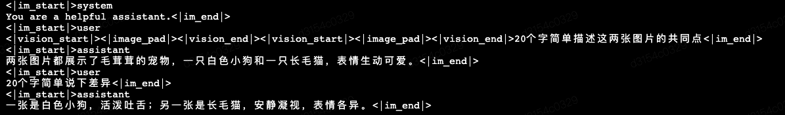

我们看到对于JSON的数据，处理成了扁平的文本格式，处理过程默认在会话前增加了system信息，为了保留结构化信息，通过插入一些特殊token来分割文本：

使用<|im_start|> 和 <|im_end|> 来封装一次会话
分别system, user, assistant 作为会话的前缀，表明角色
对于多模态数据使用<|vision_start|><|image_pad|><|vision_end|>三个特殊token表示，将来通过Vision Model处理好的多模态表征会填充到<|image_pad|>占位符指示的位置。
上述如图11处理后的文本，每个"<| . |>"封装内容，整体被看做是一个token，会映射到一个tokenID，进行表征学习。

结合图11的运行结果，我们再来看下chat_template处理脚本（代码片段7），这段脚本就很容易理解了~

上述代码处理后，每个Vision数据（图片或视频）会被处理成三个特殊的token。如样本示例1中的两张图片，每张图片会生成三个token： <|vision_start|> <|image_pad|><|vision_end|>。这里<|image_pad|>token是个占位符，是为了将来填充真实Vision Model表征的占位符。因为每个Vision数据经过Vision Model会处理成不同长度的表征序列，这里只用一个占位符，显然不方便后续做不同长度的真实序列的填充。所以在处理文本数据的最后，会根据Vision Patch序列长度计算Vision Model的实际输出长度$L_v$，然后填充$L_v$个<|image_pad|>token，以方便后面按槽位将fake的表征替换成Vision Model的真实输出表征。具体实现源码如下:

```python
# 源码： https://github.com/huggingface/transformers/blob/main/src/transformers/models/qwen2_vl/processing_qwen2_vl.py#L133
class Qwen2VLProcessor(ProcessorMixin):
    def __call__(self, ...):
        image_grid_thw = image_inputs["image_grid_thw"]
        merge_length = self.image_processor.merge_size**2
        index = 0
        ### 遍历每张图片，填充 image_grid_thw[index].prod() // merge_length个 padding token
        for i in range(len(text)):
            while self.image_token in text[i]:
                text[i] = text[i].replace(
                    self.image_token, "<|placeholder|>" * (image_grid_thw[index].prod() // merge_length), 1
                )
                index += 1
            text[i] = text[i].replace("<|placeholder|>", self.image_token)

        ### text -> token_id序列
        text_inputs = self.tokenizer(text, **output_kwargs["text_kwargs"])
```

最终填充的长度： 


样本示例1中的两张图片，计算Image Padding token长度为如下图12所示：
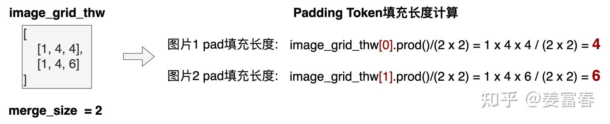

这里填充的Padding token数要用Patch的长度除以2x2，是因为后面模型在Projector阶段，对邻近的四个表征做了线性变换，将4个Patch压缩到一个表征，详见后面模型处理过程。

最终对图11的文本数据，对每个图片填充<|image_pad|>，图片1填充4个，图片2填充6个。填充后的文本数据如下图13所示

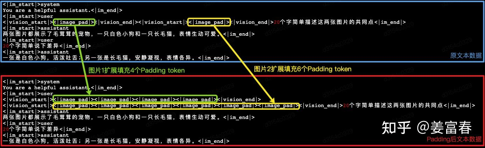

### 模型计算过程

Qwen2-VL网络包括三个模块（ViT，MLP Projector和 Qwen2主干模型），如下图14所示：
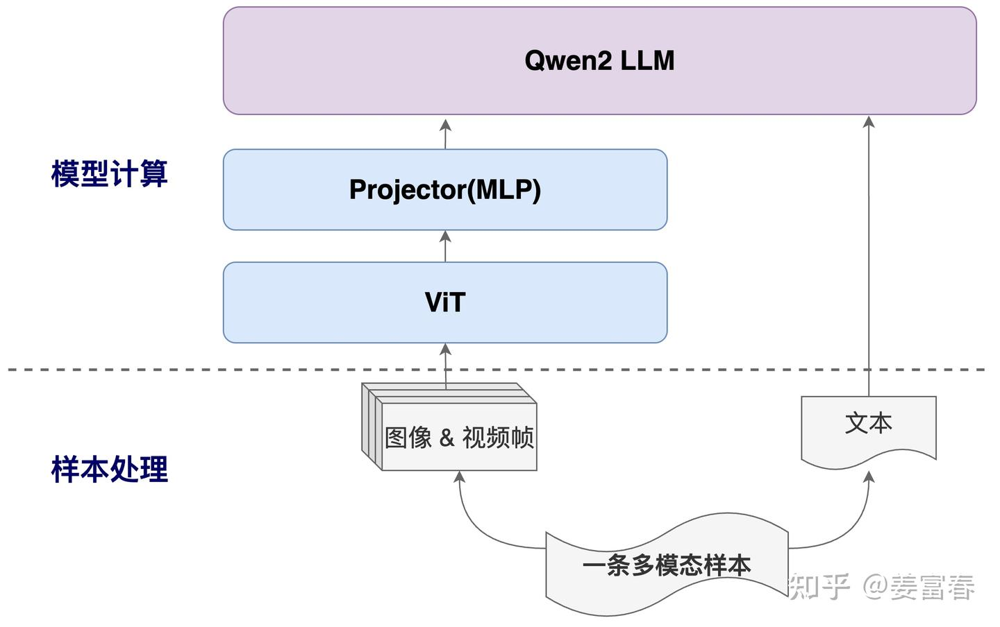

我们通过源码再补充下模型结构中的细节，模型的实现在modeling_qwen2_vl.py文件中，模型的主入口如下代码(详见注释)：

```python
# Qwen2-VL模型源码： https://github.com/huggingface/transformers/blob/main/src/transformers/models/qwen2_vl/modeling_qwen2_vl.py#L1419
class Qwen2VLForConditionalGeneration(Qwen2VLPreTrainedModel, GenerationMixin):
    def __init__(self, config):
        super().__init__(config)
        ### 视觉特征建模网络：ViT + MLP Projector 
        self.visual = Qwen2VisionTransformerPretrainedModel._from_config(config.vision_config)
        ### Qwen2主模型
        self.model = Qwen2VLModel(config)
        self.vocab_size = config.vocab_size
        self.lm_head = nn.Linear(config.hidden_size, config.vocab_size, bias=False)

    def forward(...):
        ### 只以图片特征计算为例（视频帧计算类似）
        if pixel_values is not None:
            ### Vision网络（ViT + MLP Projector）计算
            image_embeds = self.visual(pixel_values, grid_thw=image_grid_thw)
            ### 计算一个mask, 将<|image_pad|>token位置的向量全值1
            image_mask = ((input_ids == self.config.image_token_id).unsqueeze(-1).expand_as(inputs_embeds))
            ### 通过mask矩阵，实现将Vision网络输出的真实表征，替换<|image_pad|>位置的fake表征
            inputs_embeds = inputs_embeds.masked_scatter(image_mask, image_embeds)
        ### 计算3D RoPE
        position_ids, rope_deltas = self.get_rope_index(input_ids, ...)
        ### 将多模态的表征数据，输入到Qwen2主干模型进行计算
        outputs = self.model(...）
        
        hidden_states = outputs[0]
        logits = self.lm_head(hidden_states)
        ### 如果是模型训练，计算生成token的CrossEntopyLoss
        shift_logits = logits[..., :-1, :].contiguous()
        shift_labels = labels[..., 1:].contiguous()
        loss_fct = CrossEntropyLoss()
        loss = loss_fct(shift_logits, shift_labels)
```

Vision网络（Qwen2VisionTransformerPretrainedModel）

```python
# Qwen2-VL Vision网络源码：https://github.com/huggingface/transformers/blob/main/src/transformers/models/qwen2_vl/modeling_qwen2_vl.py#L955
class Qwen2VisionTransformerPretrainedModel(Qwen2VLPreTrainedModel):
    def __init__(self, config):
        self.spatial_merge_size = config.spatial_merge_size #默认配置，等于2
        ### 初始化Patch 3D卷积层参数
        self.patch_embed = PatchEmbed(patch_size=14, temporal_patch_size=2, in_channels=3, embed_dim=1280)
        ### 初始化2D的RoPE的变换矩阵
        self.rotary_pos_emb = VisionRotaryEmbedding(head_dim // 2)
        ### 初始化多层双向Attention的ViT网络
        self.blocks = nn.ModuleList([Qwen2VLVisionBlock(config, config._attn_implementation) for _ in range(config.depth)])
        ### 初始化Projector网络，是一个4h -> h的压缩变换单层MLP网络
        self.merger = PatchMerger(
            dim=config.hidden_size, context_dim=config.embed_dim, spatial_merge_size=config.spatial_merge_size
        )

    def forward(self, hidden_states: torch.Tensor, grid_thw: torch.Tensor) -> torch.Tensor:
        ### 卷积计算Patch embedding
        hidden_states = self.patch_embed(hidden_states)
        ### 计算2D RoPE变换矩阵
        rotary_pos_emb = self.rot_pos_emb(grid_thw)
        emb = torch.cat((rotary_pos_emb, rotary_pos_emb), dim=-1)
        position_embeddings = (emb.cos(), emb.sin())
        ### 根据cu_seqlens计算的每个序列长度，计算Attention矩阵，做多视觉数据计算隔离
        cu_seqlens = torch.repeat_interleave(grid_thw[:, 1] * grid_thw[:, 2], grid_thw[:, 0]).cumsum(dim=0)
        cu_seqlens = F.pad(cu_seqlens, (1, 0), value=0)
        ### 多层双向Attention的ViT网络进行计算
        for blk in self.blocks:
            hidden_states = blk(hidden_states, cu_seqlens=cu_seqlens, position_embeddings=position_embeddings)
        ### 对最终Patch的表征做4h->h的线性压缩变换
        return self.merger(hidden_states)
```

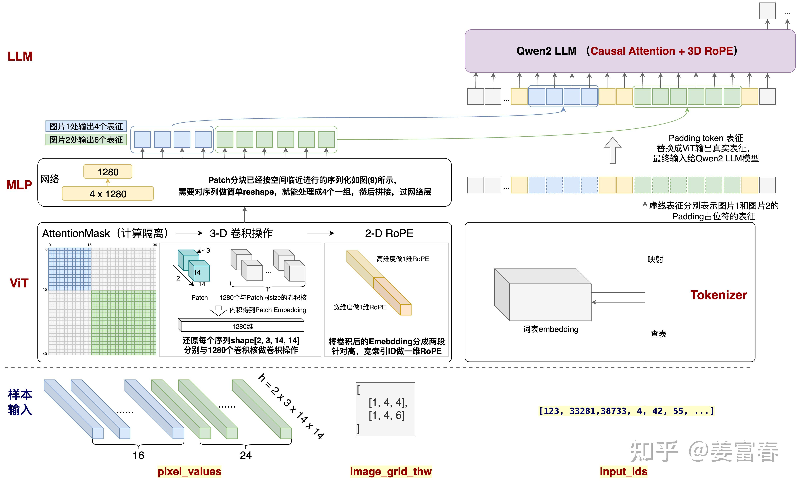