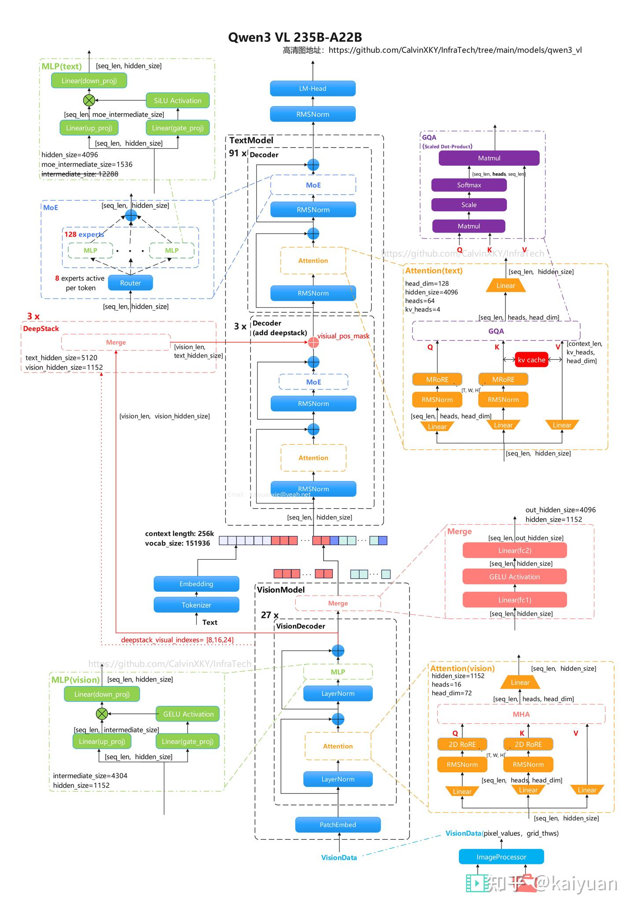
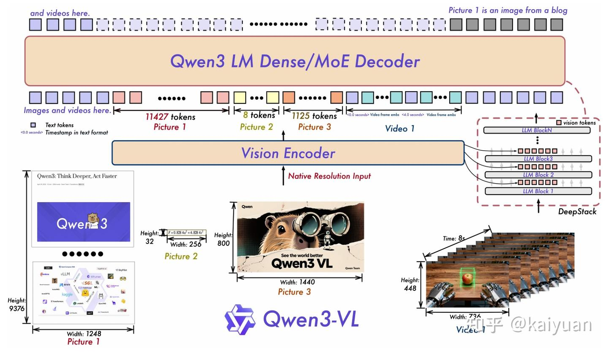
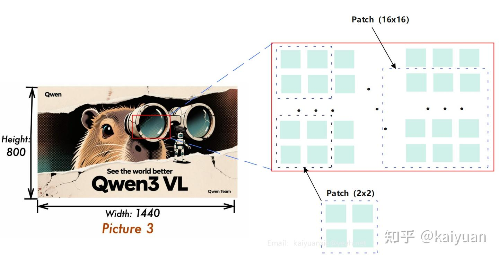
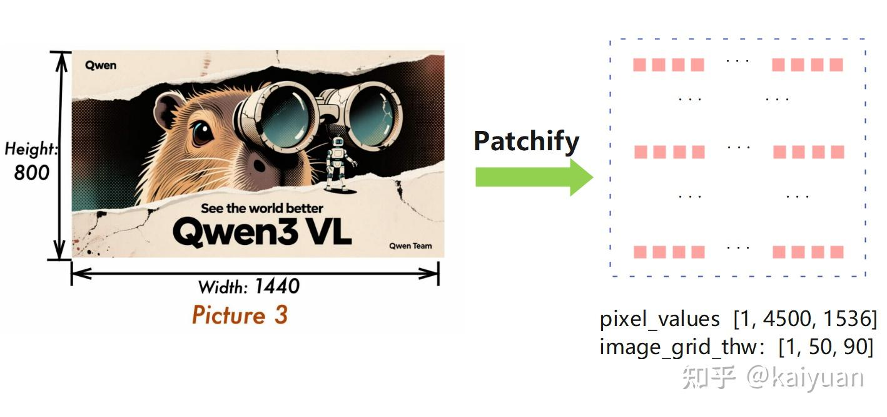
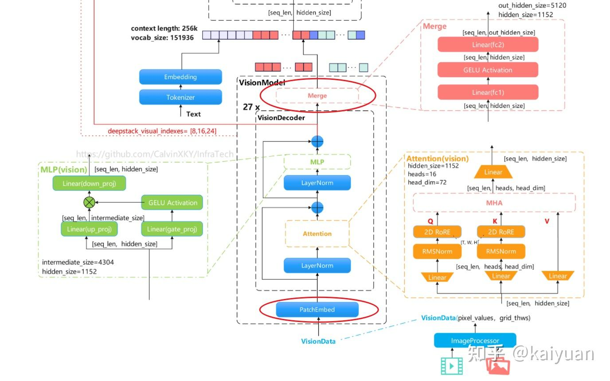
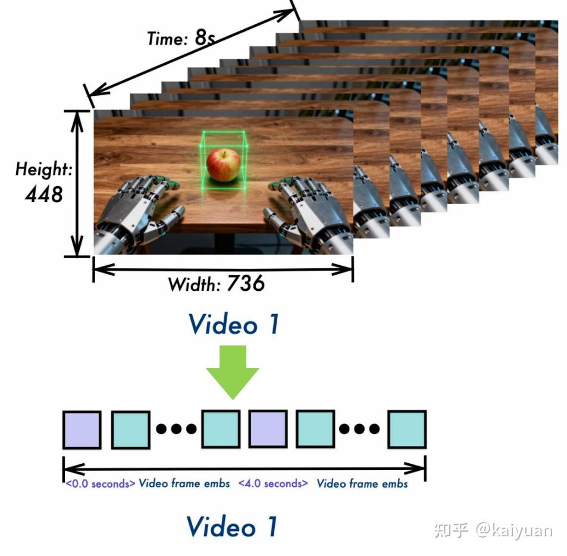
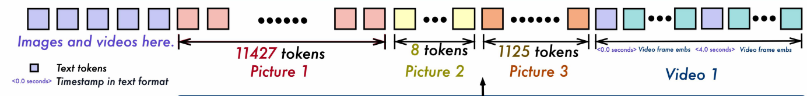
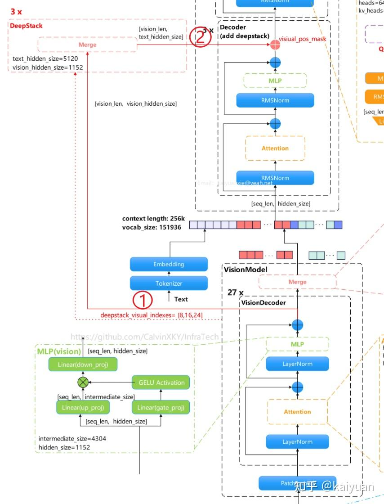
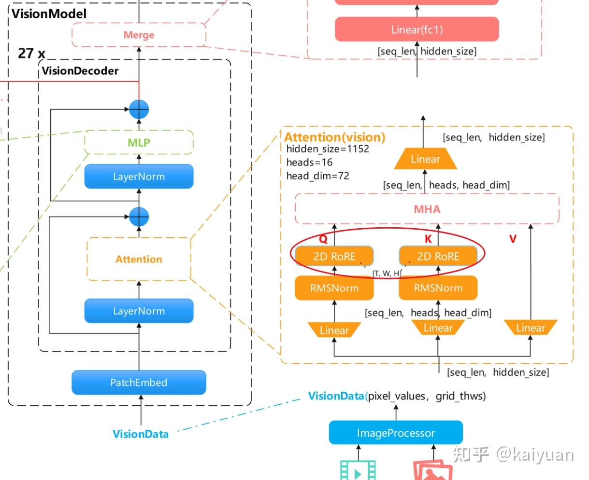
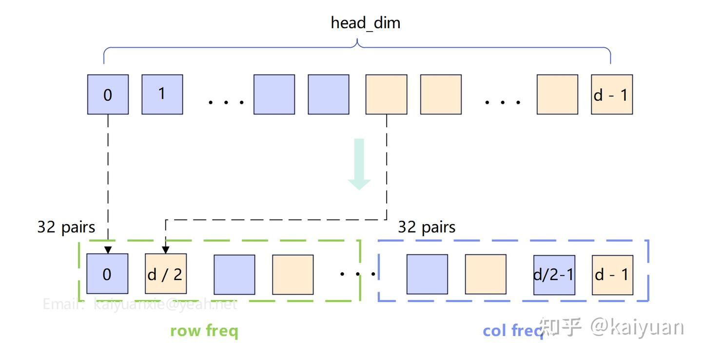

# 1 模型结构概览
Qwen3-VL是Qwen系列新一代视觉-语言模型，面向图文理解、视频理解、多模态推理与智能体交互等场景。 官方形态同时覆盖Dense与MoE，并提供Instruct/Thinking等版本，支持从边缘端到云端的灵活部署。以Qwen3-VL-32B-Instruct和Qwen3-VL-235B-A22B-Instruct为例来了解模型主体结构。


## 1.1 Qwen3-VL-32B-Instruct


模型结构描述：
类型：视觉-语言指令模型（Instruct）
架构：Qwen3VLForConditionalGeneration
模型类型：qwen3_vl
参数规模：32B（以模型命名为准）
文本上下文长度：262144
文本层数：64
文本隐藏维度：5120
文本FFN中间层维度：25600
文本注意力头数：Q=64，KV=8，head_dim=128
文本词表大小：151936
RoPE参数：rope_theta=5000000，mrope_section=[24,20,20]
视觉编码器层数：27
视觉隐藏维度：1152
视觉头数：16
视觉FFN中间层维度：4304
图像Patch大小：16，时序Patch大小：2
视觉输出映射维度：5120（与文本隐藏维度对齐）

## 1.2 Qwen3-VL-235B-A22B-Instruct



模型结构描述：

类型：视觉-语言指令模型（Instruct）
架构：Qwen3VLMoeForConditionalGeneration
模型类型：qwen3_vl_moe
参数规模：235B，激活参数22B（以模型命名为准）
文本上下文长度：262144
文本层数：94
文本隐藏维度：4096
文本FFN中间层维度：12288
文本注意力头数：Q=64，KV=4，head_dim=128
文本词表大小：151936
RoPE参数：rope_theta=5000000，mrope_section=[24,20,20]
MoE配置：专家总数128，每token激活专家数8，moe_intermediate_size=1536
视觉编码器层数：27
视觉隐藏维度：1152
视觉头数：16
视觉FFN中间层维度：4304
图像Patch大小：16，时序Patch大小：2
视觉输出映射维度：4096（与文本隐藏维度对齐）

# 二、图片到tokens的编码过程
视觉图片类数据在进入语言模型前，需要先转化为tokens序列。不同尺寸的图片经过视觉编码器（Vision Encoder）后，得到的tokens长度通常不同。 在Qwen3VL的技术报告中，有几张示意图展示了常见场景，例如H×W=32×256这种宽高比较大的图片。 这些图片最终会映射为不同长度的tokens。



图像数据如何与tokens序列对应？编码过程一般包含网格分块与压缩两步。网格分块用于重排图像数据，压缩用于降低序列长度。

## 2.1 图片patch化
下面以Height=800、Width=1440的图片为例，输入形状为[800, 1440, 3]。 在Qwen3VL中，相关patch参数如下：

- patch_size=16，图片块的高宽；
- temporal_patch_size=2，时间维度块大小（主要用于视频）；
- in_channels=3，图片通道数；



对图片进行网格化处理（时间维度会补齐到2，再除以temporal_patch_size）：

grid_t = 2⁄2 = 1
grid_h = 800⁄16 = 50
grid_w = 1440⁄16 = 90
进入VisionEncoder前的序列长度：

L_pre = grid_t * grid_h * grid_w = 1*50*90 = 4500

每个patch向量维度：

D = 3*2*16*16 = 1536

得到数据：

pixel_values 形状：[1, 4500, 1536]
image_grid_thw：[1, 50, 90]




最后一个维度的变化与映射方式相关：进入VisionEncoder后会先经过PatchEmbed处理，末端再经过Merger映射运算。


## 2.2 PatchEmbed/Merger处理
最后一个维度的变化与映射方式相关：进入VisionEncoder后会先经过PatchEmbed处理，末端再经过Merger映射运算。



**PatchEmbed处理**

PatchEmbed包含一个3D卷积映射（Conv3d），将维度从1536映射到hidden_size，因此pixel_values形状变为[1, 4500, 1152]。

示例代码如下：
```python
class Qwen3VLVisionPatchEmbed(nn.Module):
    def __init__(self, config) -> None:
        super().__init__()
        self.patch_size = config.patch_size
        self.temporal_patch_size = config.temporal_patch_size
        self.in_channels = config.in_channels
        self.embed_dim = config.hidden_size

        kernel_size = [self.temporal_patch_size, self.patch_size, self.patch_size]
        self.proj = nn.Conv3d(self.in_channels, self.embed_dim, kernel_size=kernel_size, stride=kernel_size, bias=True)

    def forward(self, hidden_states: torch.Tensor) -> torch.Tensor:
        target_dtype = self.proj.weight.dtype
        hidden_states = hidden_states.view(
            -1, self.in_channels, self.temporal_patch_size, self.patch_size, self.patch_size
        )
        hidden_states = self.proj(hidden_states.to(dtype=target_dtype)).view(-1, self.embed_dim)
        return hidden_states
```


**Merger处理**

Merger计算中会压缩序列长度。相关配置：

spatial_merge_size=2，视觉压缩（融合）尺寸。
out_hidden_size=5120，语言模型的hidden维度大小。模型规模不同时，该参数会变化。


```python
class Qwen3VLVisionPatchMerger(nn.Module):
    def __init__(self, config: Qwen3VLVisionConfig, use_postshuffle_norm=False) -> None:
        super().__init__()
        self.hidden_size = config.hidden_size * (config.spatial_merge_size**2)
        self.use_postshuffle_norm = use_postshuffle_norm
        self.norm = nn.LayerNorm(self.hidden_size if use_postshuffle_norm else config.hidden_size, eps=1e-6)
        self.linear_fc1 = nn.Linear(self.hidden_size, self.hidden_size)
        self.act_fn = nn.GELU()
        self.linear_fc2 = nn.Linear(self.hidden_size, config.out_hidden_size)

    def forward(self, x: torch.Tensor) -> torch.Tensor:
        x = self.norm(x.view(-1, self.hidden_size) if self.use_postshuffle_norm else x).view(-1, self.hidden_size)
        x = self.linear_fc2(self.act_fn(self.linear_fc1(x)))
        return x
```


在最后的Merger计算时（self.use_postshuffle_norm=True），输入x会先调整形状：x.view(-1, self.hidden_size)，其中：

self.hidden_size = config.hidden_size * (spatial_merge_size**2)。

所以，压缩后的序列计算方式：

L_final = L_pre / (spatial_merge_size**2) = 4500 / 4 = 1125

得到输出的序列长度与嵌入维度的shape=[1125, 5120]


# 三、视频数据的编码过程
视频数据与图片数据的主要差异在于增加了时间维度。视频会先抽帧降低数据量，再进行时序patch划分。 以Qwen3VL示意图中的视频为例：分辨率H=448、W=736，时长8秒




默认参数配置：

fps=2
temporal_patch_size=2
patch_size=16
merge_size=2
计算过程：

采样帧数：num_frames ≈ 8 * 2 = 16
时间网格：grid_t = 16 / 2 = 8
空间网格：

grid_h = 448 / 16 = 28
grid_w = 736 / 16 = 46
得到数据：

pixel_values 形状：[1, 10304, 1536]
image_grid_thw：[[8, 28, 46]]
L_pre = grid_t * grid_h * grid_w = 10304
与图片流程相同，视频也需要经过PatchEmbed和Merger处理，最终得到：

shape=[2576, 5120]

# 四、数据的拼接
文本、图片、视频tokens最终会一起送入LLM处理，因此需要拼接。其做法是：先在输入构造阶段通过placeholder预留图片/视频tokens位置，再在视觉分支计算完成后回填拼接



其中，图片/视频数据会引入一些额外tokens。继续以上面的视频为例，上一步得到的视觉序列长度为2576。实际构造输入时，每个grid_t都会拼接一段：

每一段分为四块：

1. "<{curr_time:.1f} seconds>"（文本，会被分词成若干 token）时间戳文本
2. vision_start_token
3. 一段视频placeholder，本例中长度为：2576/8 = 322
4. vision_end_token

所以总长度上，除了2576个视觉占位外，还会额外增加：vision_start/end共2*grid_t=16个特殊token，以及8段时间戳文本（会进一步分词）。

# 五、DeepStack操作
DeepStack原理：不把所有视觉token都“横向串成一长串”塞进LLM输入，而是把额外的高分辨率视觉token按层“纵向堆叠”， 分配到LLM的多个早期/中期层里，用残差方式逐层注入，从而在不显著增加上下文长度的前提下，让模型有效处理更多视觉细节。 DeepStack在保留更多视觉信息的同时，能够有效控制上下文长度。

Qwen3VL使用了DeepStack技术：在vision encoder中，从指定层（deepstack_visual_indexes）取出hidden_states，并分别经过deepstack_merger， 将空间merge后的视觉特征整理到可注入语言模型的维度。Qwen3VL配置中指定了[8, 16, 24]层。



操作过程：

1. vision decoder中间层特征（多尺度/不同语义深度）先各自经过merger，得到deepstack_features；
2. 这些特征后续会在文本模型前几层按视觉位置加回（_deepstack_process）。

注意：VisionDecoder最后一层的Merger与DeepStack分支中的Merger存在差异：最后一层Merger的LayerNorm位置不同，且需要进行尺寸压缩。

# 六、位置编码的处理
在Qwen3VL中，位置编码采用RoPE（Rotary Position Embedding），但视觉与文本在位置ID构造上存在差异： 视觉分支通常使用2D/3D坐标构造位置；在多模态统一建模时，会通过M-RoPE（Multimodal Rotary Position Embedding）把t/h/w信息映射到不同通道分组。 其核心差异主要体现在嵌入维度（head_dim）分量的分配方式与位置索引的组织方式上。

## 6.1 视觉塔中的2D编码



对图片数据而言，每个token有二维索引(h, w)，对应视觉塔中的row/col；若head_dim=128，其分频逻辑是：

- 128先分为64对二维向量构成独立的平面；
- 前32对的频率分量由row索引决定，后32对的频率分量由col索引决定。



更具体一点，每个维度的归属如下：

|索引区间|内容|
|----|----|
|emb[0:32]|row的32个频率分量|
|emb[32:64]|col的32个频率分量|
|emb[64:96]|再次row（与0:32相同）|
|emb[96:128]|	再次col（与32:64相同）|

然后cos = emb.cos()，sin = emb.sin()，形状都是(seq_len, 128)。规律：

- 前32个旋转对（覆盖q[0:32]与q[64:96]）由行坐标r决定相位。
- 后32个旋转对（覆盖q[32:64]与q[96:128]）由列坐标c决定相位。

其中r与c由token在图片中的行列位置决定。row与col共用freqs；max_len通常取max(R,C)，其中R、C分别为row与col方向的最大索引

## 6.2 文本模型的M-RoPE
视觉3D位置编码是在2D位置编码的基础上，进一步引入了时间维度。在M-RoPE中，有三个独立的角度：

- 时间维度角度：angle_t = t * theta_i
- 高度维度角度：angle_h = h * theta_i
- 宽度维度角度：angle_w = w * theta_i
Qwen3 VL采用了Interleaved-MRoPE，其核心思想如下：

在1D RoPE中，嵌入层分成了d/2组，每一对连续元素(x[2j], x[2j+1])视为一个二维子空间，j = 0, 1, ..., d/2 - 1。

确定第
个子空间应使用t、h、w中的哪一个轴进行旋转 采用轮询（Round‑Robin）分配


其中定义映射：0→t，1→h，2→w。因此：

当j % 3 == 0时：该子空间用t轴的旋转角度angle = t * θ_j
当j % 3 == 1时：该子空间用h轴的旋转角度angle = h * θ_j
当j % 3 == 2时：该子空间用w轴的旋转角度angle = w * θ_j


这种方式将时间、高度、宽度三个维度的信息交错融入整个特征空间，从而使多模态模型能更全面、更高效地理解数据中的复杂时空结构。


位置编码知识可参考：[《彻底搞懂RoPE计算原理：从1D到3D》](https://zhuanlan.zhihu.com/p/2023493768003724514)

相关文章：[《VLM视觉-语言融合流程解析（Kimi K2.5/VL）》](https://zhuanlan.zhihu.com/p/2018404307385500510)


# 参考
[https://zhuanlan.zhihu.com/p/2023058271653602626](https://zhuanlan.zhihu.com/p/2023058271653602626)